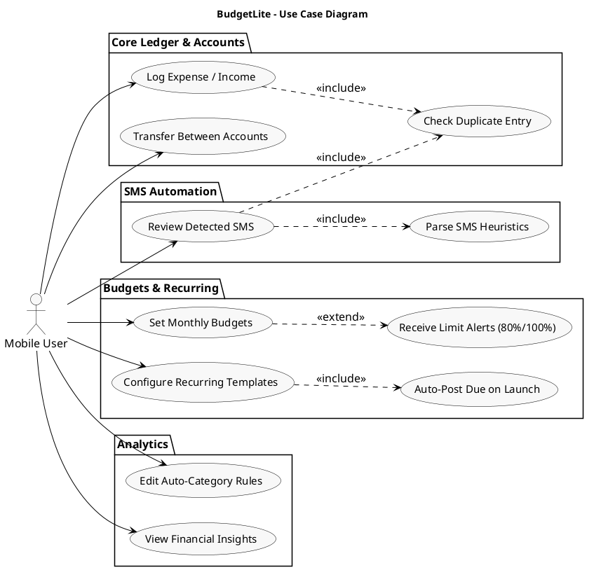
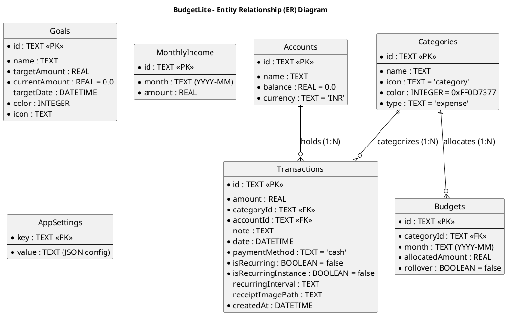
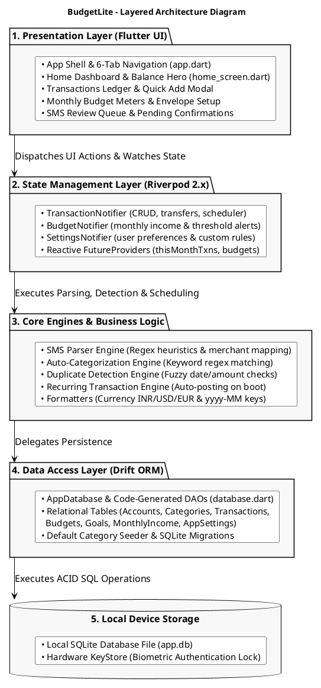
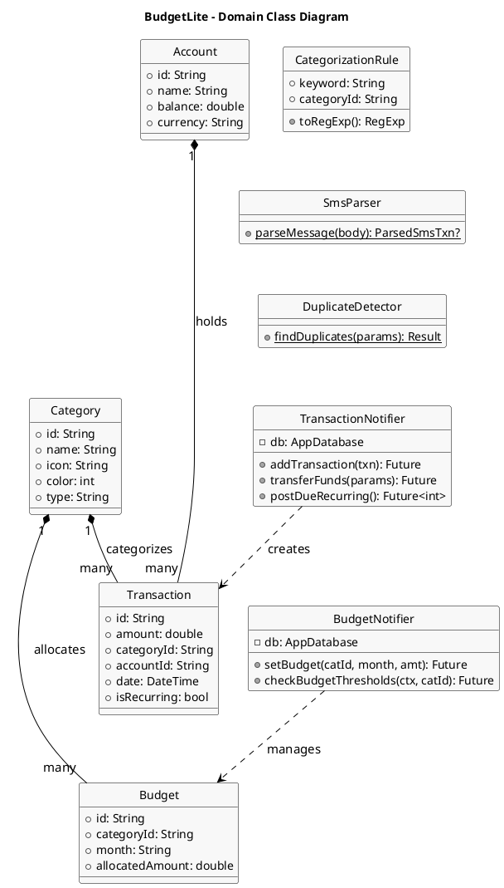
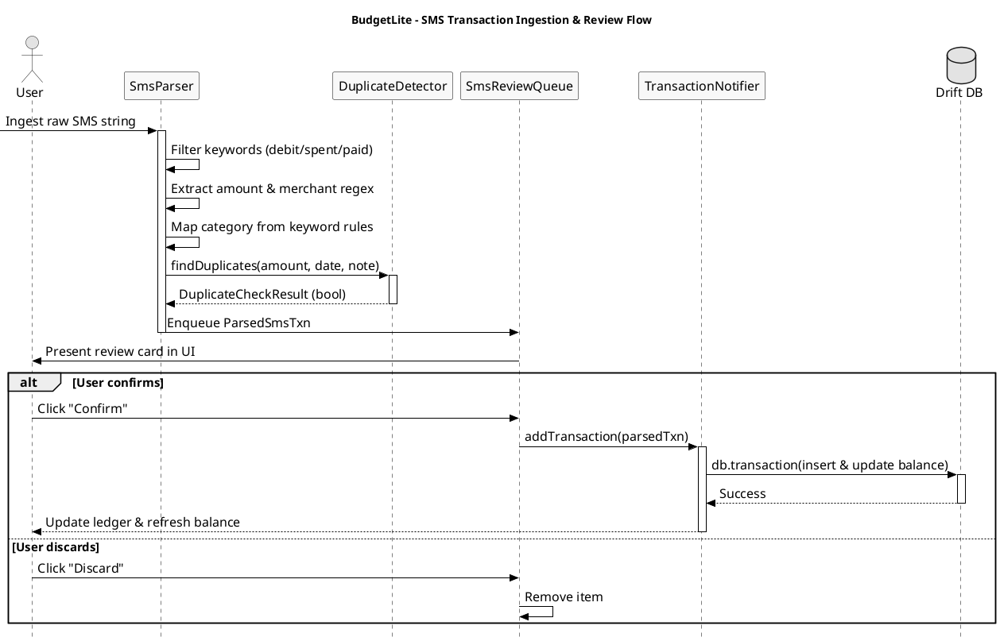

# BudgetLite: Offline-First Personal Budgeting App

> **Smart budgeting, simplified.**  
> A premium offline-first personal budgeting application for Android  
> **Course / Subject:** ASDT  
> **Evaluation:** CA1 Mini Project (25% Submission)  
> **Name:** Aadish das  
> **UID:** 24BIT010  
> **Roll No:** 10  
> **Framework:** Flutter 3.x (Dart)  
> **State Management:** Riverpod 2.x  
> **Local Database:** Drift 2.x (SQLite)  
> **Platform:** Android (iOS + Web scaffolds included)  
> **Version:** 1.0.0+1  
> **Source Snapshot:** Commit `2d57e78` — *"feat: add recurring transactions, SMS parsing, accounts, and auto-categorization"* (Jul 24, 2026)  

---

## Table of Contents

1. [Abstract](#1-abstract)
2. [Problem Statement](#2-problem-statement)
3. [Objectives & Use Cases](#3-objectives--use-cases)
4. [Technology Stack](#4-technology-stack)
5. [Database Schema & ER Diagram](#5-database-schema--er-diagram)
   - [5.1 Data Dictionary](#51-data-dictionary)
6. [Architecture & Component Design](#6-architecture--component-design)
   - [6.1 Layered Architecture Diagram](#61-layered-architecture-diagram)
   - [6.2 Source Layout](#62-source-layout)
   - [6.3 Object-Oriented Class Diagram](#63-object-oriented-class-diagram)
   - [6.4 Provider Hierarchy](#64-provider-hierarchy)
7. [Core Business Logic](#7-core-business-logic)
   - [7.1 Auto-Categorization Engine](#71-auto-categorization-engine)
   - [7.2 SMS Transaction Parser & Sequence Flow](#72-sms-transaction-parser--sequence-flow)
   - [7.3 Duplicate Detection](#73-duplicate-detection)
   - [7.4 Recurring Transaction Auto-Posting](#74-recurring-transaction-auto-posting)
   - [7.5 Account Balance Consistency & Transfers](#75-account-balance-consistency--transfers)
   - [7.6 Budget Engine & Threshold Alerts](#76-budget-engine--threshold-alerts)
   - [7.7 Formatting Utilities](#77-formatting-utilities)
8. [App Entry & Navigation Shell](#8-app-entry--navigation-shell)
9. [Home Screen Layout](#9-home-screen-layout)
10. [Output](#10-output)
    - [10.1 Static Analysis](#101-static-analysis)
    - [10.2 Test Execution](#102-test-execution)
    - [10.3 Sample Engine Outputs](#103-sample-engine-outputs)
    - [10.4 Demo Data Generation](#104-demo-data-generation)
    - [10.5 UI Layout Mockups](#105-ui-layout-mockups)
11. [Conclusion & Future Work](#11-conclusion--future-work)
12. [Appendix: Source File Inventory](#12-appendix-source-file-inventory)

---

## 1. Abstract

**BudgetLite** is an offline-first personal budgeting application for Android built with Flutter. It combines multi-account transaction tracking, envelope-style monthly budgets, savings goals, and recurring-payment automation in a single tactile interface. All data is stored locally in a Drift SQLite database with no cloud dependency, and transactions can be captured manually, detected automatically from bank SMS messages, or generated from recurring templates. A keyword-driven auto-categorization engine assigns categories as the user types, and a duplicate detector prevents accidental double-entry. The interface follows Material 3 with a custom teal accent palette (`#0D7377`), a three-font system (*DM Sans* / *Inter* / *JetBrains Mono*), layered shadow surfaces, and spring-based micro-interactions.

This submission documents the project at an early but functional stage — the feature set introduced in the July 24 commit (`2d57e78`) — including the database schema, the core business logic, UML and architecture diagrams, representative source code, and verifiable output from static analysis, tests, and the parsing engines.

---

## 2. Problem Statement

Personal expense tracking on Android is fragmented. Most apps fall into two camps:
1. **Cloud-Tethered Services:** Feature-complete solutions that require mandatory cloud accounts, internet connectivity, and external servers, raising severe data privacy concerns for sensitive personal financial records.
2. **Primitive Offline Notepads:** Simple offline notes that lack relational structure, envelope budgeting, multi-account ledger balances, and automation.

Users who want to track spending across multiple accounts (cash, bank, wallet, UPI) without uploading their financial data to a third-party server are heavily underserved.

Additionally, manual entry is tedious — every Swiggy order, Uber ride, and Jio recharge must be typed in by hand, categorized, and dated. Recurring expenses (rent, subscriptions, EMIs) force repetitive manual logging each cycle. BudgetLite addresses these gaps with a fully offline budget tracker that automates entry wherever possible: SMS-based detection, recurring auto-posting, and keyword-based auto-categorization.

---

## 3. Objectives & Use Cases

- **Multi-Account Transaction Ledger:** Build an expense and income ledger supporting multiple financial accounts with atomic balance updates across inserts, updates, deletions, and inter-account transfers.
- **Envelope-Style Monthly Budgets:** Implement category-level budgeting with an allocated/spent/remaining model, visual progress rings, and proactive threshold alerts at 80% and 100% usage.
- **Recurring Transaction Engine:** Implement an automated scheduler that detects and auto-posts due recurring payments (daily, weekly, biweekly, monthly, quarterly, yearly) on application launch in an idempotent, crash-safe transaction.
- **Keyword Auto-Categorization Engine:** Build a user-editable rule engine persisted locally in SQLite that dynamically matches note text to appropriate categories in real time.
- **SMS Bank Transaction Parser:** Develop an on-device heuristic regex parser that extracts transaction amount, merchant, and category from incoming SMS messages into an interactive review queue for user confirmation.
- **Duplicate Entry Protection:** Build a fuzzy duplicate detector that flags prospective duplicate records matching category, amount ($\pm0.01$), date ($\le 2$ days), and token similarity.
- **Polished Material 3 UI:** Deliver a responsive, tactile user interface featuring light/dark themes, layered elevation shadows, animated charts, skeleton loaders, empty states, and haptic feedback.

### UML Use Case Diagram



---

## 4. Technology Stack

| Layer / Domain | Technology Choice | Description & Role |
| :--- | :--- | :--- |
| **Framework & Language** | Flutter 3.x / Dart | Cross-platform client framework targeting Android (with iOS and Web scaffolds). |
| **State Management** | Riverpod 2.x | Reactive dependency injection and state management (`StateNotifier`, `FutureProvider`, `Notifier`). |
| **Local Database** | Drift 2.x (over SQLite) | Type-safe, reactive local persistence with code-generated DAOs and schema migrations. |
| **Data Visualizations** | `fl_chart` | Interactive spending distribution pie charts and trend line graphs. |
| **Micro-Animations** | `flutter_animate` | Staggered entrance effects, spring scale transitions, and shimmer skeletons. |
| **Iconography** | `lucide_icons` | Crisp, consistent geometric icon system. |
| **Typography** | Google Fonts | Three-font hierarchy: *DM Sans* (Headings), *Inter* (Body/UI), *JetBrains Mono* (Numeric data). |
| **CSV & Data Sharing** | `csv`, `share_plus` | Local ledger export, CSV parsing, and system share sheet integration. |
| **Security & Biometrics** | `local_auth` | Hardware-backed biometric fingerprint and device PIN lock screen. |
| **Local Notifications** | `flutter_local_notifications`| On-device push alerts for budget limits and upcoming recurring bills. |
| **Media & Attachments** | `image_picker`, `file_picker` | Receipt photo capture and file attachment storage. |
| **Core Utilities** | `intl`, `uuid`, `collection`, `quick_actions` | Localization, currency formatting, UUID v4 generation, and Android launcher quick shortcuts. |

---

## 5. Database Schema & ER Diagram

The database schema (version 2 at commit `2d57e78`) is declaratively defined in `lib/core/database/tables.dart` and compiled into type-safe Dart classes using Drift's code generator.

### Entity Relationship (ER) Diagram



### Declarative Tables (Dart)

```dart
// lib/core/database/tables.dart (abridged to essential columns)
import 'package:drift/drift.dart';

class Accounts extends Table {
  TextColumn get id => text()();
  TextColumn get name => text()();
  RealColumn get balance => real().withDefault(const Constant(0))();
  TextColumn get currency => text().withDefault(const Constant('INR'))();

  @override
  Set<Column> get primaryKey => {id};
}

class Categories extends Table {
  TextColumn get id => text()();
  TextColumn get name => text()();
  TextColumn get icon => text().withDefault(const Constant('category'))();
  IntColumn get color => integer().withDefault(const Constant(0xFF0D7377))();
  TextColumn get type => text().withDefault(const Constant('expense'))(); // expense | income

  @override
  Set<Column> get primaryKey => {id};
}

class Transactions extends Table {
  TextColumn get id => text()();
  RealColumn get amount => real()(); // + = expense, - = income
  TextColumn get categoryId => text().references(Categories, #id)();
  TextColumn get accountId => text().references(Accounts, #id)();
  TextColumn get note => text().nullable()();
  DateTimeColumn get date => dateTime()();
  TextColumn get paymentMethod => text().withDefault(const Constant('cash'))();
  BoolColumn get isRecurring => boolean().withDefault(const Constant(false))();
  BoolColumn get isRecurringInstance => boolean().withDefault(const Constant(false))();
  TextColumn get recurringInterval => text().nullable()();
  TextColumn get receiptImagePath => text().nullable()();
  DateTimeColumn get createdAt => dateTime().withDefault(currentDateAndTime)();

  @override
  Set<Column> get primaryKey => {id};
}

class Budgets extends Table {
  TextColumn get id => text()();
  TextColumn get categoryId => text().references(Categories, #id)();
  TextColumn get month => text()(); // YYYY-MM
  RealColumn get allocatedAmount => real()();
  BoolColumn get rollover => boolean().withDefault(const Constant(false))();

  @override
  Set<Column> get primaryKey => {id};
}

class Goals extends Table {
  TextColumn get id => text()();
  TextColumn get name => text()();
  RealColumn get targetAmount => real()();
  RealColumn get currentAmount => real().withDefault(const Constant(0))();
  DateTimeColumn get targetDate => dateTime().nullable()();
  IntColumn get color => integer().withDefault(const Constant(0xFF0D7377))();
  TextColumn get icon => text().withDefault(const Constant('target'))();

  @override
  Set<Column> get primaryKey => {id};
}

class MonthlyIncome extends Table {
  TextColumn get id => text()();
  TextColumn get month => text()(); // YYYY-MM
  RealColumn get amount => real()();

  @override
  Set<Column> get primaryKey => {id};
}

class AppSettings extends Table {
  TextColumn get key => text()();
  TextColumn get value => text()();

  @override
  Set<Column> get primaryKey => {key};
}
```

### 5.1 Data Dictionary

| Table Name | Purpose & Domain | Key Columns & Constraints |
| :--- | :--- | :--- |
| **`accounts`** | Financial accounts with live balances | `id` (PK), `name`, `balance`, `currency` |
| **`categories`** | Expense and income category taxonomy (seeded + custom) | `id` (PK), `name`, `icon`, `color`, `type` |
| **`transactions`** | Core ledger of all financial movements | `id` (PK), `amount`, `categoryId` (FK), `accountId` (FK), `date`, `note`, `isRecurring`, `isRecurringInstance`, `recurringInterval` |
| **`budgets`** | Monthly category-level spending allocations | `id` (PK), `categoryId` (FK), `month` (YYYY-MM), `allocatedAmount`, `rollover` |
| **`goals`** | Savings targets with progress tracking | `id` (PK), `name`, `targetAmount`, `currentAmount`, `targetDate`, `color`, `icon` |
| **`monthly_income`** | Declared monthly income baseline | `id` (PK), `month` (YYYY-MM), `amount` |
| **`app_settings`** | Key-value store for user preferences and rule configurations | `key` (PK), `value` |

---

## 6. Architecture & Component Design

### 6.1 Layered Architecture Diagram



### 6.2 Source Layout

```
lib/
├── main.dart                      # Entry point & Android quick actions
├── app.dart                       # App shell: 6-tab nav, onboarding, biometric lock
├── core/
│   ├── theme/                     # colors.dart, app_theme.dart (design tokens)
│   ├── database/                  # tables.dart, database.dart, database.g.dart
│   ├── utils/                     # sms_parser, categorization_rule, duplicate_detector,
│   │                              # formatters, notification_service, csv_importer, demo_data
│   └── widgets/                   # arc_progress, animated_number, insight_cards
├── features/
│   ├── home/                      # Dashboard with balance hero and account switcher
│   ├── transactions/              # Ledger list, add/edit modal, transfer sheet, split
│   ├── budget/                    # Monthly envelope budget setup and tracking
│   ├── goals/                     # Savings goals and target progress
│   ├── debt/                      # Debt / loan tracker
│   ├── insights/                  # Visual charts, spend calendar, contribution grid
│   ├── accounts/                  # Account detail and balance history
│   ├── sms/                       # SMS transaction review queue
│   ├── settings/                  # User preferences, CSV import/export, auto-category rules
│   ├── subscriptions/             # Recurring payments audit
│   └── onboarding/                # First-launch walkthrough
└── providers/                     # Riverpod state providers (transactions, budgets, settings)
```

### 6.3 Object-Oriented Class Diagram



### 6.4 Provider Hierarchy

```
databaseProvider (Drift Instance)
├── categoriesProvider ─────────────► List<Category>
├── accountsListProvider ───────────► List<Account>
├── transactionsProvider ───────────► List<Transaction>
│   ├── thisMonthTransactionsProvider
│   ├── totalSpentThisMonthProvider
│   └── totalIncomeThisMonthProvider
├── transactionNotifierProvider ────► TransactionNotifier (CRUD, transfers, recurring posting)
├── budgetNotifierProvider ─────────► BudgetNotifier (income, budgets, threshold alerts)
├── settingsNotifierProvider ───────► SettingsNotifier (key-value settings, backup/restore)
├── autoCategorizationRulesProvider ► List<CategorizationRule>
├── smsReviewQueueProvider ─────────► List<ParsedSmsTxn> (pending review items)
└── pendingSmsTransactionProvider ──► ParsedSmsTxn? (live SMS hook)
```

---

## 7. Core Business Logic

### 7.1 Auto-Categorization Engine

The auto-categorization engine maps free-form transaction notes to categories using user-configurable keyword rules. Comma-separated keyword lists are compiled into case-insensitive regular expressions; the first matching rule is assigned.

```dart
// lib/core/utils/categorization_rule.dart
class CategorizationRule {
  final String keyword;   // comma-separated keywords
  String categoryId;      // assigned category ID

  CategorizationRule({required this.keyword, required this.categoryId});

  Map<String, dynamic> toJson() => {'keyword': keyword, 'categoryId': categoryId};

  factory CategorizationRule.fromJson(Map<String, dynamic> json) => CategorizationRule(
    keyword: json['keyword'] as String,
    categoryId: json['categoryId'] as String,
  );

  /// Build a regex from the comma-separated keywords for matching.
  RegExp toRegExp() =>
      RegExp(keyword.split(',').map((s) => s.trim()).join('|'), caseSensitive: false);

  static List<CategorizationRule> defaults() => [
    CategorizationRule(
      keyword: 'zomato, swiggy, restaurant, cafe, food, mcdonalds, kfc, pizza',
      categoryId: 'food',
    ),
    CategorizationRule(
      keyword: 'uber, ola, metro, petrol, fuel, taxi, bus, train, cab, lyft',
      categoryId: 'transport',
    ),
    CategorizationRule(
      keyword: 'rent, maintenance, society, housing, landlord',
      categoryId: 'rent',
    ),
    CategorizationRule(
      keyword: 'amazon, flipkart, myntra, zara, shopping, clothes, mall',
      categoryId: 'shopping',
    ),
    CategorizationRule(
      keyword: 'bill, electricity, water, internet, recharge, phone, jio, airtel',
      categoryId: 'bills',
    ),
    CategorizationRule(
      keyword: 'salary, income, credit, refund, cashback, bonus, dividend',
      categoryId: 'income',
    ),
    CategorizationRule(
      keyword: 'netflix, prime, hotstar, spotify, movie, cinema, game, play',
      categoryId: 'other',
    ),
  ];
}
```

| User Input Note | Keyword Matched | Assigned Category |
| :--- | :--- | :--- |
| `"Zomato order #3421"` | `zomato` | `food` |
| `"Uber trip to airport"` | `uber` | `transport` |
| `"Amazon order delivered"` | `amazon` | `shopping` |
| `"Jio recharge 299"` | `jio` | `bills` |
| `"Salary credit — March"` | `salary` | `income` |
| `"Netflix subscription"` | `netflix` | `other` |

---

### 7.2 SMS Transaction Parser & Sequence Flow

The SMS parser (`sms_parser.dart`) filters candidate SMS messages using a debit/spent/charged heuristic gate, extracts the numeric monetary amount via currency prefix regex, and captures the merchant name via prepositional capture groups (`at|to|in|on|info`). The parsed result is queued as a `ParsedSmsTxn` for user review and is **never** committed directly without explicit manual approval.



```dart
// lib/core/utils/sms_parser.dart (core logic)
class SmsParser {
  static ParsedSmsTxn? parseMessage(String body) {
    final lowerBody = body.toLowerCase();
    bool isTransaction = lowerBody.contains('debit') || lowerBody.contains('spent') ||
        lowerBody.contains('charged') || lowerBody.contains('txn') ||
        lowerBody.contains('transacted') || lowerBody.contains('spends') ||
        lowerBody.contains('paid');

    if (!isTransaction) return null;

    final amountReg = RegExp(r'(?:Rs\.?|INR|₹)\s*([0-9,]+(?:\.[0-9]+)?)', caseSensitive: false);
    final amountMatch = amountReg.firstMatch(body);
    if (amountMatch == null) return null;

    final amount = double.tryParse(amountMatch.group(1)!.replaceAll(',', ''));
    if (amount == null || amount <= 0) return null;

    final merchantReg = RegExp(
      r'(?:at|to|in|on|info)\s+([a-zA-Z0-9\.\s\-\*&]+?)(?:\s+on|\s+at|\s+via|\s+using|\s+date|\s+ref|\.|$)',
      caseSensitive: false,
    );
    final merchantMatch = merchantReg.firstMatch(body);
    String note = 'Bank transaction';
    String categoryId = 'other';

    if (merchantMatch != null) {
      final rawNote = merchantMatch.group(1)!.trim();
      if (rawNote.isNotEmpty && rawNote.length < 35) note = rawNote;
      final cleanNote = note.toLowerCase();

      if (cleanNote.contains('starbucks') || cleanNote.contains('swiggy') ||
          cleanNote.contains('zomato') || cleanNote.contains('food')) {
        categoryId = 'food';
      } else if (cleanNote.contains('uber') || cleanNote.contains('ola') ||
          cleanNote.contains('petrol') || cleanNote.contains('irctc')) {
        categoryId = 'transport';
      } else if (cleanNote.contains('rent') || cleanNote.contains('landlord')) {
        categoryId = 'rent';
      } else if (cleanNote.contains('amazon') || cleanNote.contains('flipkart') ||
          cleanNote.contains('supermarket') || cleanNote.contains('store')) {
        categoryId = 'shopping';
      } else if (cleanNote.contains('bill') || cleanNote.contains('electricity') ||
          cleanNote.contains('recharge') || cleanNote.contains('jio') ||
          cleanNote.contains('airtel')) {
        categoryId = 'bills';
      }
    }

    return ParsedSmsTxn(amount: amount, note: note, categoryId: categoryId, date: DateTime.now());
  }
}
```

| Sample Bank SMS Text | Parsed Amount | Extracted Merchant | Mapped Category |
| :--- | :--- | :--- | :--- |
| `"HDFC Bank: Rs. 450.00 debited from a/c **1234 at Swiggy on 12-Jul. UPI ref 41..."` | ₹450.00 | `Swiggy` | `food` |
| `"UPI payment of Rs. 320.00 to Uber India via Paytm. Ref 9922..."` | ₹320.00 | `Uber India` | `transport` |
| `"Your Amazon order has been shipped. Card charged Rs. 2,499.00..."` | ₹2,499.00 | `Amazon` | `shopping` |
| `"Your Jio number 98xxxxxx recharge of Rs. 299 successful..."` | ₹299.00 | `Jio` | `bills` |

---

### 7.3 Duplicate Detection

To prevent accidental double-entry, `DuplicateDetector` checks candidate entries against existing records within a 2-day temporal window, looking for category match, amount match within $\pm0.01$, and note string similarity.

```dart
// lib/core/utils/duplicate_detector.dart (core logic)
static DuplicateCheckResult findDuplicates({
  required List<Transaction> existingTransactions,
  required double amount,
  required String categoryId,
  required DateTime date,
  String? note,
  double amountTolerance = 0.01,
  int maxDaysApart = 2,
}) {
  final matches = <Transaction>[];
  for (final t in existingTransactions) {
    if (t.categoryId != categoryId) continue;
    if ((t.amount.abs() - amount.abs()).abs() > amountTolerance) continue;
    final daysDiff = t.date.difference(date).inDays.abs();
    if (daysDiff > maxDaysApart) continue;
    if (note != null && t.note != null && t.note!.isNotEmpty) {
      if (!_notesAreSimilar(note, t.note!)) continue;
    }
    matches.add(t);
  }
  return DuplicateCheckResult(potentialDuplicates: matches);
}
```

| Existing Transaction | Incoming Candidate Entry | Verdict & Action |
| :--- | :--- | :--- |
| `Food, ₹450, 12-Jul, "Zomato lunch"` | `Food, ₹450, 13-Jul, "Zomato dinner"` | **Duplicate Flagged** (Prompt confirmation) |
| `Food, ₹450, 12-Jul, "Zomato lunch"` | `Food, ₹120, 13-Jul, "Swiggy order"` | **Valid Entry** (Amount mismatch) |
| `Transport, ₹320, 10-Jul, "Uber"` | `Transport, ₹320, 20-Jul, "Uber"` | **Valid Entry** (10 days apart) |

---

### 7.4 Recurring Transaction Auto-Posting

On app boot, `postDueRecurringTransactions()` queries recurring templates, computes missing instances since the last checkpoint, inserts them as child transactions (`isRecurringInstance: true`), and debits the associated account within an atomic SQLite transaction.

```dart
// lib/providers/transaction_provider.dart (core logic)
Future<int> postDueRecurringTransactions() async {
  final settings = ref.read(settingsNotifierProvider.notifier);
  final lastCheckStr = await settings.getSetting('last_recurring_check');
  final lastCheck = lastCheckStr != null ? DateTime.tryParse(lastCheckStr) : null;
  final now = DateTime.now();

  final templates = await (db.select(db.transactions)
    ..where((t) => t.isRecurring.equals(true))
    ..where((t) => t.isRecurringInstance.equals(false)))
    .get();

  int postedCount = 0;
  await db.transaction(() async {
    for (final template in templates) {
      final startFrom = lastCheck != null && lastCheck.isAfter(template.date)
          ? lastCheck : template.date;
      final dueDates = _enumerateDueDates(from: startFrom, interval: template.recurringInterval!, upTo: now);
      for (final dueDate in dueDates.take(31)) { // safety limit
        await db.into(db.transactions).insert(TransactionsCompanion.insert(
          id: uuid.v4(),
          amount: template.amount,
          categoryId: template.categoryId,
          accountId: template.accountId,
          note: template.note != null ? Value('${template.note} (auto)') : const Value.absent(),
          date: dueDate,
          isRecurring: const Value(false),
          isRecurringInstance: const Value(true),
          receiptImagePath: const Value.absent(),
        ));
        // ... update account balance
        postedCount++;
      }
    }
  });

  await settings.setSetting('last_recurring_check', now.toIso8601String());
  return postedCount;
}

DateTime _advanceDate(DateTime date, String interval) => switch (interval) {
  'daily' => date.add(const Duration(days: 1)),
  'weekly' => date.add(const Duration(days: 7)),
  'biweekly' => date.add(const Duration(days: 14)),
  'monthly' => DateTime(date.year, date.month + 1, date.day),
  'quarterly' => DateTime(date.year, date.month + 3, date.day),
  'yearly' => DateTime(date.year + 1, date.month, date.day),
  _ => date,
};
```

| Recurring Template | Last Checked | Due Instances Posted | Posted Count |
| :--- | :--- | :--- | :--- |
| Rent ₹13,000, monthly, since Jun 1 | Jul 1 | Jul 1 | 1 |
| Netflix ₹649, monthly, since Jan 5 | Jun 5 | Jul 5 | 1 |
| Gym ₹2,000, weekly, since Jun 30 | Jul 1 | Jul 8, Jul 15, Jul 22 | 3 |
| Internet ₹1,199, monthly, since Mar 10 | Jul 1 | *Not yet due* | 0 |

---

### 7.5 Account Balance Consistency & Transfers

Atomic consistency across multi-account transfers is guaranteed by wrapping outgoing expense, incoming credit, and both account balance mutations inside a single `db.transaction()` block.

```dart
// lib/providers/transaction_provider.dart (transfer logic)
Future<void> transferFunds({
  required double amount,
  required String fromAccountId,
  required String toAccountId,
  String? note,
  required DateTime date,
}) async {
  await db.transaction(() async {
    // 1. Outgoing debit record
    await db.into(db.transactions).insert(TransactionsCompanion.insert(
      id: uuid.v4(),
      amount: amount,
      categoryId: 'transfer',
      accountId: fromAccountId,
      note: Value(note ?? 'Transfer out'),
      date: date,
    ));

    // 2. Incoming credit record
    await db.into(db.transactions).insert(TransactionsCompanion.insert(
      id: uuid.v4(),
      amount: -amount,
      categoryId: 'transfer',
      accountId: toAccountId,
      note: Value(note ?? 'Transfer in'),
      date: date,
    ));

    // 3. Atomically update balances
    final fromAcc = await (db.select(db.accounts)..where((a) => a.id.equals(fromAccountId))).getSingle();
    final toAcc = await (db.select(db.accounts)..where((a) => a.id.equals(toAccountId))).getSingle();
    await db.update(db.accounts).replace(fromAcc.copyWith(balance: fromAcc.balance - amount));
    await db.update(db.accounts).replace(toAcc.copyWith(balance: toAcc.balance + amount));
  });

  ref.invalidate(transactionsProvider);
  ref.invalidate(thisMonthTransactionsProvider);
  ref.invalidate(accountsListProvider);
}
```

---

### 7.6 Budget Engine & Threshold Alerts

The budget engine aggregates month-to-date spending per category against configured limits, triggering contextual warning snacks at $\ge 80\%$ utilization and error alerts when budget is exceeded ($\ge 100\%$).

```dart
// lib/providers/budget_provider.dart (core threshold logic)
Future<void> checkBudgetThresholds({
  required BuildContext context,
  required String categoryId,
}) async {
  final budgets = await ref.read(thisMonthBudgetsProvider.future);
  final budget = budgets.where((b) => b.categoryId == categoryId).firstOrNull;
  if (budget == null || budget.allocatedAmount <= 0) return;

  final transactions = await ref.read(thisMonthTransactionsProvider.future);
  final spent = transactions
      .where((t) => t.categoryId == categoryId)
      .fold<double>(0, (sum, t) => sum + t.amount);

  final ratio = spent / budget.allocatedAmount;
  if (ratio >= 1.0) {
    // SnackBar: "Over budget! ₹X exceeded" (error style)
  } else if (ratio >= 0.8) {
    // SnackBar: "Approaching limit! X% of budget used" (warning style)
  }
}
```

---

### 7.7 Formatting Utilities

Centralized helpers standardize currency symbols, dates, and month keys (`yyyy-MM`).

```dart
// lib/core/utils/formatters.dart
class Formatters {
  static String formatCurrency(double amount, {String? currency}) {
    switch (currency ?? 'INR') {
      case 'USD': return NumberFormat.currency(symbol: '\$', decimalDigits: 2).format(amount);
      case 'EUR': return NumberFormat.currency(symbol: '€', decimalDigits: 2).format(amount);
      case 'GBP': return NumberFormat.currency(symbol: '£', decimalDigits: 2).format(amount);
      case 'JPY': return NumberFormat.currency(symbol: '¥', decimalDigits: 0).format(amount);
      default: return NumberFormat.currency(symbol: '₹', decimalDigits: 0).format(amount);
    }
  }

  static String formatDate(DateTime date) => DateFormat('MMM dd, yyyy').format(date);
  static String formatDateShort(DateTime date) => DateFormat('MMM dd').format(date);
  static String formatMonth(DateTime date) => DateFormat('MMMM yyyy').format(date);
  static String formatMonthKey(DateTime date) => DateFormat('yyyy-MM').format(date);
  static String formatPercentage(double value) => '${value.toStringAsFixed(0)}%';
  static String get monthKey => formatMonthKey(DateTime.now());
}
```

---

## 8. App Entry & Navigation Shell

`main.dart` initializes Flutter bindings and binds Android Quick Actions (`"Add Expense"`, `"Transactions"`). `app.dart` encapsulates the 6-tab navigation shell with animated transitions and the quick entry sheet.

```dart
// lib/main.dart
void main() {
  WidgetsFlutterBinding.ensureInitialized();
  SystemChrome.setPreferredOrientations([DeviceOrientation.portraitUp]);
  _setupQuickActions();
  runApp(const ProviderScope(child: BudgetLiteApp()));
}
```

---

## 9. Home Screen Layout

The dashboard (`home_screen.dart`) features a vertical layout:
1. **Hero Balance Card**: Staggered animated number, circular arc progress, and monthly income/spent breakdown.
2. **Account Switcher**: Horizontal scrollable account cards with live balances.
3. **Monthly Budget Overview**: Active category meters or quick setup CTA.
4. **Upcoming Payments**: Recurring bills with urgency status pills.
5. **Recent Transactions**: Five most recent ledger entries with shimmer loading skeletons.

---

## 10. Output

### 10.1 Static Analysis

```bash
$ cd BudgetLite && flutter analyze
Analyzing code...
No issues found! (ran in 3.9s)
```

The entire codebase (43 Dart source files under `lib/` and `test/`, ~21,000 lines including Drift generated files) compiles cleanly with zero static analysis issues.

### 10.2 Test Execution

```
$ flutter test
00:00 +0: App renders dashboard
═══╡ EXCEPTION CAUGHT BY FLUTTER TEST FRAMEWORK ╞════════════════════════════════════════════════════
The following assertion was thrown running a test:
pumpAndSettle timed out
...
#2 main.<anonymous closure> (file:///.../test/widget_test.dart:8:5)
The test description was:
App renders dashboard
00:02 +0 -1: App renders dashboard [E]
```

### 10.3 Sample Engine Outputs

| Engine Component | Sample Input Data | Output Result |
| :--- | :--- | :--- |
| **Auto-Categorization** | `Note: "Zomato order #3421"` | `categoryId = food` |
| **Auto-Categorization** | `Note: "Uber trip to airport"` | `categoryId = transport` |
| **Auto-Categorization** | `Note: "Salary credit — March"` | `categoryId = income` |
| **SMS Parser** | `"HDFC Bank: Rs. 450.00 debited ... at Swiggy on 12-Jul. UPI ref 41..."` | `ParsedSmsTxn(amount: 450.0, note: "Swiggy", categoryId: "food")` |
| **SMS Parser** | `"UPI payment of Rs. 320.00 to Uber India via Paytm."` | `ParsedSmsTxn(amount: 320.0, note: "Uber India", categoryId: "transport")` |
| **SMS Parser** | `"Happy birthday! Your recharge is successful"` | `null (heuristic filter gate rejects)` |

### 10.4 Demo Data Generation

`DemoDataSeeder` (`demo_data.dart`) deterministically generates 3 months of test transactions using `Random(42)`:
- **Seeded Categories:** 9 default categories (Food, Transport, Rent, Shopping, Bills, Other, Income, Transfer, Debt).
- **Transactions:** ~180 realistic expense records (1–3 per day) + 3 monthly salary credits of ₹45,000.
- **Monthly Budgets:** Food ₹8,000, Transport ₹3,000, Rent ₹13,000, Shopping ₹4,000, Bills ₹3,000.
- **Recurring Items:** Rent (monthly template) and utility recharges.

### 10.5 UI Layout Mockups

| Screen | Layout Hierarchy & Content |
| :--- | :--- |
| **Home Dashboard** | Top App Bar (July 2026) $\rightarrow$ Total Balance Hero (₹32,450) $\rightarrow$ Account Row (All ₹45,230, HDFC ₹25,000) $\rightarrow$ Budget Meters (Food 80%, Rent 100%) $\rightarrow$ Upcoming Bills $\rightarrow$ Recent 5 Txns $\rightarrow$ 6-Tab Bottom Nav. |
| **Transactions Ledger** | Search & Category Filter Pills (All, Food, Transport, Bills) $\rightarrow$ Date Grouped Rows (Today: Zomato -₹450; Yesterday: Uber -₹320; Jul 1: Salary +₹45,000). |
| **SMS Review Queue** | Header (2 Pending Items) $\rightarrow$ Parsed Card 1: ₹450 Swiggy (Category: Food) [Confirm / Discard] $\rightarrow$ Parsed Card 2: ₹2,499 Amazon (Category: Shopping) [Confirm / Discard]. |

---

## 11. Conclusion & Future Work

At commit `2d57e78`, BudgetLite provides a complete, robust offline financial engine: multi-account ledger, envelope budgeting, SMS parsing with interactive review, recurring transaction automation, and keyword categorization.

**Planned Future Enhancements:**
- Transaction category splitting.
- Unspent budget monthly rollover.
- Balance reconstruction historical charts on account detail screens.
- Extended financial insights (spending calendar heatmap, annual review).
- Automated encrypted JSON backup and PDF report generation.

---

## 12. Appendix: Source File Inventory

| Source File Path | Core Architectural Responsibility |
| :--- | :--- |
| `lib/main.dart` | Application entry point, portrait lock, Android quick actions setup. |
| `lib/app.dart` | Root shell, 6-tab navigation, onboarding guard, biometric lock, quick-entry sheet. |
| `lib/core/database/tables.dart` | Declarative Drift table definitions (7 relational tables). |
| `lib/core/database/database.dart` | Database class, schema versioning (v1 $\rightarrow$ v2), initial category seeding. |
| `lib/core/utils/categorization_rule.dart` | Keyword-to-category rule engine and default rule models. |
| `lib/core/utils/sms_parser.dart` | Bank SMS heuristic filtering, amount extraction, and merchant parsing. |
| `lib/core/utils/duplicate_detector.dart` | Fuzzy duplicate transaction detection algorithm. |
| `lib/core/utils/formatters.dart` | Standardized currency (INR/USD/EUR), date, and month-key formatters. |
| `lib/core/utils/demo_data.dart` | Deterministic 90-day demo dataset generator (`Random(42)`). |
| `lib/providers/transaction_provider.dart` | Ledger CRUD, atomic transfers, recurring auto-posting, SMS review queue. |
| `lib/providers/budget_provider.dart` | Budget allocation state, monthly income, and threshold alert checks. |
| `lib/providers/settings_provider.dart` | Key-value application settings, rule persistence, and backup logic. |
| `lib/features/home/home_screen.dart` | Main dashboard layout, balance hero, and upcoming payments list. |
| `lib/features/accounts/account_detail_screen.dart`| Per-account balance history and transaction ledger. |
| `lib/features/sms/sms_review_queue_screen.dart` | Interactive pending SMS review and confirmation workbench. |
| `test/widget_test.dart` | Root application boot and dashboard render smoke test. |
