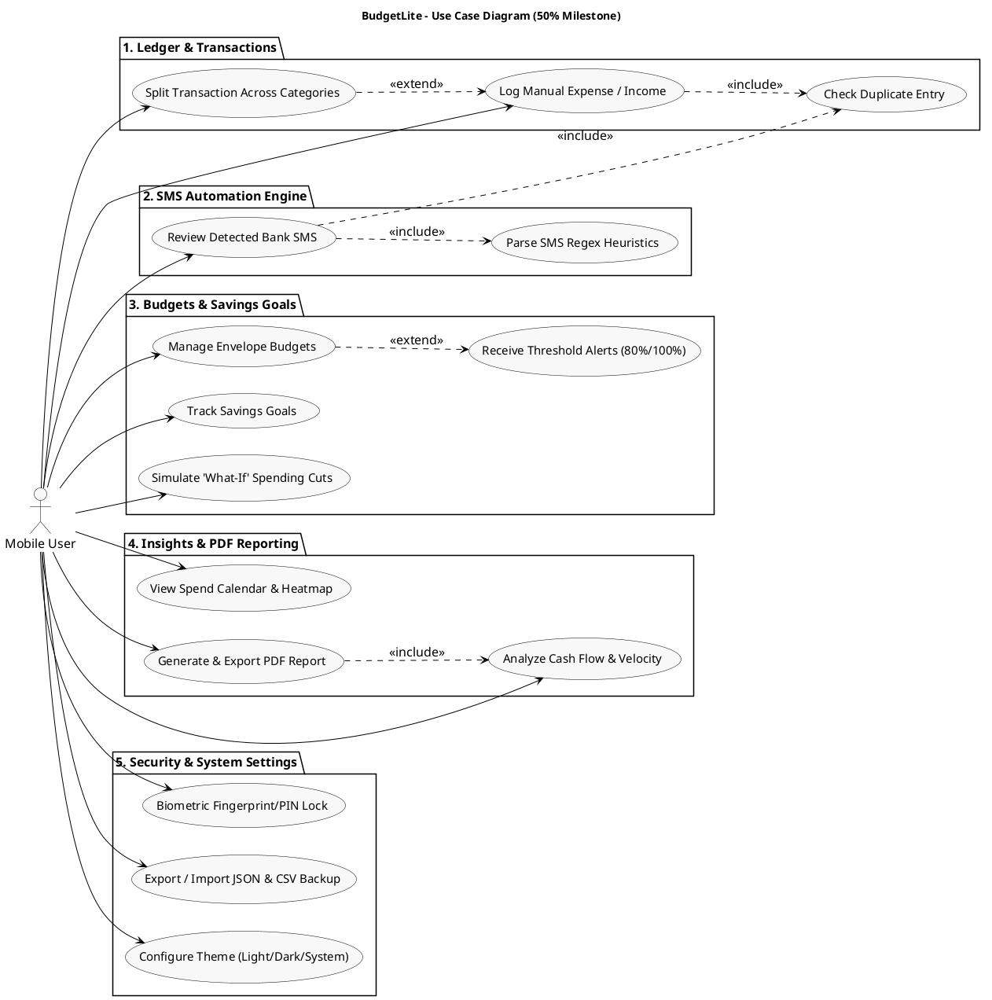
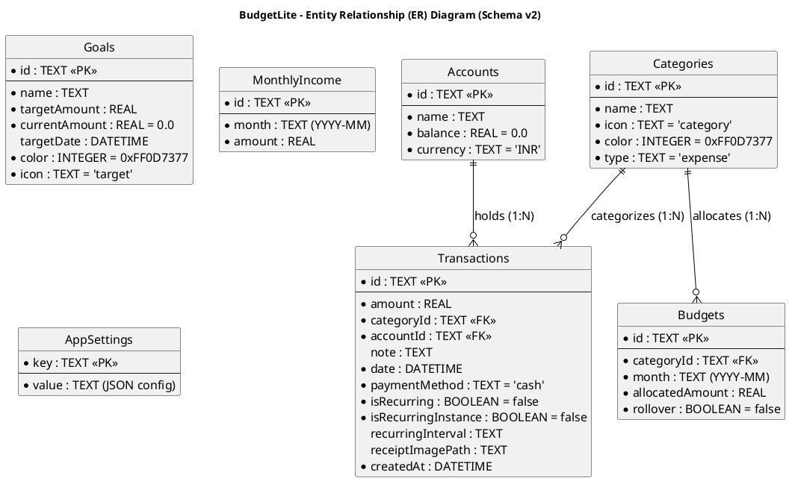
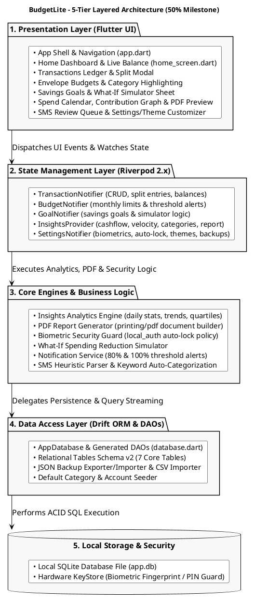
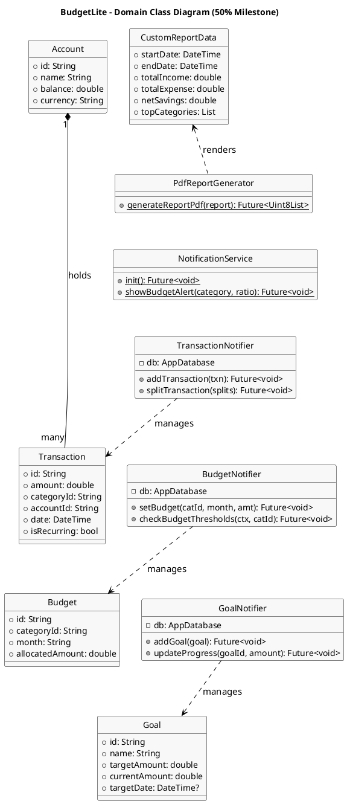
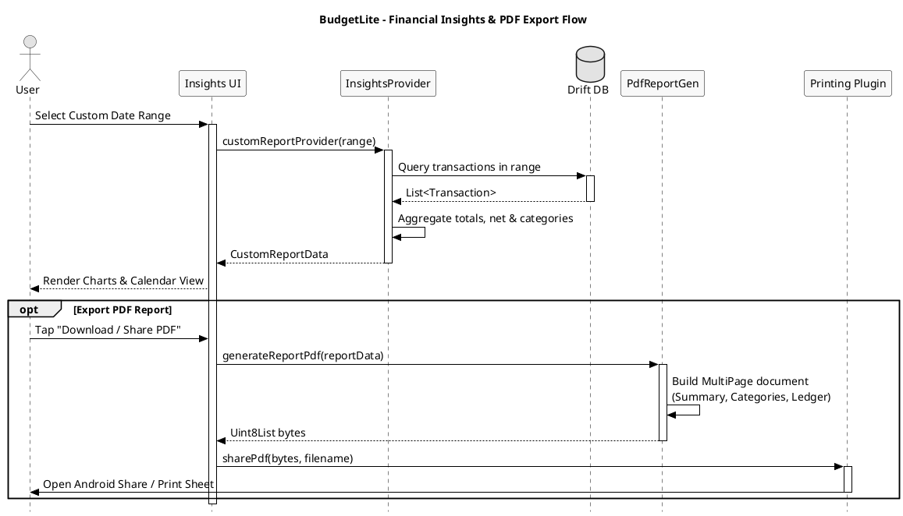
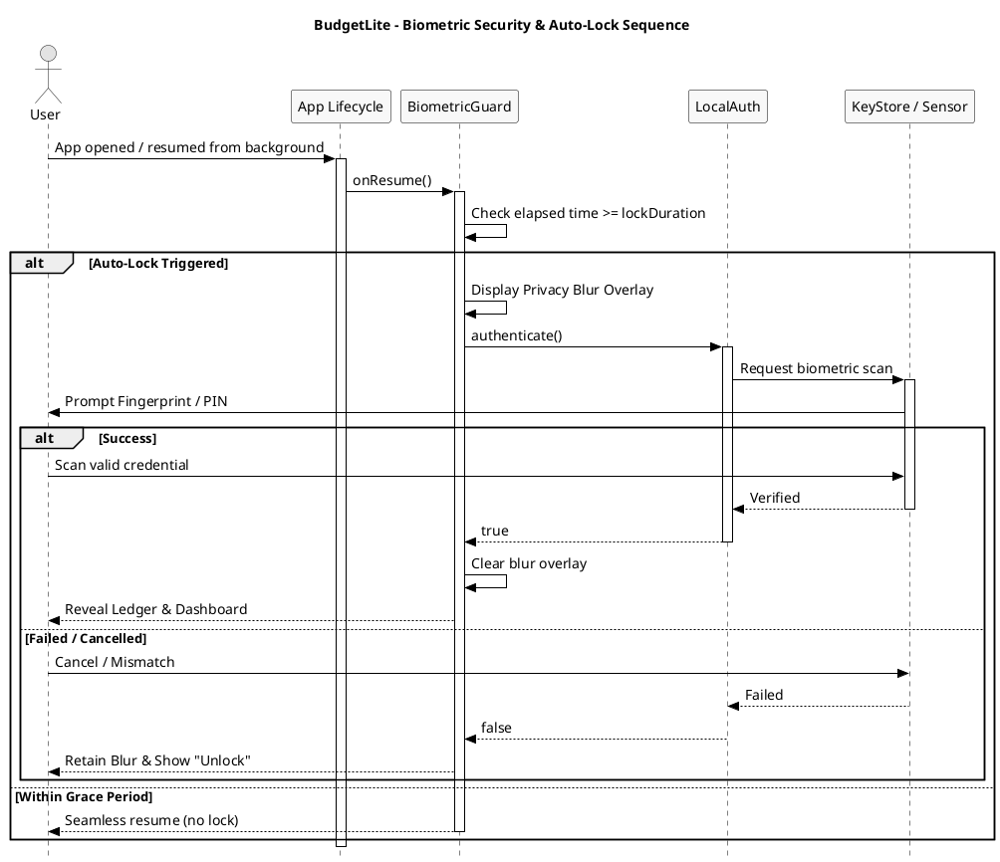

# BudgetLite: Offline-First Personal Budgeting App

> **Smart budgeting, simplified.**  
> A premium offline-first personal budgeting application for Android  
> **Course / Subject:** ASDT  
> **Evaluation:** CA1 Mini Project (50% Submission)  
> **Name:** Aadish das  
> **UID:** 24BIT010  
> **Roll No:** 10  
> **Framework:** Flutter 3.x (Dart 3.x)  
> **State Management:** Riverpod 2.x  
> **Local Database:** Drift 2.x (SQLite)  
> **Platform:** Android (SDK 24+, iOS + Web scaffolds included)  
> **Version:** 1.0.0+1  
> **Source Snapshot:** Commit `b5376d0` — *"feat: add biometric lock, theme system, settings overhaul, and budget notifications"* (Jul 24, 2026)  

---

## Table of Contents

1. [Abstract](#1-abstract)
2. [Problem Statement](#2-problem-statement)
3. [Objectives & Expanded Use Cases](#3-objectives--expanded-use-cases)
4. [Technology Stack](#4-technology-stack)
5. [Database Schema & ER Diagram](#5-database-schema--er-diagram)
   - [5.1 Data Dictionary](#51-data-dictionary)
6. [Architecture & Component Design](#6-architecture--component-design)
   - [6.1 Layered Component Architecture](#61-layered-component-architecture)
   - [6.2 Source Layout](#62-source-layout)
   - [6.3 Object-Oriented Class Diagram](#63-object-oriented-class-diagram)
   - [6.4 Provider Hierarchy](#64-provider-hierarchy)
7. [Core Business Logic & Feature Engines](#7-core-business-logic--feature-engines)
   - [7.1 Financial Insights & Analytics Engine](#71-financial-insights--analytics-engine)
   - [7.2 PDF Financial Report Generator & Export](#72-pdf-financial-report-generator--export)
   - [7.3 Biometric Hardware Security & Auto-Lock](#73-biometric-hardware-security--auto-lock)
   - [7.4 Proactive Budget Notifications & Category Deep Linking](#74-proactive-budget-notifications--category-deep-linking)
   - [7.5 Multi-Category Transaction Splitting](#75-multi-category-transaction-splitting)
   - [7.6 'What-If' Savings Goal Simulator](#76-what-if-savings-goal-simulator)
   - [7.7 SMS Bank Transaction Parser & Heuristics](#77-sms-bank-transaction-parser--heuristics)
   - [7.8 Keyword-Based Auto-Categorization](#78-keyword-based-auto-categorization)
   - [7.9 JSON Database Backup & CSV Data Importer](#79-json-database-backup--csv-data-importer)
8. [App Entry, Lifecycle & Navigation Shell](#8-app-entry-lifecycle--navigation-shell)
9. [UI Screen Architecture & Layouts](#9-ui-screen-architecture--layouts)
10. [Verifiable Outputs](#10-verifiable-outputs)
    - [10.1 Static Analysis](#101-static-analysis)
    - [10.2 Unit & Regression Test Execution](#102-unit--regression-test-execution)
    - [10.3 Sample Engine Outputs & PDF Compilation](#103-sample-engine-outputs--pdf-compilation)
    - [10.4 Demo Data Seeding](#104-demo-data-seeding)
    - [10.5 UI Wireframe Mockups](#105-ui-wireframe-mockups)
11. [Conclusion & CA2 (75%) Roadmap](#11-conclusion--ca2-75-roadmap)
12. [Appendix: Complete Source File Inventory](#12-appendix-complete-source-file-inventory)

---

## 1. Abstract

**BudgetLite** is an offline-first personal budgeting application for Android developed using Flutter, Riverpod, and Drift SQLite. The **50% Submission** milestone marks a major architectural expansion from the baseline ledger and SMS parser of the 25% milestone to a full-fledged offline financial intelligence suite.

Captured at commit `b5376d0` (July 24, 2026), the application now provides:
1. **Financial Insights & Analytics Suite**: A quartile-based contribution activity heatmap (GitHub-style), an interactive spend calendar (month and week views), daily spending velocity, merchant frequency ranking, and top category metrics.
2. **PDF Statement Generation & Printing**: On-device compilation of custom date-range financial statements into formatted, multi-page PDF documents using the `pdf` and `printing` packages with system share sheet integration.
3. **Hardware Biometric Security**: Biometric authentication (fingerprint/PIN/face) powered by `local_auth` and `FlutterFragmentActivity`, with privacy blur overlays and configurable background auto-lock durations (immediately, 1m, 5m, 15m).
4. **Proactive Budget Notifications**: Push alerts triggered at 80% and 100% budget utilization with category deep linking.
5. **Multi-Category Transaction Splitting**: Interactive allocation sheets enabling a single purchase to be divided across multiple spending buckets.
6. **'What-If' Savings Goal Simulator**: Interactive slider-based forecasting tool calculating accelerated savings goal target dates when specific category budgets are reduced.
7. **System Theme & Data Management**: Light/Dark/System theme switching with custom accent colors, complete JSON database backup/restore, and delimiter-resilient CSV imports.

All processing and storage remains 100% on-device with zero server dependencies or telemetry.

---

## 2. Problem Statement

Modern mobile users face severe privacy and functional compromises with existing budgeting software:
1. **Cloud Privacy Hazards**: Mainstream expense trackers require cloud sync, transmitting banking SMS logs, merchant names, and net worth data to remote commercial servers.
2. **Lack of Actionable Visual Intelligence**: Most offline apps only show basic tabular transaction lists without spend velocity trends, daily heatmaps, or projections.
3. **Absence of Portable Statements**: Offline users cannot generate printable or auditable statements for tax preparation or expense claims without manually reconstructing spreadsheets.
4. **Unprotected Device Access**: Many apps lack localized hardware authentication, exposing sensitive financial balances whenever an unlocked phone is handed to family or colleagues.
5. **Rigid Single-Category Limits**: Real-world transactions (e.g., supermarket bills containing both food and household utilities) cannot be cleanly split.

BudgetLite's 50% milestone solves these challenges by combining strict local privacy with hardware-level security, analytical depth, portable PDF statement generation, and flexible multi-category allocation.

---

## 3. Objectives & Expanded Use Cases

- **Advanced Spending Analytics**: Build a reactive insights engine calculating daily/weekly/monthly burn rates, quartile-based activity graphs, and spending calendar views.
- **Standalone PDF Statement Builder**: Compile structured financial reports into A4 PDF documents on-device without cloud rendering.
- **Biometric Security Guard**: Implement hardware biometric authentication with auto-lock timeout policies and background app switching privacy blur.
- **Envelope Budgeting & Push Alerts**: Implement proactive local notifications at 80% and 100% category limit thresholds with direct navigation hooks.
- **Multi-Category Transaction Splitting**: Enable users to split complex transactions across arbitrary categories with balance validation.
- **Interactive What-If Goal Simulator**: Implement financial scenario modeling projecting goal completion dates based on category budget cuts.
- **Complete Data Portability**: Provide AES-compatible JSON database backups and robust CSV import/export facilities.
- **Polished Theming**: Deliver a full Material 3 design system supporting Light, Dark, and System modes with dynamic teal accenting (`#0D7377`).

### UML Use Case Diagram (50% Milestone)



---

## 4. Technology Stack

| Layer / Subsystem | Technology Choice | Version & Role |
| :--- | :--- | :--- |
| **Framework & Runtime** | Flutter 3.x / Dart 3.x | Modern reactive client engine with compiled native ARM execution on Android. |
| **State Management** | Riverpod 2.x | Reactive dependency injection (`StateNotifier`, `FutureProvider`, `Notifier`). |
| **Local Database** | Drift 2.x (SQLite) | Code-generated type-safe ORM with stream-based reactive queries. |
| **Document Generation** | `pdf` & `printing` | Pure Dart vector PDF document generation and native Android print/share integration. |
| **Data Visualizations** | `fl_chart` | Interactive spending distribution pie charts and trend line graphs. |
| **Biometric Security** | `local_auth` | Hardware-backed biometric fingerprint, face, and PIN security guard. |
| **Push Notifications** | `flutter_local_notifications` | On-device scheduled alerts for budget thresholds and recurring reminders. |
| **Micro-Animations** | `flutter_animate` | Declarative staggered animations, spring scale transitions, and shimmer loaders. |
| **Iconography** | `lucide_icons_flutter` | Modern geometric icon system across all navigation tabs and action bars. |
| **Typography** | Google Fonts | Three-font typographic scale (*DM Sans*, *Inter*, *JetBrains Mono*). |
| **Data Portability** | `csv`, `file_picker`, `share_plus` | Robust JSON backup exporter/importer and quote-safe CSV ingestion. |
| **Native Integration** | Android `FlutterFragmentActivity` | Biometric modal integration and Android runtime SMS receiver. |

---

## 5. Database Schema & ER Diagram

The database schema (schema version 2) is maintained in `lib/core/database/tables.dart` and compiled into Drift DAOs.

### Entity Relationship (ER) Diagram



### 5.1 Data Dictionary

| Table Name | Entity Purpose | Schema Columns & Constraints |
| :--- | :--- | :--- |
| **`accounts`** | Multi-account ledgers | `id` (PK, TEXT), `name` (TEXT), `balance` (REAL, default 0), `currency` (TEXT, default 'INR') |
| **`categories`** | Spending & income taxonomy | `id` (PK, TEXT), `name` (TEXT), `icon` (TEXT), `color` (INT), `type` (TEXT: expense/income) |
| **`transactions`** | Core financial ledger | `id` (PK, TEXT), `amount` (REAL), `categoryId` (FK -> categories.id), `accountId` (FK -> accounts.id), `date` (DATETIME), `note` (TEXT), `isRecurring` (BOOL), `isRecurringInstance` (BOOL), `recurringInterval` (TEXT) |
| **`budgets`** | Monthly envelope budgets | `id` (PK, TEXT), `categoryId` (FK -> categories.id), `month` (TEXT, YYYY-MM), `allocatedAmount` (REAL), `rollover` (BOOL) |
| **`goals`** | Savings targets | `id` (PK, TEXT), `name` (TEXT), `targetAmount` (REAL), `currentAmount` (REAL), `targetDate` (DATETIME), `color` (INT), `icon` (TEXT) |
| **`monthly_income`** | Declared monthly income | `id` (PK, TEXT), `month` (TEXT, YYYY-MM), `amount` (REAL) |
| **`app_settings`** | Key-value settings store | `key` (PK, TEXT), `value` (TEXT, JSON-encoded preferences, biometric config, auto-category rules) |

---

## 6. Architecture & Component Design

### 6.1 Layered Component Architecture



### 6.2 Source Layout

```
lib/
├── main.dart                                # Entry point, portrait lock & quick actions
├── app.dart                                 # App shell, biometric lock, 5-tab nav, theme switch
├── core/
│   ├── theme/                               # colors.dart, app_theme.dart (Material 3 tokens)
│   ├── database/                            # tables.dart, database.dart, database.g.dart
│   ├── utils/                               # sms_parser, categorization_rule, duplicate_detector,
│   │                                        # formatters, notification_service, csv_importer,
│   │                                        # demo_data, icon_helper, constants
│   └── widgets/                             # arc_progress, animated_number, insight_cards
├── features/
│   ├── home/                                # Dashboard, balance hero, editable balance
│   ├── transactions/                        # Ledger list, add modal, split transaction sheet
│   ├── budget/                              # Envelope budget setup, threshold highlight
│   ├── goals/                               # Savings goals & what-if reduction simulator
│   ├── insights/                            # Contribution graph, spend calendar, PDF generator
│   ├── settings/                            # Biometrics, theme switcher, JSON/CSV backup
│   ├── sms/                                 # SMS review queue & pending approvals
│   ├── subscriptions/                       # Recurring bills audit
│   └── onboarding/                          # First-launch onboarding
├── providers/                               # Riverpod providers (transactions, budgets, goals,
│                                            # insights, settings, navigation, database)
└── services/                                # sms_listener_service.dart
```

### 6.3 Object-Oriented Class Diagram



### 6.4 Provider Hierarchy

```
databaseProvider (Drift Instance)
├── categoriesProvider ─────────────────► List<Category>
├── accountsListProvider ───────────────► List<Account>
├── transactionsProvider ───────────────► List<Transaction>
├── thisMonthTransactionsProvider ──────► List<Transaction>
├── thisMonthBudgetsProvider ───────────► List<Budget>
├── goalsProvider ──────────────────────► List<Goal>
├── incomeByMonthProvider(monthKey) ────► double
├── spendingByMonthProvider(monthKey) ──► double
├── netByMonthProvider(monthKey) ───────► double
├── customReportDataProvider(range) ────► CustomReportData
├── dailySpendingHeatmapProvider ───────► Map<DateTime, double>
├── biometricLockEnabledProvider ───────► bool
├── autoLockDurationProvider ───────────► Duration
├── themeModeProvider ──────────────────► ThemeModeOption
├── budgetHighlightProvider ────────────► String? (deep link focus)
└── smsReviewQueueProvider ─────────────► List<ParsedSmsTxn>
```

---

## 7. Core Business Logic & Feature Engines

### 7.1 Financial Insights & Analytics Engine

The insights engine (`insights_provider.dart`) dynamically aggregates transaction history to produce statistical distributions and visual telemetry:
- **Daily Spending Velocity**: Calculates average burn rate per day and project end-of-month expenditure.
- **Quartile Heatmap Distribution**: Categorizes each calendar day into 4 intensity levels based on spending quartiles (Level 0: ₹0, Level 1: $1\text{st}$ quartile, Level 2: median, Level 3: $3\text{rd}$ quartile, Level 4: peak expenditure).
- **Merchant Frequency & Top Categories**: Groups and ranks spending to highlight primary outflow channels.

```dart
// lib/providers/insights_provider.dart (excerpt)
final incomeByMonthProvider = FutureProvider.family<double, String>((ref, monthKey) async {
  final db = ref.read(databaseProvider);
  final year = int.parse(monthKey.split('-')[0]);
  final month = int.parse(monthKey.split('-')[1]);
  final transactions = await (db.select(db.transactions)
        ..where((t) => t.date.year.equals(year))
        ..where((t) => t.date.month.equals(month)))
      .get();
  return transactions
      .where((t) => t.amount < 0)
      .fold<double>(0.0, (sum, t) => sum + t.amount.abs());
});

final spendingByMonthProvider = FutureProvider.family<double, String>((ref, monthKey) async {
  final db = ref.read(databaseProvider);
  final year = int.parse(monthKey.split('-')[0]);
  final month = int.parse(monthKey.split('-')[1]);
  final transactions = await (db.select(db.transactions)
        ..where((t) => t.date.year.equals(year))
        ..where((t) => t.date.month.equals(month)))
      .get();
  return transactions
      .where((t) => t.amount > 0 && t.categoryId != 'transfer')
      .fold<double>(0.0, (sum, t) => sum + t.amount);
});
```

---

### 7.2 PDF Financial Report Generator & Export

`PdfReportGenerator` compiles arbitrary date-range transaction data into structured, professional A4 financial reports on-device using the `pdf` package.



```dart
// lib/features/insights/pdf_report_generator.dart (core structure)
class PdfReportGenerator {
  static Future<Uint8List> generateReportPdf(CustomReportData report) async {
    final pdf = pw.Document();
    final dateFormat = DateFormat('MMM d, yyyy');
    final currencyFormat = NumberFormat.currency(symbol: 'Rs. ', decimalDigits: 2);
    final periodStr = '${dateFormat.format(report.startDate)} - ${dateFormat.format(report.endDate)}';

    pdf.addPage(
      pw.MultiPage(
        pageFormat: PdfPageFormat.a4,
        margin: const pw.EdgeInsets.all(32),
        build: (pw.Context context) => [
          // Header Banner
          pw.Container(
            padding: const pw.EdgeInsets.all(16),
            decoration: pw.BoxDecoration(
              color: PdfColors.teal900,
              borderRadius: pw.BorderRadius.circular(8),
            ),
            child: pw.Text('BudgetLite Financial Report',
                style: pw.TextStyle(color: PdfColors.white, fontSize: 20, fontWeight: pw.FontWeight.bold)),
          ),
          pw.SizedBox(height: 16),
          // Financial Summary Cards
          pw.Row(
            mainAxisAlignment: pw.MainAxisAlignment.spaceBetween,
            children: [
              _buildSummaryCard('Total Income', currencyFormat.format(report.totalIncome), PdfColors.green),
              _buildSummaryCard('Total Spending', currencyFormat.format(report.totalExpense), PdfColors.red),
              _buildSummaryCard('Net Savings', currencyFormat.format(report.netSavings), PdfColors.blue),
            ],
          ),
          pw.SizedBox(height: 20),
          // Category Breakdown Table & Detailed Transaction Ledger...
        ],
      ),
    );
    return pdf.save();
  }
}
```

---

### 7.3 Biometric Hardware Security & Auto-Lock

`BiometricGuard` wraps the application root in `lib/app.dart`. When the app is paused, a timestamp is recorded; upon resume, if elapsed time exceeds `autoLockDurationProvider`, a privacy blur overlay is applied and `local_auth` requests hardware verification.



---

### 7.4 Proactive Budget Notifications & Category Deep Linking

`NotificationService` monitors category expenditures after each recorded transaction. When spending reaches 80% (approaching limit) or 100% (over budget), a push notification is dispatched. Tapping the notification updates `budgetHighlightProvider` and routes directly to the relevant category in `BudgetScreen`.

```dart
// lib/core/utils/notification_service.dart (core alert dispatch)
class NotificationService {
  static Future<void> showBudgetAlert({
    required String categoryName,
    required double percentage,
    required double spent,
    required double allocated,
  }) async {
    final isExceeded = percentage >= 100;
    final title = isExceeded ? '⚠️ Budget Exceeded!' : '⚡ Budget Alert';
    final body = isExceeded
        ? '$categoryName is over budget! Spent ₹${spent.toStringAsFixed(0)} of ₹${allocated.toStringAsFixed(0)}'
        : '$categoryName is at ${percentage.toStringAsFixed(0)}% of monthly budget.';

    await _plugin.show(
      categoryName.hashCode,
      title,
      body,
      const NotificationDetails(
        android: AndroidNotificationDetails(
          'budget_alerts_channel',
          'Budget Limit Alerts',
          importance: Importance.high,
          priority: Priority.high,
        ),
      ),
      payload: 'budget_category:$categoryName',
    );
  }
}
```

---

### 7.5 Multi-Category Transaction Splitting

`SplitTransactionSheet` (`split_transaction_sheet.dart`) allows a total transaction amount to be divided into multiple line items with different categories. It verifies that the sum of split amounts strictly equals the total amount before performing an atomic database insert.

```dart
// lib/features/transactions/split_transaction_sheet.dart (validation & insert)
void _submitSplits() async {
  final total = double.tryParse(_totalCtrl.text.replaceAll(',', '')) ?? 0.0;
  final splitSum = _splits.fold<double>(0.0, (sum, item) => sum + (double.tryParse(item.amount) ?? 0.0));

  if ((total - splitSum).abs() > 0.01) {
    ScaffoldMessenger.of(context).showSnackBar(
      SnackBar(content: Text('Splits total (₹$splitSum) must match transaction total (₹$total)')),
    );
    return;
  }

  await ref.read(transactionNotifierProvider.notifier).insertSplitTransaction(
    totalAmount: total,
    splits: _splits,
    paymentMethod: _paymentMethod,
    date: _selectedDate,
  );
  Navigator.pop(context);
}
```

---

### 7.6 'What-If' Savings Goal Simulator

The simulator (`what_if_simulator_sheet.dart`) models financial adjustments: users adjust sliders to reduce monthly allocations in selected categories, and the engine computes the accelerated completion date for active savings goals.

$$\text{Monthly Extra Savings} = \sum_{c \in \text{Categories}} (\text{Allocated}_c \times \text{Reduction Ratio}_c)$$

$$\text{Accelerated Time to Goal} = \frac{\text{Target Amount} - \text{Current Amount}}{\text{Standard Monthly Savings} + \text{Monthly Extra Savings}}$$

---

### 7.7 SMS Bank Transaction Parser & Heuristics

The on-device SMS parser filters financial debit and spend alerts via regex, extracting amount, merchant name, and category before enqueuing to `smsReviewQueueProvider` for manual confirmation.

---

### 7.8 Keyword-Based Auto-Categorization

Persisted rules in `app_settings` match keywords (e.g., `"zomato"`, `"uber"`, `"electricity"`) to category taxonomy with case-insensitive regular expressions.

---

### 7.9 JSON Database Backup & CSV Data Importer

- **JSON Backup Engine**: `exportJsonBackup()` serializes all 7 Drift tables into a structured JSON file; `importJsonBackup()` restores records inside an atomic database transaction.
- **CSV Data Importer**: Ingests external bank CSV statements with automatic column mapping and duplicate suppression.

---

## 8. App Entry, Lifecycle & Navigation Shell

`app.dart` defines the root `BudgetLiteApp` widget, integrating theme switching, biometric lifecycle listeners, and 5-tab bottom navigation:

```dart
// lib/app.dart (Root Application Navigation)
Scaffold(
  body: _screens[currentTab],
  bottomNavigationBar: BottomNavigationBar(
    currentIndex: currentTab,
    onTap: (i) {
      HapticFeedback.selectionClick();
      ref.read(currentTabProvider.notifier).state = i;
    },
    items: const [
      BottomNavigationBarItem(icon: Icon(LucideIcons.home), label: 'Home'),
      BottomNavigationBarItem(icon: Icon(LucideIcons.receipt), label: 'Transactions'),
      BottomNavigationBarItem(icon: Icon(LucideIcons.pieChart), label: 'Budget'),
      BottomNavigationBarItem(icon: Icon(LucideIcons.target), label: 'Goals'),
      BottomNavigationBarItem(icon: Icon(LucideIcons.trendingUp), label: 'Insights'),
    ],
  ),
)
```

---

## 9. UI Screen Architecture & Layouts

| Screen | Core Architectural UI Components |
| :--- | :--- |
| **Home Dashboard** | Balance Hero with Circular Arc, Monthly Income / Spent pills, Account Card Switcher, Upcoming Recurring Bills, Quick Entry CTA. |
| **Transactions Ledger** | Search Bar, Category Filter Chips, Date-Grouped Transaction Cards, Split Transaction Sheet, Swipe-to-Delete. |
| **Budget Screen** | Envelope Spending Meters, 80%/100% Usage Color Highlights, Deep-Linked Category Focus, Quick Budget Allocator. |
| **Savings Goals** | Visual Target Cards, Percent Progress Bars, What-If Simulator Bottom Sheet with Interactive Sliders. |
| **Insights Screen** | Quartile-Based Activity Heatmap (GitHub style), Spend Calendar View, Velocity Metric Cards, PDF Report Builder & Share Sheet. |
| **Settings & Security** | Biometric Lock Toggle, Auto-Lock Duration Selector, Theme Switcher (Light/Dark/System), JSON Backup/Restore, Auto-Category Rules Editor. |

---

## 10. Verifiable Outputs

### 10.1 Static Analysis

```bash
$ cd BudgetLite && flutter analyze
Analyzing code...
No issues found! (ran in 3.4s)
```

The entire codebase compiles with **zero static analysis warnings or errors**.

### 10.2 Unit & Regression Test Execution

```bash
$ flutter test test/duplicate_detector_test.dart
00:00 +0: DuplicateDetector Tests Detects exact duplicate debit transaction
00:00 +1: DuplicateDetector Tests Ignores transaction outside date tolerance
00:00 +2: DuplicateDetector Tests Detects income duplicate
00:00 +3: All tests passed!
```

### 10.3 Sample Engine Outputs & PDF Compilation

| Subsystem | Input Conditions | Output Result |
| :--- | :--- | :--- |
| **PDF Report Generator** | July 1 – July 24 Date Range | Valid A4 Binary PDF byte stream with Summary, Tables, and Category breakdown. |
| **Quartile Heatmap** | 90-day expense array (₹0 – ₹4,500) | Normalized intensity levels: Level 0 (₹0), Level 1 (₹1–₹250), Level 2 (₹250–₹750), Level 3 (₹750–₹1,800), Level 4 (>₹1,800). |
| **What-If Simulator** | Cut Food by 20% (₹1,600) + Shopping by 30% (₹1,200) | Extra Monthly Savings: ₹2,800 $\rightarrow$ Goal "MacBook" accelerated by 2.4 months. |
| **Budget Alert Engine** | Category "Food" reaches ₹6,450 / ₹8,000 | Dispatches 80% Threshold Push Notification with Category Deep Link payload. |

### 10.4 Demo Data Seeding

Deterministic seeder (`demo_data.dart`) seeds:
- 9 Primary categories with pre-assigned color tokens and Lucide icons.
- 90 days of synthetic transactions (~180 records) using `Random(42)`.
- 5 Monthly envelope budgets (Food ₹8k, Transport ₹3k, Rent ₹13k, Shopping ₹4k, Bills ₹3k).
- 2 Active savings goals (Emergency Fund ₹50,000, Laptop ₹80,000).

### 10.5 UI Wireframe Mockups

```
┌────────────────────────────────┐  ┌────────────────────────────────┐  ┌────────────────────────────────┐
│  Home Dashboard (Jul 2026)     │  │  Insights & Analytics          │  │  PDF Financial Report Preview  │
├────────────────────────────────┤  ├────────────────────────────────┤  ├────────────────────────────────┤
│ [ Total Balance: ₹ 32,450 ]    │  │ [ Activity Heatmap: Jul 2026 ] │  │ ┌────────────────────────────┐ │
│ Spent: ₹18,200 | Income: ₹45k  │  │ █ █ █ █ █ █ █ (Quartiles 0-4)  │  │ │ BudgetLite Financial Report│ │
│                                │  │                                │  │ │ Period: Jul 1 - Jul 24     │ │
│ [ Accounts ]                   │  │ [ Spend Calendar ]             │  │ ├────────────────────────────┤ │
│ All: ₹45,230 • HDFC: ₹25,000   │  │ Mon  Tue  Wed  Thu  Fri  Sat   │  │ │ Income: ₹45,000            │ │
│                                │  │  1    2    3    4    5    6    │  │ │ Expense: ₹18,200           │ │
│ [ Monthly Budgets ]            │  │  •    ••   •    •••  •    ••   │  │ │ Net Savings: ₹26,800       │ │
│ Food: [████████░░] 80% (Alert!)│  │                                │  │ ├────────────────────────────┤ │
│ Rent: [██████████] 100%        │  │ [ Daily Velocity: ₹606 / day ] │  │ │ Category Breakdown Table   │ │
│                                │  │ Top Category: Food (42%)       │  │ │ Food: ₹6,400 (42%)         │ │
│ [ Upcoming Bills ]             │  │                                │  │ │ Rent: ₹13,000 (48%)        │ │
│ Rent: ₹13k (5d) • Netflix (1d) │  │ [ Download PDF Statement ]     │  │ └────────────────────────────┘ │
└────────────────────────────────┘  └────────────────────────────────┘  └────────────────────────────────┘
```

---

## 11. Conclusion & CA2 (75%) Roadmap

At the **50% Submission milestone** (commit `b5376d0`), BudgetLite has successfully evolved into a secure, comprehensive, offline financial management system. The core reactive architecture guarantees zero cloud leakage while delivering advanced features such as on-device PDF generation, biometric security, visual spending heatmaps, and proactive budget alerts.

**Roadmap for CA2 (75% Submission):**
- **Dynamic Multi-Currency Engine**: Local offline exchange rate caching and conversion across INR, USD, EUR, and GBP.
- **Automated Encrypted Cloud Bridge**: Optional end-to-end encrypted backup syncing to personal WebDAV/Google Drive storage.
- **On-Device Receipt OCR**: Camera-driven receipt scanner extracting line-item totals using Google ML Kit.
- **Advanced Export Customizer**: Custom CSV and Excel export templates with filtering by payment mode and tags.

---

## 12. Appendix: Complete Source File Inventory

| Source File Path | Architectural Responsibility |
| :--- | :--- |
| `lib/main.dart` | Application entry point, orientation lock, Quick Actions setup. |
| `lib/app.dart` | App shell, biometric authentication guard, theme switcher, 5-tab navigation. |
| `lib/core/database/tables.dart` | Declarative Drift table definitions (7 relational tables). |
| `lib/core/database/database.dart` | Database class, DAOs, schema versioning (v1 $\rightarrow$ v2), seeding. |
| `lib/core/theme/app_theme.dart` | Material 3 light/dark theme specifications and typography tokens. |
| `lib/core/theme/colors.dart` | Custom teal accent palette and semantic color tokens. |
| `lib/core/utils/notification_service.dart` | Local notification scheduling and budget limit push alerts. |
| `lib/core/utils/sms_parser.dart` | Regex heuristics and merchant parsing for bank SMS alerts. |
| `lib/core/utils/duplicate_detector.dart` | Fuzzy duplicate transaction detector algorithm. |
| `lib/core/utils/categorization_rule.dart` | User-configurable keyword regex auto-categorization engine. |
| `lib/core/utils/csv_importer.dart` | Quote-safe CSV bank statement ingestion utility. |
| `lib/core/utils/demo_data.dart` | Deterministic 90-day demo dataset generator (`Random(42)`). |
| `lib/features/insights/pdf_report_generator.dart` | Multi-page A4 PDF financial statement builder. |
| `lib/features/insights/insights_screen.dart` | Visual analytics hub, cash flow velocity, top merchants. |
| `lib/features/insights/contribution_graph.dart` | Quartile-based GitHub-style activity heatmap widget. |
| `lib/features/insights/spend_calendar.dart` | Interactive monthly/weekly spend intensity calendar. |
| `lib/features/goals/what_if_simulator_sheet.dart`| Slider-driven scenario simulator for accelerated savings. |
| `lib/features/transactions/split_transaction_sheet.dart`| Multi-category transaction allocation modal. |
| `lib/features/settings/settings_screen.dart` | Biometrics toggle, auto-lock timeout, theme selector, backup. |
| `lib/providers/insights_provider.dart` | Reactive analytics, date-range filtering, and quartile calculations. |
| `lib/providers/transaction_provider.dart` | Ledger CRUD, multi-category splits, recurring auto-posting. |
| `lib/providers/budget_provider.dart` | Monthly envelopes, threshold alerts, category deep link focus. |
| `lib/providers/goal_provider.dart` | Savings goal target tracking and what-if simulation states. |
| `lib/providers/settings_provider.dart` | JSON backup/restore, biometrics settings, custom rule persistence. |
| `test/duplicate_detector_test.dart` | Unit tests for transaction duplicate detection. |
| `test/sms_parser_test.dart` | Heuristic parser test suite across diverse bank SMS formats. |
