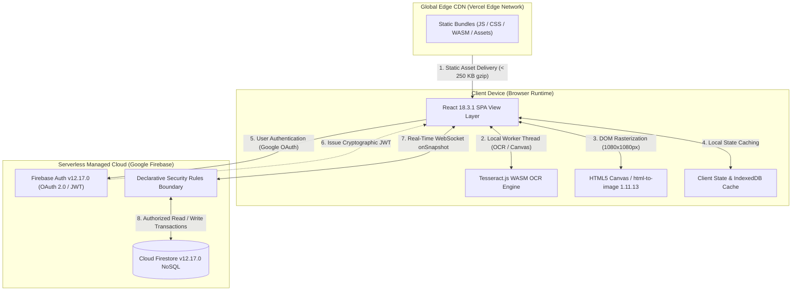

# 2.1 Web Architectures for Crowdsourced Verification

## 2.1.1 Introduction and Architectural Context
Designing an information system to counter the viral spread of misinformation across encrypted social networks requires fundamentally re-evaluating traditional web application architectures. Conventional public-web fact-checking portals (such as editorial web publications) operate on standard request-response paradigms, where journalists author articles and readers consume static or cached server-rendered pages. In stark contrast, a community-driven, decentralized fact-checking platform such as **FactStamp** operates under complex, bi-directional socio-technical constraints:

1. **Zero Operational Budget:** As an academic research project and public-interest civic technology, the system must achieve complete financial sustainability within perpetual zero-cost cloud tiers, ruling out persistent dedicated virtual private servers (VPS) or container clusters incurring recurring monthly fees ($15–$100/month).
2. **High-Throughput Mobile Ingestion:** More than 80% of target users in India interact with WhatsApp on mid-range Android smartphones over variable 4G cellular networks. The system must ingest claims—often submitted as high-resolution screenshots—without saturating upstream mobile bandwidth.
3. **Client-Side Compute Offloading:** Heavy computational tasks such as image downscaling, character recognition via WebAssembly (WASM), and DOM-to-canvas graphic compilation must execute within the client browser rather than consuming expensive cloud server CPU cycles.
4. **Sub-Second Reactive Synchronization:** When multiple independent community fact-checkers evaluate pending claims simultaneously, voting states, quorum counters ($N \ge 3$), and consensus updates must broadcast instantaneously across active client sessions without polling overhead.

To determine the optimal foundation for FactStamp, three primary architectural archetypes were comprehensively analyzed: **Monolithic Server-Side Rendering (SSR)**, **Hybrid SSR / Serverless Edge**, and **Decoupled Serverless Single-Page Application (SPA) with Backend-as-a-Service (BaaS)**.

---

## 2.1.2 Comparative Evaluation of Architectural Paradigms

| Architectural Model | Representative Stacks | Key Advantages | Limitations & Failure Modes for FactStamp |
| :--- | :--- | :--- | :--- |
| **Monolithic Server-Side Rendering (SSR)** | Django, Ruby on Rails, Laravel, Express + Pug | Centralized business logic; mature relational ORMs; straightforward ACID transaction handling; native search crawler indexing. | Demands continuous cloud server instances ($10–$50/mo); poor real-time reactive streaming (requires heavy HTTP polling); high server compute cost for image processing and OCR; single point of failure. |
| **Hybrid SSR / Serverless Edge** | Next.js 14+ (App Router), Remix, Nuxt 3 | Optimized first-contentful-paint (FCP); automatic edge caching; integrated server actions; seamless API route co-location. | Cold-start latency on serverless edge functions (250–1200ms); edge memory limits (50MB) restrict client-side WASM OCR dependencies; unnecessary complexity for authenticated verification workflows. |
| **Decoupled Serverless SPA (BaaS)** | React 18.3.1 + Vite 5.4.0 + Cloud Firestore v12.17.0 (BaaS) | Zero monthly compute cost; instant client routing; real-time WebSocket snapshot listeners; client-side image compression and OCR execution; local-first offline caching. | Requires disciplined client state management; mandates declarative database-layer security rules in place of traditional middle-tier application controllers. |

### 1. Monolithic Server-Side Rendering (SSR)
Traditional web architectures rely on a centralized backend runtime (such as Python/Django, PHP/Laravel, or Node.js/Express) connected to an internal relational database (PostgreSQL or MySQL). In this model, every client request triggers server-side template evaluation, database queries, and full HTML page construction before streaming the rendered document back over HTTP.

* **Advantages:** Centralized business logic simplifies authorization; relational database transactions provide robust ACID guarantees; search engines index rendered HTML effortlessly.
* **Failure Modes for FactStamp:**
  - *Continuous Compute Costs:* A monolithic application demands persistent cloud hosting (such as AWS EC2, DigitalOcean Droplets, or Heroku Dynos). Maintaining continuous availability incurs fixed baseline operational expenses ($10 to $50 per month), violating the zero-budget academic mandate.
  - *Compute Bottlenecks:* If incoming screenshot images are uploaded to the central server for OCR processing, concurrent submissions rapidly saturate CPU and memory buffers, inducing cascading server timeouts or requiring expensive auto-scaling worker nodes.
  - *High Latency for Collaborative Verification:* Synchronizing quorum voting progress across multiple active verifiers requires HTTP short-polling or long-polling, generating immense query volume and degrading server responsiveness.

### 2. Hybrid SSR / Serverless Edge
Modern meta-frameworks like Next.js 14+ (utilizing the React Server Components architecture) and Remix split application logic between edge compute workers and client runtimes. Dynamic pages are pre-rendered at edge points-of-presence (PoPs), while state mutations execute via server actions.

* **Advantages:** Delivers exceptional First Contentful Paint (FCP) and Cumulative Layout Shift (CLS) scores; simplifies search engine optimization for public-facing claim registries; provides seamless API route colocation.
* **Failure Modes for FactStamp:**
  - *Serverless Cold-Start Overhead:* On free-tier serverless hosting providers (e.g., Vercel Hobby or Netlify), edge functions enter sleep states during periods of inactivity. Waking an edge worker introduces cold-start latencies of 250 ms to 1,200 ms, frustrating mobile verifiers.
  - *Binary Size and WASM Execution Constraints:* Edge runtime environments strictly cap worker execution bundle sizes (typically 1 MB to 50 MB) and restrict native execution threads, rendering the direct inclusion of heavy WASM OCR engines (Tesseract.js language traineddata files measuring 4 MB to 15 MB) complex or cost-prohibitive.
  - *Redundant Architecture for Interactive Dashboards:* Because FactStamp's primary operational surfaces—the Multimodal Ingestion portal, the Quorum Verification queue, and the Fact Card compilation canvas—are highly stateful, interactive web tools, server-rendered HTML offers zero functional benefit over client-side DOM updates.

### 3. Decoupled Serverless Single-Page Application (SPA) with BaaS
The chosen architecture cleanly decouples static frontend asset delivery from backend data persistence. Static application assets (HTML, JavaScript bundles, CSS stylesheets, WASM binaries, and optimized SVG icons) are hosted globally across Vercel's Edge Content Delivery Network (CDN). The client browser directly connects to managed cloud services (Google Firebase Authentication and Google Cloud Firestore v12.17.0) via TLS 1.3 encrypted WebSockets.

* **Key Strengths for FactStamp:**
  - *Zero Compute Infrastructure Costs:* Serving static assets via edge CDNs falls completely within perpetual free-tier allocations (100 GB monthly bandwidth). No dedicated compute servers or containers are instantiated.
  - *Client-Side Distributed Processing:* By shifting image downscaling (via HTML5 2D Canvas) and OCR character extraction (via Tesseract.js WebAssembly) directly onto the client's device CPU/GPU threads, cloud compute resource utilization is reduced to zero.
  - *Native Real-Time Reactive Streaming:* Google Cloud Firestore v12.17.0 maintains persistent bidirectional WebSocket connections (`onSnapshot` listeners). When a verifier commits a vote, Firestore pushes delta mutations to all subscribed clients in under 120 ms, eliminating polling latency.
  - *Local-First Offline Resilience:* The Firestore client SDK automatically maintains an in-memory and IndexedDB local cache. Even if mobile connectivity briefly drops on rural cellular networks, verifiers can continue drafting rationale texts without losing active state.

---

## 2.1.3 Architectural Topology of the Decoupled System

---

## 2.1.4 Client-Side Distributed Offloading Model & Zero Cloud Storage Architecture

Under FactStamp's decoupled paradigm, client workstations and mobile devices are transformed from passive display terminals into active compute nodes. The computational workload is distributed according to device capabilities:

1. **Client-Side Image Downscaling & Zero Cloud Storage Bill Model:** Before any image payload leaves the client or enters the OCR pipeline, the browser loads the screenshot file into an off-screen HTML5 Canvas. The canvas downscales ultra-high-resolution mobile screenshots (often $1080 \times 2400$px or larger, 3–8 MB) down to a normalized bounding dimension of $\le 1200$px while maintaining aspect ratio, and exports a compressed JPEG/WebP base64 data string under 500 KB. Storing this compressed string directly inside the Firestore document field completely avoids instantiating Google Cloud Storage or AWS S3 buckets, achieving an absolute **$0.00 cloud storage bill model**.
2. **In-Browser WebAssembly OCR:** The downscaled image buffer is dispatched directly to an in-browser Web Worker running Tesseract.js (compiled from C++ to WebAssembly). Character recognition executes entirely within the browser's allocated WebAssembly heap, never transmitting raw user screenshots to third-party APIs.
3. **Client-Side DOM-to-PNG Card Rasterization:** When compiling the certified fact-check verdict into a shareable square PNG card, `html-to-image` 1.11.13 clones the active DOM tree, encapsulates it inside an SVG `<foreignObject>`, and leverages the browser's native C++ rendering pipeline (Blink/WebKit/Gecko) to rasterize a high-DPI $1080 \times 1080$px PNG image at 2x resolution (`pixelRatio: 2`). Cloud rendering servers (e.g., Puppeteer microservices) are completely eliminated.

---

## 2.1.5 Architectural Decision Record (ADR)

* **Title:** ADR-01: Adoption of Decoupled Serverless SPA Architecture with Backend-as-a-Service (BaaS)
* **Status:** Accepted and Fully Implemented.
* **Context:** FactStamp requires an architecture capable of processing multimodal claims and coordinating real-time consensus verification among citizens with zero financial budget, high mobile performance, and complete data privacy.
* **Decision:** Implement FactStamp as a decoupled client-side Single-Page Application using React 18.3.1, Vite 5.4.0, Tailwind CSS v4.0.0, and Google Cloud Firestore v12.17.0. Execute all image downscaling, character recognition, and card rasterization on client browser threads.
* **Consequences:** Eliminates recurring cloud server and vision API bills ($0.00/month baseline); delivers sub-120ms real-time consensus updates; necessitates comprehensive declarative Firestore security rules to protect database integrity without a custom API backend.
