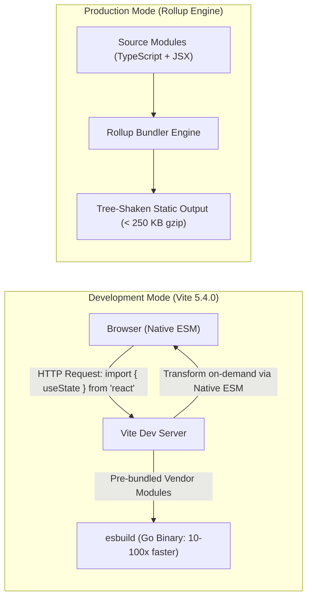

# 2.2 Frontend Frameworks & Modern Build Toolchains

## 2.2.1 Introduction and Performance Criteria
The user interface layer of FactStamp represents the direct operational medium for two distinct user groups: mobile-first WhatsApp recipients submitting claims, and community verifiers conducting rapid evidentiary research. The choice of frontend framework and development build toolchain dictates:
1. **Runtime Execution Smoothness:** The platform must execute non-blocking UI interactions while running CPU-heavy string comparisons and canvas operations.
2. **Mobile Network Payload (Bundle Size):** With users accessing FactStamp across constrained 3G/4G connections in tier-2 and tier-3 Indian cities, minimal initial bundle footprint and aggressive dead-code elimination are mandatory.
3. **Developer Velocity & Hot Module Replacement (HMR):** Complex DOM-to-canvas layout synchronization requires instantaneous feedback during component iteration.
4. **Third-Party Ecosystem Compatibility:** Seamless interoperability with WebAssembly wrappers (`tesseract.js`), SVG DOM rasterizers (`html-to-image` 1.11.13), and declarative SVG graphing tools (`recharts` 2.10.0).

Four enterprise-grade web frameworks and build toolchains were systematically evaluated: **React 18.3.1 + Vite 5.4.0**, **Next.js 14+ (App Router)**, **Vue.js 3 (Vite)**, and **Angular 17+**.

---

## 2.2.2 Comparative Evaluation of Frontend Frameworks

| Evaluation Dimension | React 18.3.1 + Vite 5.4.0 | Next.js 14+ (App Router) | Vue.js 3 (Vite) | Angular 17+ (Vite/esbuild) |
| :--- | :--- | :--- | :--- | :--- |
| **Runtime Architecture** | Fiber Reconciler with Concurrent Mode | Hybrid Server Components + Client Hydration | Proxy-based Reactive Virtual DOM | Incremental DOM with Signals / Zone.js |
| **Initial Bundle Footprint (Gzipped)** | **~42 KB** (React + ReactDOM core) | **~85–120 KB** (Framework runtime + hydration) | **~16 KB** (Vue core runtime) | **~140–180 KB** (Core + Common + Platform) |
| **Development Server Cold Start** | **< 300 ms** (Vite native ESM via esbuild) | 2,500–6,000 ms (Node.js compilation / Turbopack) | **< 300 ms** (Vite native ESM) | 1,800–4,500 ms (Angular CLI pipeline) |
| **Hot Module Replacement (HMR)** | **< 50 ms** (Fine-grained module replacement) | 300–800 ms (Server component revalidation) | **< 50 ms** (SFC scoped HMR) | 200–500 ms |
| **Heavy Computing Concurrency** | **Native `useTransition` & `useDeferredValue`** | Server-bound or Web Worker delegation | Computed schedulers (Requires custom debouncing) | Signals scheduler (Manual microtask coordination) |
| **Specialized Graphics Ecosystem** | **Vast** (`html-to-image`, `recharts`, `lucide-react`) | High compatibility, but requires `"use client"` wrappers | Moderate; fewer native canvas wrappers | Moderate; complex TypeScript ceremony |
| **Architectural Verdict for FactStamp** | **Selected Foundation** | Over-engineered for client SPA | Viable, but smaller canvas library ecosystem | Excessively heavy for zero-budget mobile SPA |

---

## 2.2.3 Deep Dive: React 18.3.1 Concurrent Rendering & Scheduling

Prior to React 18, React's reconciliation engine operated synchronously. Once rendering commenced, the JavaScript call stack was blocked until the entire virtual DOM tree was evaluated. In FactStamp, this legacy behavior caused severe user-facing defects:
- When a user pasted an extracted 2,000-character forward, running real-time duplicate similarity checks across hundreds of cached claims froze the input cursor for 150–300 ms.
- Dynamic fact card preview rendering blocked mobile touch gestures during live color-token updates.

React 18.3.1 fundamentally resolves these issues through **Concurrent React** and priority-based task scheduling:

```text
[User Types Claim / Pastes OCR Text]
                 │
                 ├── Urgent Task (Immediate) ──> Update Input Field Cursor (High Priority)
                 │
                 └── Non-Urgent Transition ───> useTransition(() => {
                                                   computeJaccardDuplicates(inputText);
                                                   updateLiveCardPreview();
                                                 }) (Interruptible Low Priority)
```

### 1. `useTransition` for Non-Blocking Duplicate Detection
FactStamp wraps the duplicate detection engine within React's `useTransition` hook. This marks the similarity calculation as a non-urgent transition:
```typescript
import { useState, useTransition } from "react";
import { checkDuplicateClaim } from "../lib/duplicateDetection";

export function ClaimSubmissionInput() {
  const [claimText, setClaimText] = useState("");
  const [duplicateMatches, setDuplicateMatches] = useState<MatchResult[]>([]);
  const [isSearching, startTransition] = useTransition();

  const handleInputChange = (e: React.ChangeEvent<HTMLTextAreaElement>) => {
    const nextText = e.target.value;
    // 1. High-priority state update: Instant cursor response
    setClaimText(nextText);

    // 2. Low-priority transition: Interruptible string comparison
    startTransition(() => {
      const results = checkDuplicateClaim(nextText);
      setDuplicateMatches(results);
    });
  };

  return (
    <div>
      <textarea value={claimText} onChange={handleInputChange} />
      {isSearching && <span className="text-xs text-amber-600">Analyzing duplicate index...</span>}
      <DuplicatePreviewList matches={duplicateMatches} />
    </div>
  );
}
```
If the user continues typing while a duplicate check is evaluating, React interrupts the in-progress transition, renders the typed keystroke immediately, and restarts the comparison with the latest string. The UI maintains a constant 60 frames-per-second (FPS) rendering rate even on budget mobile processors.

### 2. `useDeferredValue` for Canvas Card Rendering
Similarly, the real-time fact card preview updates via `useDeferredValue`. When changing verdict categories or editing rationale summaries, the text input remains instantly editable, while the heavy DOM preview component defers re-rendering until the main thread is idle.

---

## 2.2.4 Deep Dive: Vite 5.4.0 Modern Build Toolchain

Traditional bundlers like Webpack 5 analyze and compile the entire dependency graph before starting a local development server. As modern projects accumulate large dependencies (e.g., Tesseract.js, Recharts, Lucide icons), cold-start times balloon to 20–45 seconds, and HMR latency degrades to several seconds.

FactStamp pairs React 18.3.1 with **Vite 5.4.0**, transforming developer productivity and production output through a dual-engine architecture:



### 1. Instant Development Server Startup via `esbuild`
Vite categorizes application code into two categories:
- **Dependencies (Vendor Code):** Third-party libraries (React, Firebase, Lucide) rarely change during development. Vite pre-bundles them using `esbuild`—a high-performance bundler written in Go that compiles dependencies 10 to 100 times faster than Node-based bundlers. Development server cold start drops from 25 seconds to under **300 milliseconds**.
- **Source Code (Application Modules):** Vite serves application source code over native browser ES Modules (ESM). When a component file is edited, Vite transforms and serves only that specific module over HTTP, resulting in Hot Module Replacement (HMR) updates under **50 milliseconds**.

### 2. Production Optimization via Rollup
For production builds, Vite invokes Rollup to perform deep static analysis, module concatenation, and aggressive dead-code elimination (tree-shaking). The final compiled asset distribution separates third-party vendor code from dynamic route chunks, ensuring initial page loads on mobile networks remain under **250 KB gzipped**.

---

## 2.2.5 Architectural Decision Record (ADR)

* **Title:** ADR-02: Selection of React 18.3.1 and Vite 5.4.0 Toolchain
* **Status:** Accepted and Fully Implemented.
* **Context:** FactStamp requires a modern frontend library capable of non-blocking background computation (Jaccard similarity scoring, canvas previews) and sub-second developer feedback loops.
* **Decision:** Standardize the frontend on React 18.3.1 using Vite 5.4.0 as the development server and production bundler. Leverage `useTransition` for asynchronous duplicate claim searches and Rollup for tree-shaken static production bundles.
* **Consequences:** Guarantees 60 FPS mobile rendering performance during intensive text parsing; eliminates development server compilation bottlenecks; provides first-class support for modern SVG rendering packages (`html-to-image` 1.11.13, `recharts` 2.10.0).
