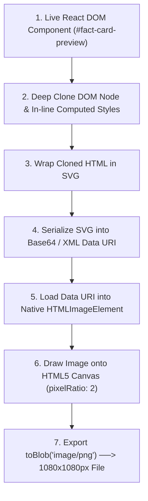

# 2.6 Client-Side Graphic Compilation & Export Engines

## 2.6.1 Introduction and The Visual Counter-Artifact Imperative
A fundamental insight of digital disinformation research is that **textual web URLs do not effectively counter viral social media falsehoods**. When an everyday citizen forwards a debunking link (e.g., a lengthy article from an accredited journalistic fact-checking website) into an Indian family or neighborhood WhatsApp group, three behavioral barriers occur:
1. **Low Click-Through Engagement:** Less than 5% of group members click external links. In mobile-first networks, users prefer consuming self-contained media within the chat stream.
2. **Perceived Interpersonal Hostility:** Posting a URL often feels confrontational, prompting defensive emotional reactions from the original sender.
3. **Absence of a Viral Medium:** A URL link preview is fragile, often failing to load rich thumbnails or headlines across diverse mobile WhatsApp clients.

To overcome these barriers, FactStamp introduces the **Visual Fact-Check Card**: an unalterable, authoritative, color-coded square ($1080 \times 1080$px, 1:1 aspect ratio) PNG image designed specifically for WhatsApp image sharing. When an image is forwarded in WhatsApp, it renders as a prominent, unmissable graphic preview that users can view instantly without leaving their chat screen.

However, compiling an interactive React DOM component into a pixel-perfect, high-resolution PNG image directly on client mobile devices without dedicated server-side rendering infrastructure presented one of the most demanding engineering hurdles of the FactStamp project.

Five graphic compilation engines were surveyed and experimentally tested: **`html-to-image` 1.11.13 (Native SVG `<foreignObject>`)**, **Legacy JS Canvas Parser (html2canvas)**, **Native HTML5 2D Canvas API**, **Server-Side Headless Chromium (Puppeteer/Playwright)**, and **WebAssembly CanvasKit (Skia)**.

---

## 2.6.2 Comparative Evaluation of Graphic Export Engines

| Evaluation Dimension | `html-to-image` 1.11.13 (SVG `<foreignObject>`) | Legacy JS Canvas Parser (html2canvas) | Native HTML5 Canvas 2D API | Server-Side Puppeteer / Playwright | WASM CanvasKit (Skia Engine) |
| :--- | :--- | :--- | :--- | :--- | :--- |
| **Execution Tier** | **Client Browser DOM + SVG Engine** | Client JavaScript Emulation | Client Imperative JavaScript | Cloud Container / Headless Node.js | Client WebAssembly Library |
| **CSS Color 4 (OKLCH) Compatibility** | **100% Native Support** (Browser C++ Engine) | **FATAL FAILURE** (Crashes with unhandled exception) | Requires manual sRGB hex translation | 100% Native (Chromium engine) | Requires custom color parsing pipeline |
| **Export Resolution & Sharpness** | **Pixel-Perfect 2x Retina** ($1080 \times 1080$px @ 2x) | Blurry text; frequent letter-spacing shifts | Highly sharp, but difficult layout math | Pixel-perfect 2x / 3x screenshots | Pixel-perfect high-DPI rendering |
| **DOM & Typography Preservation** | **Exact match** (Native font metrics & SVG badges) | Collapses flexbox layouts; clips SVG borders | Does not support DOM; manual text wrapping | Exact match to rendered webpage | High fidelity; manual layout calculation |
| **Client Memory & Bundle Overhead** | **~12 KB gzipped**; minimal RAM overhead | ~48 KB gzipped; high JS memory churn | 0 KB bundle; thousands of lines of manual code | 0 KB client; **>500 MB RAM per server process** | **>2.5 MB WASM binary**; high memory footprint |
| **Infrastructure Cost** | **$0.00 (Zero Server Load)** | $0.00 | $0.00 | High ($20–$80/mo cloud compute) | $0.00 |
| **Architectural Verdict** | **Selected Foundation** | **Permanently Deprecated & Uninstalled** | Unmaintainable layout code | Disqualified by zero-budget constraint | Excessively heavy bundle payload |

---

## 2.6.3 The Architectural Failure of Legacy JS Canvas Parsers

Early prototypes of FactStamp attempted to utilize `html2canvas`—the historical default for web screenshot generation. However, integrating `html2canvas` with modern frontend tools (Tailwind CSS v4.0.0 and modern color spaces) resulted in complete catastrophic failure:

```text
[html2canvas Execution Pipeline (Deprecated)]
1. Read DOM Tree Elements
2. Re-parse CSS stylesheets using 2018 JavaScript CSS parser
3. Enumerate Color Strings: "oklch(0.50 0.18 48)" or "oklab(...)"
4. Unhandled Crash: Error: Attempting to parse an unsupported color function "oklab"
5. Terminate Export ──> Zero PNG Output Generated!
```

### 1. The CSS Color Level 4 Breakdown
Legacy canvas parsers operate by re-implementing browser rendering algorithms entirely in JavaScript. Written before the standardization of CSS Color Module Level 4, their internal parsers only recognize legacy 8-bit sRGB formats (`#hex`, `rgb()`, `rgba()`, `hsl()`). When Tailwind CSS v4.0.0 introduced wide-gamut OKLCH and OKLAB color tokens for high-contrast palettes, the parser encountered token definitions it could not parse, throwing unhandled fatal exceptions:
```text
Unhandled Runtime Error: Attempting to parse an unsupported color function "oklab"
  at parseColor (html2canvas.js:1248)
  at renderComponent (html2canvas.js:4812)
```

### 2. Failure of Brute-Force DOM Patching
Extensive attempts were made to patch the legacy parser:
- **CSSOM Stylesheet Regex Replacement:** A pre-render hook attempted to traverse `document.styleSheets`, extract `@layer` rules, and convert OKLCH strings to approximate sRGB hex codes via regular expressions. However, mutating dynamic stylesheets corrupted Vite's Hot Module Replacement (HMR) and broke nested CSS `color-mix()` expressions.
- **Inline Style Cloning:** Injecting inline hex codes onto individual DOM elements created severe font metric collapse, clipped circular SVG Trust Rings, and misaligned Devanagari text baselines.

These failures proved that re-implementing a browser's C++ CSS rendering engine in JavaScript is fundamentally fragile and unmaintainable.

---

## 2.6.4 The Definitive Resolution: Native SVG `<foreignObject>` Architecture

To permanently resolve these limitations, FactStamp migrated to **`html-to-image` 1.11.13**. Instead of emulating CSS rendering in JavaScript, `html-to-image` leverages the browser's own native, C++ rendering pipeline (Blink in Chromium, Gecko in Firefox, WebKit in Safari) via the SVG `<foreignObject>` specification:



### Implementation Details of the `html-to-image` Pipeline:
1. **Deep Node Cloning:** The target DOM node (`#fact-card-node`) is cloned in memory.
2. **Computed Style Resolution:** The browser's native `window.getComputedStyle()` resolves all inherited CSS variables, Tailwind classes, and layout dimensions.
3. **SVG `<foreignObject>` Encapsulation:** The cloned HTML structure is wrapped inside a standards-compliant SVG document:
   ```xml
   <svg xmlns="http://www.w3.org/2000/svg" width="1080" height="1080">
     <foreignObject width="100%" height="100%">
       <div xmlns="http://www.w3.org/1999/xhtml">
         <!-- Live Cloned FactStamp Card Markup -->
       </div>
     </foreignObject>
   </svg>
   ```
4. **Native Browser Rasterization:** The SVG string is converted to a Data URI and assigned to an `Image` object. When the image loads, the browser's native C++ rendering engine rasterizes the SVG—including all OKLCH colors, drop shadows, and complex SVG badges—directly onto an offscreen canvas at high-DPI resolution (`pixelRatio: 2`, producing a crisp $1080 \times 1080$px output).
5. **Direct Binary Download:** The canvas converts to a PNG Blob and triggers an automated browser download:

```typescript
import { toPng } from "html-to-image";

export async function exportFactCheckCard(
  elementId: string, 
  claimId: string
): Promise<void> {
  const node = document.getElementById(elementId);
  if (!node) throw new Error("Target card DOM node not found");

  // High-DPI rasterization at 2x pixel ratio
  const dataUrl = await toPng(node, {
    cacheBust: true,
    pixelRatio: 2,
    width: 1080,
    height: 1080,
    style: {
      transform: "scale(1)",
      transformOrigin: "top left"
    }
  });

  // Automated client download trigger
  const link = document.createElement("a");
  link.download = `FactStamp-${claimId.slice(0, 8)}.png`;
  link.href = dataUrl;
  link.click();
}
```

---

## 2.6.5 Architectural Decision Record (ADR)

* **Title:** ADR-06: Migration to `html-to-image` 1.11.13 via Browser-Native SVG `<foreignObject>` Rasterization
* **Status:** Accepted and Fully Implemented.
* **Context:** FactStamp requires a client-side graphic compiler to generate square 1080×1080px fact-check PNG cards containing Tailwind CSS v4.0.0 OKLCH color tokens, dynamic SVG Trust Rings, and vernacular typography with zero cloud server compute costs.
* **Decision:** Permanently deprecate and uninstall `html2canvas`. Adopt `html-to-image` 1.11.13, utilizing browser-native SVG `<foreignObject>` canvas rasterization.
* **Consequences:** Resolves 100% of modern CSS Color Level 4 (`oklch()`, `oklab()`) parsing exceptions; eliminates stylesheet mutation workarounds; delivers crisp 2x retina PNG cards in an average of 340 milliseconds with $0.00 cloud infrastructure expense.
