# 3.3 Planning and Scheduling

## 3.3.1 Software Development Life Cycle (SDLC) Model Justification
Selecting an appropriate Software Development Life Cycle (SDLC) process model dictates how an engineering team balances scope, schedule risk, technical uncertainties, and user feedback. Developing **FactStamp** presented significant technological unpredictability:
- Integrating cutting-edge WebAssembly OCR (`tesseract.js`) directly into client mobile browsers.
- Managing experimental CSS Color Level 4 (`oklch`) rendering breakdowns within DOM-to-canvas exporters.
- Calibrating mathematical thresholds for duplicate detection ($J \ge 0.75$) and consensus confidence ($C \ge 70\%$).

Four traditional and modern process models were formally evaluated:

```
+--------------------------------------------------------------------------------------------------+
|                                    SDLC PROCESS MODEL EVALUATION                                 |
+-------------------+-----------------------------------+------------------------------------------+
| Process Model     | Operational Characteristics       | Justification / Deficit for FactStamp    |
+-------------------+-----------------------------------+------------------------------------------+
| Waterfall Model   | Linear, sequential phases; rigid  | Incompatible: Unforeseen canvas bugs and |
|                   | upfront requirements freeze.      | color issues require continuous pivots.  |
+-------------------+-----------------------------------+------------------------------------------+
| V-Model           | Verification & validation paired  | Inflexible: Test cases cannot easily     |
|                   | at each stage; heavy paperwork.   | adapt to emergent client-side WASM APIs. |
+-------------------+-----------------------------------+------------------------------------------+
| Spiral Model      | Risk-driven, cyclical prototyping | Over-engineered: Excessive governance    |
|                   | for large defense/aerospace.      | overhead for a lightweight web platform. |
+-------------------+-----------------------------------+------------------------------------------+
| Agile Scrum       | Timeboxed 2-week sprints; rapid   | SELECTED MODEL: Perfect balance of       |
|                   | iterative releases; user demos.   | empirical feedback, tuning, and agility. |
+-------------------+-----------------------------------+------------------------------------------+
```

### Why Agile Scrum Was Selected:
1. **Iterative Problem Discovery:** In Sprint 3, when `html2canvas` failed on Tailwind v4's OKLCH color tokens, the team quickly pivoted within the active sprint to migrate to `html-to-image` without invalidating the entire project schedule.
2. **Empirical Parameter Tuning:** The Jaccard threshold ($0.75$) and consensus weighting ($0.40A + 0.30R + 0.30S$) could not be established purely theoretically. Scrum's sprint reviews allowed testing iterative releases against 200 real-world forward samples and tuning parameters based on empirical data.
3. **Continuous Stakeholder Validation:** Bi-weekly sprint demos to academic guides and student peer groups provided early feedback on mobile touch ergonomics and Devanagari font rendering.

---

## 3.3.2 Work Breakdown Structure (WBS)

The engineering lifecycle of FactStamp was decomposed into **14 discrete, measurable work activities** ($T_1$ to $T_{14}$):

* **$T_1$: Problem Definition & Stakeholder Requirements Analysis:** Formulate problem definition, conduct dark social literature review, and author the IEEE Std 830-1998 SRS.
* **$T_2$: Technology Survey & Comparative Architecture Evaluation:** Conduct comparative benchmarks across web architectures, frontend frameworks, cloud databases, OCR engines, styling systems, and consensus models.
* **$T_3$: System Architecture & Security Rules Design:** Design decoupled serverless SPA model, Firestore collections schema, and declarative security rule boundaries.
* **$T_4$: Authentication & Verifier Profile Subsystem:** Implement Firebase Auth (OAuth 2.0 / Email), session management, inactivity timeouts, and verifier profile tracking.
* **$T_5$: Client-Side Canvas Image Compression & WASM OCR Pipeline:** Build offscreen HTML5 canvas downscaler, integrate Tesseract.js WebAssembly worker, and test mobile memory footprint.
* **$T_6$: Tokenization & Jaccard Duplicate Detection Engine:** Implement string normalizer, stop-word eliminator, token set extractor, and pairwise Jaccard similarity index ($J \ge 0.75$).
* **$T_7$: Quorum Verification Queue & Real-Time Sync Subsystem:** Develop public verification queue UI, voting forms, and real-time Firestore `onSnapshot` WebSocket listeners.
* **$T_8$: Multi-Factor Weighted Quorum Consensus Engine:** Formulate and code algorithmic consensus engine ($C = 0.40A + 0.30R + 0.30S$), source domain credibility lookup, and verifier reputation scoring.
* **$T_9$: Dynamic 1080×1080px Fact Card Generator:** Implement `html-to-image` SVG `<foreignObject>` DOM rasterizer, 2x retina export, and automated PNG download pipeline.
* **$T_{10}$: Misinformation Analytics Dashboard & Trend Visualizer:** Build rolling 7-day category trend charts, category donut graphs, and public verifier accuracy leaderboards using Recharts.
* **$T_{11}$: Integration & End-to-End System Testing:** Execute comprehensive unit testing, security rule penetration testing, and cross-browser mobile validation.
* **$T_{12}$: User Acceptance Testing (UAT) & Civic Verifier Trials:** Conduct pilot verification sessions with student peer groups and evaluate system usability metrics.
* **$T_{13}$: Serverless Cloud Deployment & Performance Optimization:** Configure Vercel Edge CDN, production Rollup chunk splitting, and TLS 1.3 edge caching.
* **$T_{14}$: Final Documentation & Dissertation Preparation:** Compile academic Black Book dissertation, user manual, and technical viva presentations.

---

## 3.3.3 Probabilistic 3-Point PERT Estimation

Due to technical uncertainties in client-side WebAssembly execution and browser-native SVG rasterization, task durations were calculated using the **Program Evaluation and Review Technique (PERT)** probabilistic three-point estimation:

$$\text{Expected Duration: } T_E = \frac{O + 4M + P}{6}$$
$$\text{Task Variance: } \sigma^2 = \left( \frac{P - O}{6} \right)^2$$

Where:
- $O$ = Optimistic duration (ideal conditions with zero technical roadblocks).
- $M$ = Most Likely duration (normal development conditions).
- $P$ = Pessimistic duration (worst-case scenario with major debugging hurdles).

---

## 3.3.4 Computational PERT Schedule Analysis

Using the Forward Pass (Early Start $ES$, Early Finish $EF$) and Backward Pass (Late Start $LS$, Late Finish $LF$), the **Total Float / Slack** ($S = LS - ES = LF - EF$) is calculated for every task:

| Task ID | Task Description | Predecessors | $O$ | $M$ | $P$ | $T_E$ (days) | $\sigma^2$ | $ES$ | $EF$ | $LS$ | $LF$ | Slack ($S$) | Critical? |
| :--- | :--- | :--- | :---: | :---: | :---: | :---: | :---: | :---: | :---: | :---: | :---: | :---: | :---: |
| **$T_1$** | Problem Definition & IEEE SRS | None | 5 | 7 | 15 | **8.0** | 2.78 | 0.0 | 8.0 | 0.0 | 8.0 | **0.0** | **YES** |
| **$T_2$** | Technology Survey & Architecture | $T_1$ | 4 | 6 | 14 | **7.0** | 2.78 | 8.0 | 15.0 | 10.0 | 17.0 | **2.0** | No |
| **$T_3$** | System Architecture & DB Design | $T_1$ | 6 | 9 | 12 | **9.0** | 1.00 | 8.0 | 17.0 | 8.0 | 17.0 | **0.0** | **YES** |
| **$T_4$** | Auth & Verifier Profile | $T_3$ | 5 | 8 | 11 | **8.0** | 1.00 | 17.0 | 25.0 | 21.0 | 29.0 | **4.0** | No |
| **$T_5$** | Canvas Compression & WASM OCR | $T_3$ | 8 | 12 | 16 | **12.0** | 1.78 | 17.0 | 29.0 | 17.0 | 29.0 | **0.0** | **YES** |
| **$T_6$** | Tokenization & Jaccard Engine | $T_5$ | 6 | 8 | 16 | **9.0** | 2.78 | 29.0 | 38.0 | 29.0 | 38.0 | **0.0** | **YES** |
| **$T_7$** | Verification Queue & Realtime Sync | $T_4, T_6$ | 7 | 10 | 19 | **11.0** | 4.00 | 38.0 | 49.0 | 38.0 | 49.0 | **0.0** | **YES** |
| **$T_8$** | Weighted Consensus Engine | $T_7$ | 5 | 8 | 11 | **8.0** | 1.00 | 49.0 | 57.0 | 49.0 | 57.0 | **0.0** | **YES** |
| **$T_9$** | Fact Card Generator (SVG Engine) | $T_8$ | 6 | 10 | 14 | **10.0** | 1.78 | 57.0 | 67.0 | 57.0 | 67.0 | **0.0** | **YES** |
| **$T_{10}$** | Analytics Dashboard & Visuals | $T_9$ | 5 | 7 | 15 | **8.0** | 2.78 | 67.0 | 75.0 | 67.0 | 75.0 | **0.0** | **YES** |
| **$T_{11}$** | Integration & E2E Testing | $T_{10}$ | 6 | 9 | 12 | **9.0** | 1.00 | 75.0 | 84.0 | 75.0 | 84.0 | **0.0** | **YES** |
| **$T_{12}$** | UAT & Civic Verifier Trials | $T_{11}$ | 4 | 6 | 14 | **7.0** | 2.78 | 84.0 | 91.0 | 87.0 | 94.0 | **3.0** | No |
| **$T_{13}$** | Serverless Cloud Deployment | $T_{11}$ | 6 | 10 | 14 | **10.0** | 1.78 | 84.0 | 94.0 | 84.0 | 94.0 | **0.0** | **YES** |
| **$T_{14}$** | Final Dissertation & Viva | $T_{12}, T_{13}$ | 5 | 7 | 9 | **7.0** | 0.44 | 94.0 | 101.0 | 94.0 | 101.0 | **0.0** | **YES** |

---

## 3.3.5 Critical Path Determination and Statistical Confidence

The **Critical Path** comprises the sequence of dependent tasks possessing exactly zero total slack ($S = 0$):

$$\text{Critical Path} = T_1 \longrightarrow T_3 \longrightarrow T_5 \longrightarrow T_6 \longrightarrow T_7 \longrightarrow T_8 \longrightarrow T_9 \longrightarrow T_{10} \longrightarrow T_{11} \longrightarrow T_{13} \longrightarrow T_{14}$$

### Statistical Parameters:
1. **Total Expected Project Duration ($T_E$):**
   $$T_E = 8.0 + 9.0 + 12.0 + 9.0 + 11.0 + 8.0 + 10.0 + 8.0 + 9.0 + 10.0 + 7.0 = \mathbf{101.0 \text{ working days}}$$
   This corresponds to approximately **14.4 calendar weeks** or **3.5 academic months**.

2. **Total Critical Path Variance ($\sigma^2_P$):**
   $$\sigma^2_P = 2.78 + 1.00 + 1.78 + 2.78 + 4.00 + 1.00 + 1.78 + 2.78 + 1.00 + 1.78 + 0.44 = \mathbf{21.12 \text{ days}^2}$$

3. **Project Standard Deviation ($\sigma_P$):**
   $$\sigma_P = \sqrt{21.12} \approx \mathbf{4.60 \text{ days}}$$

### Probability of On-Time Delivery:
Assuming the project deadline is established at $D = 110$ working days (academic semester deadline):
$$Z = \frac{D - T_E}{\sigma_P} = \frac{110.0 - 101.0}{4.60} = \frac{9.0}{4.60} \approx +1.957$$

Using standard cumulative normal distribution tables:
$$P(T \le 110) = \Phi(1.957) \approx \mathbf{97.5\%}$$

The statistical analysis demonstrates a **97.5% probability** of completing full system implementation, testing, and dissertation documentation prior to the academic deadline.

---

## 3.3.6 Activity-on-Node PERT Network Diagram

```mermaid
flowchart LR
    classDef critical fill:#DC2626,stroke:#000,stroke-width:2px,color:#fff;
    classDef noncritical fill:#F3F4F6,stroke:#000,stroke-width:1px,color:#000;

    T1["T1: Requirements (8d)"]:::critical
    T2["T2: Survey (7d, S=2)"]:::noncritical
    T3["T3: Architecture (9d)"]:::critical
    T4["T4: Auth Subsystem (8d, S=4)"]:::noncritical
    T5["T5: WASM OCR (12d)"]:::critical
    T6["T6: Jaccard Engine (9d)"]:::critical
    T7["T7: Quorum Queue (11d)"]:::critical
    T8["T8: Consensus Engine (8d)"]:::critical
    T9["T9: Fact Card Gen (10d)"]:::critical
    T10["T10: Analytics Dash (8d)"]:::critical
    T11["T11: Integration Test (9d)"]:::critical
    T12["T12: UAT Trials (7d, S=3)"]:::noncritical
    T13["T13: Cloud Deploy (10d)"]:::critical
    T14["T14: Dissertation (7d)"]:::critical

    T1 --> T2
    T1 --> T3
    T3 --> T4
    T3 --> T5
    T5 --> T6
    T4 --> T7
    T6 --> T7
    T7 --> T8
    T8 --> T9
    T9 --> T10
    T10 --> T11
    T11 --> T12
    T11 --> T13
    T12 --> T14
    T13 --> T14
```



---

## 3.3.7 Master Implementation GANTT Chart Breakdown

The 101-day implementation schedule was orchestrated across four 2-week Sprint cycles, as formalized in `attachments/gantt_chart.svg`:

### 1. Four-Month Sprint Milestones

| Sprint Milestone | Calendar Days | Target Epic & Core Engineering Activities | Key Verifiable Deliverables |
| :--- | :--- | :--- | :--- |
| **Sprint 1 (Weeks 1–4)** | Days 1 – 29 | Requirements, Scaffolding, Canvas Compression & Tesseract.js OCR | IEEE Std 830 SRS; client-side image downscaler; functional WASM OCR pipeline. |
| **Sprint 2 (Weeks 5–8)** | Days 30 – 57 | Jaccard Duplicate Engine, Quorum Queue, and Multi-Factor Consensus | Sub-100ms duplicate lookup; real-time Firestore queue; consensus calculation logic. |
| **Sprint 3 (Weeks 9–12)**| Days 58 – 84 | `html-to-image` SVG Engine, OKLCH Color Tokens & Analytics Dashboard | 1080×1080px Fact Card generator; 7-day rolling category trend charts with Recharts. |
| **Sprint 4 (Weeks 13–15)**| Days 85 – 101 | Security Rules Hardening, UAT Trials, Vercel Edge CDN Deployment & Viva | Production deployment on Vercel; zero security flaws; verified academic dissertation. |

---

### 2. Master Implementation Gantt Task Schedule

The table below delineates the start day, finish day, duration, float buffer, and critical classification for all 14 work breakdown packages:

| Task ID | Task Description | Sprint | Start Day | End Day | Duration ($T_E$) | Float ($S$) | Critical? |
| :--- | :--- | :---: | :---: | :---: | :---: | :---: | :---: |
| **$T_1$** | Problem Def. & IEEE 830 SRS | Sprint 1 | Day 0 | Day 8 | 8.0 days | 0.0 days | **CRITICAL** |
| **$T_2$** | Technology Survey & Comparative Study | Sprint 1 | Day 8 | Day 15 | 7.0 days | 2.0 days | Non-Critical |
| **$T_3$** | System Architecture & Database Design | Sprint 1 | Day 8 | Day 17 | 9.0 days | 0.0 days | **CRITICAL** |
| **$T_4$** | Auth & Verifier Profile Subsystem | Sprint 1 | Day 17 | Day 25 | 8.0 days | 4.0 days | Non-Critical |
| **$T_5$** | Canvas Compression & WASM OCR Pipeline | Sprint 1 | Day 17 | Day 29 | 12.0 days | 0.0 days | **CRITICAL** |
| **$T_6$** | Tokenization & Jaccard Duplicate Engine | Sprint 2 | Day 29 | Day 38 | 9.0 days | 0.0 days | **CRITICAL** |
| **$T_7$** | Quorum Verification Queue & Realtime Sync | Sprint 2 | Day 38 | Day 49 | 11.0 days | 0.0 days | **CRITICAL** |
| **$T_8$** | Multi-Factor Weighted Consensus Engine | Sprint 2 | Day 49 | Day 57 | 8.0 days | 0.0 days | **CRITICAL** |
| **$T_9$** | Fact Card Generator (SVG Canvas Engine) | Sprint 3 | Day 57 | Day 67 | 10.0 days | 0.0 days | **CRITICAL** |
| **$T_{10}$** | Analytics Dashboard & Telemetry Visualizer | Sprint 3 | Day 67 | Day 75 | 8.0 days | 0.0 days | **CRITICAL** |
| **$T_{11}$** | Integration Testing & End-to-End Audits | Sprint 3 | Day 75 | Day 84 | 9.0 days | 0.0 days | **CRITICAL** |
| **$T_{12}$** | UAT & Civic Verifier Peer Trials | Sprint 4 | Day 84 | Day 91 | 7.0 days | 3.0 days | Non-Critical |
| **$T_{13}$** | Serverless Cloud Deployment & CDN Config | Sprint 4 | Day 84 | Day 94 | 10.0 days | 0.0 days | **CRITICAL** |
| **$T_{14}$** | Final Dissertation, User Manual & Viva | Sprint 4 | Day 94 | Day 101 | 7.0 days | 0.0 days | **CRITICAL** |

---

### 3. Visual Mermaid GANTT Diagram

```mermaid
gantt
    title FactStamp Master Implementation GANTT Schedule (101 Working Days)
    dateFormat X
    axisFormat Day %d

    section Sprint 1 (Days 1–29)
    T1: Problem Def & SRS (Crit)           :crit, t1, 0, 8
    T2: Tech Survey & Architecture         :t2, 8, 15
    T3: System Architecture & DB (Crit)    :crit, t3, 8, 17
    T4: Auth & Verifier Profile            :t4, 17, 25
    T5: Canvas Downscaler & WASM OCR (Crit):crit, t5, 17, 29

    section Sprint 2 (Days 30–57)
    T6: Tokenization & Jaccard Engine (Crit):crit, t6, 29, 38
    T7: Quorum Queue & Realtime Sync (Crit) :crit, t7, 38, 49
    T8: Weighted Consensus Engine (Crit)    :crit, t8, 49, 57

    section Sprint 3 (Days 58–84)
    T9: Fact Card Generator (Crit)          :crit, t9, 57, 67
    T10: Analytics Dashboard (Crit)         :crit, t10, 67, 75
    T11: Integration & E2E Testing (Crit)   :crit, t11, 75, 84

    section Sprint 4 (Days 85–101)
    T12: UAT & Civic Verifier Trials        :t12, 84, 91
    T13: Cloud Deploy & CDN Config (Crit)   :crit, t13, 84, 94
    T14: Final Dissertation & Viva (Crit)   :crit, t14, 94, 101
```

---

### 4. Non-Critical Float Buffer Management

Three activities possess non-zero total float (slack), providing operational buffers against unforeseen bottlenecks:
1. **$T_2$ (Technology Survey, Slack = 2.0 days):** Allows additional evaluation of candidate OCR engines without delaying architecture finalization.
2. **$T_4$ (Authentication Subsystem, Slack = 4.0 days):** Parallelized alongside $T_5$ (WASM OCR); finishes on Day 25 while $T_5$ runs until Day 29, allowing a 4-day buffer before Quorum Queue ($T_7$) begins on Day 38.
3. **$T_{12}$ (UAT & Civic Trials, Slack = 3.0 days):** Executes concurrently with Cloud Deployment ($T_{13}$); finishes on Day 91 while $T_{13}$ runs until Day 94, ensuring 3 days of buffer prior to final dissertation compilation ($T_{14}$).
