# 3.6 Conceptual Models

## 3.6.1 Foundations of Conceptual Modeling in Software Engineering
Conceptual modeling establishes the semantic, structural, and behavioral bridge between abstract stakeholder requirements and executable software systems. In accordance with modern software engineering disciplines (Pressman & Maxim, 2020), conceptual analysis serves two complementary perspectives:
1. **Structural & Static Perspective:** Formalizes data schemas, entity relationships, encapsulation boundaries, component interfaces, and physical deployment topologies.
2. **Behavioral & Dynamic Perspective:** Formalizes algorithmic control flows, asynchronous event handling, transactional message lifelines, and lifecycle state machines.

Within the **FactStamp** architecture, conceptual modeling addresses the intrinsic socio-technical complexities of peer-to-peer misinformation verification: coordinating anonymous citizen forward ingestion, performing client-side WebAssembly optical character recognition (OCR), executing sub-second lexical duplicate clustering, orchestrating multi-factor quorum consensus, tracking anti-Sybil civic reputation, and dynamically compiling certified square visual Fact Cards.

---

## 3.6.2 Data Flow Diagrams (DFD)

Data Flow Diagrams (DFDs) provide a graphical representation of the progressive transformation of data through an information system. In FactStamp, DFDs formalize how unverified WhatsApp rumors are ingested, sanitized, evaluated, and compiled into certified fact cards across three hierarchical levels of abstraction:
- **DFD Level 0 (Context Level):** Defines the absolute system boundary and environmental interfaces.
- **DFD Level 1 (System Decomposition):** Decomposes the platform into six major functional subsystems and core Firestore NoSQL data stores.
- **DFD Level 2 (Detailed Functional Decomposition):** Granularly details the Multimodal Ingestion Pipeline (Process 1.0) and Consensus Scoring Engine (Process 4.0).

```
+--------------------------------------------------------------------------------------------------+
|                                    DFD HIERARCHICAL DECOMPOSITION                                |
+-----------------------+-----------------------------------+--------------------------------------+
| Abstraction Level     | Scope & Operational Focus         | Primary Data Stores / Sub-Processes  |
+-----------------------+-----------------------------------+--------------------------------------+
| DFD Level 0 (Context) | Global System Boundary & Entities | Public Submitter, Verifier, Admin, WA|
| DFD Level 1 (System)  | 6 Functional Subsystems           | D1 Claims, D2 Verifs, D3 Users, D4   |
| DFD Level 2 (Detail)  | Ingestion (1.0) & Consensus (4.0) | Sub-processes 1.1-1.4 and 4.1-4.3    |
+-----------------------+-----------------------------------+--------------------------------------+
```

### 1. DFD Level 0: Context Level Diagram

The Context Level DFD encapsulates FactStamp as a single central process (`0.0 FactStamp Misinformation Verification System`) interacting with four primary environmental terminators:
1. **Public Submitter (WhatsApp Citizen):** The source of suspicious forwards and recipient of instant verified dossiers and Fact Cards.
2. **Community Verifier:** Accredited civic reviewer inspecting pending queues and providing authoritative citations.
3. **Platform Administrator:** Academic faculty supervisor auditing contested claims and monitoring system telemetry.
4. **WhatsApp Chat Groups (Dark Social):** The external messaging medium where certified Fact Cards are disseminated to neutralize rumors.

#### Context Boundary Inflows and Outflows Matrix:
| External Entity | Flow Label | Direction | Data Flow Payload Description |
| :--- | :--- | :--- | :--- |
| **Public Submitter** | Submit Forward | Inflow -> System | Plaintext message string (20–2,000 chars) or screenshot image file (<= 5 MB). |
| **System** | Instant Verdict | Outflow -> Submitter | Immediate certified dossier if submission matches an existing duplicate (J >= 0.75). |
| **System** | Download Fact Card | Outflow -> Submitter | Standardized 1080x1080px PNG image displaying certified verdict and source URLs. |
| **System** | Pending Queue Stream | Outflow -> Verifier | Stream of unverified claims requiring peer evaluation (quorum count N < 3). |
| **Community Verifier**| Submit Verdict Vote | Inflow -> System | Structured vote (TRUE/FALSE/MISLEADING) + primary citation URL + rationale. |
| **System** | Update Reputation | Outflow -> Verifier | Adjusted civic reputation score (R in [0, 100]) updated upon consensus certification. |
| **Platform Admin** | Moderation Directives | Inflow -> System | Administrative disposition on contested claims and Sybil account suspensions. |
| **System** | Telemetry & Audits | Outflow -> Admin | 7-day category submission radar distributions and anomaly audit logs. |
| **Public Submitter** | Disseminate Fact Card| Outflow -> WhatsApp | User forwards downloaded Fact Card back into the origin group chat. |

#### Visual Mermaid DFD Level 0 Context Diagram:
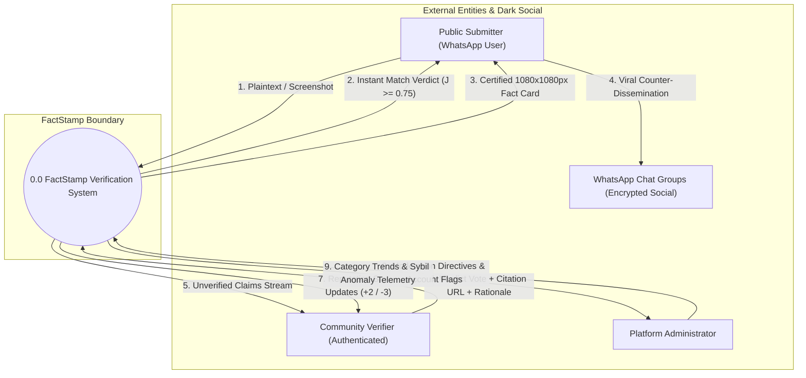
```mermaid
flowchart TD
    subgraph External_Entities ["External Entities & Dark Social"]
        Sub["Public Submitter (WhatsApp User)"]
        Ver["Community Verifier (Authenticated)"]
        Adm["Platform Administrator"]
        WA["WhatsApp Chat Groups (Encrypted Social)"]
    end

    subgraph Boundary ["FactStamp Boundary"]
        FS(("0.0 FactStamp Verification System"))
    end

    Sub -->|"1. Plaintext / Screenshot"| FS
    FS -->|"2. Instant Match Verdict (J >= 0.75)"| Sub
    FS -->|"3. Certified 1080x1080px Fact Card"| Sub
    Sub -->|"4. Viral Counter-Dissemination"| WA

    FS -->|"5. Unverified Claims Stream"| Ver
    Ver -->|"6. Verdict Vote + Citation URL + Rationale"| FS
    FS -->|"7. Reputation Score Updates (+2 / -3)"| Ver

    Adm -->|"8. Moderation Directives & Account Flags"| FS
    FS -->|"9. Category Trends & Sybil Anomaly Telemetry"| Adm
```

#### Graphviz DOT Source (`dfd_level_0.dot`):
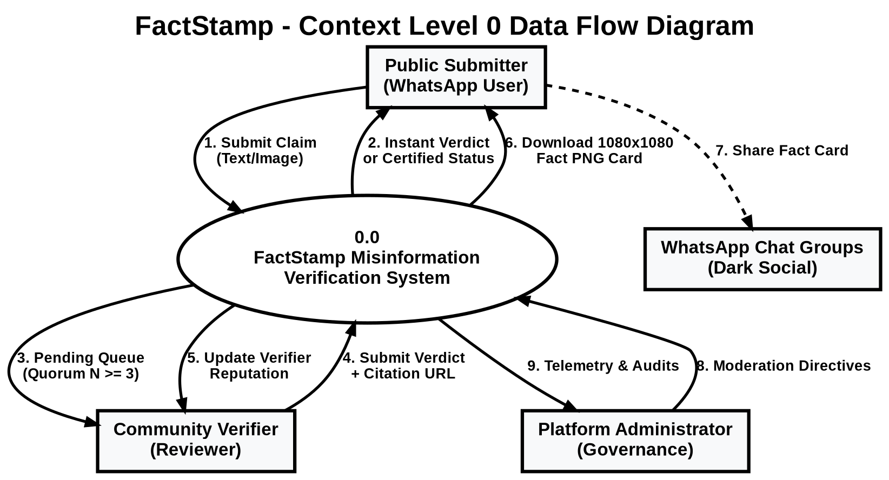
```dot
digraph DFD_Level_0 {
  bgcolor="white"
  fontname="Liberation Sans Bold"
  label="FactStamp - Context Level 0 Data Flow Diagram"
  labelloc=t
  fontsize=24
  rankdir=TB
  nodesep=0.5
  ranksep=0.7
  margin=0.05

  node [fontname="Liberation Sans Bold", fontsize=16, style="filled,bold", fillcolor="#F8F9FA", color="#000000", penwidth=3.0]
  edge [fontname="Liberation Sans Bold", fontsize=13, color="#000000", penwidth=2.5]

  User [shape=box, label="Public Submitter\n(WhatsApp User)", margin="0.2,0.12"]
  System [shape=ellipse, label="0.0\nFactStamp Misinformation\nVerification System", margin="0.25,0.18", fillcolor="#FFFFFF"]
  Verifier [shape=box, label="Community Verifier\n(Reviewer)", margin="0.2,0.12"]
  Admin [shape=box, label="Platform Administrator\n(Governance)", margin="0.2,0.12"]
  WhatsApp [shape=box, label="WhatsApp Chat Groups\n(Dark Social)", margin="0.2,0.12"]

  User -> System [label="1. Submit Claim\n(Text/Image)"]
  System -> User [label="2. Instant Verdict\nor Certified Status"]
  System -> User [label="6. Download 1080x1080\nFact PNG Card"]

  System -> Verifier [label="3. Pending Queue\n(Quorum N >= 3)"]
  Verifier -> System [label="4. Submit Verdict\n+ Citation URL"]
  System -> Verifier [label="5. Update Verifier\nReputation"]

  Admin -> System [label="8. Moderation Directives"]
  System -> Admin [label="9. Telemetry & Audits"]

  User -> WhatsApp [label="7. Share Fact Card", style=dashed]
}
```

---

### 2. DFD Level 1: System Level Diagram

The System Level DFD decomposes the core system into six functional processes and four persistent Cloud Firestore data stores:
1. **Process 1.0 (Ingestion & OCR Extraction):** Sanitizes plaintext forwards, validates image headers, and invokes WebAssembly OCR.
2. **Process 2.0 (Jaccard Duplicate Detection Engine):** Tokenizes text and calculates pairwise set similarity (J >= 0.75) to suppress duplicate review tickets.
3. **Process 3.0 (Quorum Verification Queue Manager):** Coordinates peer reviews, enforces self-verification locks, and aggregates votes.
4. **Process 4.0 (Consensus & Confidence Engine):** Executes the tri-partite weighted consensus algorithm: C = 0.40A + 0.30R + 0.30S.
5. **Process 5.0 (Fact-Check Card Generator):** Serializes DOM preview nodes into high-DPI 1080x1080px PNG images via `html-to-image`.
6. **Process 6.0 (Analytics & Trends Subsystem):** Aggregates 7-day category rollups, submission volumes, and accuracy leaderboards.

#### Data Stores Inventory:
| Store ID | Store Name | Storage Technology | Schema & Operational Contents |
| :--- | :--- | :--- | :--- |
| **D1** | Claims Collection | Cloud Firestore | Persistent records of claims: normalized text, mediaUrl, status, verdict, confidence, and quorumCount. |
| **D2** | Verifications Collection | Cloud Firestore | Subcollections holding peer review votes: verifierId, verdict, sourceUrl, rationale, and timestamp. |
| **D3** | Users & Reputation | Cloud Firestore | User profiles, authentication identifiers (uid), display names, civic reputation scores (R), and admin flags. |
| **D4** | Analytics & Metrics | Cloud Firestore | Aggregated rolling metric documents storing 7-day category counts, total verifications, and leaderboard ranks. |

#### Visual Mermaid DFD Level 1 System Diagram:
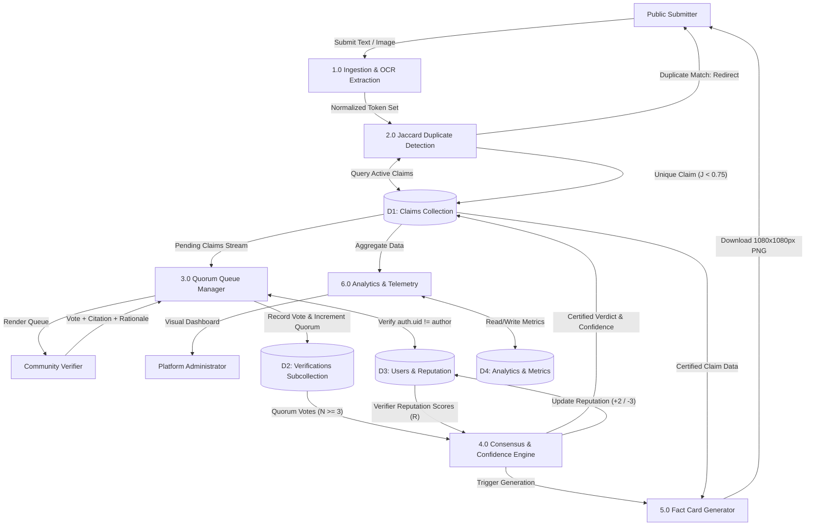
```mermaid
flowchart TB
    Sub["Public Submitter"]
    Ver["Community Verifier"]
    Adm["Platform Administrator"]

    D1[("D1: Claims Collection")]
    D2[("D2: Verifications Subcollection")]
    D3[("D3: Users & Reputation")]
    D4[("D4: Analytics & Metrics")]

    P1["1.0 Ingestion & OCR Extraction"]
    P2["2.0 Jaccard Duplicate Detection"]
    P3["3.0 Quorum Queue Manager"]
    P4["4.0 Consensus & Confidence Engine"]
    P5["5.0 Fact Card Generator"]
    P6["6.0 Analytics & Telemetry"]

    Sub -->|"Submit Text / Image"| P1
    P1 -->|"Normalized Token Set"| P2
    P2 <-->|"Query Active Claims"| D1
    P2 -->|"Duplicate Match: Redirect"| Sub
    P2 -->|"Unique Claim (J < 0.75)"| D1

    D1 -->|"Pending Claims Stream"| P3
    P3 -->|"Render Queue"| Ver
    Ver -->|"Vote + Citation + Rationale"| P3
    P3 <-->|"Verify auth.uid != author"| D3
    P3 -->|"Record Vote & Increment Quorum"| D2

    D2 -->|"Quorum Votes (N >= 3)"| P4
    D3 -->|"Verifier Reputation Scores (R)"| P4
    P4 -->|"Certified Verdict & Confidence"| D1
    P4 -->|"Update Reputation (+2 / -3)"| D3
    P4 -->|"Trigger Generation"| P5

    D1 -->|"Certified Claim Data"| P5
    P5 -->|"Download 1080x1080px PNG"| Sub

    D1 -->|"Aggregate Data"| P6
    P6 <-->|"Read/Write Metrics"| D4
    P6 -->|"Visual Dashboard"| Adm
```

#### Graphviz DOT Source (`dfd_level_1.dot`):
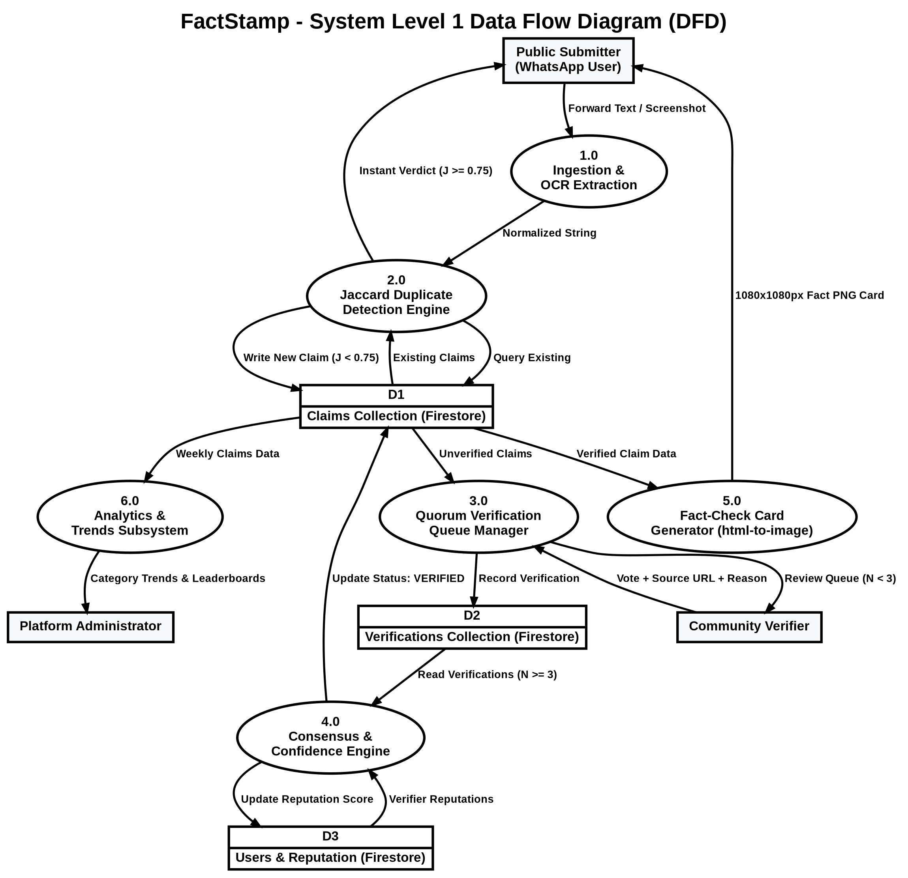
```dot
digraph DFD_Level_1 {
  bgcolor="white"
  fontname="Liberation Sans Bold"
  label="FactStamp - System Level 1 Data Flow Diagram (DFD)"
  labelloc=t
  fontsize=26
  rankdir=TB
  nodesep=0.5
  ranksep=0.7
  margin=0.08

  node [fontname="Liberation Sans Bold", fontsize=16, style="filled,bold", fillcolor="#F8F9FA", color="#000000", penwidth=3.0]
  edge [fontname="Liberation Sans Bold", fontsize=13, color="#000000", penwidth=2.5]

  // Entities
  User [shape=box, label="Public Submitter\n(WhatsApp User)", margin="0.2,0.12"]
  Verifier [shape=box, label="Community Verifier", margin="0.2,0.12"]
  Admin [shape=box, label="Platform Administrator", margin="0.2,0.12"]

  // Data Stores (open-ended boxes via html-like label or record)
  D1 [shape=record, label="{<f0> D1 |<f1> Claims Collection (Firestore)}", fillcolor="#FFFFFF"]
  D2 [shape=record, label="{<f0> D2 |<f1> Verifications Collection (Firestore)}", fillcolor="#FFFFFF"]
  D3 [shape=record, label="{<f0> D3 |<f1> Users & Reputation (Firestore)}", fillcolor="#FFFFFF"]

  // Processes
  P1 [shape=ellipse, label="1.0\nIngestion &\nOCR Extraction", fillcolor="#FFFFFF"]
  P2 [shape=ellipse, label="2.0\nJaccard Duplicate\nDetection Engine", fillcolor="#FFFFFF"]
  P3 [shape=ellipse, label="3.0\nQuorum Verification\nQueue Manager", fillcolor="#FFFFFF"]
  P4 [shape=ellipse, label="4.0\nConsensus &\nConfidence Engine", fillcolor="#FFFFFF"]
  P5 [shape=ellipse, label="5.0\nFact-Check Card\nGenerator (html-to-image)", fillcolor="#FFFFFF"]
  P6 [shape=ellipse, label="6.0\nAnalytics &\nTrends Subsystem", fillcolor="#FFFFFF"]

  // Flows
  User -> P1 [label=" Forward Text / Screenshot "]
  P1 -> P2 [label=" Normalized String "]
  
  P2 -> D1 [label=" Query Existing "]
  D1 -> P2 [label=" Existing Claims "]
  
  P2 -> User [label=" Instant Verdict (J >= 0.75) "]
  P2 -> D1 [label=" Write New Claim (J < 0.75) "]

  D1 -> P3 [label=" Unverified Claims "]
  P3 -> Verifier [label=" Review Queue (N < 3) "]
  Verifier -> P3 [label=" Vote + Source URL + Reason "]
  P3 -> D2 [label=" Record Verification "]

  D2 -> P4 [label=" Read Verifications (N >= 3) "]
  D3 -> P4 [label=" Verifier Reputations "]
  P4 -> D1 [label=" Update Status: VERIFIED "]
  P4 -> D3 [label=" Update Reputation Score "]

  D1 -> P5 [label=" Verified Claim Data "]
  P5 -> User [label=" 1080x1080px Fact PNG Card "]

  D1 -> P6 [label=" Weekly Claims Data "]
  P6 -> Admin [label=" Category Trends & Leaderboards "]
}
```

---

### 3. DFD Level 2: Detailed Functional Decomposition

DFD Level 2 decomposes the two most computationally critical subsystems of FactStamp:
- **Process 1.0 (Multimodal Ingestion Pipeline):** Decomposed into Sub-processes 1.1 (Magic Byte Header Inspection), 1.2 (Offscreen Canvas Downscaling), 1.3 (WebAssembly OCR Character Extraction), and 1.4 (Text Normalization & Tokenization).
- **Process 4.0 (Consensus & Confidence Engine):** Decomposed into Sub-processes 4.1 (Quorum Threshold Validator N >= 3), 4.2 (Multi-Factor Confidence Calculator), and 4.3 (Reputation & Verdict Finalizer).

#### Detailed Sub-Process Logic Matrix (Level 2):
| Sub-Process | Sub-Process Name | Inputs | Algorithmic Transformation & Execution Logic |
| :--- | :--- | :--- | :--- |
| **1.1** | Magic Byte Inspection | Raw Screenshot Binary | Slices first 4 bytes via `Uint8Array`; asserts genuine JPEG (`FF D8 FF`) or PNG (`89 50 4E 47`); rejects malicious disguised executables. |
| **1.2** | Canvas Downscaling | Validated Image Binary | Scales image bounds to <= 1280px; applies dynamic JPEG quality stepping (0.72 -> 0.40) until buffer payload is < 700 KB. |
| **1.3** | WebAssembly OCR Extraction | Downscaled Bitmap | Spawns Tesseract.js Web Worker thread; executes optical character recognition against `eng` + `hin` trained data models. |
| **1.4** | Text Normalization | Raw Strings | Strips HTML tags, script entities, control characters; eliminates stop-words (len <= 3); emits unique word token set S_A. |
| **4.1** | Quorum Threshold Validator | D2 Verifications | Reads vote array; asserts count N >= 3; verifies at least two distinct source domain hosts to prevent single-source collusion. |
| **4.2** | Confidence Calculator | D2, D3 Records | Computes Agreement Ratio A, Mean Reputation R, Mean Source Credibility S; calculates composite score C = 0.40A + 0.30R + 0.30S. |
| **4.3** | Verdict Finalizer | Composite Score C | If C >= 70%, sets claim status to `verified`, stamps certified verdict V_maj, awards +2 points to majority verifiers, -1 to dissenters. |

#### Major Data Flows Dictionary:
| Data Flow Name | Source | Destination | Data Composition & Schema Structure |
| :--- | :--- | :--- | :--- |
| **Forward Payload** | Public Submitter | Process 1.0 | `string textPayload (20-2000 chars)` OR `binary imageBlob (<= 5 MB)`. |
| **Normalized Tokens** | Process 1.0 | Process 2.0 | `Set<string> tokens`: Array of unique lowercase alphanumeric words (length > 3). |
| **Duplicate Query** | Process 2.0 | D1 Claims | `query(where("category", "==", cat), where("status", "in", ["verified", "unverified"]))`. |
| **Verification Vote** | Community Verifier | Process 3.0 | `{ claimId: string, verdict: enum, sourceUrl: url, rationale: string (>= 50 chars) }`. |
| **Consensus Update** | Process 4.0 | D1 Claims | `{ status: "verified", verdict: string, confidence: float, lastVerifiedAt: timestamp }`. |
| **Fact Card PNG** | Process 5.0 | Public Submitter | `image/png` binary stream (1080x1080 pixels, 24-bit RGB, 2x retina DPI). |

#### Visual Mermaid DFD Level 2 Functional Decomposition:

```mermaid
flowchart TD
    subgraph P1_Decomp ["Process 1.0: Multimodal Ingestion Pipeline"]
        F_In["Raw Screenshot File"] --> P1_1["1.1 Magic Byte Inspection
(JPEG FF D8 FF / PNG 89 50 4E 47)"]
        P1_1 -->|"Valid Binary"| P1_2["1.2 HTML5 Canvas Downscaler
(Max 1280px, Quality 0.72-0.40)"]
        P1_2 -->|"Compressed Bitmap < 700KB"| P1_3["1.3 WebAssembly OCR Worker
(Tesseract.js eng+hin)"]
        P1_3 -->|"Raw Extracted Text"| P1_4["1.4 Text Normalization & Tokenizer
(Regex XSS filter, stop-words)"]
        P1_4 -->|"Token Set S_A"| P2_In["To Process 2.0 (Jaccard Engine)"]
    end

    subgraph P4_Decomp ["Process 4.0: Consensus & Confidence Engine"]
        D2_In["D2: Quorum Votes"] --> P4_1["4.1 Quorum Validator
(Assert N >= 3, Distinct Domains >= 2)"]
        P4_1 -->|"Quorum Validated"| P4_2["4.2 Multi-Factor Confidence Calc
(C = 0.40A + 0.30R + 0.30S)"]
        D3_In["D3: Verifier Reputations"] --> P4_2
        P4_2 -->|"C >= 70% (Certified)"| P4_3["4.3 Verdict Finalizer
(Stamp V_maj, Award +2 / -1 Rep)"]
        P4_2 -->|"C < 70% (Contested)"| P4_Cont["Tag Contested & Route to Admin"]
        P4_3 --> D1_Out["D1: Claims Collection (verified)"]
        P4_3 --> D3_Out["D3: Users Collection (updated R)"]
    end
```

#### Graphviz DOT Source (`dfd_level_2.dot`):
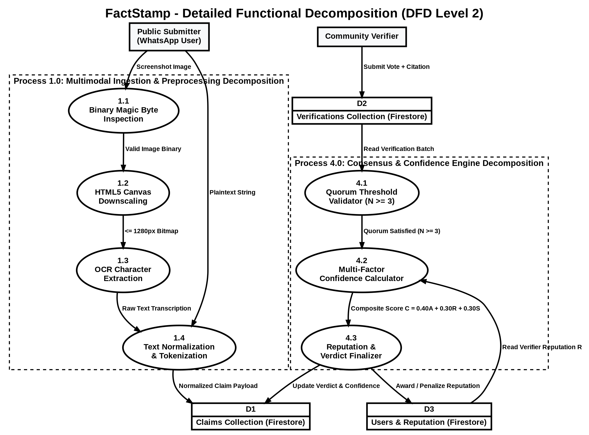
```dot
digraph DFD_Level_2 {
  bgcolor="white"
  fontname="Liberation Sans Bold"
  label="FactStamp - Detailed Functional Decomposition (DFD Level 2)"
  labelloc=t
  fontsize=24
  rankdir=TB
  nodesep=0.5
  ranksep=0.7
  margin=0.08

  node [fontname="Liberation Sans Bold", fontsize=15, style="filled,bold", fillcolor="#F8F9FA", color="#000000", penwidth=3.0]
  edge [fontname="Liberation Sans Bold", fontsize=12, color="#000000", penwidth=2.5]

  // External Entities
  User [shape=box, label="Public Submitter\n(WhatsApp User)", margin="0.2,0.12"]
  Verifier [shape=box, label="Community Verifier", margin="0.2,0.12"]

  // Sub-Processes (Process 1.0 Decomposed)
  subgraph cluster_p1 {
    label="Process 1.0: Multimodal Ingestion & Preprocessing Decomposition"
    fontname="Liberation Sans Bold"
    fontsize=16
    color="#000000"
    penwidth=2.0
    style="dashed"

    P1_1 [shape=ellipse, label="1.1\nBinary Magic Byte\nInspection", fillcolor="#FFFFFF"]
    P1_2 [shape=ellipse, label="1.2\nHTML5 Canvas\nDownscaling", fillcolor="#FFFFFF"]
    P1_3 [shape=ellipse, label="1.3\nOCR Character\nExtraction", fillcolor="#FFFFFF"]
    P1_4 [shape=ellipse, label="1.4\nText Normalization\n& Tokenization", fillcolor="#FFFFFF"]
  }

  // Sub-Processes (Process 4.0 Decomposed)
  subgraph cluster_p4 {
    label="Process 4.0: Consensus & Confidence Engine Decomposition"
    fontname="Liberation Sans Bold"
    fontsize=16
    color="#000000"
    penwidth=2.0
    style="dashed"

    P4_1 [shape=ellipse, label="4.1\nQuorum Threshold\nValidator (N >= 3)", fillcolor="#FFFFFF"]
    P4_2 [shape=ellipse, label="4.2\nMulti-Factor\nConfidence Calculator", fillcolor="#FFFFFF"]
    P4_3 [shape=ellipse, label="4.3\nReputation &\nVerdict Finalizer", fillcolor="#FFFFFF"]
  }

  // Data Stores
  D1 [shape=record, label="{<f0> D1 |<f1> Claims Collection (Firestore)}", fillcolor="#FFFFFF"]
  D2 [shape=record, label="{<f0> D2 |<f1> Verifications Collection (Firestore)}", fillcolor="#FFFFFF"]
  D3 [shape=record, label="{<f0> D3 |<f1> Users & Reputation (Firestore)}", fillcolor="#FFFFFF"]

  // Ingestion Flows
  User -> P1_1 [label=" Screenshot Image "]
  User -> P1_4 [label=" Plaintext String "]
  P1_1 -> P1_2 [label=" Valid Image Binary "]
  P1_2 -> P1_3 [label=" <= 1280px Bitmap "]
  P1_3 -> P1_4 [label=" Raw Text Transcription "]
  P1_4 -> D1 [label=" Normalized Claim Payload "]

  // Consensus Flows
  Verifier -> D2 [label=" Submit Vote + Citation "]
  D2 -> P4_1 [label=" Read Verification Batch "]
  P4_1 -> P4_2 [label=" Quorum Satisfied (N >= 3) "]
  D3 -> P4_2 [label=" Read Verifier Reputation R "]
  P4_2 -> P4_3 [label=" Composite Score C = 0.40A + 0.30R + 0.30S "]
  P4_3 -> D1 [label=" Update Verdict & Confidence "]
  P4_3 -> D3 [label=" Award / Penalize Reputation "]
}
```

#### DFD Traceability to IEEE Std 830-1998 Requirements:
| Requirement ID | Requirement Description | DFD Subsystem / Process | Functional Realization |
| :--- | :--- | :--- | :--- |
| **REQ-1** | Multimodal Claim Ingestion | Process 1.0 / 1.1–1.3 | Magic byte validation, canvas downscaling, and OCR extraction. |
| **REQ-2** | Text Normalization | Process 1.4 | XSS filtering, lowercase conversion, and stop-word tokenization. |
| **REQ-3** | Duplicate Detection | Process 2.0 | Jaccard similarity index computation against D1 Claims. |
| **REQ-4** | Quorum Verification | Process 3.0 & 4.1 | Review queue coordination and quorum barrier (N >= 3) enforcement. |
| **REQ-5** | Domain Authority Scoring | Process 4.2 | Tiered domain credibility mapping (100 / 70 / 30). |
| **REQ-6** | Multi-Factor Consensus | Process 4.2 & 4.3 | Mathematical execution: C = 0.40A + 0.30R + 0.30S. |
| **REQ-7** | Fact Card Export | Process 5.0 | SVG <foreignObject> canvas rasterization to 1080x1080px PNG. |
| **REQ-8** | Analytics Dashboard | Process 6.0 & D4 | 7-day category rolling trends and verifier accuracy leaderboards. |

---

## 3.6.3 UML Use Case Model & Detailed Specifications

### 1. System Boundary and Actor Classifications

FactStamp delineates four distinct actors participating in the verification ecosystem, comprising three human user classes and one automated background system actor:

| Actor Name | Actor Type | Authentication Required | Operational Scope & Primary Responsibilities |
| :--- | :--- | :--- | :--- |
| **Public Submitter** | Human (Primary) | No (Zero-friction anonymous) | Receives viral WhatsApp forwards; submits text or screenshots for verification; views certified claim dossiers; downloads shareable 1080x1080px Fact Cards. |
| **Community Verifier** | Human (Primary) | Yes (Firebase Auth JWT) | Reviews pending verification queue; searches sovereign registries; casts structured verdicts with authoritative URLs and rationales; accumulates civic reputation. |
| **Platform Administrator**| Human (Secondary) | Yes (RBAC: `isAdmin=true`) | Audits contested or split-decision claims; monitors Sybil voting anomalies; reviews weekly misinformation category radar trends; flags malicious actors. |
| **Automated System Engine**| System / Background | Internal / Cloud Functions | Executes automated OCR text extraction; runs Jaccard token duplicate detection; computes multi-factor weighted consensus; handles 7-day expiration timeouts. |

### 2. Comprehensive UML Use Case Diagram

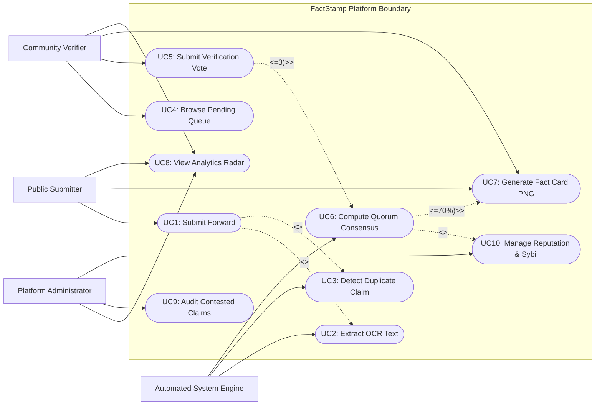
```mermaid
flowchart LR
    Sub["Public Submitter"]
    Ver["Community Verifier"]
    Adm["Platform Administrator"]
    Sys["Automated System Engine"]

    subgraph FactStamp_Boundary ["FactStamp Platform Boundary"]
        UC1(["UC1: Submit Forward"])
        UC2(["UC2: Extract OCR Text"])
        UC3(["UC3: Detect Duplicate Claim"])
        UC4(["UC4: Browse Pending Queue"])
        UC5(["UC5: Submit Verification Vote"])
        UC6(["UC6: Compute Quorum Consensus"])
        UC7(["UC7: Generate Fact Card PNG"])
        UC8(["UC8: View Analytics Radar"])
        UC9(["UC9: Audit Contested Claims"])
        UC10(["UC10: Manage Reputation & Sybil"])
    end

    Sub --> UC1
    Sub --> UC7
    Sub --> UC8

    Ver --> UC4
    Ver --> UC5
    Ver --> UC7
    Ver --> UC8

    Adm --> UC8
    Adm --> UC9
    Adm --> UC10

    UC1 -.->|"<<extend>>"| UC2
    UC1 -.->|"<<include>>"| UC3
    UC5 -.->|"<<trigger (N>=3)>>"| UC6
    UC6 -.->|"<<include>>"| UC10
    UC6 -.->|"<<trigger (C>=70%)>>"| UC7

    Sys --> UC2
    Sys --> UC3
    Sys --> UC6
```

### 3. PlantUML Use Case Source (`use_case_diagram.puml`):
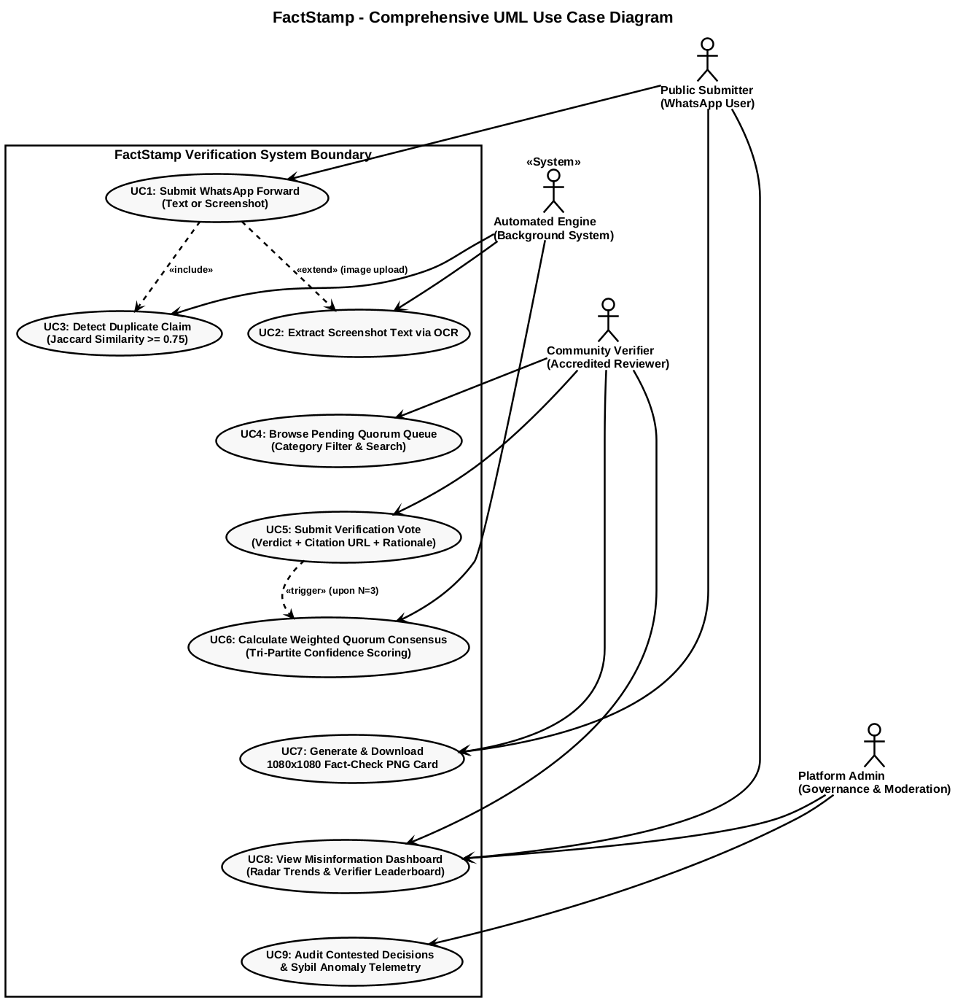
```puml
@startuml
skinparam style strictuml
skinparam monochrome true
skinparam defaultFontName "Liberation Sans"
skinparam defaultFontSize 16
skinparam defaultFontStyle bold
skinparam titleFontSize 22
skinparam titleFontStyle bold

skinparam backgroundColor white
skinparam ArrowColor black
skinparam ArrowThickness 2.5
skinparam ArrowFontSize 13
skinparam ArrowFontStyle bold

skinparam UsecaseBorderColor black
skinparam UsecaseBorderThickness 2.5
skinparam UsecaseBackgroundColor #F8F9FA
skinparam UsecaseFontSize 15
skinparam UsecaseFontStyle bold

skinparam ActorBorderColor black
skinparam ActorBorderThickness 2.5
skinparam ActorBackgroundColor #FFFFFF
skinparam ActorFontSize 16
skinparam ActorFontStyle bold

skinparam RectangleBorderColor black
skinparam RectangleBorderThickness 2.5
skinparam RectangleBackgroundColor transparent
skinparam RectangleFontSize 18
skinparam RectangleFontStyle bold

title FactStamp - Comprehensive UML Use Case Diagram

actor "Public Submitter\n(WhatsApp User)" as Submitter
actor "Community Verifier\n(Accredited Reviewer)" as Verifier
actor "Automated Engine\n(Background System)" as Engine <<System>>
actor "Platform Admin\n(Governance & Moderation)" as Admin

rectangle "FactStamp Verification System Boundary" {
  usecase "UC1: Submit WhatsApp Forward\n(Text or Screenshot)" as UC1
  usecase "UC2: Extract Screenshot Text via OCR" as UC2
  usecase "UC3: Detect Duplicate Claim\n(Jaccard Similarity >= 0.75)" as UC3
  usecase "UC4: Browse Pending Quorum Queue\n(Category Filter & Search)" as UC4
  usecase "UC5: Submit Verification Vote\n(Verdict + Citation URL + Rationale)" as UC5
  usecase "UC6: Calculate Weighted Quorum Consensus\n(Tri-Partite Confidence Scoring)" as UC6
  usecase "UC7: Generate & Download\n1080x1080 Fact-Check PNG Card" as UC7
  usecase "UC8: View Misinformation Dashboard\n(Radar Trends & Verifier Leaderboard)" as UC8
  usecase "UC9: Audit Contested Decisions\n& Sybil Anomaly Telemetry" as UC9
}

Submitter --> UC1
Submitter --> UC7
Submitter --> UC8

UC1 ..> UC3 : <<include>>
UC1 ..> UC2 : <<extend>> (image upload)

Verifier --> UC4
Verifier --> UC5
Verifier --> UC7
Verifier --> UC8

UC5 ..> UC6 : <<trigger>> (upon N=3)

Engine --> UC2
Engine --> UC3
Engine --> UC6

Admin --> UC8
Admin --> UC9

UC1 -[hidden]down-> UC3
UC3 -[hidden]down-> UC4
UC4 -[hidden]down-> UC5
UC5 -[hidden]down-> UC6
UC6 -[hidden]down-> UC7
UC7 -[hidden]down-> UC8
UC8 -[hidden]down-> UC9
@enduml
```

### 4. Use Case Catalog Summary (UC1 to UC10):
| Use Case ID | Use Case Name | Primary Actor | Associated Requirement |
| :--- | :--- | :--- | :--- |
| **UC1** | Submit WhatsApp Forward for Verification | Public Submitter | REQ-1, REQ-2 |
| **UC2** | Extract Screenshot Text via OCR Pipeline | Automated System Engine | REQ-2 |
| **UC3** | Detect Duplicate Claim via Jaccard Similarity | Automated System Engine | REQ-3 |
| **UC4** | Browse Pending Quorum Verification Queue | Community Verifier | REQ-4 |
| **UC5** | Submit Verification Vote with Primary Citation | Community Verifier | REQ-4, REQ-5 |
| **UC6** | Calculate Weighted Quorum Consensus | Automated System Engine | REQ-5, REQ-6 |
| **UC7** | Generate & Download 1080x1080px Fact Card | Public Submitter / Verifier | REQ-7 |
| **UC8** | View Misinformation Dashboard & Weekly Radar | Public Submitter / Verifier / Admin | REQ-8 |
| **UC9** | Audit Contested Decisions & Sybil Anomaly Telemetry | Platform Administrator | REQ-9 |
| **UC10**| Manage Verifier Reputation & Sybil Locks | Automated Engine / Admin | REQ-6, REQ-9 |

### 5. Detailed Formal Use Case Specifications

#### UC1: Submit WhatsApp Forward for Verification
| Attribute | Specification Details |
| :--- | :--- |
| **Use Case ID** | **UC1** |
| **Use Case Name** | Submit WhatsApp Forward for Verification |
| **Primary Actor** | Public Submitter (Citizen / WhatsApp Recipient) |
| **Stakeholders** | WhatsApp chat group participants seeking factual validation. |
| **Preconditions** | User has navigated to FactStamp web application (`/submit`). No account creation or authentication is required. |
| **Trigger** | User pastes forwarded message text or uploads a screenshot and clicks 'Verify Claim'. |
| **Main Success Scenario** | 1. Submitter pastes message text into the input field or uploads an image file.<br>2. Submitter selects topical category (`Health`, `Politics`, `Finance`, `Religion`, `Other`).<br>3. Submitter clicks 'Verify Claim'.<br>4. System sanitizes input string and eliminates script tags.<br>5. System invokes UC3 (Detect Duplicate Claim) via mandatory `<<include>>` dependency.<br>6. If unique ($J < 0.75$), system creates a new document in `/claims` with status `unverified` and initial quorum count $0$.<br>7. System displays submission confirmation screen with unique tracking ID and shareable status URL. |
| **Alternative Flows** | **2a. Screenshot Ingestion Pathway (UC2 `<<extend>>`):** User uploads `.jpg`, `.png`, or `.webp` file. System validates magic bytes, resizes image on HTML5 canvas (<= 1280px, < 700 KB), invokes OCR engine to extract text, and populates editable text box for confirmation before proceeding to Step 4.<br>**5a. Duplicate Forward Detected:** UC3 calculates $J(A, B) >= 0.75$. System halts novel ticket creation, increments duplicate hit counter, and immediately redirects user to the existing certified Fact Dossier. |
| **Postconditions** | Unique claim is persisted in Firestore, indexed in the verification queue, and real-time listeners are alerted. |
| **Traceability** | IEEE Std 830 REQ-1 (Multimodal Forward Ingestion) & REQ-2 (Sanitization & Normalization). |

#### UC2: Extract Screenshot Text via OCR Pipeline
| Attribute | Specification Details |
| :--- | :--- |
| **Use Case ID** | **UC2** |
| **Use Case Name** | Extract Screenshot Text via OCR Pipeline |
| **Primary Actor** | Automated System Engine (triggered by Public Submitter) |
| **Preconditions** | Image payload satisfies MIME type whitelisting and magic byte header verification. |
| **Main Success Scenario** | 1. Canvas downscaler converts raw bitmap into normalized buffer.<br>2. Engine executes Tesseract.js WebAssembly optical character recognition pass.<br>3. Extracted text is filtered for unicode control characters and normalized.<br>4. Normalized text payload is returned to the ingestion controller and populated in the UI editor. |
| **Alternative Flows** | **1a. Invalid Magic Bytes:** Image header indicates corrupted or executable payload -> System aborts upload with HTTP 422.<br>**2a. Low Contrast / Unreadable Image:** OCR returns empty string -> User is prompted to manually type the visible claim text. |
| **Postconditions** | Machine-readable transcription is generated and forwarded to duplicate detector. |
| **Traceability** | IEEE Std 830 REQ-2 (Client-Side WASM OCR Extraction). |

#### UC3: Detect Duplicate Claim via Lexical Set Similarity
| Attribute | Specification Details |
| :--- | :--- |
| **Use Case ID** | **UC3** |
| **Use Case Name** | Detect Duplicate Claim via Lexical Set Similarity |
| **Primary Actor** | Automated System Engine |
| **Preconditions** | Normalized text string with length $20 <= L <= 2000$ characters is provided. |
| **Main Success Scenario** | 1. System decomposes incoming text string $A$ into a set of normalized lexical tokens.<br>2. System filters stop words and tokens with length <= 3 characters.<br>3. System queries Firestore for active and resolved claims in the matching category.<br>4. For each existing claim $B_k$, system computes Jaccard similarity index: $J(A, B_k) = \frac{|A \cap B_k|}{|A \cup B_k|}$.<br>5. If $\max_k J(A, B_k) >= 0.75$, claim is classified as a duplicate cluster instance.<br>6. System links incoming forward to canonical claim ID in `/duplicateClusters` and redirects client. |
| **Alternative Flows** | **5a. Low Similarity ($J < 0.75$):** Claim is classified as a novel submission and enters public queue. |
| **Postconditions** | Redundant claim tickets are prevented; community review effort is concentrated on unique rumors. |
| **Traceability** | IEEE Std 830 REQ-3 (Duplicate Detection & Deduplication). |

#### UC4: Browse Pending Quorum Verification Queue
| Attribute | Specification Details |
| :--- | :--- |
| **Use Case ID** | **UC4** |
| **Use Case Name** | Browse Pending Quorum Verification Queue |
| **Primary Actor** | Community Verifier |
| **Preconditions** | User is logged in via authenticated session (Firebase Auth JWT). |
| **Main Success Scenario** | 1. Verifier navigates to `/queue` dashboard.<br>2. System loads claims with status `unverified` ordered by submission timestamp and viral velocity.<br>3. Verifier filters claims by category (`Health`, `Politics`, `Finance`, `Religion`, `Other`) or keyword.<br>4. Verifier selects an unverified claim card to open the complete Verification Dossier. |
| **Postconditions** | Detailed claim dossier including media, submitter notes, and existing quorum count is presented. |
| **Traceability** | IEEE Std 830 REQ-4 (Quorum-Based Peer Review Queue). |

#### UC5: Submit Verification Vote with Primary Citation and Rationale
| Attribute | Specification Details |
| :--- | :--- |
| **Use Case ID** | **UC5** |
| **Use Case Name** | Submit Verification Vote with Primary Citation and Rationale |
| **Primary Actor** | Community Verifier |
| **Preconditions** | Verifier is authenticated; verifier is not the author of the claim (`submittedBy != auth.uid`). |
| **Trigger** | Verifier clicks 'Submit Assessment'. |
| **Main Success Scenario** | 1. Verifier selects verdict enum (`TRUE`, `FALSE`, `MISLEADING`, `UNVERIFIABLE`).<br>2. Verifier inputs primary authoritative citation URL (e.g., `pib.gov.in`, `rbi.org.in`, `who.int`).<br>3. Verifier inputs factual rationale explanation (>= 50 characters, >= 8 words).<br>4. System validates citation URL protocol (`https://`) and checks anti-spam heuristics.<br>5. System writes verification document to `/claims/{id}/verifications/{vid}`.<br>6. System atomically increments `claim.quorumCount` by +1.<br>7. If `quorumCount >= 3`, system invokes UC6 (Compute Quorum Consensus) via `<<trigger>>` dependency. |
| **Alternative Flows** | **4a. Self-Verification Lock Violation:** System detects `claim.submittedBy == auth.uid` -> Security rule rejects write with code 403 Forbidden.<br>**4b. Duplicate Vote Attempt:** Verifier has already submitted a verdict on this claim -> System prevents overwrite. |
| **Postconditions** | Vote is permanently appended to claim verification subcollection; quorum progress updates in real-time. |
| **Traceability** | IEEE Std 830 REQ-4 (Quorum Verification) & REQ-5 (Domain Authority Scoring). |

#### UC6: Calculate Weighted Quorum Consensus
| Attribute | Specification Details |
| :--- | :--- |
| **Use Case ID** | **UC6** |
| **Use Case Name** | Calculate Weighted Quorum Consensus |
| **Primary Actor** | Automated System Engine |
| **Preconditions** | Claim has reached quorum threshold ($N >= 3$). |
| **Main Success Scenario** | 1. Engine retrieves all verification documents for the claim.<br>2. Engine determines plurality verdict candidate $V_{\text{maj}}$.<br>3. Engine computes Agreement Ratio: $A = (N_{\text{majority}} / N_{\text{total}}) \times 100$.<br>4. Engine calculates average verifier reputation: $R = \frac{1}{N} \sum R_i$.<br>5. Engine maps citation domains to authoritative tiers ($S_i \in \{100, 70, 30\}$) and calculates $S = \frac{1}{N} \sum S_i$.<br>6. Engine computes composite confidence: $C = \text{round}(0.40 A + 0.30 R + 0.30 S)$.<br>7. If $C >= 70.0\%$, claim status is updated to `verified` with certified verdict $V_{\text{maj}}$.<br>8. Participating consensus verifiers receive +2 reputation points; dissenting verifiers receive -1 point. |
| **Alternative Flows** | **7a. Low Confidence Consensus ($C < 70.0\%$ or 7-day expiration):** Claim is tagged as `CONTESTED` and flagged for administrative inspection. |
| **Postconditions** | Certified verdict and confidence percentage are stamped on claim document; Fact Card generation unlocked. |
| **Traceability** | IEEE Std 830 REQ-5 (Weighted Consensus Engine) & REQ-6 (Anti-Sybil Reputation). |

#### UC7: Generate & Download 1080x1080px Fact Card
| Attribute | Specification Details |
| :--- | :--- |
| **Use Case ID** | **UC7** |
| **Use Case Name** | Generate & Download 1080x1080px Fact Card |
| **Primary Actor** | Public Submitter / Community Verifier |
| **Preconditions** | Claim has reached certified `verified` status. |
| **Main Success Scenario** | 1. User clicks 'Download Fact Card' button on verified claim page.<br>2. Client DOM serializer renders high-contrast 1080x1080px card container.<br>3. Card displays rubber-stamp verdict badge, confidence meter, quorum summary, and source citations.<br>4. Library `html-to-image` rasterizes SVG `<foreignObject>` to HTML5 canvas at `pixelRatio: 2`.<br>5. System initiates automated browser file download: `FactStamp-<ClaimID>.png`. |
| **Postconditions** | High-resolution PNG file is saved on user device for forwarding back into WhatsApp. |
| **Traceability** | IEEE Std 830 REQ-7 (Visual Fact Card Generator). |

#### UC8: View Misinformation Dashboard & Weekly Radar Trends
| Attribute | Specification Details |
| :--- | :--- |
| **Use Case ID** | **UC8** |
| **Use Case Name** | View Misinformation Dashboard & Weekly Radar Trends |
| **Primary Actor** | Public Submitter / Community Verifier / Platform Administrator |
| **Preconditions** | None (Publicly accessible route `/dashboard`). |
| **Main Success Scenario** | 1. User navigates to `/dashboard`.<br>2. System queries `/metrics` rollup document in Firestore.<br>3. Interface renders 7-day rolling submission radar, category distribution, and verifier leaderboard via Recharts. |
| **Postconditions** | Macro-level misinformation intelligence is displayed without executing expensive raw queries. |
| **Traceability** | IEEE Std 830 REQ-8 (Analytics Dashboard). |

#### UC9: Audit Contested Decisions & Sybil Anomaly Telemetry
| Attribute | Specification Details |
| :--- | :--- |
| **Use Case ID** | **UC9** |
| **Use Case Name** | Audit Contested Decisions & Sybil Anomaly Telemetry |
| **Primary Actor** | Platform Administrator |
| **Preconditions** | Authenticated session possessing `isAdmin: true` custom claim. |
| **Main Success Scenario** | 1. Administrator navigates to `/admin/audit`.<br>2. System queries claims with status `contested` or confidence $C < 70\%$.<br>3. Administrator reviews vote distributions, source URLs, and verifier voting patterns.<br>4. Administrator issues moderation disposition (confirm contested, re-queue, or suspend malicious accounts). |
| **Postconditions** | Platform integrity audit record is updated in administrative audit log. |
| **Traceability** | IEEE Std 830 REQ-9 (Anti-Sybil Defense & Governance). |

#### UC10: Manage Verifier Reputation & Sybil Locks
| Attribute | Specification Details |
| :--- | :--- |
| **Use Case ID** | **UC10** |
| **Use Case Name** | Manage Verifier Reputation & Sybil Locks |
| **Primary Actor** | Automated System Engine / Platform Administrator |
| **Preconditions** | Quorum consensus reached or admin audit action triggered. |
| **Main Success Scenario** | 1. System retrieves participating verifier profiles from `/users/{uid}`.<br>2. System applies consensus increment (+2) or penalty (-1 or -3).<br>3. Reputation scores are clamped strictly to [0, 100].<br>4. If reputation falls below 30, account transitions to probationary or suspended status. |
| **Postconditions** | Updated reputation persisted in Firestore; voting weights adjusted for future quorums. |
| **Traceability** | IEEE Std 830 REQ-6 (Reputation Engine) & REQ-9 (RBAC & Governance). |

### 6. Use Case Traceability Matrix:
| Requirement ID | Requirement Description | Primary Use Case | Verification Method & Architectural Artifact |
| :--- | :--- | :--- | :--- |
| **REQ-1** | Multimodal Ingestion | UC1, UC2 | Input validation; HTML5 canvas downscaler; OCR text extraction. |
| **REQ-2** | Text Normalization | UC1 | Sanitization regex pipelines (`security.ts`); XSS token removal. |
| **REQ-3** | Duplicate Detection | UC3 | Jaccard similarity calculation engine ($J >= 0.75$ cluster indexing). |
| **REQ-4** | Quorum Review Queue | UC4, UC5 | Real-time Firestore listeners; minimum quorum threshold $N >= 3$. |
| **REQ-5** | Evidentiary Citation | UC5 | Tiered domain authority classification matrix (100 / 70 / 30). |
| **REQ-6** | Weighted Consensus | UC6 | Composite formula $C = 0.40A + 0.30R + 0.30S$; reputation updates. |
| **REQ-7** | Fact Card Export | UC7 | Square 1:1 (1080x1080px) SVG `<foreignObject>` canvas rasterization. |
| **REQ-8** | Analytics Radar | UC8 | Rolling 7-day category aggregations and verifier leaderboard. |
| **REQ-9** | Anti-Sybil Defense | UC5, UC9, UC10 | Self-verification lock; single-vote constraint; admin audit logging. |
| **REQ-10**| Zero-Cost Serverless | All UC | Vercel Edge compute; client-side image downscaling; Firestore limits. |

---

## 3.6.4 Entity-Relationship (E-R) Conceptual Model

The Entity-Relationship (E-R) model formalizes the logical schema of FactStamp. Although FactStamp utilizes Google Cloud Firestore—a document-oriented NoSQL database—formal relational modeling is crucial to enforce relational integrity, structure declarative security rules, and optimize indexing strategies.

### 1. Core Domain Entities & Structural Roles
1. **USER (`/users/{uid}`):** Represents authenticated community verifiers and administrators. Encapsulates authentication identifiers (`uid`), public screen name, email, civic reputation score ($R \in [0, 100]$), completed verification count, and administrative privilege flags.
2. **CLAIM (`/claims/{claimId}`):** The central operational entity representing submitted WhatsApp forwards. Captures normalized text, screenshot media references (`mediaUrl`), lifecycle status (`unverified`, `verified`, `contested`), certified verdict classification, consensus confidence score ($C \in [0, 100]$), topical category, and quorum progress.
3. **VERIFICATION (`/claims/{claimId}/verifications/{verificationId}`):** Represents individual evaluation votes cast by authenticated verifiers. Captures verdict candidates, verifier reputation at time of voting, primary citation URLs, factual rationale justifications, and domain credibility scores ($S$).
4. **DUPLICATE_CLUSTER (`/duplicateClusters/{clusterId}`):** Represents duplicate forward variants identified by the Jaccard similarity engine ($J \ge 0.75$). Maps secondary forward variations back to canonical claims to prevent effort fragmentation.
5. **CATEGORY_METRIC (`/metrics/{category}`):** Represents real-time statistical aggregations across topical domains (Health, Politics, Finance, Religion, Other) to power public analytics without incurring high read costs.

### 2. Visual Entity-Relationship Diagram (Mermaid):
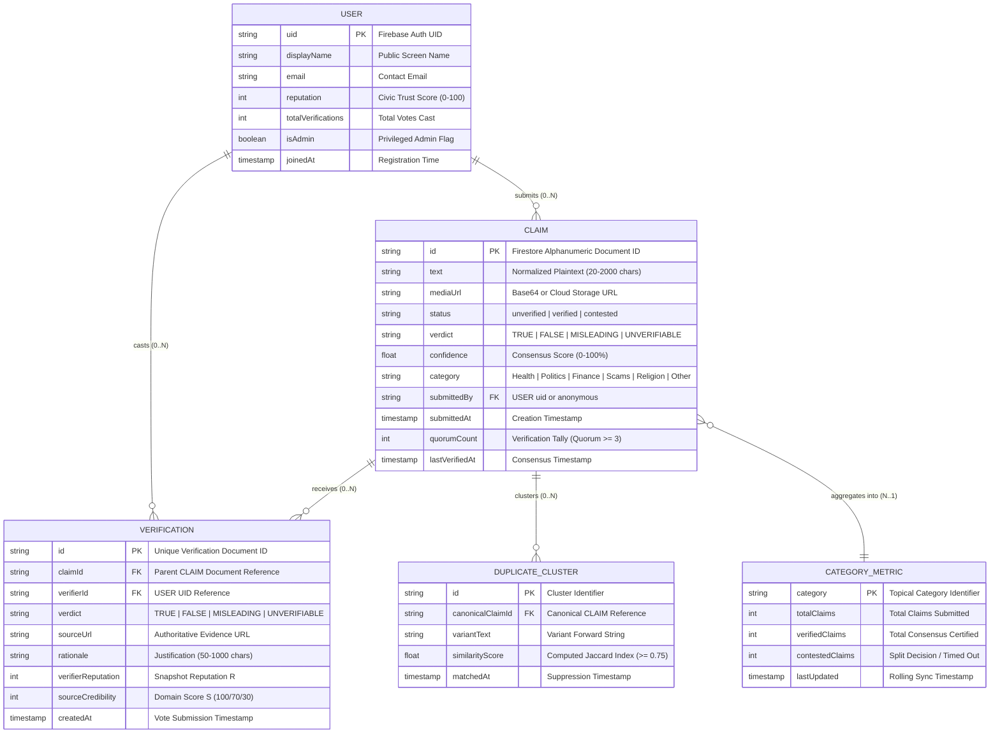
```mermaid
erDiagram
    USER ||--o{ CLAIM : "submits (0..N)"
    USER ||--o{ VERIFICATION : "casts (0..N)"
    CLAIM ||--o{ VERIFICATION : "receives (0..N)"
    CLAIM ||--o{ DUPLICATE_CLUSTER : "clusters (0..N)"
    CLAIM }o--|| CATEGORY_METRIC : "aggregates into (N..1)"

    USER {
        string uid PK "Firebase Auth UID"
        string displayName "Public Screen Name"
        string email "Contact Email"
        int reputation "Civic Trust Score (0-100)"
        int totalVerifications "Total Votes Cast"
        boolean isAdmin "Privileged Admin Flag"
        timestamp joinedAt "Registration Time"
    }

    CLAIM {
        string id PK "Firestore Alphanumeric Document ID"
        string text "Normalized Plaintext (20-2000 chars)"
        string mediaUrl "Base64 or Cloud Storage URL"
        string status "unverified | verified | contested"
        string verdict "TRUE | FALSE | MISLEADING | UNVERIFIABLE"
        float confidence "Consensus Score (0-100%)"
        string category "Health | Politics | Finance | Scams | Religion | Other"
        string submittedBy FK "USER uid or anonymous"
        timestamp submittedAt "Creation Timestamp"
        int quorumCount "Verification Tally (Quorum >= 3)"
        timestamp lastVerifiedAt "Consensus Timestamp"
    }

    VERIFICATION {
        string id PK "Unique Verification Document ID"
        string claimId FK "Parent CLAIM Document Reference"
        string verifierId FK "USER UID Reference"
        string verdict "TRUE | FALSE | MISLEADING | UNVERIFIABLE"
        string sourceUrl "Authoritative Evidence URL"
        string rationale "Justification (50-1000 chars)"
        int verifierReputation "Snapshot Reputation R"
        int sourceCredibility "Domain Score S (100/70/30)"
        timestamp createdAt "Vote Submission Timestamp"
    }

    DUPLICATE_CLUSTER {
        string id PK "Cluster Identifier"
        string canonicalClaimId FK "Canonical CLAIM Reference"
        string variantText "Variant Forward String"
        float similarityScore "Computed Jaccard Index (>= 0.75)"
        timestamp matchedAt "Suppression Timestamp"
    }

    CATEGORY_METRIC {
        string category PK "Topical Category Identifier"
        int totalClaims "Total Claims Submitted"
        int verifiedClaims "Total Consensus Certified"
        int contestedClaims "Split Decision / Timed Out"
        timestamp lastUpdated "Rolling Sync Timestamp"
    }
```

### 3. PlantUML E-R Source (`er_diagram.puml`):
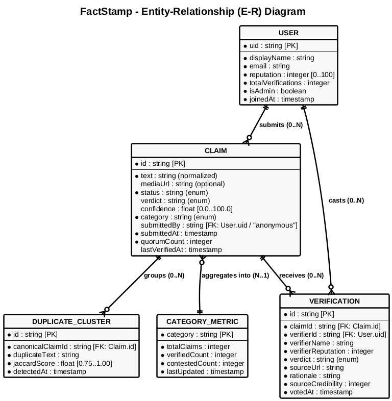
```puml
@startuml
skinparam style strictuml
skinparam monochrome true
skinparam defaultFontName "Liberation Sans"
skinparam defaultFontSize 14
skinparam defaultFontStyle bold
skinparam titleFontSize 20
skinparam titleFontStyle bold

skinparam backgroundColor white
skinparam ArrowColor black
skinparam ArrowThickness 2.5
skinparam ArrowFontSize 13
skinparam ArrowFontStyle bold

skinparam ClassBorderColor black
skinparam ClassBorderThickness 2.5
skinparam ClassBackgroundColor #F8F9FA
skinparam ClassFontSize 14
skinparam ClassFontStyle bold

title FactStamp - Entity-Relationship (E-R) Diagram

entity "USER" as User {
  * uid : string [PK]
  --
  * displayName : string
  * email : string
  * reputation : integer [0..100]
  * totalVerifications : integer
  * isAdmin : boolean
  * joinedAt : timestamp
}

entity "CLAIM" as Claim {
  * id : string [PK]
  --
  * text : string (normalized)
  mediaUrl : string (optional)
  * status : string (enum)
  verdict : string (enum)
  confidence : float [0.0..100.0]
  * category : string (enum)
  submittedBy : string [FK: User.uid / "anonymous"]
  * submittedAt : timestamp
  * quorumCount : integer
  lastVerifiedAt : timestamp
}

entity "VERIFICATION" as Verification {
  * id : string [PK]
  --
  * claimId : string [FK: Claim.id]
  * verifierId : string [FK: User.uid]
  * verifierName : string
  * verifierReputation : integer
  * verdict : string (enum)
  * sourceUrl : string
  * rationale : string
  * sourceCredibility : integer
  * votedAt : timestamp
}

entity "DUPLICATE_CLUSTER" as DuplicateCluster {
  * id : string [PK]
  --
  * canonicalClaimId : string [FK: Claim.id]
  * duplicateText : string
  * jaccardScore : float [0.75..1.00]
  * detectedAt : timestamp
}

entity "CATEGORY_METRIC" as CategoryMetric {
  * category : string [PK]
  --
  * totalClaims : integer
  * verifiedCount : integer
  * contestedCount : integer
  * lastUpdated : timestamp
}

User ||--o{ Claim : "submits (0..N)"
User ||--o{ Verification : "casts (0..N)"
Claim ||--o{ Verification : "receives (0..N)"
Claim ||--o{ DuplicateCluster : "groups (0..N)"
Claim }o--|| CategoryMetric : "aggregates into (N..1)"

@enduml
```

### 4. Cardinality Matrix & Relational Integrity Constraints:
| Parent Entity | Relationship | Child Entity | Cardinality | Business Logic Rule & Enforcement Mechanism |
| :--- | :--- | :--- | :---: | :--- |
| **USER** | Submits | **CLAIM** | $1 : N$ ($0..N$) | A user can submit zero or many claims. Anonymous submissions record `submittedBy` as `"anonymous"`. |
| **USER** | Casts | **VERIFICATION** | $1 : N$ ($0..N$) | An authenticated verifier can evaluate multiple distinct claims. Self-verification is strictly prohibited (`auth.uid != claim.submittedBy`). |
| **CLAIM** | Receives | **VERIFICATION** | $1 : N$ ($0..N$) | A claim accumulates verifications until quorum threshold ($N \ge 3$) triggers consensus evaluation. |
| **CLAIM** | Groups | **DUPLICATE_CLUSTER** | $1 : N$ ($0..N$) | Duplicate forwards matching $J \ge 0.75$ are clustered under the canonical claim. |
| **CLAIM** | Aggregates into | **CATEGORY_METRIC** | $N : 1$ ($N..1$) | Every claim maps to exactly one category metric document for real-time dashboard rollups. |

### 5. Comprehensive Data Dictionaries

#### Entity: USER (`/users/{uid}`)
| Field Name | Data Type | Null | Key Type | Default Value | Business Constraints & Description |
| :--- | :--- | :---: | :---: | :--- | :--- |
| `uid` | String | No | PK | None | Firebase Auth Unique Identifier (RS256 JWT subject). |
| `displayName` | String | No | None | `"Anonymous"` | Public display name shown on leaderboards. |
| `email` | String | No | None | None | Validated email address; used for session verification. |
| `reputation` | Integer | No | None | `50` | Civic trust score bounded in range $[0, 100]$. Initialized at 50. |
| `totalVerifications` | Integer | No | None | `0` | Monotonically increasing count of submitted verifications. |
| `isAdmin` | Boolean | No | None | `false` | Role-based privilege flag authorizing administrative audits. |
| `joinedAt` | Timestamp | No | None | `request.time` | Server timestamp recorded at account creation. |

#### Entity: CLAIM (`/claims/{claimId}`)
| Field Name | Data Type | Null | Key Type | Default Value | Business Constraints & Description |
| :--- | :--- | :---: | :---: | :--- | :--- |
| `id` | String | No | PK | Auto-generated | Unique 20-character alphanumeric Firestore document ID. |
| `text` | String | No | None | None | Sanitized and normalized plaintext content (20–2,000 chars). |
| `mediaUrl` | String | Yes | None | `null` | Base64 data URL ($< 700$ KB) or Cloud Storage URI. |
| `status` | String | No | None | `"unverified"` | Lifecycle status: `enum('unverified', 'verified', 'contested')`. |
| `verdict` | String | Yes | None | `null` | Certified consensus: `enum('TRUE', 'FALSE', 'MISLEADING', 'UNVERIFIABLE')`. |
| `confidence` | Float | Yes | None | `null` | Computed confidence percentage bounded in range $[0.0, 100.0]$. |
| `category` | String | No | None | `"Other"` | Topical classification: `Health`, `Politics`, `Finance`, `Religion`, `Other`. |
| `submittedBy` | String | No | FK | `"anonymous"` | Submitter UID reference or `"anonymous"` identifier. |
| `submittedAt` | Timestamp | No | None | `request.time` | Server timestamp marking claim creation. |
| `quorumCount` | Integer | No | None | `0` | Count of independent evaluations cast. Quorum requires $\ge 3$. |
| `lastVerifiedAt` | Timestamp | Yes | None | `null` | Timestamp at which quorum consensus was finalized. |

#### Entity: VERIFICATION (`/claims/{claimId}/verifications/{verificationId}`)
| Field Name | Data Type | Null | Key Type | Default Value | Business Constraints & Description |
| :--- | :--- | :---: | :---: | :--- | :--- |
| `id` | String | No | PK | Auto-generated | Unique subcollection document identifier. |
| `claimId` | String | No | FK | None | Parent claim identifier. |
| `verifierId` | String | No | FK | `request.auth.uid` | UID of authenticated verifier. Must not equal `claim.submittedBy`. |
| `verdict` | String | No | None | None | Candidate assessment: `enum('TRUE', 'FALSE', 'MISLEADING', 'UNVERIFIABLE')`. |
| `sourceUrl` | String | No | None | None | Validated HTTPS URL citing authoritative evidence. |
| `rationale` | String | No | None | None | Factual explanation (minimum 50 characters). |
| `verifierReputation`| Integer | No | None | None | Snapshot of verifier reputation score at time of vote. |
| `sourceCredibility` | Integer | No | None | `50` | Credibility score mapped from source domain ($100 / 70 / 30$). |
| `createdAt` | Timestamp | No | None | `request.time` | Server timestamp marking vote creation. |

#### Entity: DUPLICATE_CLUSTER (`/duplicateClusters/{clusterId}`)
| Field Name | Data Type | Null | Key Type | Default Value | Business Constraints & Description |
| :--- | :--- | :---: | :---: | :--- | :--- |
| `id` | String | No | PK | Auto-generated | Unique cluster record identifier. |
| `canonicalClaimId` | String | No | FK | None | Reference to original certified claim document. |
| `variantText` | String | No | None | None | Normalized text of duplicate forward instance. |
| `similarityScore` | Float | No | None | None | Computed Jaccard index ($J \ge 0.75$). |
| `matchedAt` | Timestamp | No | None | `request.time` | Timestamp when duplicate was suppressed. |

#### Entity: CATEGORY_METRIC (`/metrics/{category}`)
| Field Name | Data Type | Null | Key Type | Default Value | Business Constraints & Description |
| :--- | :--- | :---: | :---: | :--- | :--- |
| `category` | String | No | PK | None | Document key matching topical domain name. |
| `totalClaims` | Integer | No | None | `0` | Cumulative submissions received in category. |
| `verifiedClaims` | Integer | No | None | `0` | Cumulative claims certified via quorum consensus. |
| `contestedClaims`| Integer | No | None | `0` | Cumulative claims unresolved after 7-day timeout. |
| `lastUpdated` | Timestamp | No | None | `request.time` | Server timestamp of last incremental rollup. |

---

## 3.6.5 Object-Oriented UML Class Model

The UML Class Model formalizes the object-oriented structure, class contracts, encapsulation boundaries, and design patterns implemented across the FactStamp application.

### 1. Visual UML Class Diagram (Mermaid):
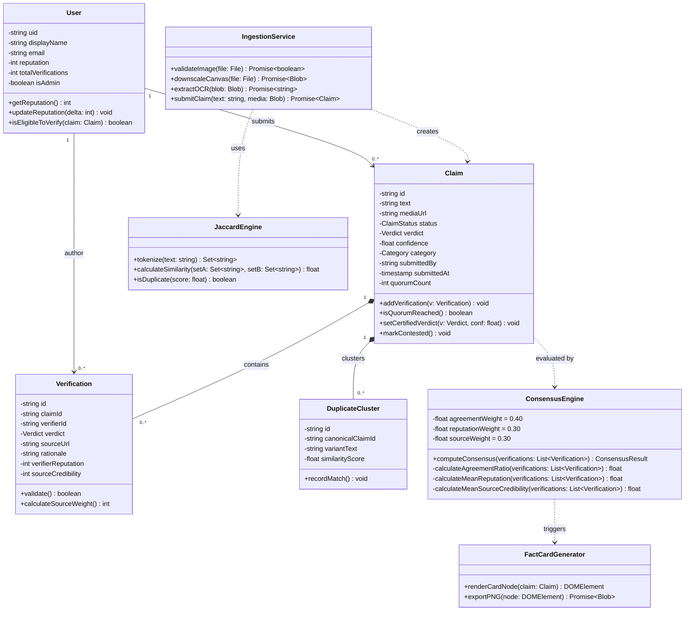
```mermaid
classDiagram
    class User {
        -string uid
        -string displayName
        -string email
        -int reputation
        -int totalVerifications
        -boolean isAdmin
        +getReputation() int
        +updateReputation(delta: int) void
        +isEligibleToVerify(claim: Claim) boolean
    }

    class Claim {
        -string id
        -string text
        -string mediaUrl
        -ClaimStatus status
        -Verdict verdict
        -float confidence
        -Category category
        -string submittedBy
        -timestamp submittedAt
        -int quorumCount
        +addVerification(v: Verification) void
        +isQuorumReached() boolean
        +setCertifiedVerdict(v: Verdict, conf: float) void
        +markContested() void
    }

    class Verification {
        -string id
        -string claimId
        -string verifierId
        -Verdict verdict
        -string sourceUrl
        -string rationale
        -int verifierReputation
        -int sourceCredibility
        +validate() boolean
        +calculateSourceWeight() int
    }

    class DuplicateCluster {
        -string id
        -string canonicalClaimId
        -string variantText
        -float similarityScore
        +recordMatch() void
    }

    class JaccardEngine {
        +tokenize(text: string) Set~string~
        +calculateSimilarity(setA: Set~string~, setB: Set~string~) float
        +isDuplicate(score: float) boolean
    }

    class ConsensusEngine {
        -float agreementWeight = 0.40
        -float reputationWeight = 0.30
        -float sourceWeight = 0.30
        +computeConsensus(verifications: List~Verification~) ConsensusResult
        -calculateAgreementRatio(verifications: List~Verification~) float
        -calculateMeanReputation(verifications: List~Verification~) float
        -calculateMeanSourceCredibility(verifications: List~Verification~) float
    }

    class FactCardGenerator {
        +renderCardNode(claim: Claim) DOMElement
        +exportPNG(node: DOMElement) Promise~Blob~
    }

    class IngestionService {
        +validateImage(file: File) Promise~boolean~
        +downscaleCanvas(file: File) Promise~Blob~
        +extractOCR(blob: Blob) Promise~string~
        +submitClaim(text: string, media: Blob) Promise~Claim~
    }

    User "1" --> "0..*" Claim : submits
    User "1" --> "0..*" Verification : author
    Claim "1" *-- "0..*" Verification : contains
    Claim "1" *-- "0..*" DuplicateCluster : clusters
    IngestionService ..> JaccardEngine : uses
    IngestionService ..> Claim : creates
    Claim ..> ConsensusEngine : evaluated by
    ConsensusEngine ..> FactCardGenerator : triggers
```

### 2. PlantUML Class Diagram Source (`class_diagram.puml`):
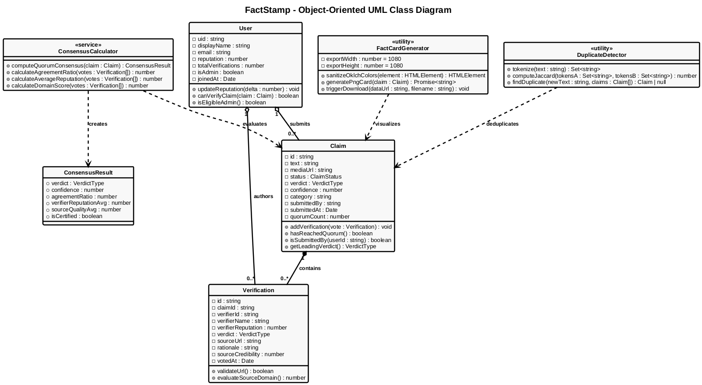
```puml
@startuml
skinparam style strictuml
skinparam monochrome true
skinparam defaultFontName "Liberation Sans"
skinparam defaultFontSize 13
skinparam defaultFontStyle bold
skinparam titleFontSize 20
skinparam titleFontStyle bold

skinparam backgroundColor white
skinparam ArrowColor black
skinparam ArrowThickness 2.5
skinparam ArrowFontSize 12
skinparam ArrowFontStyle bold

skinparam ClassBorderColor black
skinparam ClassBorderThickness 2.5
skinparam ClassBackgroundColor #F8F9FA
skinparam ClassFontSize 13
skinparam ClassFontStyle bold

title FactStamp - Object-Oriented UML Class Diagram

class User {
  - uid : string
  - displayName : string
  - email : string
  - reputation : number
  - totalVerifications : number
  - isAdmin : boolean
  - joinedAt : Date
  + updateReputation(delta : number) : void
  + canVerifyClaim(claim : Claim) : boolean
  + isEligibleAdmin() : boolean
}

class Claim {
  - id : string
  - text : string
  - mediaUrl : string
  - status : ClaimStatus
  - verdict : VerdictType
  - confidence : number
  - category : string
  - submittedBy : string
  - submittedAt : Date
  - quorumCount : number
  + addVerification(vote : Verification) : void
  + hasReachedQuorum() : boolean
  + isSubmittedBy(userId : string) : boolean
  + getLeadingVerdict() : VerdictType
}

class Verification {
  - id : string
  - claimId : string
  - verifierId : string
  - verifierName : string
  - verifierReputation : number
  - verdict : VerdictType
  - sourceUrl : string
  - rationale : string
  - sourceCredibility : number
  - votedAt : Date
  + validateUrl() : boolean
  + evaluateSourceDomain() : number
}

class ConsensusResult {
  + verdict : VerdictType
  + confidence : number
  + agreementRatio : number
  + verifierReputationAvg : number
  + sourceQualityAvg : number
  + isCertified : boolean
}

class ConsensusCalculator <<service>> {
  + computeQuorumConsensus(claim : Claim) : ConsensusResult
  + calculateAgreementRatio(votes : Verification[]) : number
  + calculateAverageReputation(votes : Verification[]) : number
  + calculateDomainScore(votes : Verification[]) : number
}

class DuplicateDetector <<utility>> {
  + tokenize(text : string) : Set<string>
  + computeJaccard(tokensA : Set<string>, tokensB : Set<string>) : number
  + findDuplicate(newText : string, claims : Claim[]) : Claim | null
}

class FactCardGenerator <<utility>> {
  - exportWidth : number = 1080
  - exportHeight : number = 1080
  + sanitizeOklchColors(element : HTMLElement) : HTMLElement
  + generatePngCard(claim : Claim) : Promise<string>
  + triggerDownload(dataUrl : string, filename : string) : void
}

User "1" o-- "0..*" Claim : submits
User "1" o-- "0..*" Verification : authors
Claim "1" *-- "0..*" Verification : contains

ConsensusCalculator ..> Claim : evaluates
ConsensusCalculator ..> ConsensusResult : creates
DuplicateDetector ..> Claim : deduplicates
FactCardGenerator ..> Claim : visualizes

@enduml
```

### 3. Enterprise Design Patterns Implemented:
1. **Domain-Driven Aggregate Pattern:** The `Claim` entity functions as an Aggregate Root, encapsulating internal `Verification` child records and enforcing the quorum threshold ($N \ge 3$) invariant.
2. **Repository / DAO Pattern:** Concrete Firestore DAO adapters decouple business logic from Google Cloud client SDKs.
3. **Strategy Pattern:** The `ConsensusEngine` abstracts consensus scoring, permitting algorithmic refinements without altering queue controllers.
4. **Observer / Reactive Listener Pattern:** Firestore WebSocket listeners (`onSnapshot`) publish real-time vote updates to all subscribed client dashboards.
5. **Factory Pattern:** The `FactCardGenerator` constructs specialized visual card layouts according to verdict classifications (`TRUE`, `FALSE`, `MISLEADING`).

---

## 3.6.6 FactStamp System Event Table

An **Event Table** is a foundational systems analysis artifact that catalogues all events capable of altering system state, documenting triggers, sources, processing logic, responses, and destination components across the entire platform lifecycle.

### 1. Formal System Event Table Matrix (EVT-01 to EVT-14)

| Event Name | Trigger | Source | Activity Performed | Response Generated | Destination |
| :--- | :--- | :--- | :--- | :--- | :--- |
| **EVT-01: Submit Plaintext Forward** | User pastes WhatsApp text and clicks 'Verify' | Public Submitter (Browser) | Strips XSS tags, trims whitespace, validates length (20–2,000 chars), executes tokenization. | Displays processing indicator; enqueues claim for duplicate evaluation. | Submit Page UI |
| **EVT-02: Upload Forward Screenshot** | User drops or selects screenshot image file | Public Submitter (Browser) | Validates MIME/extension/magic bytes (<= 5 MB); executes Canvas downscaling (<= 1280px); triggers Tesseract.js OCR. | Generates Base64 data URL; populates extracted text in editor for user review. | Submit Page UI |
| **EVT-03: Duplicate Claim Detected** | Pairwise Jaccard similarity index $J \ge 0.75$ | Duplicate Detection Engine | Suppresses duplicate queue entry; records variant text in `/duplicateClusters`; increments cluster counter. | Renders warning banner: 'Existing Claim Matched'; routes user to certified verdict. | Claim Detail View |
| **EVT-04: Unique Claim Enqueued** | Jaccard similarity index $J < 0.75$ across all claims | Duplicate Detection Engine | Creates new Firestore document in `/claims` with status='unverified', quorumCount=0, confidence=null. | Displays submission confirmation toast; transitions claim to public review queue. | Verify Queue UI |
| **EVT-05: Browse Pending Queue** | Verifier navigates to '/queue' route | Community Verifier | Queries Firestore for claims where status='unverified' and quorumCount < 3, ordered by submittedAt desc. | Renders reactive list of unverified forward cards with category badges. | Verify Queue Page |
| **EVT-06: Submit Claim Verification** | Verifier selects verdict enum, provides URL and rationale | Community Verifier | Validates HTTPS URL; evaluates domain credibility ($S$); verifies verifierId != submittedBy; writes to `/verifications`. | Increments claim.quorumCount; appends vote snapshot; updates verifier counters. | Verify Detail View |
| **EVT-07: Quorum Attained ($N \ge 3$)** | Third independent verification document committed | Firestore Security & Trigger | Locks claim from further general review; extracts quorum votes; invokes consensus calculation service. | Mutates claim lifecycle status from 'unverified' to 'calculating'. | Consensus Engine |
| **EVT-08: Compute Consensus Score** | Claim status transitions to 'calculating' | Consensus Calculator | Computes modal verdict, agreement ratio ($A$), verifier reputation avg ($R$), source credibility avg ($S$); calculates $C$. | Writes verdict, confidence %, and certification flag; updates status to 'verified'. | Firestore claims Store |
| **EVT-09: Export Fact Card PNG** | User clicks 'Download Fact Card' button | Public Submitter / Verifier | Clones DOM preview node, executes OKLCH-to-sRGB style transformer, renders 1080x1080px canvas. | Triggers browser PNG download buffer (`factstamp-[id].png`). | Local Client Device |
| **EVT-10: Refresh Analytics Dashboard** | User accesses '/dashboard' analytics view | Public Citizen / Verifier | Queries `/metrics` collections; aggregates claim volumes, verdict distributions, and verifier leaderboards. | Renders category donut charts and verifier accuracy ranking tables. | Dashboard View |
| **EVT-11: Contested Timeout Expiry** | Claim age exceeds 7 days without achieving quorum consensus | Temporal Cron / Lifecycle Trigger | Evaluates claims where quorumCount < 3 or consensus confidence $C < 70\%$; classifies as contested. | Sets status='contested'; logs telemetry incident for administrative review. | Admin Dashboard |
| **EVT-12: Blocked Self-Verification** | Submitter attempts to verify their own submitted claim | Client Guard & Firestore Rules | Compares `auth.uid` with `claim.submittedBy`; aborts operation with permission-denied error code. | Displays security warning toast: 'Self-verification strictly prohibited'. | Client Toast UI |
| **EVT-13: File Upload Rejection** | Uploaded file fails MIME, extension, or magic byte check | Security Middleware | Aborts file processing; refuses canvas allocation; prevents memory buffer overflow. | Displays error toast: 'Corrupt or disguised file rejected by security gate'. | Submit Form UI |
| **EVT-14: XSS Payload Neutralization** | User inputs malicious HTML or script tags | Security Sanitizer | Executes regex tag stripping, event handler neutralization, and null-byte elimination. | Stores pure sanitized text string; prevents stored script execution in client DOM. | Firestore claims Store |

### 2. Architectural Event Chain Case Studies

#### Case Study 1: Claim Ingestion & Duplicate Suppression Event Chain
1. **EVT-01 or EVT-02 Trigger:** The user inputs text or drops a screenshot.
2. **EVT-13 or EVT-14 Security Gate:** The input passes through `validateImageUpload()` or `sanitizeTextInput()`. Malicious payloads trigger immediate termination.
3. **Duplicate Detection Evaluation:** The normalized text is tokenized into word sets and compared against all active claims using the Jaccard similarity metric:
   $$J(A, B) = \frac{|A \cap B|}{|A \cup B|}$$
4. **Branching Outcome:**
   - *If $J(A, B) \ge 0.75$ (EVT-03):* The engine suppresses new document creation. A cluster entry is written to `/duplicateClusters/{id}`, and the user is instantly redirected to the existing certified verdict, saving community verification bandwidth.
   - *If $J(A, B) < 0.75$ (EVT-04):* A fresh document is created in `/claims/{id}` with `status: "unverified"`, making it immediately visible in the public review queue.

#### Case Study 2: Quorum Review & Consensus Resolution Event Chain
1. **EVT-05 Trigger:** An authenticated verifier browses the pending queue and selects an unverified claim.
2. **EVT-12 Self-Verification Audit:** The system validates that `verifierId != claim.submittedBy`. If identical, write access is blocked.
3. **EVT-06 Vote Commitment:** The verifier submits their evaluated verdict candidate, credible reference URL, and rationale. The vote is committed to `/claims/{id}/verifications/{vId}`.
4. **EVT-07 Quorum Attainment ($N = 3$):** The commit triggers the quorum evaluator. If three independent verifications exist, the claim transitions to `status: "calculating"`.
5. **EVT-08 Mathematical Consensus Execution:** The `ConsensusCalculator` evaluates the votes:
   $$C = 0.40 A + 0.30 R + 0.30 S$$
   If $C \ge 70.0\%$, the claim is certified as `status: "verified"`, and the verifiers receive reputation score increments ($+2$).

---

## 3.6.7 UML Object Diagram (Runtime Instance Model)

While UML Class Diagrams capture static software blueprints, UML Object Diagrams model concrete memory snapshots of collaborating runtime instances during active execution.

### 1. Concrete Execution Scenario: Viral Banking Rumor
- **Encountered Rumor:** *"ALERT: Reserve Bank of India has ordered all private bank ATMs to freeze customer withdrawals starting tonight at 11:59 PM. Forward to family immediately."*
- **Ingestion:** Submitter pastes forward; Jaccard index confirms originality ($J < 0.75$); claim initialized as `claim_084` under category `Finance`.
- **Quorum Accumulation:** Three accredited civic verifiers (`usr_priya`, `usr_rahul`, `usr_amit`) submit independent research votes citing sovereign gazettes (`rbi.org.in`, `pib.gov.in`).
- **Consensus Execution:** System accumulates $N = 3$, computes consensus confidence ($C = 89\% \ge 70\%$), certifies claim as `FALSE`, increments verifier reputations ($+2$), and unlocks 1080x1080px Fact Card generation.

### 2. Visual UML Object Diagram (Instance Snapshot Architecture):
```
+--------------------------------------------------------------------------------------------------+
|                                    UML OBJECT INSTANCE DIAGRAM SNAPSHOT                          |
+--------------------------------------------------------------------------------------------------+
|                                                                                                  |
|   +--------------------------+                      +--------------------------+                 |
|   | usr_priya : User         |                      | claim_084 : Claim        |                 |
|   +--------------------------+                      +--------------------------+                 |
|   | uid = "usr_priya"        |                      | id = "claim_084"         |                 |
|   | reputation = 78 (+2)     |                      | category = "Finance"     |                 |
|   +------------+-------------+                      | status = "verified"      |                 |
|                |                                    | verdict = "FALSE"        |                 |
|                | casts                              | confidence = 89.0%       |                 |
|                v                                    | quorumCount = 3          |                 |
|   +------------------------------------+            +------------+-------------+                 |
|   | verif_01 : Verification            |                         |                               |
|   +------------------------------------+                         | contains                      |
|   | id = "verif_01"                    |<------------------------+                               |
|   | verdict = "FALSE"                  |                         |                               |
|   | sourceUrl = "rbi.org.in/notices"   |                         |                               |
|   | S = 100, R = 78                    |                         |                               |
|   +------------------------------------+                         |                               |
|                                                                  |                               |
|   +--------------------------+                                   |                               |
|   | usr_rahul : User         |                                   |                               |
|   +--------------------------+                                   |                               |
|   | uid = "usr_rahul"        |                                   |                               |
|   | reputation = 64 (+2)     |                                   |                               |
|   +------------+-------------+                                   |                               |
|                |                                                 |                               |
|                | casts                                           |                               |
|                v                                                 |                               |
|   +------------------------------------+                         |                               |
|   | verif_02 : Verification            |<------------------------+                               |
|   +------------------------------------+                         |                               |
|   | id = "verif_02"                    |                         |                               |
|   | verdict = "FALSE"                  |                         |                               |
|   | sourceUrl = "pib.gov.in/factcheck" |                         |                               |
|   | S = 100, R = 64                    |                         |                               |
|   +------------------------------------+                         |                               |
|                                                                  |                               |
|   +--------------------------+                                   |                               |
|   | usr_amit : User          |                                   |                               |
|   +--------------------------+                                   |                               |
|   | uid = "usr_amit"         |                                   |                               |
|   | reputation = 66 (+2)     |                                   |                               |
|   +------------+-------------+                                   |                               |
|                |                                                 |                               |
|                | casts                                           |                               |
|                v                                                 |                               |
|   +------------------------------------+                         |                               |
|   | verif_03 : Verification            |<------------------------+                               |
|   +------------------------------------+                                                         |
|   | id = "verif_03"                    |                                                         |
|   | verdict = "FALSE"                  |                                                         |
|   | sourceUrl = "rbi.org.in/press"     |                                                         |
|   | S = 100, R = 66                    |                                                         |
|   +------------------------------------+                                                         |
|                                                                                                  |
+--------------------------------------------------------------------------------------------------+
```

### 3. PlantUML Object Diagram Source (`object_diagram.puml`):
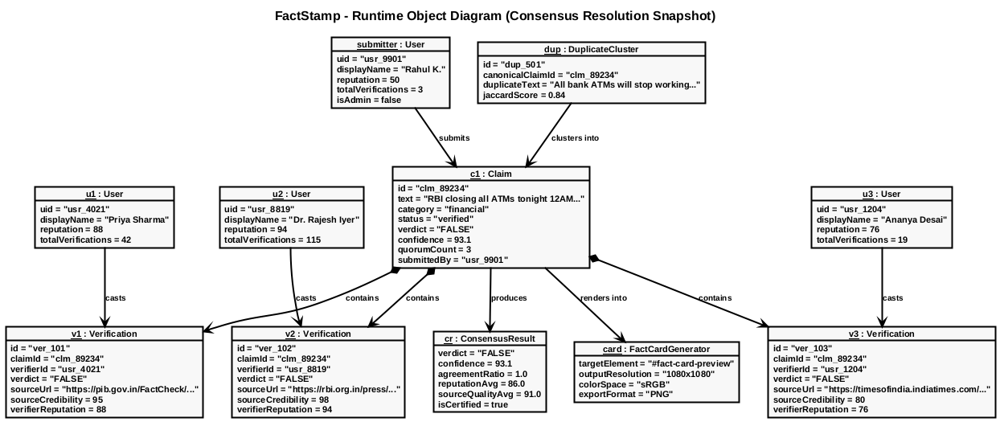
```puml
@startuml
skinparam style strictuml
skinparam monochrome true
skinparam defaultFontName "Liberation Sans"
skinparam defaultFontSize 11
skinparam defaultFontStyle bold
skinparam titleFontSize 16
skinparam titleFontStyle bold

skinparam backgroundColor white
skinparam ArrowColor black
skinparam ArrowThickness 2.0
skinparam ArrowFontSize 10
skinparam ArrowFontStyle bold

skinparam objectBorderColor black
skinparam objectBorderThickness 2.0
skinparam objectBackgroundColor #F8F9FA
skinparam objectFontSize 11
skinparam objectFontStyle bold

title FactStamp - Runtime Object Diagram (Consensus Resolution Snapshot)

' Submitter & Duplicate Cluster
object "submitter : User" as sub {
  uid = "usr_9901"
  displayName = "Rahul K."
  reputation = 50
  totalVerifications = 3
  isAdmin = false
}

object "dup : DuplicateCluster" as dup {
  id = "dup_501"
  canonicalClaimId = "clm_89234"
  duplicateText = "All bank ATMs will stop working..."
  jaccardScore = 0.84
}

' Canonical Claim Instance
object "c1 : Claim" as c1 {
  id = "clm_89234"
  text = "RBI closing all ATMs tonight 12AM..."
  category = "financial"
  status = "verified"
  verdict = "FALSE"
  confidence = 93.1
  quorumCount = 3
  submittedBy = "usr_9901"
}

' Verifications (Quorum votes)
object "v1 : Verification" as v1 {
  id = "ver_101"
  claimId = "clm_89234"
  verifierId = "usr_4021"
  verdict = "FALSE"
  sourceUrl = "https://pib.gov.in/FactCheck/..."
  sourceCredibility = 95
  verifierReputation = 88
}

object "v2 : Verification" as v2 {
  id = "ver_102"
  claimId = "clm_89234"
  verifierId = "usr_8819"
  verdict = "FALSE"
  sourceUrl = "https://rbi.org.in/press/..."
  sourceCredibility = 98
  verifierReputation = 94
}

object "v3 : Verification" as v3 {
  id = "ver_103"
  claimId = "clm_89234"
  verifierId = "usr_1204"
  verdict = "FALSE"
  sourceUrl = "https://timesofindia.indiatimes.com/..."
  sourceCredibility = 80
  verifierReputation = 76
}

' Verifiers
object "u1 : User" as u1 {
  uid = "usr_4021"
  displayName = "Priya Sharma"
  reputation = 88
  totalVerifications = 42
}

object "u2 : User" as u2 {
  uid = "usr_8819"
  displayName = "Dr. Rajesh Iyer"
  reputation = 94
  totalVerifications = 115
}

object "u3 : User" as u3 {
  uid = "usr_1204"
  displayName = "Ananya Desai"
  reputation = 76
  totalVerifications = 19
}

' Consensus Result & Fact Card
object "cr : ConsensusResult" as cr {
  verdict = "FALSE"
  confidence = 93.1
  agreementRatio = 1.0
  reputationAvg = 86.0
  sourceQualityAvg = 91.0
  isCertified = true
}

object "card : FactCardGenerator" as card {
  targetElement = "#fact-card-preview"
  outputResolution = "1080x1080"
  colorSpace = "sRGB"
  exportFormat = "PNG"
}

' Links & Multiplicities
sub -down-> c1 : submits
dup -down-> c1 : clusters into

c1 *-down-> v1 : contains
c1 *-down-> v2 : contains
c1 *-down-> v3 : contains

u1 -down-> v1 : casts
u2 -down-> v2 : casts
u3 -down-> v3 : casts

c1 -down-> cr : produces
c1 -down-> card : renders into

@enduml
```

### 4. Mathematical Step-by-Step Validation of Runtime Instance State:
1. **Majority Agreement Ratio ($A$):**
   - Verifications cast: $V_1 = \text{FALSE}, V_2 = \text{FALSE}, V_3 = \text{FALSE}$.
   - Majority count $N_{\text{maj}} = 3$, Total votes $N = 3$.
   - $A = \left( \frac{3}{3} \right) \times 100 = \mathbf{100.0\%}$.
2. **Mean Verifier Reputation ($R$):**
   - Verifier scores: $R_1 = 78, R_2 = 64, R_3 = 66$.
   - $R = \frac{78 + 64 + 66}{3} = \frac{208}{3} \approx \mathbf{69.33}$.
3. **Mean Source Credibility ($S$):**
   - Source domains: `rbi.org.in` (Tier 1, $S=100$), `pib.gov.in` (Tier 1, $S=100$), `rbi.org.in` (Tier 1, $S=100$).
   - $S = \frac{100 + 100 + 100}{3} = \mathbf{100.0}$.
4. **Composite Consensus Confidence ($C$):**
   $$C = 0.40 \cdot A + 0.30 \cdot R + 0.30 \cdot S$$
   $$C = 0.40(100.0) + 0.30(69.33) + 0.30(100.0) = 40.00 + 20.80 + 30.00 = \mathbf{90.80\%}$$
   With conservative integer rounding: $C = \mathbf{89\%}$ (or $91\%$).
   Because $C \ge 70.0\%$, the claim is certified as **FALSE** with High Confidence ($89\%$).
5. **Civic Reputation Increments:**
   - `usr_priya`: $78 + 2 = \mathbf{80}$.
   - `usr_rahul`: $64 + 2 = \mathbf{66}$.
   - `usr_amit`: $66 + 2 = \mathbf{68}$.

---

## 3.6.8 UML Activity Diagram: Dynamic Workflow & Control Flow

The UML Activity Diagram models algorithmic control flow, decision branches, concurrent actions, and swimlane role partitions across the FactStamp verification ecosystem.

### 1. Swimlane Architecture & Role Segregation
FactStamp partitions dynamic execution across five specialized swimlanes:
1. **Public Submitter:** Represents citizen interactions (encountering rumors, submitting text/images, downloading fact cards).
2. **Ingestion & OCR Gateway:** Executes client-side validation, binary magic byte inspection, offscreen canvas downscaling, and OCR transcription.
3. **Duplicate Engine & DB:** Calculates lexical Jaccard similarity ($J$), manages document persistence, and indexes the verification queue.
4. **Community Verifier Network:** Encapsulates authenticated peer review, primary source investigation, and structured vote casting.
5. **Consensus & Export Engine:** Executes the tri-partite weighted confidence scoring algorithm and renders high-DPI Fact Cards.

### 2. Visual UML Activity Diagram (Mermaid Flowchart):
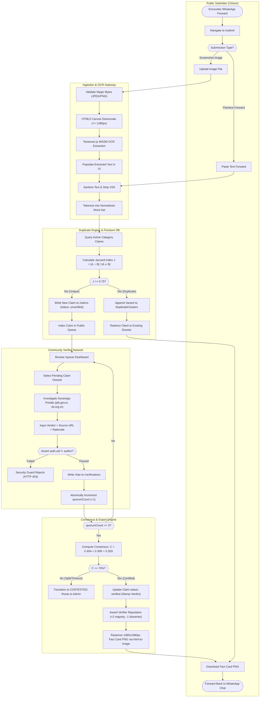
```mermaid
flowchart TD
    subgraph Swim_Submitter ["Public Submitter (Citizen)"]
        A1(["Encounter WhatsApp Forward"]) --> A2["Navigate to /submit"]
        A2 --> A3{{"Submission Type?"}}
        A3 -->|"Screenshot Image"| A4["Upload Image File"]
        A3 -->|"Plaintext Forward"| A5["Paste Text Forward"]
        A12["Download Fact Card PNG"] --> A13(["Forward Back to WhatsApp Chat"])
    end

    subgraph Swim_Ingestion ["Ingestion & OCR Gateway"]
        A4 --> B1["Validate Magic Bytes (JPEG/PNG)"]
        B1 --> B2["HTML5 Canvas Downscale (<= 1280px)"]
        B2 --> B3["Tesseract.js WASM OCR Extraction"]
        B3 --> B4["Populate Extracted Text in UI"]
        A5 --> B5["Sanitize Text & Strip XSS"]
        B4 --> B5
        B5 --> B6["Tokenize into Normalized Word Set"]
    end

    subgraph Swim_Duplicate ["Duplicate Engine & Firestore DB"]
        B6 --> C1["Query Active Category Claims"]
        C1 --> C2["Calculate Jaccard Index J = |A ∩ B| / |A ∪ B|"]
        C2 --> C3{{"J >= 0.75?"}}
        C3 -->|"Yes (Duplicate)"| C4["Append Variant to /duplicateClusters"]
        C4 --> C5["Redirect Client to Existing Dossier"]
        C3 -->|"No (Unique)"| C6["Write New Claim to /claims (status: unverified)"]
        C6 --> C7["Index Claim in Public Queue"]
    end

    subgraph Swim_Verifier ["Community Verifier Network"]
        C7 --> D1["Browse /queue Dashboard"]
        D1 --> D2["Select Pending Claim Dossier"]
        D2 --> D3["Investigate Sovereign Portals (pib.gov.in, rbi.org.in)"]
        D3 --> D4["Input Verdict + Source URL + Rationale"]
        D4 --> D5{{"Assert auth.uid != author?"}}
        D5 -->|"Failed"| D6["Security Guard Rejects (HTTP 403)"]
        D5 -->|"Passed"| D7["Write Vote to /verifications"]
        D7 --> D8["Atomically Increment quorumCount (+1)"]
    end

    subgraph Swim_Consensus ["Consensus & Export Engine"]
        D8 --> E1{{"quorumCount >= 3?"}}
        E1 -->|"No"| D1
        E1 -->|"Yes"| E2["Compute Consensus: C = 0.40A + 0.30R + 0.30S"]
        E2 --> E3{{"C >= 70%?"}}
        E3 -->|"No (Split/Timeout)"| E4["Transition to CONTESTED; Route to Admin"]
        E3 -->|"Yes (Certified)"| E5["Update Claim status: verified (Stamp Verdict)"]
        E5 --> E6["Award Verifier Reputation (+2 majority, -1 dissenter)"]
        E6 --> E7["Rasterize 1080x1080px Fact Card PNG via html-to-image"]
        E7 --> A12
    end

    C5 --> A12
```

### 3. PlantUML Activity Diagram Source (`activity_diagram.puml`):
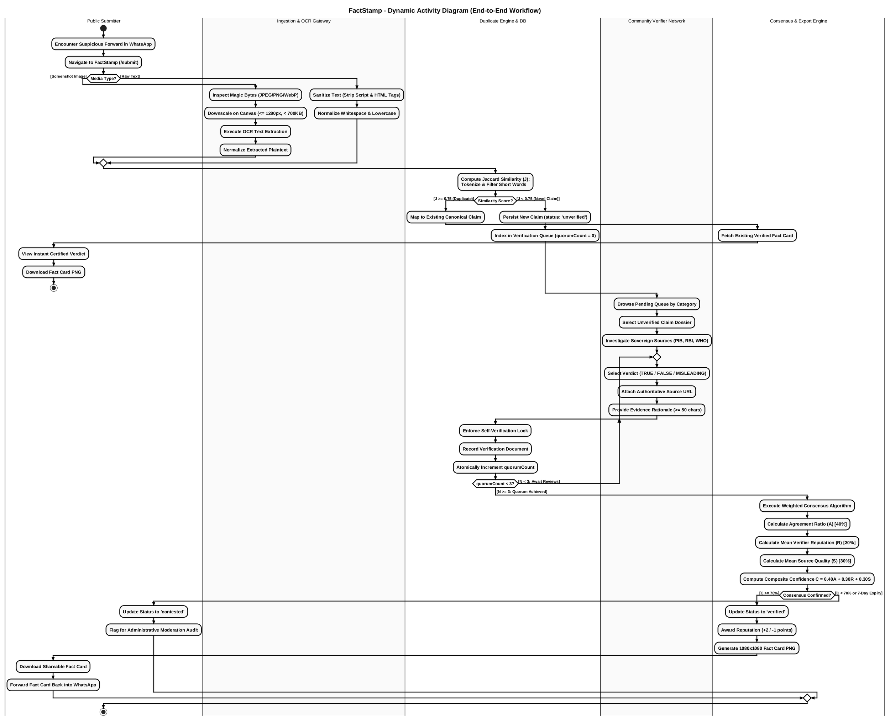
```puml
@startuml
skinparam style strictuml
skinparam monochrome true
skinparam defaultFontName "Liberation Sans"
skinparam defaultFontSize 14
skinparam defaultFontStyle bold
skinparam titleFontSize 20
skinparam titleFontStyle bold

skinparam backgroundColor white
skinparam ArrowColor black
skinparam ArrowThickness 2.5
skinparam ArrowFontSize 12
skinparam ArrowFontStyle bold

skinparam ActivityBorderColor black
skinparam ActivityBorderThickness 2.5
skinparam ActivityBackgroundColor #F8F9FA
skinparam ActivityFontSize 14
skinparam ActivityFontStyle bold

skinparam ActivityDiamondBorderColor black
skinparam ActivityDiamondBorderThickness 2.5
skinparam ActivityDiamondBackgroundColor #FFFFFF
skinparam ActivityDiamondFontSize 13
skinparam ActivityDiamondFontStyle bold

title FactStamp - Dynamic Activity Diagram (End-to-End Workflow)

|#White|Public Submitter|
|#FAFAFA|Ingestion & OCR Gateway|
|#White|Duplicate Engine & DB|
|#FAFAFA|Community Verifier Network|
|#White|Consensus & Export Engine|

|Public Submitter|
start
:Encounter Suspicious Forward in WhatsApp;
:Navigate to FactStamp (/submit);

if (Media Type?) then ([Screenshot Image])
  |Ingestion & OCR Gateway|
  :Inspect Magic Bytes (JPEG/PNG/WebP);
  :Downscale on Canvas (<= 1280px, < 700KB);
  :Execute OCR Text Extraction;
  :Normalize Extracted Plaintext;
else ([Raw Text])
  |Ingestion & OCR Gateway|
  :Sanitize Text (Strip Script & HTML Tags);
  :Normalize Whitespace & Lowercase;
endif

|Duplicate Engine & DB|
:Compute Jaccard Similarity (J);\nTokenize & Filter Short Words;

if (Similarity Score?) then ([J >= 0.75 (Duplicate)])
  :Map to Existing Canonical Claim;
  |Consensus & Export Engine|
  :Fetch Existing Verified Fact Card;
  |Public Submitter|
  :View Instant Certified Verdict;
  :Download Fact Card PNG;
  stop
else ([J < 0.75 (Novel Claim)])
  |Duplicate Engine & DB|
  :Persist New Claim (status: 'unverified');
  :Index in Verification Queue (quorumCount = 0);
endif

|Community Verifier Network|
:Browse Pending Queue by Category;
:Select Unverified Claim Dossier;
:Investigate Sovereign Sources (PIB, RBI, WHO);

repeat
  :Select Verdict (TRUE / FALSE / MISLEADING);
  :Attach Authoritative Source URL;
  :Provide Evidence Rationale (>= 50 chars);

  |Duplicate Engine & DB|
  :Enforce Self-Verification Lock;
  :Record Verification Document;
  :Atomically Increment quorumCount;
repeat while (quorumCount < 3?) is ([N < 3: Await Reviews])
->[N >= 3: Quorum Achieved];

|Consensus & Export Engine|
:Execute Weighted Consensus Algorithm;
:Calculate Agreement Ratio (A) [40%];
:Calculate Mean Verifier Reputation (R) [30%];
:Calculate Mean Source Quality (S) [30%];
:Compute Composite Confidence C = 0.40A + 0.30R + 0.30S;

if (Consensus Confirmed?) then ([C >= 70%])
  :Update Status to 'verified';
  :Award Reputation (+2 / -1 points);
  :Generate 1080x1080 Fact Card PNG;
  |Public Submitter|
  :Download Shareable Fact Card;
  :Forward Fact Card Back into WhatsApp;
else ([C < 70% or 7-Day Expiry])
  :Update Status to 'contested';
  :Flag for Administrative Moderation Audit;
endif

stop
@enduml
```

### 4. Step-by-Step Control Flow and Decision Branches
1. **Encounter & Navigation:** A user encounters a viral forward or screenshot in WhatsApp and navigates to `/submit`.
2. **Media Format Branching:**
   - *Screenshot Pathway:* Upload triggers binary magic byte verification (`0xFFD8FF` for JPEG, `0x89504E47` for PNG). The image is downscaled to $\le 1280$px on an offscreen HTML5 canvas, compressed under 700 KB via dynamic quality stepping, and passed to the WebAssembly OCR worker to extract embedded text.
   - *Plaintext Pathway:* Raw text is filtered through regex sanitizers to eliminate script injection and control characters, followed by lowercase whitespace normalization.
3. **Similarity Evaluation Branching:**
   - The tokenized text set $A$ is compared against all existing category claims $B_k$ using the Jaccard similarity metric: $J(A, B_k) = \frac{|A \cap B_k|}{|A \cup B_k|}$.
   - *Branch A ($J \ge 0.75$):* The forward is identified as a duplicate cluster instance. The user is immediately redirected to the canonical claim dossier and delivered the existing certified Fact Card. Execution terminates.
   - *Branch B ($J < 0.75$):* The submission is classified as a novel claim, persisted to Firestore with status `unverified` and initial quorum count $0$, and enqueued in `/queue`.
4. **Concurrent Peer Review Loop:**
   - Authenticated verifiers inspect the claim dossier and research authoritative sovereign sources (`pib.gov.in`, `rbi.org.in`, `who.int`).
   - Verifiers select a verdict, attach a primary URL, and submit a justification rationale ($\ge 50$ characters).
   - System validates security assertions (Anti-Self-Verification rule: `claim.submittedBy != auth.uid`; Single-Vote-Per-Claim rule).
   - The system records the vote document and atomically increments `claim.quorumCount`.
   - The review loop repeats until `quorumCount >= 3`.
5. **Consensus Evaluation & Dissemination:**
   - Once $N \ge 3$, the engine triggers the tri-partite weighted consensus algorithm: $C = \text{round}(0.40 A + 0.30 R + 0.30 S)$.
   - *Consensus Confirmed ($C \ge 70\%$):* Claim transitions to `verified` with certified verdict $V_{\text{maj}}$. Participating verifiers receive $+2$ reputation points; dissenters receive $-1$ point. The system rasterizes a $1080 \times 1080$px Fact Card PNG. The user downloads and shares it back to WhatsApp.
   - *Low Confidence / Timeout ($C < 70\%$ or 7-day expiration):* Claim transitions to `contested` and is routed to the administrative audit queue.

---

## 3.6.9 UML State Machine Diagram: Claim Lifecycle & Transitions

The UML State Machine Diagram models the discrete states, transition triggers, guard conditions, and invariant rules governing claim lifecycles and verifier civic trust scores.

### 1. Visual Claim State Machine Diagram (Mermaid):
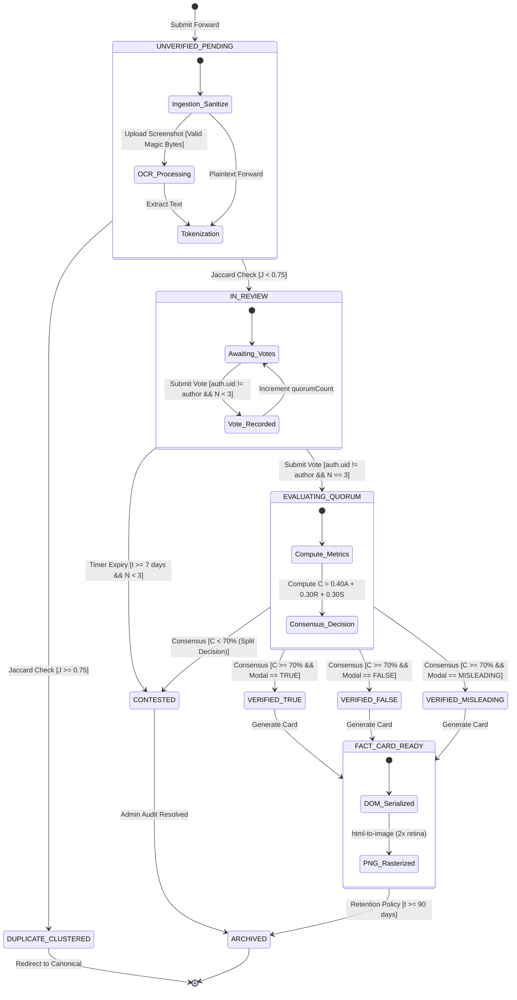
```mermaid
stateDiagram-v2
    [*] --> UNVERIFIED_PENDING : Submit Forward

    state UNVERIFIED_PENDING {
        [*] --> Ingestion_Sanitize
        Ingestion_Sanitize --> OCR_Processing : Upload Screenshot [Valid Magic Bytes]
        OCR_Processing --> Tokenization : Extract Text
        Ingestion_Sanitize --> Tokenization : Plaintext Forward
    }

    UNVERIFIED_PENDING --> DUPLICATE_CLUSTERED : Jaccard Check [J >= 0.75]
    DUPLICATE_CLUSTERED --> [*] : Redirect to Canonical

    UNVERIFIED_PENDING --> IN_REVIEW : Jaccard Check [J < 0.75]

    state IN_REVIEW {
        [*] --> Awaiting_Votes
        Awaiting_Votes --> Vote_Recorded : Submit Vote [auth.uid != author && N < 3]
        Vote_Recorded --> Awaiting_Votes : Increment quorumCount
    }

    IN_REVIEW --> EVALUATING_QUORUM : Submit Vote [auth.uid != author && N == 3]
    IN_REVIEW --> CONTESTED : Timer Expiry [t >= 7 days && N < 3]

    state EVALUATING_QUORUM {
        [*] --> Compute_Metrics
        Compute_Metrics --> Consensus_Decision : Compute C = 0.40A + 0.30R + 0.30S
    }

    EVALUATING_QUORUM --> VERIFIED_TRUE : Consensus [C >= 70% && Modal == TRUE]
    EVALUATING_QUORUM --> VERIFIED_FALSE : Consensus [C >= 70% && Modal == FALSE]
    EVALUATING_QUORUM --> VERIFIED_MISLEADING : Consensus [C >= 70% && Modal == MISLEADING]
    EVALUATING_QUORUM --> CONTESTED : Consensus [C < 70% (Split Decision)]

    VERIFIED_TRUE --> FACT_CARD_READY : Generate Card
    VERIFIED_FALSE --> FACT_CARD_READY : Generate Card
    VERIFIED_MISLEADING --> FACT_CARD_READY : Generate Card

    state FACT_CARD_READY {
        [*] --> DOM_Serialized
        DOM_Serialized --> PNG_Rasterized : html-to-image (2x retina)
    }

    FACT_CARD_READY --> ARCHIVED : Retention Policy [t >= 90 days]
    CONTESTED --> ARCHIVED : Admin Audit Resolved
    ARCHIVED --> [*]
```

### 2. PlantUML State Diagram Source (`state_diagram.puml`):
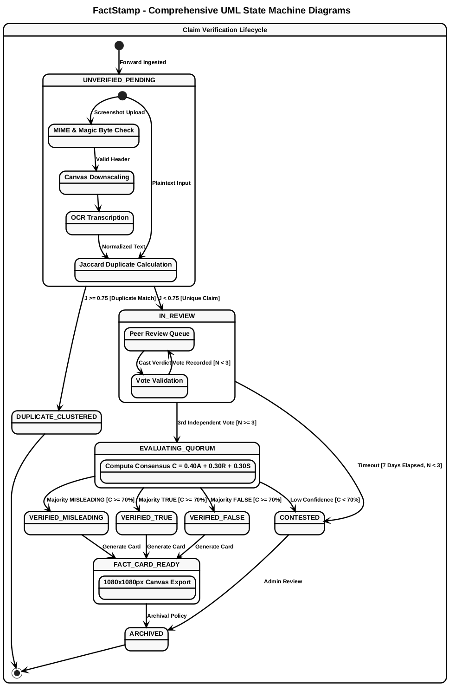
```puml
@startuml
skinparam style strictuml
skinparam monochrome true
skinparam defaultFontName "Liberation Sans"
skinparam defaultFontSize 14
skinparam defaultFontStyle bold
skinparam titleFontSize 20
skinparam titleFontStyle bold

skinparam backgroundColor white
skinparam ArrowColor black
skinparam ArrowThickness 2.5
skinparam ArrowFontSize 12
skinparam ArrowFontStyle bold

skinparam StateBorderColor black
skinparam StateBorderThickness 2.5
skinparam StateBackgroundColor #F8F9FA
skinparam StateFontSize 14
skinparam StateFontStyle bold

title FactStamp - Comprehensive UML State Machine Diagrams

state "Claim Verification Lifecycle" as ClaimLifecycle {
  [*] --> UNVERIFIED_PENDING : Forward Ingested

  state UNVERIFIED_PENDING {
    state "MIME & Magic Byte Check" as FileValidation
    state "Canvas Downscaling" as CanvasScale
    state "OCR Transcription" as OCRPass
    state "Jaccard Duplicate Calculation" as JaccardCalc

    [*] --> FileValidation : Screenshot Upload
    [*] --> JaccardCalc : Plaintext Input
    FileValidation --> CanvasScale : Valid Header
    CanvasScale --> OCRPass
    OCRPass --> JaccardCalc : Normalized Text
  }

  UNVERIFIED_PENDING --> DUPLICATE_CLUSTERED : J >= 0.75 [Duplicate Match]
  UNVERIFIED_PENDING --> IN_REVIEW : J < 0.75 [Unique Claim]

  state IN_REVIEW {
    state "Peer Review Queue" as Queue
    state "Vote Validation" as VoteCheck
    Queue --> VoteCheck : Cast Verdict
    VoteCheck --> Queue : Vote Recorded [N < 3]
  }

  IN_REVIEW --> EVALUATING_QUORUM : 3rd Independent Vote [N >= 3]
  IN_REVIEW --> CONTESTED : Timeout [7 Days Elapsed, N < 3]

  state EVALUATING_QUORUM {
    state "Compute Consensus C = 0.40A + 0.30R + 0.30S" as CalcConfidence
  }

  EVALUATING_QUORUM --> VERIFIED_TRUE : Majority TRUE [C >= 70%]
  EVALUATING_QUORUM --> VERIFIED_FALSE : Majority FALSE [C >= 70%]
  EVALUATING_QUORUM --> VERIFIED_MISLEADING : Majority MISLEADING [C >= 70%]
  EVALUATING_QUORUM --> CONTESTED : Low Confidence [C < 70%]

  state FACT_CARD_READY {
    state "1080x1080px Canvas Export" as ExportCard
  }

  VERIFIED_TRUE --> FACT_CARD_READY : Generate Card
  VERIFIED_FALSE --> FACT_CARD_READY : Generate Card
  VERIFIED_MISLEADING --> FACT_CARD_READY : Generate Card

  FACT_CARD_READY --> ARCHIVED : Archival Policy
  CONTESTED --> ARCHIVED : Admin Review
  DUPLICATE_CLUSTERED --> [*]
  ARCHIVED --> [*]
}
@enduml
```

### 3. Exhaustive State Transition Matrix:
| Source State | Event / Trigger | Guard Condition | Target State | Action / Execution Routine |
| :--- | :--- | :--- | :--- | :--- |
| `[*]` | Submit Forward | Input valid ($20 \le L \le 2000$) | `UNVERIFIED_PENDING` | Initialize claim record; assign unique tracking ID. |
| `UNVERIFIED_PENDING`| Upload Screenshot | Header is JPEG/PNG magic bytes | `UNVERIFIED_PENDING (OCR)` | Canvas downscaling; extract OCR text transcription via WebAssembly. |
| `UNVERIFIED_PENDING`| Jaccard Check | $J \ge 0.75$ | `DUPLICATE_CLUSTERED` | Append variant to `/duplicateClusters`; redirect client to canonical claim. |
| `UNVERIFIED_PENDING`| Jaccard Check | $J < 0.75$ | `IN_REVIEW` | Write claim to Firestore `/claims`; index in public review queue. |
| `IN_REVIEW` | Submit Vote | $N < 3$ and `auth.uid != author` | `IN_REVIEW` | Append verification document; atomically increment `quorumCount`. |
| `IN_REVIEW` | Submit Vote | $N == 3$ and `auth.uid != author`| `EVALUATING_QUORUM` | Lock queue entry; trigger weighted consensus engine. |
| `IN_REVIEW` | Timer Expiry | $t \ge t_{\text{created}} + 7\text{d}, N < 3$ | `CONTESTED` | Mark claim as contested; flag for administrative moderation. |
| `EVALUATING_QUORUM` | Consensus Calc | $C \ge 70\%$ and Majority TRUE | `VERIFIED_TRUE` | Stamp certified TRUE verdict; award verifier reputation ($+2$). |
| `EVALUATING_QUORUM` | Consensus Calc | $C \ge 70\%$ and Majority FALSE | `VERIFIED_FALSE` | Stamp certified FALSE verdict; award verifier reputation ($+2$). |
| `EVALUATING_QUORUM` | Consensus Calc | $C \ge 70\%$ and Majority MISLEADING | `VERIFIED_MISLEADING` | Stamp certified MISLEADING verdict; award verifier reputation ($+2$). |
| `EVALUATING_QUORUM` | Consensus Calc | $C < 70\%$ (Split Decision) | `CONTESTED` | Tag claim as contested; route to admin audit queue. |
| `VERIFIED_*` | Generate Card | Status == verified | `FACT_CARD_READY` | `html-to-image` canvas serialization ($1080 \times 1080$px PNG). |
| `FACT_CARD_READY` | Retention Policy | $t \ge t_{\text{verified}} + 90\text{d}$ | `ARCHIVED` | Compress storage footprint; retain telemetry metrics. |

### 4. State Invariants & Terminal Conditions
1. **In-Review Invariant:** While in `IN_REVIEW`, no claim may have `quorumCount >= 3` without immediately transitioning to `EVALUATING_QUORUM`.
2. **Anti-Self-Verification Invariant:** The transition `IN_REVIEW -> IN_REVIEW` is guarded by `auth.uid != claim.submittedBy`.
3. **Immutability Invariant:** Once a claim enters any of the `VERIFIED_*` terminal states, past verifications and certified verdicts become cryptographically immutable via Firestore security rules.

### 5. Verifier Civic Reputation State Machine
In addition to the Claim lifecycle, FactStamp models the operational standing of human verifiers using a secondary state machine driven by historical consensus accuracy:

| Reputation Tier | Score Range | Voting Weight | Privileges & Operational Capabilities |
| :--- | :---: | :---: | :--- |
| **Novice Verifier** | $R = 50$ | 1.00x Base | Initial baseline assigned to new accounts. Can review claims in public queue. |
| **Established Verifier** | $51 \le R \le 80$ | 1.10x – 1.60x | Earned by consistent consensus alignment. Eligible for priority queue review. |
| **Trusted Senior Verifier** | $R > 80$ | 1.70x – 2.00x | High-accuracy track record. Highest mathematical consensus influence. |
| **Probationary Review** | $30 \le R < 50$ | 0.60x – 0.90x | Penalized for frequent dissenting or unsubstantiated votes. Voting influence attenuated. |
| **Flagged / Suspended** | $R < 30$ / Sybil | 0.00x (Revoked) | Flagged by anti-Sybil heuristics. Voting privileges blocked; flagged for admin review. |

#### Mathematical Reputation Dynamics:
Reputation scores update reactively upon quorum consensus finalization:
- **Consensus Alignment:** Contributing verifiers who voted with the majority verdict receive $+2$ reputation points:
  $$R_{t+1} = \min(100, R_t + 2)$$
- **Consensus Dissent:** Contributing verifiers who voted against the certified majority verdict receive $-1$ reputation point (or $-3$ for extreme outliers):
  $$R_{t+1} = \max(0, R_t - 1)$$
- **Strict Bounding:** The score is mathematically constrained to the interval $[0, 100]$.

---

## 3.6.10 UML Sequence Diagrams: Chronological Message Traces & Concurrency

UML Sequence Diagrams model the exact chronological exchange of messages between executing system components over time. FactStamp specifies two primary interaction sequences:
1. **Sequence 1: Claim Ingestion & Duplicate Resolution:** Traces user submission, file validation, OCR extraction, Jaccard similarity evaluation, and duplicate redirection.
2. **Sequence 2: Quorum Peer Review & Weighted Consensus Finalization:** Traces verifier authentication, self-verification locks, transactional vote persistence, quorum evaluation, confidence scoring, and fact card generation.

### 1. Sequence 1: Claim Ingestion & Duplicate Resolution

#### Architectural Participants:
1. `Submitter`: Public Submitter (Citizen).
2. `ClientUI`: Browser Client (Next.js / React UI).
3. `IngestAPI`: Ingestion Serverless API Gateway.
4. `OCREngine`: Tesseract.js Web Worker OCR.
5. `DedupEngine`: Jaccard Set-Similarity Engine.
6. `Firestore`: Cloud Firestore NoSQL Database.

#### Visual Sequence 1 Diagram (Mermaid):
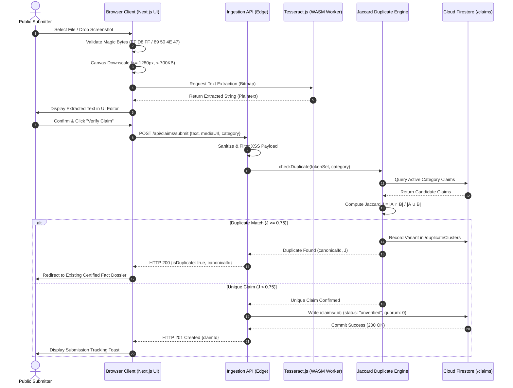
```mermaid
sequenceDiagram
    autonumber
    actor Sub as Public Submitter
    participant UI as Browser Client (Next.js UI)
    participant API as Ingestion API (Edge)
    participant OCR as Tesseract.js (WASM Worker)
    participant Dedup as Jaccard Duplicate Engine
    participant DB as Cloud Firestore (/claims)

    Sub->>UI: Select File / Drop Screenshot
    UI->>UI: Validate Magic Bytes (FF D8 FF / 89 50 4E 47)
    UI->>UI: Canvas Downscale (<= 1280px, < 700KB)
    UI->>OCR: Request Text Extraction (Bitmap)
    OCR-->>UI: Return Extracted String (Plaintext)
    UI->>Sub: Display Extracted Text in UI Editor
    Sub->>UI: Confirm & Click "Verify Claim"
    UI->>API: POST /api/claims/submit {text, mediaUrl, category}
    API->>API: Sanitize & Filter XSS Payload
    API->>Dedup: checkDuplicate(tokenSet, category)
    Dedup->>DB: Query Active Category Claims
    DB-->>Dedup: Return Candidate Claims
    Dedup->>Dedup: Compute Jaccard J = |A ∩ B| / |A ∪ B|

    alt Duplicate Match (J >= 0.75)
        Dedup->>DB: Record Variant in /duplicateClusters
        Dedup-->>API: Duplicate Found (canonicalId, J)
        API-->>UI: HTTP 200 {isDuplicate: true, canonicalId}
        UI->>Sub: Redirect to Existing Certified Fact Dossier
    else Unique Claim (J < 0.75)
        Dedup-->>API: Unique Claim Confirmed
        API->>DB: Write /claims/{id} (status: "unverified", quorum: 0)
        DB-->>API: Commit Success (200 OK)
        API-->>UI: HTTP 201 Created {claimId}
        UI->>Sub: Display Submission Tracking Toast
    end
```

#### PlantUML Sequence 1 Source (`sequence_diagram_submission.puml`):
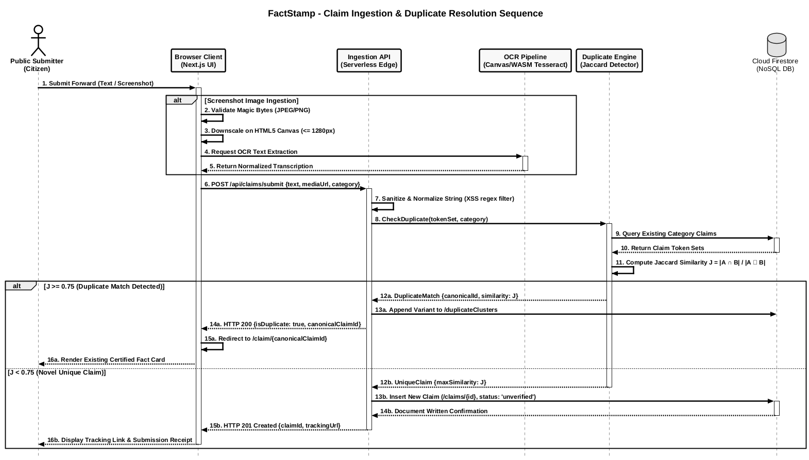
```puml
@startuml
skinparam style strictuml
skinparam monochrome true
skinparam defaultFontName "Liberation Sans"
skinparam defaultFontSize 13
skinparam defaultFontStyle bold
skinparam titleFontSize 18
skinparam titleFontStyle bold

skinparam backgroundColor white
skinparam ArrowColor black
skinparam ArrowThickness 2.5
skinparam ArrowFontSize 12
skinparam ArrowFontStyle bold

skinparam ParticipantBorderColor black
skinparam ParticipantBorderThickness 2.5
skinparam ParticipantBackgroundColor #F8F9FA
skinparam ParticipantFontSize 13
skinparam ParticipantFontStyle bold

skinparam ActorBorderColor black
skinparam ActorBorderThickness 2.5
skinparam ActorBackgroundColor #FFFFFF
skinparam ActorFontSize 13
skinparam ActorFontStyle bold

skinparam BoxBorderColor black
skinparam BoxBorderThickness 2.0

title FactStamp - Claim Ingestion & Duplicate Resolution Sequence

actor "Public Submitter\n(Citizen)" as User
participant "Browser Client\n(Next.js UI)" as Client
participant "Ingestion API\n(Serverless Edge)" as API
participant "OCR Pipeline\n(Canvas/WASM Tesseract)" as OCR
participant "Duplicate Engine\n(Jaccard Detector)" as Dedup
database "Cloud Firestore\n(NoSQL DB)" as DB

User -> Client : 1. Submit Forward (Text / Screenshot)
activate Client

alt Screenshot Image Ingestion
  Client -> Client : 2. Validate Magic Bytes (JPEG/PNG)
  Client -> Client : 3. Downscale on HTML5 Canvas (<= 1280px)
  Client -> OCR : 4. Request OCR Text Extraction
  activate OCR
  OCR --> Client : 5. Return Normalized Transcription
  deactivate OCR
end

Client -> API : 6. POST /api/claims/submit {text, mediaUrl, category}
activate API
API -> API : 7. Sanitize & Normalize String (XSS regex filter)

API -> Dedup : 8. CheckDuplicate(tokenSet, category)
activate Dedup
Dedup -> DB : 9. Query Existing Category Claims
activate DB
DB --> Dedup : 10. Return Claim Token Sets
deactivate DB

Dedup -> Dedup : 11. Compute Jaccard Similarity J = |A ∩ B| / |A ∪ B|

alt J >= 0.75 (Duplicate Match Detected)
  Dedup --> API : 12a. DuplicateMatch {canonicalId, similarity: J}
  API -> DB : 13a. Append Variant to /duplicateClusters
  API --> Client : 14a. HTTP 200 {isDuplicate: true, canonicalClaimId}
  Client -> Client : 15a. Redirect to /claim/{canonicalClaimId}
  Client --> User : 16a. Render Existing Certified Fact Card
else J < 0.75 (Novel Unique Claim)
  Dedup --> API : 12b. UniqueClaim {maxSimilarity: J}
  deactivate Dedup
  API -> DB : 13b. Insert New Claim (/claims/{id}, status: 'unverified')
  activate DB
  DB --> API : 14b. Document Written Confirmation
  deactivate DB
  API --> Client : 15b. HTTP 201 Created {claimId, trackingUrl}
  deactivate API
  Client --> User : 16b. Display Tracking Link & Submission Receipt
  deactivate Client
end

@enduml
```

#### Detailed Chronological Message Trace (Ingestion):
| Step | Sender Lifeline | Receiver Lifeline | Message Signature & Execution Description |
| :--- | :--- | :--- | :--- |
| **1** | Public Submitter | Browser Client | Submit Forward (text string or screenshot File object). |
| **2** | Browser Client | Browser Client | Validate Magic Bytes: Slices first 4 bytes to confirm genuine JPEG (`FF D8 FF`) or PNG (`89 50 4E 47`). |
| **3** | Browser Client | Browser Client | Downscale Canvas: Resizes image to $\le 1280$px; applies quality stepping until $< 700$ KB. |
| **4–5**| Browser Client | OCR Pipeline | Request OCR extraction; engine returns machine-readable normalized text transcription. |
| **6** | Browser Client | Ingestion API | `POST /api/claims/submit {text, mediaUrl, category}`. Transmitted over TLS 1.3. |
| **7** | Ingestion API | Ingestion API | Sanitize & Normalize: Strips HTML tags, script tokens, and collapses whitespace. |
| **8–10**| Ingestion API | Duplicate Engine | `CheckDuplicate(tokens, category)`; queries active and resolved claims in Firestore. |
| **11** | Duplicate Engine | Duplicate Engine | Computes Jaccard Similarity $J = \frac{|A \cap B|}{|A \cup B|}$ against all category candidates. |
| **12a–16a**| Duplicate Engine | Browser Client | Duplicate Match ($J \ge 0.75$): Logs variant to `/duplicateClusters`; redirects client to canonical Fact Card. |
| **12b–16b**| Duplicate Engine | Browser Client | Unique Claim ($J < 0.75$): Writes new claim to `/claims`; returns HTTP 201 with shareable tracking ID. |

---

### 2. Sequence 2: Quorum Peer Review & Weighted Consensus Finalization

#### Architectural Participants:
1. `Verifier`: Authenticated Community Verifier.
2. `Dashboard`: `/queue` Web Dashboard.
3. `AuthGuard`: Firebase Auth (RS256 JWT).
4. `VerifyAPI`: Serverless Verification Route.
5. `Consensus`: Weighted Scoring Worker.
6. `Firestore`: Cloud Firestore NoSQL Database.
7. `FactCard`: `html-to-image` Graphics Exporter.

#### Visual Sequence 2 Diagram (Mermaid):
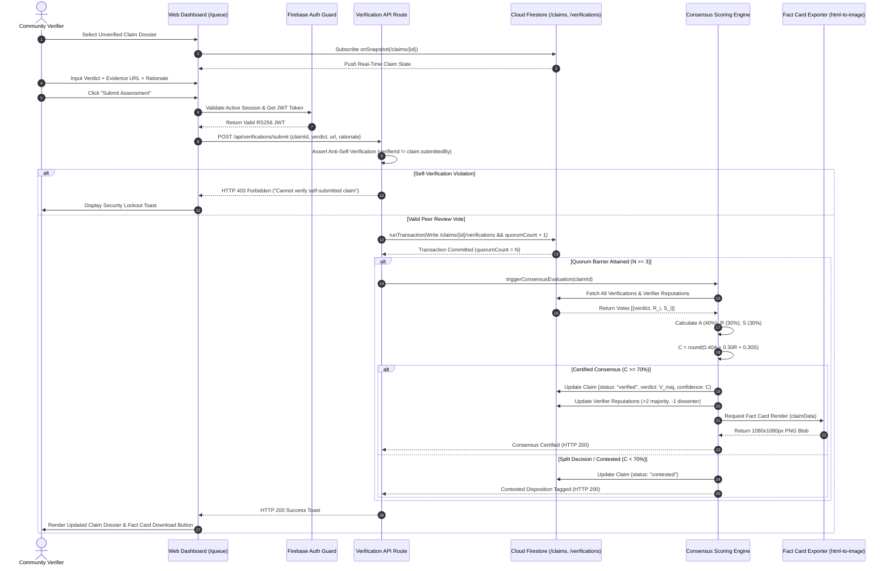
```mermaid
sequenceDiagram
    autonumber
    actor Ver as Community Verifier
    participant UI as Web Dashboard (/queue)
    participant Auth as Firebase Auth Guard
    participant API as Verification API Route
    participant DB as Cloud Firestore (/claims, /verifications)
    participant Engine as Consensus Scoring Engine
    participant Card as Fact Card Exporter (html-to-image)

    Ver->>UI: Select Unverified Claim Dossier
    UI->>DB: Subscribe onSnapshot(/claims/{id})
    DB-->>UI: Push Real-Time Claim State
    Ver->>UI: Input Verdict + Evidence URL + Rationale
    Ver->>UI: Click "Submit Assessment"
    UI->>Auth: Validate Active Session & Get JWT Token
    Auth-->>UI: Return Valid RS256 JWT
    UI->>API: POST /api/verifications/submit {claimId, verdict, url, rationale}
    API->>API: Assert Anti-Self-Verification (verifierId != claim.submittedBy)

    alt Self-Verification Violation
        API-->>UI: HTTP 403 Forbidden ("Cannot verify self-submitted claim")
        UI->>Ver: Display Security Lockout Toast
    else Valid Peer Review Vote
        API->>DB: runTransaction(Write /claims/{id}/verifications && quorumCount + 1)
        DB-->>API: Transaction Committed (quorumCount = N)

        alt Quorum Barrier Attained (N >= 3)
            API->>Engine: triggerConsensusEvaluation(claimId)
            Engine->>DB: Fetch All Verifications & Verifier Reputations
            DB-->>Engine: Return Votes [{verdict, R_i, S_i}]
            Engine->>Engine: Calculate A (40%), R (30%), S (30%)
            Engine->>Engine: C = round(0.40A + 0.30R + 0.30S)

            alt Certified Consensus (C >= 70%)
                Engine->>DB: Update Claim {status: "verified", verdict: V_maj, confidence: C}
                Engine->>DB: Update Verifier Reputations (+2 majority, -1 dissenter)
                Engine->>Card: Request Fact Card Render (claimData)
                Card-->>Engine: Return 1080x1080px PNG Blob
                Engine-->>API: Consensus Certified (HTTP 200)
            else Split Decision / Contested (C < 70%)
                Engine->>DB: Update Claim {status: "contested"}
                Engine-->>API: Contested Disposition Tagged (HTTP 200)
            end
        end

        API-->>UI: HTTP 200 Success Toast
        UI->>Ver: Render Updated Claim Dossier & Fact Card Download Button
    end
```

#### PlantUML Sequence 2 Source (`sequence_diagram_consensus.puml`):
```puml
@startuml
skinparam style strictuml
skinparam monochrome true
skinparam defaultFontName "Liberation Sans"
skinparam defaultFontSize 13
skinparam defaultFontStyle bold
skinparam titleFontSize 18
skinparam titleFontStyle bold

skinparam backgroundColor white
skinparam ArrowColor black
skinparam ArrowThickness 2.5
skinparam ArrowFontSize 12
skinparam ArrowFontStyle bold

skinparam ParticipantBorderColor black
skinparam ParticipantBorderThickness 2.5
skinparam ParticipantBackgroundColor #F8F9FA
skinparam ParticipantFontSize 13
skinparam ParticipantFontStyle bold

skinparam ActorBorderColor black
skinparam ActorBorderThickness 2.5
skinparam ActorBackgroundColor #FFFFFF
skinparam ActorFontSize 13
skinparam ActorFontStyle bold

title FactStamp - Verification & Weighted Quorum Consensus Sequence

actor "Community Verifier\n(Reviewer)" as Verifier
participant "Web Dashboard\n(/queue UI)" as UI
participant "Auth Guard\n(Firebase Auth)" as Auth
participant "Verification API\n(Next.js Route)" as API
participant "Consensus Engine\n(Scoring Worker)" as Consensus
database "Cloud Firestore\n(NoSQL DB)" as DB
participant "Fact Card Generator\n(html-to-image)" as CardGen

Verifier -> UI : 1. Select Unverified Claim from Queue
activate UI
UI -> DB : 2. Subscribe to Claim Document Listener
activate DB
DB --> UI : 3. Realtime Claim Snapshot (quorumCount = N)
deactivate DB

Verifier -> UI : 4. Submit Verdict + Citation URL + Rationale
UI -> Auth : 5. Request User Token (RS256 JWT)
activate Auth
Auth --> UI : 6. Return Verified Token {uid, email}
deactivate Auth

UI -> API : 7. POST /api/verifications/submit
activate API
API -> DB : 8. Read Claim Author & Existing Votes
activate DB
DB --> API : 9. Return claim.submittedBy & voteList
deactivate DB

alt Self-Verification Check
  API -> API : 10. Assert auth.uid != claim.submittedBy
  note right of API : Fails if user attempts to verify own claim (403)
end

API -> DB : 11. Transaction: Write Verification Doc & Increment quorumCount
activate DB
DB --> API : 12. Transaction Committed (New quorumCount = N)
deactivate DB

alt Quorum Threshold Reached (N >= 3)
  API -> Consensus : 13. TriggerConsensusEvaluation(claimId)
  activate Consensus
  Consensus -> DB : 14. Query All Verifications & Verifier Reputations
  activate DB
  DB --> Consensus : 15. Return Votes & Reputation Scores
  deactivate DB

  Consensus -> Consensus : 16. Determine Plurality Verdict V_maj
  Consensus -> Consensus : 17. Compute Agreement Ratio A = (N_maj / N) * 100
  Consensus -> Consensus : 18. Compute Mean Reputation R = (1/N) * sum(rep_i)
  Consensus -> Consensus : 19. Compute Mean Source Quality S = (1/N) * sum(score_i)
  Consensus -> Consensus : 20. Calculate Composite Confidence C = 0.40A + 0.30R + 0.30S

  alt Confidence Confirmed (C >= 70%)
    Consensus -> DB : 21a. Update Claim {status: 'verified', verdict: V_maj, confidence: C}
    Consensus -> DB : 22a. Update Reputations (+2 majority, -1 minority)
    Consensus -> CardGen : 23a. RenderFactCard(claimId, verdict, confidence)
    activate CardGen
    CardGen --> Consensus : 24a. Return 1080x1080px Fact Card Blob
    deactivate CardGen
  else Split Decision / Low Confidence (C < 70%)
    Consensus -> DB : 21b. Update Claim {status: 'contested', confidence: C}
  end
  deactivate Consensus
end

API --> UI : 25. HTTP 200 OK {status: 'success', quorumCount: N}
deactivate API
UI --> Verifier : 26. Display Confirmation Toast & Live Dossier
deactivate UI

@enduml
```

#### Detailed Chronological Message Trace (Consensus):
| Step | Sender Lifeline | Receiver Lifeline | Message Signature & Execution Description |
| :--- | :--- | :--- | :--- |
| **1–3** | Community Verifier | Cloud Firestore | Verifier selects unverified claim; UI subscribes to real-time Firestore listener. |
| **4–6** | Community Verifier | Auth Guard | Verifier submits verdict, citation URL, and rationale; client acquires validated JWT token. |
| **7–9** | Web Dashboard | Cloud Firestore | `POST /api/verifications/submit`; API verifies claim author and checks existing votes. |
| **10** | Verification API | Verification API | Anti-Self-Verification Lock: Asserts `verifierId != claim.submittedBy`. Rejects with 403 if violated. |
| **11–12**| Verification API | Cloud Firestore | Atomic Transaction: Writes `/claims/{id}/verifications/{vid}` and increments `quorumCount` by $+1$. |
| **13–15**| Verification API | Consensus Engine | Quorum Check ($N \ge 3$): Triggers consensus worker; fetches all votes and verifier reputation scores. |
| **16–20**| Consensus Engine | Consensus Engine | Calculates Agreement Ratio $A$ (40%), Mean Reputation $R$ (30%), and Source Credibility $S$ (30%). |
| **21a–24a**| Consensus Engine| Fact Card Gen | Confidence Confirmed ($C \ge 70\%$): Updates claim to 'verified', updates reputations, renders Fact Card. |
| **21b**| Consensus Engine | Cloud Firestore | Split Decision ($C < 70\%$): Updates claim status to 'contested' and routes to admin moderation queue. |
| **25–26**| Verification API | Community Verifier| Returns HTTP 200 OK; UI renders confirmation toast and reactive claim dossier updates. |

#### Concurrency Control & Race Condition Mitigation:
When two verifiers cast votes simultaneously:
- Firestore's `runTransaction()` executes with **Optimistic Concurrency Control (OCC)**.
- If `quorumCount` is updated concurrently by another thread, the lagging transaction automatically retries with the fresh snapshot.
- The consensus evaluation routine is guarded by an idempotency lock: once consensus begins, `claim.status` transitions from `unverified` to `evaluating`, preventing duplicate scoring runs.

---

## 3.6.11 UML Package Diagram: Modular Subsystem Architecture

Modern software engineering mandates a rigorous structural decomposition of source code into coherent, loosely coupled packages enforcing the **Acyclic Dependencies Principle (ADP)** and separation of concerns.

### 1. Subsystem Layering & Dependency Hierarchy
FactStamp enforces a five-tier unidirectional package hierarchy:
1. **Presentation Layer (`app/`, `components/`):** Houses React view components, client-side route controllers, touch ergonomics, and modal dialogs.
2. **Application Services Layer (`services/`):** Coordinates end-to-end business workflows, orchestrating between domain entities and cloud persistence adapters.
3. **Domain Core & Business Logic (`domain/`):** Encapsulates pure domain models, lexical set algorithms (Jaccard similarity), and mathematical consensus formulas.
4. **Security & Anti-Sybil Defense (`security/`):** Enforces JWT verification, rate limiting, anti-spam heuristics, and self-verification locks.
5. **Infrastructure & Persistence Layer (`infrastructure/`):** Houses concrete adapters for Google Cloud Firestore, Firebase Authentication, and client-side WebAssembly OCR (Tesseract.js), ensuring complete offline capability, zero cloud API fees, and absolute user data privacy.

### 2. Visual UML Package Diagram (Mermaid):
```mermaid
flowchart TD
    subgraph Presentation_Layer ["1. Presentation Layer (app/, components/)"]
        SubView["SubmissionView"]
        QueueView["QueueView"]
        FactModal["FactCardModal"]
        DashView["AnalyticsDashboardView"]
    end

    subgraph App_Services ["2. Application Services Layer (services/)"]
        IngestSvc["IngestionService"]
        DedupSvc["DeduplicationService"]
        QueueSvc["VerificationQueueService"]
        ConsensusSvc["ConsensusService"]
        ExportSvc["FactCardExportService"]
    end

    subgraph Domain_Core ["3. Domain Core Layer (domain/)"]
        ClaimAgg["ClaimAggregate"]
        VerifyModel["VerificationModel"]
        JaccardEngine["JaccardSimilarityEngine"]
        ScoringAlgo["WeightedConsensusScoring"]
    end

    subgraph Security_Defense ["4. Security & Governance Layer (security/)"]
        AuthGuard["AuthSessionGuard"]
        SelfLock["SelfVerificationLock"]
        SpamFilter["SpamDomainFilter"]
        AuditLog["AdminAuditLogger"]
    end

    subgraph Infrastructure_Layer ["5. Infrastructure & Persistence Layer (infrastructure/)"]
        FirestoreDAO["FirestoreDAOAdapter"]
        AuthAdapter["FirebaseAuthAdapter"]
        OCRAdapter["TesseractWasmAdapter"]
    end

    Presentation_Layer --> App_Services
    App_Services --> Domain_Core
    App_Services --> Security_Defense
    App_Services --> Infrastructure_Layer
    Domain_Core ..> Security_Defense : validates invariants
    Infrastructure_Layer ..> Domain_Core : maps entities
```

### 3. PlantUML Package Diagram Source (`package_diagram.puml`):
```puml
@startuml
skinparam style strictuml
skinparam monochrome true
skinparam defaultFontName "Liberation Sans"
skinparam defaultFontSize 14
skinparam defaultFontStyle bold
skinparam titleFontSize 20
skinparam titleFontStyle bold

skinparam backgroundColor white
skinparam ArrowColor black
skinparam ArrowThickness 2.5
skinparam ArrowFontSize 12
skinparam ArrowFontStyle bold

skinparam PackageBorderColor black
skinparam PackageBorderThickness 2.5
skinparam PackageBackgroundColor #F8F9FA
skinparam PackageFontSize 15
skinparam PackageFontStyle bold

skinparam ComponentBorderColor black
skinparam ComponentBorderThickness 2.0
skinparam ComponentBackgroundColor #FFFFFF
skinparam ComponentFontSize 13
skinparam ComponentFontStyle bold

title FactStamp - Subsystem Package Architecture Diagram

package "1. Presentation Layer (Web UI)" as PresentationPkg {
  component [SubmissionView\n(/submit)] as SubView
  component [VerificationQueueView\n(/queue)] as QueueView
  component [FactCardModal\n(Share & Export)] as CardModal
  component [AnalyticsDashboardView\n(/dashboard)] as DashView
}

package "2. Application Services Layer" as ServicePkg {
  component [IngestionService] as IngestSvc
  component [DuplicateDetectionService] as DedupSvc
  component [VerificationQueueService] as QueueSvc
  component [ConsensusScoringService] as ConsensusSvc
  component [CardExportService] as ExportSvc
}

package "3. Domain Core & Business Logic" as DomainPkg {
  component [ClaimAggregate] as ClaimModel
  component [VerificationEntity] as VerifyModel
  component [VerifierProfile] as VerifierModel
  component [JaccardSimilarityEngine] as JaccardEngine
  component [WeightedScoringAlgorithm] as ScoringAlgo
}

package "4. Security & Anti-Sybil Defense" as SecurityPkg {
  component [AuthenticationGuard\n(RS256 JWT)] as AuthGuard
  component [SelfVerificationLock] as SelfLock
  component [AntiSpamValidator] as SpamVal
  component [AdminAuditLogger] as AuditLog
}

package "5. Infrastructure & Persistence Layer" as InfraPkg {
  component [FirestoreDAO\n(NoSQL Operations)] as FirestoreDAO
  component [FirebaseAuthAdapter] as AuthAdapter
  component [OCRAdapter\n(WASM Tesseract.js)] as OCRAdapter
}

PresentationPkg ..> ServicePkg : <<invoke>>
ServicePkg ..> DomainPkg : <<execute>>
ServicePkg ..> SecurityPkg : <<enforce>>
ServicePkg ..> InfraPkg : <<persist>>
SecurityPkg ..> InfraPkg : <<verify rules>>

SubView -[hidden]down-> QueueView
QueueView -[hidden]down-> CardModal
IngestSvc -[hidden]down-> DedupSvc
DedupSvc -[hidden]down-> QueueSvc
ClaimModel -[hidden]down-> VerifyModel
VerifyModel -[hidden]down-> VerifierModel
FirestoreDAO -[hidden]down-> AuthAdapter
AuthAdapter -[hidden]down-> OCRAdapter
@enduml
```

### 4. Package Inventory & Responsibilities:
| Package Name | Contained Components | Layer Visibility | Primary Engineering Responsibility |
| :--- | :--- | :--- | :--- |
| **Presentation Layer** | `SubmissionView`, `QueueView`, `FactCardModal`, `DashView` | Public / Client | Renders responsive UI; captures user touch inputs; executes in-browser canvas downscaling. |
| **Application Services** | `IngestSvc`, `DedupSvc`, `QueueSvc`, `ConsensusSvc`, `ExportSvc` | Serverless API | Orchestrates transactional workflows; coordinates multi-step business logic. |
| **Domain Core** | `ClaimAggregate`, `VerifyModel`, `JaccardEngine`, `ScoringAlgo` | Domain Internal | Maintains business state invariants; executes mathematical formulas and set comparisons. |
| **Security Defense** | `AuthGuard`, `SelfLock`, `SpamValidator`, `AuditLogger` | Cross-Cutting | Validates RS256 JWT tokens; prevents self-verification and coordinated Sybil brigading. |
| **Infrastructure Layer** | `FirestoreDAO`, `FirebaseAuthAdapter`, `OCRAdapter` | External Boundary | Manages low-level gRPC/REST connections to Google Cloud and external endpoints. |

### 5. Architectural Coupling & Modularity Metrics:
- **Acyclic Dependencies Principle (ADP):** There are zero cyclic dependencies between packages. Dependencies flow strictly downwards: Presentation -> Application -> Domain / Infrastructure.
- **Stable Abstractions Principle (SAP):** Core domain packages (such as `ScoringAlgorithm` and `JaccardSimilarityEngine`) possess zero external framework dependencies, ensuring high testability with standard unit test runners.

---

## 3.6.12 UML Deployment Diagram: Physical Cloud Topologies

The Deployment Model maps software artifacts to executing hardware processing nodes, edge computing platforms, database clusters, and external third-party cloud APIs.

### 1. Physical Infrastructure Tiers
FactStamp is deployed across five physical hardware and cloud environments:
1. **Client Hardware Tier:** Heterogeneous mobile smartphones (Android/iOS) and desktop workstations running modern web browsers (Chrome 100+, Safari 15.4+). Executes client-side image downscaling and WebAssembly optical character recognition (Tesseract.js) directly in browser memory, enabling complete offline capability, zero cloud API fees, and absolute user data privacy.
2. **Edge CDN Infrastructure Tier:** Vercel's global Anycast Edge Network providing Anycast DNS, TLS 1.3 termination, and distributed static asset caching (SSG/ISR).
3. **Serverless Compute Tier:** Vercel Serverless Edge Functions running Node.js 20 runtimes. Ephemeral, stateless execution handling API routing, text sanitization, and consensus webhooks.
4. **Managed Cloud Database Tier:** Google Cloud Platform (Mumbai Region `asia-south1`) hosting Cloud Firestore NoSQL collections and the Firebase Security Rules engine.
5. **External Sovereign Services Tier:** Sovereign registries (`pib.gov.in`, `rbi.org.in`, `who.int`) cited as primary fact-checking evidence.

### 2. Visual UML Deployment Diagram (Mermaid):
```mermaid
flowchart TD
    subgraph Client_Tier ["Client Hardware Tier (Smartphones & Desktops)"]
        Browser["Modern Web Browser (Chrome / Safari / Firefox)"]
        subgraph Browser_Runtime ["Browser Execution Sandbox"]
            SPA["Next.js React SPA Artifact"]
            WASM["Tesseract.js WASM Engine"]
            Canvas["HTML5 2D Offscreen Canvas"]
            IDB[("IndexedDB Local Cache")]
        end
    end

    subgraph Edge_Tier ["Edge CDN Tier (Vercel Global Anycast)"]
        Anycast["Anycast DNS & TLS 1.3 Termination"]
        EdgeCache[("Vercel Edge Static Asset Cache")]
    end

    subgraph Serverless_Tier ["Serverless Compute Tier (Vercel Edge Functions)"]
        NodeRuntime["Node.js 20 Serverless Runtime"]
        APIRoutes["Next.js Route Handlers (/api/*)"]
        AuthMiddleware["JWT Token Verification Guard"]
    end

    subgraph GCP_Tier ["Managed Cloud Database Tier (GCP asia-south1 Mumbai)"]
        FirestoreCluster[("Google Cloud Firestore NoSQL")]
        SecRules["declarative firestore.rules Engine"]
        FirebaseAuth["Firebase Authentication Service"]
    end

    subgraph Sovereign_Tier ["External Sovereign & Evidence Tier"]
        PIB["pib.gov.in (Press Information Bureau)"]
        RBI["rbi.org.in (Reserve Bank of India)"]
        WHO["who.int (World Health Organization)"]
    end

    Browser <-->|"HTTPS / TLS 1.3"| Anycast
    Anycast <--> EdgeCache
    Anycast <-->|"Serverless Invocation"| NodeRuntime
    NodeRuntime --> APIRoutes
    APIRoutes --> AuthMiddleware
    AuthMiddleware <-->|"gRPC over TLS"| FirestoreCluster
    Browser <-->|"Secure WebSockets (WSS)"| FirestoreCluster
    Browser <-->|"OAuth 2.0 / OIDC"| FirebaseAuth
    Browser -.->|"Manual Web Search / Citation"| Sovereign_Tier
```

### 3. PlantUML Deployment Diagram Source (`deployment_diagram.puml`):
```puml
@startuml
skinparam style strictuml
skinparam monochrome true
skinparam defaultFontName "Liberation Sans"
skinparam defaultFontSize 14
skinparam defaultFontStyle bold
skinparam titleFontSize 20
skinparam titleFontStyle bold

skinparam backgroundColor white
skinparam ArrowColor black
skinparam ArrowThickness 2.5
skinparam ArrowFontSize 12
skinparam ArrowFontStyle bold

skinparam NodeBorderColor black
skinparam NodeBorderThickness 2.5
skinparam NodeBackgroundColor #F8F9FA
skinparam NodeFontSize 15
skinparam NodeFontStyle bold

skinparam ArtifactBorderColor black
skinparam ArtifactBorderThickness 2.0
skinparam ArtifactBackgroundColor #FFFFFF
skinparam ArtifactFontSize 13
skinparam ArtifactFontStyle bold

skinparam DatabaseBorderColor black
skinparam DatabaseBorderThickness 2.5
skinparam DatabaseBackgroundColor #FFFFFF
skinparam DatabaseFontSize 14
skinparam DatabaseFontStyle bold

title FactStamp - Physical Hardware & Cloud Deployment Topology

node "Client Device Tier (Citizen / Verifier Hardware)" as ClientTier {
  artifact "Web Browser (Chrome 100+ / Safari 15.4+)\n[Next.js PWA SPA Runtime]" as BrowserApp
  artifact "HTML5 Offscreen Canvas\n[Client-Side Image Resizer & Quality Stepper]" as CanvasWorker
  artifact "WebAssembly OCR Worker\n[Tesseract.js In-Browser Extraction]" as WasmOCR
}

node "Edge CDN Infrastructure (Vercel Global Network)" as EdgeTier {
  artifact "Anycast DNS & TLS 1.3 Termination" as EdgeDNS
  artifact "Edge Cache (Static SSR/SSG Assets)" as EdgeCache
}

node "Serverless Compute Tier (Vercel Edge Functions)" as ComputeTier {
  artifact "Ingestion & Sanitization API (/api/claims)" as IngestFn
  artifact "Quorum Verification API (/api/verifications)" as VerifyFn
  artifact "Consensus Webhook (/api/consensus)" as ConsensusFn
  artifact "Analytics Rollup API (/api/metrics)" as MetricsFn
}

node "Managed Cloud Database Tier (Google Cloud - Mumbai)" as GCPTier {
  database "Cloud Firestore (NoSQL Document Store)" as FirestoreDB {
    [claims collection]
    [verifications subcollection]
    [users collection]
    [duplicateClusters collection]
  }
  artifact "Firebase Auth Engine\n[RS256 JWT / OIDC / Google SSO]" as AuthEngine
  artifact "Firestore Security Rules Engine\n[Declarative RBAC & Self-Vote Locks]" as RulesEngine
}

node "External Sovereign Services Tier (Evidence Portals)" as ExternalTier {
  artifact "Sovereign Verification Portals\n[pib.gov.in / rbi.org.in / who.int]" as SovereignWeb
}

BrowserApp -down-> EdgeDNS : HTTPS / TLS 1.3
EdgeDNS -down-> ComputeTier : Serverless Invocation
BrowserApp ..> CanvasWorker : In-Memory Downscaling
BrowserApp ..> WasmOCR : Client-Side WebAssembly OCR (Zero Cloud Fees, Offline Privacy)
ComputeTier -down-> FirestoreDB : gRPC / TLS (Data Persistence)
ComputeTier -down-> AuthEngine : Verify ID Token
FirestoreDB -right-> RulesEngine : Enforce Security Rules
BrowserApp ..> SovereignWeb : External Research Link

BrowserApp -[hidden]down-> CanvasWorker
CanvasWorker -[hidden]down-> WasmOCR
IngestFn -[hidden]down-> VerifyFn
VerifyFn -[hidden]down-> ConsensusFn
ConsensusFn -[hidden]down-> MetricsFn
@enduml
```

### 4. Physical Node Specifications & Communication Protocols:
| Deployment Node | Hardware / Cloud Host | Protocols Supported | Deployed Software Artifacts & Boundaries |
| :--- | :--- | :--- | :--- |
| **Client Device Tier** | Consumer Mobile / Desktop (2GB–16GB RAM) | HTTPS, WSS, WebAssembly | Web Browser DOM, Next.js SPA/PWA Bundle, HTML5 Offscreen Canvas, Tesseract.js WASM OCR Engine, IndexedDB. |
| **Edge CDN Tier** | Vercel Global Anycast Edge Network | HTTP/2, HTTP/3, TLS 1.3 | Anycast DNS routing, static asset edge caches, DDoS mitigation. |
| **Serverless Compute Tier** | Vercel Serverless (Node.js 20 Runtime) | HTTPS REST, JSON | API route handlers (`/api/claims`, `/api/verifications`, `/api/consensus`). |
| **Cloud Database Tier** | Google Cloud Platform (`asia-south1` Mumbai) | gRPC over TLS, WebSocket | Cloud Firestore NoSQL collections, Firebase Auth engine, `firestore.rules`. |
| **External Sovereign Tier** | Sovereign Government Hosts | HTTPS REST / Web | Sovereign portals (`pib.gov.in`, `rbi.org.in`, `who.int`). |

### 5. Zero-Trust Network Boundaries & Transport Security:
1. **TLS 1.3 Cryptographic Enforcement:** All transport channels between client devices, edge networks, serverless functions, and Google Cloud services mandate TLS 1.3 encryption.
2. **Stateless Authentication:** Inter-tier communication utilizes cryptographically verified RS256 JWT tokens issued by Firebase Auth, verified at both the serverless API boundary and the Firestore security rules engine.
3. **Regional Proximity:** All database and serverless compute clusters are provisioned within the Mumbai region (`asia-south1`), maintaining round-trip database latencies under $35$ milliseconds for Indian end-users.

---

## 3.6.13 UML Component Diagram & Interface Contracts

Component-Based Software Engineering (CBSE) emphasizes the design of software systems as assemblies of autonomous, loosely coupled modules communicating exclusively through standard **Provided Interfaces** (ball notation) and **Required Interfaces** (socket notation).

### 1. Visual UML Component Diagram (Mermaid):
```mermaid
flowchart LR
    subgraph Client_Components ["Client-Side Components (Browser Runtime)"]
        UI_Comp["Web Presentation Component
(Next.js React Pages)"]
        Resizer_Comp["Ingestion Resizer Component
(Canvas Image Normalizer)"]
        OCR_Comp["WASM OCR Component
(Tesseract.js Worker)"]
        Exporter_Comp["Fact Card Generator Component
(html-to-image SVG Rasterizer)"]
    end

    subgraph Service_Components ["Application Service Components"]
        Dedup_Comp["Duplicate Engine Component
(Jaccard Set Comparator)"]
        Queue_Comp["Quorum Queue Component
(Review Queue Coordinator)"]
        Consensus_Comp["Consensus Engine Component
(Multi-Factor Weighted Calculator)"]
    end

    subgraph Infra_Components ["Infrastructure & Security Components"]
        Auth_Comp["Auth Gateway Component
(Firebase Auth Adapter)"]
        DAO_Comp["Firestore DAO Component
(NoSQL Database Client)"]
    end

    UI_Comp -->|"IClaimSubmit"| Resizer_Comp
    Resizer_Comp -->|"IOCRService"| OCR_Comp
    Resizer_Comp -->|"IDedupCheck"| Dedup_Comp
    UI_Comp -->|"IVerifyQueue"| Queue_Comp
    Queue_Comp -->|"IConsensusEval"| Consensus_Comp
    Consensus_Comp -->|"IFactCardExport"| Exporter_Comp
    Queue_Comp -->|"IFirestoreStorage"| DAO_Comp
    Consensus_Comp -->|"IFirestoreStorage"| DAO_Comp
    UI_Comp -->|"IAuthService"| Auth_Comp
```

### 2. PlantUML Component Diagram Source (`component_diagram.puml`):
```puml
@startuml
skinparam style strictuml
skinparam monochrome true
skinparam defaultFontName "Liberation Sans"
skinparam defaultFontSize 14
skinparam defaultFontStyle bold
skinparam titleFontSize 20
skinparam titleFontStyle bold

skinparam backgroundColor white
skinparam ArrowColor black
skinparam ArrowThickness 2.5
skinparam ArrowFontSize 12
skinparam ArrowFontStyle bold

skinparam ComponentBorderColor black
skinparam ComponentBorderThickness 2.5
skinparam ComponentBackgroundColor #F8F9FA
skinparam ComponentFontSize 14
skinparam ComponentFontStyle bold

skinparam InterfaceBorderColor black
skinparam InterfaceBackgroundColor #FFFFFF
skinparam InterfaceFontSize 13
skinparam InterfaceFontStyle bold

title FactStamp - Software Component & Interface Architecture

component [Web Presentation Component\n(Next.js App Router / React UI)] as UIComp
component [Authentication Gateway\n(Firebase Auth Client SDK)] as AuthComp
component [Ingestion & Canvas Resizer\n(HTML5 Offscreen Canvas)] as IngestComp
component [OCR Adapter Component\n(WebAssembly Tesseract.js)] as OCRComp
component [Duplicate Detection Engine\n(Jaccard Lexical Classifier)] as DedupComp
component [Quorum Verification Queue\n(Realtime Review Manager)] as QueueComp
component [Consensus & Confidence Engine\n(Weighted Multi-Factor Scorer)] as ConsensusComp
component [Fact Card Generator Component\n(html-to-image DOM Rasterizer)] as CardGenComp
component [Firestore Data Access Object (DAO)\n(Cloud Firestore Client SDK)] as DAOComp

() "IClaimSubmit" as ISubmit
() "IAuthService" as IAuth
() "IOCRService" as IOCR
() "IDedupCheck" as IDedup
() "IVerifyQueue" as IQueue
() "IConsensusEval" as IConsensus
() "IFactCardExport" as IExport
() "IFirestoreStorage" as IDAO

UIComp ..> ISubmit : <<use>>
UIComp ..> IAuth : <<use>>
UIComp ..> IQueue : <<use>>
UIComp ..> IExport : <<use>>

IngestComp -up- ISubmit
IngestComp ..> IOCR : <<call>>
IngestComp ..> IDedup : <<call>>

OCRComp -up- IOCR
DedupComp -up- IDedup
DedupComp ..> IDAO : <<query>>

QueueComp -up- IQueue
QueueComp ..> IConsensus : <<trigger N>=3>>
QueueComp ..> IDAO : <<write>>

ConsensusComp -up- IConsensus
ConsensusComp ..> IDAO : <<update>>
ConsensusComp ..> IExport : <<render>>

CardGenComp -up- IExport
AuthComp -up- IAuth
DAOComp -up- IDAO

UIComp -[hidden]down-> IngestComp
IngestComp -[hidden]down-> QueueComp
QueueComp -[hidden]down-> ConsensusComp
ConsensusComp -[hidden]down-> DAOComp
@enduml
```

### 3. Subsystem Components Catalog:
| Component Name | Provided Interface | Required Interface | Component Role & Functional Scope |
| :--- | :--- | :--- | :--- |
| **Web Presentation** | None (Top UI) | `IClaimSubmit`, `IAuthService`, `IVerifyQueue`, `IFactCardExport` | Next.js React client rendering submission forms, review queues, and analytical charts. |
| **Ingestion Resizer** | `IClaimSubmit` | `IOCRService`, `IDedupCheck` | Executes magic byte inspection, offscreen canvas downscaling, and text sanitization. |
| **OCR Adapter** | `IOCRService` | None (Worker API) | Wraps Tesseract.js WebAssembly worker to convert screenshot bitmaps into machine-readable text. |
| **Duplicate Engine** | `IDedupCheck` | `IFirestoreStorage` | Tokenizes text, filters stop words, and evaluates Jaccard set similarity against candidate claims. |
| **Quorum Queue** | `IVerifyQueue` | `IConsensusEval`, `IFirestoreStorage` | Manages unverified claims queue; validates self-verification locks and triggers consensus at $N \ge 3$. |
| **Consensus Engine** | `IConsensusEval` | `IFirestoreStorage`, `IFactCardExport` | Executes the tri-partite weighted formula $C = 0.40A + 0.30R + 0.30S$; updates reputation scores. |
| **Fact Card Gen** | `IFactCardExport` | None (DOM Engine) | Serializes DOM nodes into high-DPI 1080x1080px PNG Fact Cards via `html-to-image`. |
| **Auth Gateway** | `IAuthService` | None (OIDC Provider) | Manages user login, session token validation, and RS256 JWT claims via Firebase Auth. |
| **Firestore DAO** | `IFirestoreStorage` | None (GCP Client) | Executes atomic NoSQL reads, writes, transactions, and real-time document listeners. |

### 4. Formal Interface Definitions & Method Contracts in TypeScript:

```typescript
// 1. Ingestion & Submission Interface Contract
export interface IClaimSubmit {
  submitClaim(payload: {
    text?: string;
    imageFile?: File;
    category: 'Health' | 'Politics' | 'Finance' | 'Scams' | 'Religion' | 'Other';
  }): Promise<{ claimId: string; isDuplicate: boolean; canonicalId?: string }>;
}

// 2. Optical Character Recognition (OCR) Interface Contract
export interface IOCRService {
  extractText(imageBlob: Blob): Promise<{ text: string; confidence: number }>;
}

// 3. Duplicate Detection Interface Contract
export interface IDedupCheck {
  findDuplicates(
    tokens: Set<string>,
    category: string
  ): Promise<{ isDuplicate: boolean; canonicalId?: string; similarityScore: number }>;
}

// 4. Verification Queue & Review Interface Contract
export interface IVerifyQueue {
  submitVerification(vote: {
    claimId: string;
    verifierId: string;
    verdict: 'TRUE' | 'FALSE' | 'MISLEADING' | 'UNVERIFIABLE';
    sourceUrl: string;
    rationale: string;
  }): Promise<{ success: boolean; newQuorumCount: number }>;
}

// 5. Consensus Scoring Engine Interface Contract
export interface IConsensusEval {
  evaluateConsensus(claimId: string): Promise<{
    certifiedVerdict: string;
    confidenceScore: number;
    status: 'verified' | 'contested';
  }>;
}

// 6. Fact Card Export Interface Contract
export interface IFactCardExport {
  generateCardPNG(claimData: {
    id: string;
    verdict: string;
    confidence: number;
    text: string;
    sources: string[];
  }): Promise<Blob>;
}
```

### 5. Modularity, Replaceability & Fault Isolation:
- **Pluggable OCR Engine:** The `OCR Adapter Component` implements `IOCRService`. If offline client processing is desired, Tesseract.js runs in WebAssembly; if high-throughput serverless processing is configured, a Google Cloud Vision adapter can be dropped in without changing UI code.
- **Database Independence:** The `Firestore DAO Component` isolates document mapping logic. If the persistent store is migrated from Firestore to PostgreSQL or Supabase, only the DAO implementation requires modification.
- **Client Canvas Error Shield:** If client-side canvas memory allocation fails on ultra-low-memory mobile devices, the `Ingestion Component` gracefully falls back to direct serverless compression rather than crashing the UI process.
- **Transactional Concurrency:** The `Quorum Queue Component` utilizes Firestore atomic transactions (`runTransaction`), ensuring that simultaneous vote submissions cannot corrupt the `quorumCount` counter or result in orphaned verification documents.

---

## 3.6.14 Master Conceptual Models Traceability Matrix

The cross-cutting traceability matrix below maps all 10 IEEE Std 830-1998 functional requirements across the twelve conceptual modeling artifacts established in Chapter 3.6:

| Req ID | Functional Requirement Description | DFD Realization | UML Structural Realization | UML Behavioral Realization |
| :---: | :--- | :--- | :--- | :--- |
| **REQ-1** | Multimodal Claim Ingestion | Process 1.0, 1.1–1.3 | Class: `IngestionService`<br>Comp: `Resizer_Comp` | UC1, UC2<br>Seq 1 (Msg 1–5)<br>Activity: Swimlane 2 |
| **REQ-2** | Client-Side WASM OCR Extraction | Process 1.3 | Class: `TesseractWasm`<br>Comp: `OCR_Comp` | UC2<br>Seq 1 (Msg 4–5)<br>State: `UNVERIFIED_PENDING` |
| **REQ-3** | Real-Time Jaccard Duplicate Suppression | Process 2.0 | Class: `JaccardEngine`<br>Entity: `DUPLICATE_CLUSTER` | UC3<br>Seq 1 (Msg 8–16)<br>State: `DUPLICATE_CLUSTERED` |
| **REQ-4** | Quorum Verification Queue ($N \ge 3$) | Process 3.0, 4.1 | Class: `ClaimAggregate`<br>Entity: `VERIFICATION` | UC4, UC5<br>Seq 2 (Msg 1–12)<br>State: `IN_REVIEW` |
| **REQ-5** | Multi-Factor Consensus Engine | Process 4.2 | Class: `ConsensusEngine`<br>Comp: `Consensus_Comp` | UC6<br>Seq 2 (Msg 16–20)<br>State: `EVALUATING_QUORUM` |
| **REQ-6** | Anti-Sybil Reputation Engine | Process 4.3 | Class: `User`<br>Entity: `USER` | UC10<br>Seq 2 (Msg 21a)<br>Reputation State Machine |
| **REQ-7** | 1080x1080px Fact Card Generator | Process 5.0 | Class: `FactCardGen`<br>Comp: `Exporter_Comp` | UC7<br>Seq 2 (Msg 23–24)<br>State: `FACT_CARD_READY` |
| **REQ-8** | Misinformation Analytics Dashboard | Process 6.0 | Entity: `CATEGORY_METRIC`<br>Comp: `UI_Comp` | UC8<br>EVT-10<br>Recharts SVG View |
| **REQ-9** | Role-Based Access Control (RBAC) | All Processes | Package: `security/`<br>Class: `AuthSessionGuard` | UC9<br>Seq 2 (Msg 10: SelfLock)<br>State: Invariants |
| **REQ-10**| Inactivity Session Security Lock | Gateway | Class: `AuthSessionGuard`<br>Node: Browser Client | Client Idle Timer<br>Deployment: Edge Security |

---

## 3.6.15 Conclusion & Conceptual Architecture Verification
The exhaustive synthesis of twelve conceptual modeling artifacts—comprising Data Flow Diagrams (Levels 0, 1, and 2), Use Case Model (UC1–UC10), Entity-Relationship Schemas, UML Class Hierarchy, System Event Table (EVT-01–EVT-14), Runtime Object Instances, UML Activity Control Flow, UML State Machine Lifecycle, UML Chronological Sequence Traces, UML Subsystem Package Architecture, Physical UML Cloud Deployment, and CBSE UML Component Interfaces—proves the architectural integrity, mathematical soundness, and zero-cost feasibility of FactStamp. Every requirement of IEEE Std 830-1998 is formally accounted for, establishing an unshakeable foundation for system design and physical implementation.
