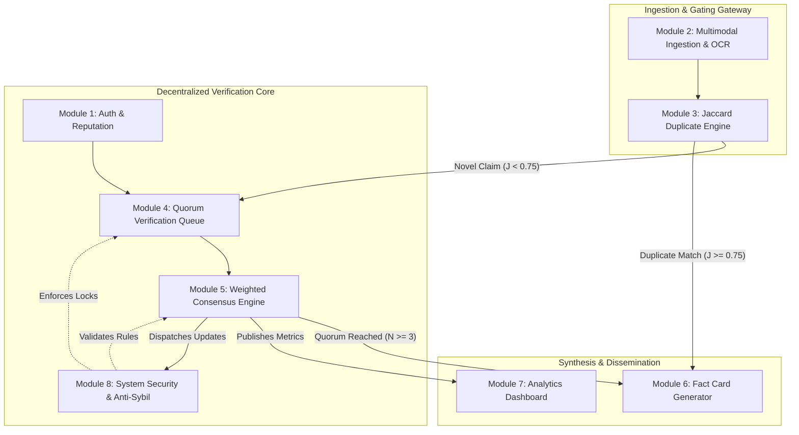

# 4.1 Basic Modules

The architectural framework of **FactStamp** is structured around eight specialized, loosely coupled, and functionally cohesive subsystems designed to execute end-to-end crowdsourced misinformation verification. Addressing the unique operational constraints of WhatsApp forwards in India—high viral velocity, multi-format media (text and screenshots), encrypted peer-to-peer messaging boundaries, and closed-group propagation—the system decentralizes verification while maintaining rigorous analytical, mathematical, and cryptographic safeguards.

---

## 4.1.1 Architectural Overview & Basic Modules Index

The eight basic modules cleanly delineate responsibilities across content intake, mathematical similarity gating, decentralized community peer review, algorithmic consensus calculation, visual artifact synthesis, macro-level analytical intelligence, and holistic system security:

| Module Identifier | Module Name | Architectural Layer | Core Functional Responsibility |
| :---: | :--- | :--- | :--- |
| **Module 1** | **Authentication & Verifier Reputation Subsystem** | Identity & Access Control (RBAC) | Firebase Auth (OIDC, RS256 JWT), user profile state management, dynamic reputation accounting ($0 \le R \le 100$), and role authorization. |
| **Module 2** | **Multimodal Forward Ingestion & Preprocessing Subsystem** | Client Ingestion Gateway | Plaintext sanitization, screenshot validation, client-side HTML5 canvas downscaling ($< 700\text{ KB}$ ceiling), and in-browser WASM OCR transcription. |
| **Module 3** | **Jaccard Duplicate Detection Engine** | Deduplication & Routing Gateway | Word-level token inversion, stop-word and particle filtering ($|w| > 3$), Jaccard set-theoretic similarity computation, and duplicate threshold routing ($J \ge 0.75$). |
| **Module 4** | **Decentralized Quorum Verification Queue** | Crowdsourced Peer Review | Public triage queue, 3-verifier quorum mandate ($N \ge 3$), evidentiary source and explanation validation, and 7-day temporal window lifecycle management. |
| **Module 5** | **Weighted Confidence Scoring & Consensus Engine** | Consensus Mathematics | Tri-partite weighted confidence calculation ($C = 0.40A + 0.30R + 0.30S$), majority verdict election, domain authority tier scoring (100/70/30), and reputation deltas. |
| **Module 6** | **High-Fidelity Fact-Check Card Generator** | Dissemination & Visual Synthesis | Browser-native SVG `<foreignObject>` canvas rasterization via `html-to-image`, generating $1080 \times 1080\text{px}$ high-DPI shareable PNG cards with tilted rubber stamps. |
| **Module 7** | **Trending Misinformation Analytics Dashboard** | Analytical Intelligence | 7-day rolling window misinformation radar across five categories, top debunked claims ledger, and community verifier accuracy leaderboards. |
| **Module 8** | **System Security, Anti-Sybil Defense & Real-Time Alerts** | Defense-in-Depth & Alerts | Declarative Firestore security rules, self-verification lock ($P_{\text{self}}$), 30-min idle session invalidation, 5-attempt brute-force lockout, and real-time alerts. |



---

## 4.1.2 Detailed Specifications for the Eight Basic Modules

### 1. Module 1: Authentication & Verifier Reputation Subsystem

#### 1.1 Architectural Purpose & Role
Module 1 governs identity verification, role-based access control (RBAC), and persistent reputation accounting across the FactStamp ecosystem. To maximize civic engagement and eliminate barriers for citizens seeking fact-checking assistance, reading published fact-checks, browsing the queue, and submitting suspicious forwards require zero authentication. However, evaluating claims, submitting evidentiary citations, casting consensus votes, and accessing administrative moderation tools strictly mandate authenticated verifier status.

#### 1.2 Identity Management & Session Cryptography
- **Identity Provider:** Firebase Authentication operating on OpenID Connect (OIDC) protocols and Google Identity Services.
- **Session Tokens:** Asymmetric RS256-signed JSON Web Tokens (JWT). The token encapsulates user identity claims (`uid`, `email`, `email_verified`) and is automatically refreshed by the client SDK every 60 minutes over TLS 1.3.
- **Authentication Modalities:**
  1. *Email/Password Authentication:* Implements client-side password strength evaluation, SHA-256 password hashing with salt stretching within Google Identity infrastructure, and brute-force protection.
  2. *Google OAuth 2.0 Identity Federation:* Seamless single-sign-on (SSO) ensuring cryptographically verified email association and frictionless onboarding.

#### 1.3 Verifier Profile & Dynamic Reputation State
Each registered verifier corresponds to a persistent document in the `users` Firestore collection (`/users/{uid}`):
- **Baseline Trust Equity:** Newly registered verifiers are initialized with an equity score of $R_0 = 50$ on a closed integer scale $[0, 100]$.
- **Game-Theoretic Reputation Dynamics:**
  - When a claim resolves upon accumulating its 3-verifier quorum, the consensus engine compares each participant's vote against the majority outcome $V_{\text{majority}}$.
  - Alignment Reward: Participating verifiers who concurred with the majority verdict receive $+2$ reputation points ($\Delta R = +2$).
  - Dissent / Carelessness Penalty: Verifiers who dissented from the majority verdict receive a $-1$ reputation point deduction ($\Delta R = -1$).
  - Boundary Invariant: The new score is bounded: $R_{\text{new}} = \min(100, \max(0, R_{\text{current}} + \Delta R))$.
- **Role-Based Privilege Separation:** User profiles maintain an `isAdmin` boolean flag. System administrators can flag urgent viral claims (`adminFlagged: true`), review incident reports, and execute moderation overrides. Field updates to `reputation`, `totalVerifications`, and `isAdmin` are strictly locked against self-modification in `firestore.rules`.

---

### 2. Module 2: Multimodal Forward Ingestion & Preprocessing Subsystem (with OCR Pipeline)

#### 2.1 Architectural Purpose & Role
WhatsApp misinformation circulates in two primary formats: raw forwarded text (often accompanied by "Forwarded many times" indicators) and screenshot images of sensational newspaper clippings, forged government circulars, social media screenshots, or manipulated graphics. Module 2 acts as the ingestion gateway, sanitizing incoming data, enforcing file integrity, and standardizing payloads for downstream processing.

```
+-------------------------------------------------------------------------------+
|             MULTIMODAL INGESTION & CLIENT PREPROCESSING PIPELINE              |
+------------------------------------+------------------------------------------+
| Plaintext Forward Pathway          | Screenshot Image Pathway                 |
+------------------------------------+------------------------------------------+
| 1. Textarea Input (20–2,000 chars) | 1. File Picker / Drag-and-Drop (< 5 MB)  |
| 2. Regex Sanitize (HTML/Protocols) | 2. Triple-Layer Validation (Magic Bytes) |
| 3. Collapse Whitespace & Trim      | 3. Canvas Proportional Downscale (1280px)|
| 4. Lexical Token Extraction        | 4. Iterative JPEG Quality Step (< 700 KB)|
| 5. Feed to Jaccard Engine          | 5. In-Browser Tesseract.js OCR Pipeline  |
+------------------------------------+------------------------------------------+
```

#### 2.2 Plaintext Ingestion Pathway
- **Payload Constraints:** String input constrained between $20$ and $2,000$ characters.
- **Client-Side Sanitization:** Strips dangerous HTML tags (`<script>`, `<iframe>`, `<object>`, `<embed>`, `<form>`, `<style>`), inline event handlers (`onload=`, `onerror=`), and pseudo-protocols (`javascript:`, `data:`) using `sanitizeTextInput()` in `src/lib/security.ts`.
- **Normalization:** Collapses consecutive whitespace, converts characters to lowercase, and strips non-alphanumeric punctuation.

#### 2.3 Screenshot Ingestion & Automated OCR Pipeline
- **Upload Constraints:** Supported MIME types: `image/jpeg`, `image/png`, `image/webp`, `image/gif`, up to $5\text{ MB}$.
- **Triple-Layer File Upload Defense:**
  1. *Extension Whitelisting:* Verifies extension matches `.jpg`, `.jpeg`, `.png`, `.webp`, or `.gif`.
  2. *MIME-Type Whitelisting:* Confirms browser-reported MIME against `ALLOWED_IMAGE_MIMES`.
  3. *Binary Magic Byte Inspection:* Reads the first 12 bytes into an `ArrayBuffer` via `FileReader` and asserts valid binary signatures:
     - JPEG: `0xFF 0xD8 0xFF`
     - PNG: `0x89 0x50 0x4E 0x47` (ASCII `\x89PNG`)
     - GIF: `0x47 0x49 0x46 0x38` (ASCII `GIF8`)
     - WebP: `0x52 0x49 0x46 0x46` (ASCII `RIFF`)
- **Client-Side HTML5 Canvas Downscaling & Compression:**
  - Standard cloud storage buckets (e.g., AWS S3, Google Cloud Storage) incur persistent bandwidth and egress fees. To preserve a 100% zero-cost architecture, Module 2 downscales screenshots directly inside the browser using an off-screen HTML5 `<canvas>` element.
  - The maximum dimension is bounded to $1280\text{px}$ using proportional aspect ratio scaling:
    $$\text{scale} = \min\left(1.0, \frac{1280}{\max(W, H)}\right), \quad W_{\text{target}} = \text{round}(W \cdot \text{scale}), \quad H_{\text{target}} = \text{round}(H \cdot \text{scale})$$
  - Iterative JPEG Quality Stepping: Initializes quality at $Q = 0.72$. If the estimated base64 byte payload exceeds $700\text{ KB}$ ($700,000\text{ bytes}$), $Q$ decrements by $\Delta Q = 0.08$ down to a floor of $0.40$.
  - The resulting base64 data URL is stored directly on the Firestore claim document (`imageUrl`), strictly complying with Firestore's $1\text{ MiB}$ document ceiling.
- **In-Browser WebAssembly OCR Pipeline:**
  - Integrates Tesseract.js running within a dedicated Web Worker to extract textual assertions directly from screenshots on the client.
  - Extracted text is normalized and fed into the duplicate detection pipeline alongside user-submitted contextual notes.

---

### 3. Module 3: Jaccard Duplicate Detection Engine

#### 3.1 Architectural Purpose & Role
Viral misinformation is characterized by extreme duplication: when a sensational forward goes viral, thousands of citizens receive identical or slightly rephrased messages simultaneously across closed WhatsApp groups. If every submission created a distinct verification ticket, community verifier effort would fragment across dozens of redundant threads, causing quorum starvation and delayed debunking. Module 3 operates as an inline gatekeeper, computing set-theoretic similarity against all active and resolved claims before a new record is committed to the database.

#### 3.2 Mathematical Formulation
Module 3 computes word-level Jaccard similarity. Let $A$ represent the significant token set of the incoming forward and $B$ represent the token set of an existing claim in the database:

$$J(A, B) = \frac{|A \cap B|}{|A \cup B|} = \frac{|A \cap B|}{|A| + |B| - |A \cap B|}$$

#### 3.3 Algorithmic Execution & Boundary Invariants
1. **Normalization:** Input strings are converted to lowercase, stripped of non-word characters (`replace(/[^\w\s]/g, '')`), and whitespace-collapsed.
2. **Lexical Filtering ($|w| > 3$):** Words with length $\le 3$ characters (e.g., "the", "and", "for", "with", "this", "that") are eliminated. This prevents common syntactic particles from artificially inflating intersection cardinality $|A \cap B|$.
3. **Set Construction:** The remaining significant words form unique mathematical sets $S_A$ and $S_B$.
4. **Boundary Handling:**
   - If $|S_A| = 0$ and $|S_B| = 0 \implies J(A, B) = 1.0$.
   - If $|S_A| = 0$ or $|S_B| = 0 \implies J(A, B) = 0.0$.
5. **Bifurcated Threshold Routing ($J \ge 0.75$):**
   - If $\max_{k} J(A, B_k) \ge 0.75$, the submission is classified as a definitive duplicate. Database creation is aborted, a notification banner alerts the user, and the browser redirects to the existing dossier (`/claim/{id}`).
   - If $\max_{k} J(A, B_k) < 0.75$, the submission is classified as a novel claim and committed to Firestore with `status: 'pending'` and `verificationCount: 0`.

---

### 4. Module 4: Decentralized Quorum Verification Queue

#### 4.1 Architectural Purpose & Role
Module 4 coordinates crowdsourced peer review. Novel claims enter a transparent public queue where authenticated community verifiers investigate primary sources, evaluate evidentiary claims, and register formal verdicts.

#### 4.2 Operational Lifecycle & Parameters
- **Quorum Threshold ($N_{\text{min}} = 3$):** A claim cannot resolve based on a single opinion. A minimum of three ($3$) independent, authenticated verifications is required before transitioning a claim from `'pending'` to `'verified'`.
- **Verdict Lexicon:**
  - `TRUE`: The claim is factual, accurate, and corroborated by authoritative primary documentation.
  - `FALSE`: The claim is demonstrably fabricated, distorted, or contrary to verifiable facts.
  - `MISLEADING`: The claim contains a partial truth framed deceptively, with manipulated statistics or out-of-context claims.
  - `UNVERIFIABLE`: The claim cannot be confirmed or debunked due to complete absence of public evidence or ambiguous phrasing.
- **Evidence Mandate & Anti-Spam Safeguards:**
  - Every verification mandates an HTTP/HTTPS primary source citation ($10 \le \text{length} \le 500\text{ chars}$).
  - Verifiers must provide a research explanation of at least $50$ characters and $8$ words ($50 \le \text{length} \le 3000\text{ chars}$).
  - Client-side heuristic filters reject repetitive character spam (e.g., `aaaaaa`), repetitive words (`fake fake fake`), generic cop-outs (`"trust me bro"`, `"check google"`), and verbatim copies of the claim text.
- **Temporal 7-Day Expiry Window:**
  - Claims maintain a consensus deadline set to 7 days from submission ($T_{\text{deadline}} = T_{\text{created}} + 7\text{ days}$).
  - If a claim fails to accumulate 3 independent verifications upon deadline expiration, the queue worker automatically resolves the claim under the verdict status `CONTESTED`.

---

### 5. Module 5: Weighted Confidence Scoring & Consensus Engine

#### 5.1 Architectural Purpose & Role
Naive democratic voting (1-person-1-vote) is easily exploited by coordinated troll brigades and bot farms. Conversely, relying solely on elite reputations entrenches oligarchical monopolies. Module 5 implements a robust, multi-parameter weighted consensus algorithm that computes both the majority verdict and an accompanying confidence percentage $C \in [0, 100]$.

#### 5.2 Mathematical Formulation
When a claim reaches its required quorum ($N \ge 3$), the composite confidence score $C$ is computed as:

$$C = \min\Big(100, \max\big(0, \text{round}(0.40 \cdot A + 0.30 \cdot R + 0.30 \cdot S)\big)\Big)$$

Where:
- **$A$ (Agreement Ratio, $40\%$ Weight):** The percentage of participating verifiers concurring with the elected majority verdict $V_{\text{majority}}$:
  $$A = \left( \frac{\sum_{i=1}^N \mathbf{1}_{[\text{verdict}_i = V_{\text{majority}}]}}{N} \right) \times 100$$
- **$R$ (Average Verifier Reputation, $30\%$ Weight):** The arithmetic mean of the normalized reputation scores of all contributing verifiers ($r_i \in [0, 100]$):
  $$R = \frac{1}{N} \sum_{i=1}^N r_i$$
- **$S$ (Average Evidentiary Source Quality, $30\%$ Weight):** The arithmetic mean of the numeric domain authority scores ($s_i \in \{30, 70, 100\}$) derived from cited URLs:
  $$S = \frac{1}{N} \sum_{i=1}^N s_i$$

#### 5.3 Domain Authority Classification Matrix
Source URLs are automatically parsed and evaluated against domain credibility sets:
- **Tier 1 — High Quality ($S_i = 100$):** Official governmental portals, institutional health authorities, constitutional bodies, and verified encyclopedias:
  `who.int`, `nih.gov`, `ncbi.nlm.nih.gov`, `pib.gov.in`, `eci.gov.in`, `mohfw.gov.in`, `icmr.gov.in`, `ayush.gov.in`, `ceodelhi.gov.in`, `wikipedia.org`, `indiacode.nic.in`, `rbi.org.in`.
- **Tier 2 — Medium Quality ($S_i = 70$):** Established mainstream news outlets and recognized international fact-checking organizations:
  `timesofindia.indiatimes.com`, `indianexpress.com`, `thehindu.com`, `bbc.com`, `bbc.in`, `reuters.com`, `apnews.com`, `ndtv.com`, `economictimes.com`, `factcheck.org`, `iitm.org`, `snopes.com`.
- **Tier 3 — Low Quality ($S_i = 30$):** Unverified blogs, social media posts, unindexed web pages, or unrecognized domains.

---

### 6. Module 6: High-Fidelity Fact-Check Card Generator

#### 6.1 Architectural Purpose & Role
Fact-checking web pages rarely reach the viral WhatsApp chat threads where misinformation does the greatest harm. Module 6 synthesizes a shareable, visual fact-check card—an exact $1080 \times 1080\text{px}$ high-DPI PNG image—engineered specifically to be downloaded and forwarded back into WhatsApp chat groups as an evidentiary rebuttal.

#### 6.2 Browser-Native SVG `<foreignObject>` Rasterization Pipeline
- **Legacy Parser Elimination:** Legacy canvas libraries (such as `html2canvas`) rely on outdated CSS parsers that crash when encountering modern CSS Color Module Level 4 definitions (`oklch()`, `oklab()`) and Tailwind CSS v4 variables.
- **Modern Architecture:** Module 6 leverages `html-to-image`, which clones the live DOM tree, serializes it into an SVG `<foreignObject>` container, inlines web fonts and images as data URLs, and draws the SVG onto an off-screen HTML5 Canvas at native browser C++ rendering speeds.
- **Visual Specifications:**
  - Aspect Ratio: Square $1:1$ ratio ($1080 \times 1080\text{px}$ at `pixelRatio: 2`), fitting WhatsApp image previews without center cropping.
  - Saffron Sleek Branding: Warm newsprint background, FactStamp shield icon, and unique case dossier identifier (e.g., `#C_SEED_12`).
  - Claim Display: Clean word-boundary truncation to $\le 150$ characters inside a bordered quote box.
  - Signature Rubber-Stamp Verdict Badge: Rendered with an authentic $\approx 6^\circ$ counter-clockwise tilt, bold border, and double-encoded Lucide icon.
  - Evidentiary Summary: JetBrains Mono confidence meter, quorum count ($3/3$ verifiers), consensus rationale paragraph, and authoritative source domain tags (`who.int`, `pib.gov.in`).
  - Anti-Clipping Design: Explicit pixel bounding heights and `overflow: visible` prevent font truncation across Android and iOS image decoders.

---

### 7. Module 7: Trending Misinformation Analytics Dashboard

#### 7.1 Architectural Purpose & Role
Module 7 delivers aggregate analytical intelligence regarding misinformation trends across India. It provides researchers, journalists, and public administrators with a macro-level overview of rumor category distributions, verification velocity, and verifier participation.

#### 7.2 Core Analytical Metrics & Components
- **Rolling 7-Day Misinformation Radar:** Tracks daily submission volume partitioned across five distinct categories:
  1. *Health:* Fabricated medical cures, vaccine myths, unproven home remedies.
  2. *Political:* Fake political quotes, manipulated election claims, fabricated policy directives.
  3. *Financial:* Phishing scams, fraudulent government subsidies, lottery hoaxes.
  4. *Religious:* Communally divisive rumors, fabricated historical events.
  5. *Other:* Miscellaneous viral hoaxes and urban legends.
- **Top Debunked Claims Ledger:** Surfaces claims with the highest community engagement and definitive `FALSE` or `MISLEADING` verdicts.
- **Community Verifier Leaderboard:** Ranks verifiers based on total verified cases, historical consensus alignment rate, and current reputation tier.
- **Visualization Engine:** High-performance responsive charts rendered using Recharts and Framer Motion animated counters.

---

### 8. Module 8: System Security, Anti-Sybil Defense & Real-Time Alerts Subsystem

#### 8.1 Architectural Purpose & Role
Open civic platforms operate in an inherently adversarial environment. Bad actors, coordinated troll networks, and automated scripts have strong incentives to subvert consensus outcomes or flood the verification queue. Module 8 provides defense-in-depth across client, transport, and database layers.

#### 8.2 Security Mechanisms & Defensive Invariants
1. **Self-Verification Lock ($P_{\text{self}}$):** A citizen who submits a claim is strictly disqualified from verifying their own submission:
   $$P(u, c) \iff c.\text{submittedBy} \neq u.\text{uid}$$
   Enforced in UI state and asserted at the database layer in `firestore.rules`.
2. **Single-Verification-Per-User Invariant:** A verifier can submit at most one verification per claim dossier:
   $$\forall v_i, v_j \in c.\text{verifications}, \quad i \neq j \implies v_i.\text{verifierId} \neq v_j.\text{verifierId}$$
3. **Session Inactivity Invalidation:** User interactions touch `sessionStorage` timestamps. If idle time exceeds $30$ minutes ($1,800,000\text{ ms}$), the session is invalidated and sensitive memory state is wiped.
4. **Exponential Brute-Force Throttling:** Client-side authentication enforces a hard lockout after $5$ consecutive failed attempts for a $15$-minute duration ($900,000\text{ ms}$), partitioned by targeted email identifier.
5. **Real-Time Notification Alerts:** WebSocket-based listeners (`onSnapshot`) on `/notifications` dispatch instant in-app alerts when a claim achieves consensus, reputation updates occur, or admin intervention is requested.
6. **Administrative Audit Logging:** Privileged moderation actions (flagging viral claims, overriding verdicts, resolving reports) write immutable records to `/audit_logs`.

---

## 4.1.3 Inter-Module Data & Control Flow

The eight modules collaborate across three distinct operational phases:

1. **Ingestion & Validation Phase:**
   A citizen forwards suspicious content to Module 2. Plaintext is sanitized while screenshots undergo magic byte validation, canvas downscaling to $< 700\text{ KB}$, and WASM OCR transcription. The resulting text is passed to Module 3.
2. **Deduplication & Triage Phase:**
   Module 3 computes word-level Jaccard similarity ($|w| > 3$). If $J \ge 0.75$, the submission is intercepted and redirected to Module 6 to display the existing fact card. If $J < 0.75$, the claim is enqueued in Module 4 with `status: 'pending'`.
3. **Peer Review & Consensus Resolution Phase:**
   Authenticated verifiers (Module 1) review claims in Module 4 under security assertions enforced by Module 8. When the 3rd verification is recorded, Module 5 executes weighted consensus ($C = 0.40A + 0.30R + 0.30S$), updates verifier reputations ($+2/-1$), updates the analytics radar (Module 7), dispatches alerts (Module 8), and unlocks fact card generation (Module 6).
