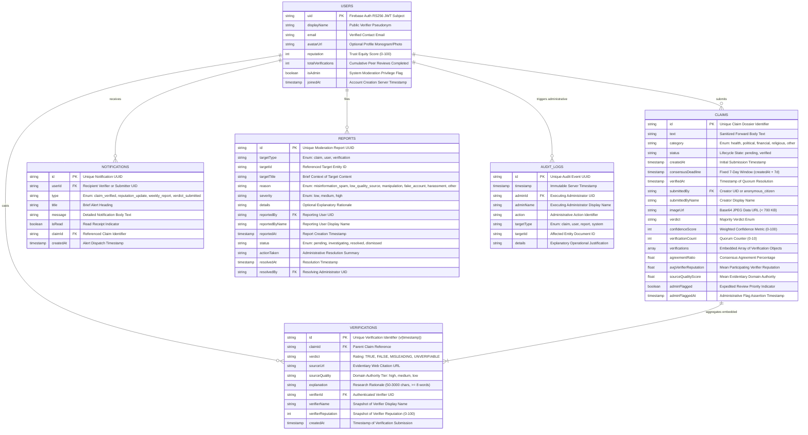

# 4.2 Data Design

Data design represents a foundational engineering pillar of **FactStamp**. Unlike conventional social networks built on rigid relational schemas, FactStamp leverages a real-time, document-oriented NoSQL model powered by **Google Cloud Firestore**. This design satisfies the high-throughput, low-latency demands of viral misinformation triage while accommodating semi-structured forward data, dynamic quorum verifications, and reactive client subscriptions.

---

## 4.2.1 Database Paradigm Evaluation: NoSQL Document Store vs. RDBMS

The architectural decision to deploy Cloud Firestore rather than a traditional Relational Database Management System (such as PostgreSQL or MySQL) was dictated by four core architectural requirements:

| Architectural Evaluation Dimension | Traditional Relational Database (RDBMS) | Cloud Firestore (NoSQL Document Store) | FactStamp Architectural Rationale |
| :--- | :--- | :--- | :--- |
| **Data Structure Flexibility** | Rigid tabular schemas; schema alterations require DDL migrations and table locking. | Dynamic JSON-like BSON/document trees; flexible embedded arrays. | WhatsApp forward submissions vary from short plain text to rich multimodal attachments with dynamic verifier lists. |
| **Real-Time Client Synchronization** | Requires external WebSocket brokers (Socket.io), Redis Pub/Sub, or database polling. | Native WebSocket-based listeners (`onSnapshot`) built into client SDKs. | Essential for collaborative triage: verifiers and citizens observe live updates as quorum counters advance. |
| **Atomic Read Efficiency (Quorum Dossier)** | Requires multi-table relational `JOIN` operations across `claims`, `verifications`, and `users`. | Denormalized embedded arrays inside the root claim document. | A single atomic document read retrieves the complete claim dossier, eliminating relational join latency and egress round-trips. |
| **Operational Economics & Sustainability** | Continuous compute billing for idle server instances ($15–$50/month). | Serverless consumption model with generous free Spark tier ($0/month). | Preserves 100% zero-cost infrastructure for civic longevity and university research sustainability. |

---

## 4.2.2 Conceptual Entity-Relationship (E-R) Model

The FactStamp data architecture models six primary entities: `USERS`, `CLAIMS`, embedded `VERIFICATIONS`, `NOTIFICATIONS`, `REPORTS`, and `AUDIT_LOGS`. Embedded denormalization is leveraged for high-frequency dossier hydration, while transactional consistency is enforced via database security assertions.



---

## 4.2.3 Physical Schema Design & Complete Data Dictionaries

The physical data model of FactStamp is organized into top-level collections in Cloud Firestore. Each collection and embedded entity schema is formally specified below.

### 1. `users` Collection Schema
- **Path:** `/databases/{database}/documents/users/{uid}`
- **Description:** Maintains verifier identity profiles, role-based access attributes, and persistent trust reputation scores.

| Field Name | Data Type | Nullable | Default Value | Integrity Constraints & Validation Rules |
| :--- | :--- | :---: | :---: | :--- |
| `uid` | `string` | No | *N/A* | Firebase Auth unique identifier (RS256 JWT subject). Document Primary Key. |
| `displayName` | `string` | No | *N/A* | Public verifier pseudonym or real name. Constraints: $1 \le \text{length} \le 100$. |
| `email` | `string` | No | *N/A* | Verified email address. Must strictly match `request.auth.token.email`. |
| `avatarUrl` | `string` | Yes | `null` | Optional URI pointing to user profile avatar or generated initial monogram. |
| `reputation` | `int` | No | `50` | Trust equity score ($0 \le R \le 100$). Initialized to 50 upon registration. Strictly immutable by self. |
| `totalVerifications` | `int` | No | `0` | Cumulative count of registered peer reviews ($\ge 0$). Incremented atomically. |
| `isAdmin` | `boolean` | No | `false` | System moderation flag granting claim flagging and override authority. Immutable by self. |
| `joinedAt` | `timestamp` | No | `request.time` | ISO-8601 server timestamp of account registration. Strictly immutable after creation. |

### 2. `claims` Collection Schema
- **Path:** `/databases/{database}/documents/claims/{claimId}`
- **Description:** The core transactional collection storing citizen forward submissions, image payloads, embedded verification arrays, and consensus outcomes.

| Field Name | Data Type | Nullable | Default Value | Integrity Constraints & Validation Rules |
| :--- | :--- | :---: | :---: | :--- |
| `id` | `string` | No | *Auto* | Unique alphanumeric identifier assigned by Firestore SDK. Document Primary Key. |
| `text` | `string` | No | *N/A* | Normalized body of the forward. Constraints: $10 \le \text{length} \le 2000$ characters. |
| `category` | `string` | No | *N/A* | Enum: `['health', 'political', 'financial', 'religious', 'other']`. |
| `status` | `string` | No | `'pending'` | Lifecycle state: `'pending'` (awaiting quorum) or `'verified'` (resolved or contested). |
| `createdAt` | `timestamp` | No | `request.time` | Server timestamp of initial submission. Strictly immutable. |
| `consensusDeadline`| `timestamp` | No | `createdAt + 7d`| Fixed temporal window for community quorum resolution. Strictly immutable. |
| `verifiedAt` | `timestamp` | Yes | `null` | Server timestamp when the 3rd verification was submitted or when marked CONTESTED. |
| `submittedBy` | `string` | No | *N/A* | UID of submitter (or `'anonymous_citizen'`). Used to enforce self-verification lock. |
| `submittedByName` | `string` | No | *N/A* | Display name of the submitter ($1 \le \text{length} \le 100$). |
| `imageUrl` | `string` | Yes | `null` | Base64 JPEG data URL ($< 700\text{ KB}$, string length $\le 800,000$ characters). |
| `verdict` | `string` | Yes | `null` | Majority outcome: `['TRUE', 'FALSE', 'MISLEADING', 'UNVERIFIABLE', 'CONTESTED']`. |
| `confidenceScore` | `int` | Yes | `null` | Computed weighted certainty metric. Closed integer range: $0 \le C \le 100$. |
| `verificationCount`| `int` | No | `0` | Count of registered peer reviews ($0 \le N \le 10$). Equal to `verifications.length`. |
| `verifications` | `array<map>`| No | `[]` | Embedded list of verification objects (detailed below). Maximum capacity: 10. |
| `agreementRatio` | `float` | Yes | `null` | Consensus agreement percentage ($0.0 \le A \le 100.0$). |
| `avgVerifierReputation`| `float`| Yes | `null` | Arithmetic mean reputation of participating verifiers ($0.0 \le R \le 100.0$). |
| `sourceQualityScore`| `float` | Yes | `null` | Arithmetic mean source domain authority ($30.0 \le S \le 100.0$). |
| `adminFlagged` | `boolean` | No | `false` | Expedited review priority indicator. Only mutable by administrators. |
| `adminFlaggedAt` | `timestamp` | Yes | `null` | Server timestamp when administrative priority flag was asserted. |

### 3. Embedded `verifications` Array Schema
- **Path:** Stored as an array of structured maps inside `/claims/{claimId}.verifications`.
- **Description:** Captures individual peer reviews. Embedding inside the parent claim guarantees atomic single-read dossier hydration.

| Property Name | Data Type | Nullable | Description & Integrity Constraints |
| :--- | :--- | :---: | :--- |
| `id` | `string` | No | Unique verification identifier formatted as `v{timestamp}`. |
| `claimId` | `string` | No | Foreign Key referencing parent `claims.id`. |
| `verdict` | `string` | No | Individual rating enum: `['TRUE', 'FALSE', 'MISLEADING', 'UNVERIFIABLE']`. |
| `sourceUrl` | `string` | No | Evidentiary web citation. Must start with `http://` or `https://` ($\le 500$ chars). |
| `sourceQuality` | `string` | No | Domain authority classification: `'high'` ($100$), `'medium'` ($70$), or `'low'` ($30$). |
| `explanation` | `string` | No | Research rationale ($50 \le \text{length} \le 3000$ characters, minimum 8 words). |
| `verifierId` | `string` | No | Foreign Key referencing `users.uid`. Must strictly match `request.auth.uid`. |
| `verifierName` | `string` | No | Snapshot of verifier's display name at vote time ($1 \le \text{length} \le 100$). |
| `verifierReputation`| `int` | No | Snapshot of verifier's reputation score at vote time ($0 \le R \le 100$). |
| `createdAt` | `timestamp` | No | Server timestamp when verification record was appended. |

### 4. `notifications` Collection Schema
- **Path:** `/databases/{database}/documents/notifications/{notificationId}`
- **Description:** Stores real-time in-app alerts dispatched to verifiers and submitters upon consensus resolution or reputation updates.

| Field Name | Data Type | Nullable | Description & Integrity Constraints |
| :--- | :--- | :---: | :--- |
| `id` | `string` | No | Unique notification identifier. Document Primary Key. |
| `userId` | `string` | No | Target recipient (`users.uid`). Indexed for owner query. |
| `type` | `string` | No | Enum: `['claim_verified', 'reputation_update', 'weekly_report', 'verdict_submitted']`. |
| `title` | `string` | No | Summary title of alert ($1 \le \text{length} \le 200$ characters). |
| `message` | `string` | No | Detailed notification body text ($1 \le \text{length} \le 2000$ characters). |
| `isRead` | `boolean` | No | Read status indicator. Toggled upon user interaction. Default: `false`. |
| `claimId` | `string` | Yes | Optional foreign key pointing to the referenced claim document. |
| `createdAt` | `timestamp` | No | Server timestamp of notification generation. |

### 5. `reports` Collection Schema
- **Path:** `/databases/{database}/documents/reports/{reportId}`
- **Description:** Facilitates community moderation, allowing users to report abusive claims, toxic explanations, or suspicious sockpuppet activities.

| Field Name | Data Type | Nullable | Description & Integrity Constraints |
| :--- | :--- | :---: | :--- |
| `id` | `string` | No | Unique moderation report identifier. Document Primary Key. |
| `targetType` | `string` | No | Entity classification enum: `['claim', 'user', 'verification']`. |
| `targetId` | `string` | No | Identifier of the reported claim (`claims.id`), user (`users.uid`), or verification. |
| `targetTitle` | `string` | No | Brief context or summary title of reported content ($1 \le \text{length} \le 300$). |
| `reason` | `string` | No | Enum: `['misinformation_spam', 'low_quality_source', 'manipulation', 'fake_account', 'harassment', 'other']`. |
| `severity` | `string` | No | Severity tier enum: `['low', 'medium', 'high']`. |
| `details` | `string` | Yes | Optional descriptive context provided by reporting citizen ($\le 3000$ characters). |
| `reportedBy` | `string` | No | UID of reporting user (`users.uid`). Must match `request.auth.uid`. |
| `reportedByName` | `string` | No | Display name of reporting user ($1 \le \text{length} \le 100$). |
| `reportedAt` | `timestamp` | No | Server timestamp when report was filed. |
| `status` | `string` | No | Moderation state: `['pending', 'investigating', 'resolved', 'dismissed']`. Default: `'pending'`. |
| `actionTaken` | `string` | Yes | Summary of administrative action taken upon investigation ($\le 1000$ characters). |
| `resolvedAt` | `timestamp` | Yes | Timestamp when report was resolved. |
| `resolvedBy` | `string` | Yes | UID of administrator who investigated the report (`users.uid`). |

### 6. `audit_logs` Collection Schema
- **Path:** `/databases/{database}/documents/audit_logs/{logId}`
- **Description:** Immutable administrative audit ledger recording privileged moderation interventions, claim priority flagging, and system overrides.

| Field Name | Data Type | Nullable | Description & Integrity Constraints |
| :--- | :--- | :---: | :--- |
| `id` | `string` | No | Unique audit event identifier. Document Primary Key. |
| `timestamp` | `timestamp` | No | Server timestamp of action execution. Strictly immutable. |
| `adminId` | `string` | No | UID of executing administrator (`users.uid`). Must satisfy `isAdmin == true`. |
| `adminName` | `string` | No | Cached display name of executing administrator ($1 \le \text{length} \le 100$). |
| `action` | `string` | No | Operational action identifier ($1 \le \text{length} \le 200$, e.g., `'flag_claim'`, `'override_verdict'`). |
| `targetType` | `string` | No | Entity enum: `['claim', 'user', 'report', 'system']`. |
| `targetId` | `string` | No | Document ID of the affected entity. |
| `details` | `string` | No | Mandatory operational justification for audit review ($1 \le \text{length} \le 2000$). |

---

## 4.2.4 Data Integrity, Referential Constraints & Security Invariants

In serverless NoSQL architectures lacking SQL foreign key triggers, integrity must be programmatically guaranteed at the database boundary via declarative rules in `firestore.rules`.

### 1. Referential Integrity & Anti-Orphan Guarantees
- **Denormalization Snapshot Trade-off:** Verifier attributes (`verifierName`, `verifierReputation`) are denormalized and captured snapshot-style inside the `verifications` array of `/claims/{claimId}`. This guarantees that subsequent modifications to a user's display name or reputation score do not retroactively alter historical consensus records.
- **Cascade Containment:** Deleting a user profile does not invalidate past community verifications; evidentiary contributions remain anchored inside the claim's immutable audit array.
- **Atomic Pre-Condition Assertions:** To prevent race conditions when multiple verifiers submit votes simultaneously, Firestore update rules assert:
  ```javascript
  request.resource.data.verificationCount == resource.data.verificationCount + 1
  && request.resource.data.verifications.hasAll(resource.data.verifications)
  ```
  This guarantees that incoming writes must append exactly one element while preserving all existing verifications without truncation.

### 2. Core Security Invariants in `firestore.rules`

#### Invariant A: Immutability of Core Claim Identity
Once a citizen submits a forward, its substantive text, category, creator identity, and deadline cannot be modified by any user, preventing "bait-and-switch" tampering:

```javascript
// Helper verifying that a specific document field was not altered during an update
function isUnchanged(field) {
  return request.resource.data.get(field, null) == resource.data.get(field, null);
}

// Enforces strict immutability across core claim identity fields
function identityUnchanged() {
  return isUnchanged('text')
    && isUnchanged('category')
    && isUnchanged('submittedBy')
    && isUnchanged('submittedByName')
    && isUnchanged('createdAt')
    && isUnchanged('consensusDeadline')
    && isUnchanged('imageUrl');
}
```

#### Invariant B: Verifier Identity & Self-Verification Lock
To eliminate conflicts of interest and Sybil manipulation, a user cannot submit a verification where the `verifierId` does not match their authenticated session token, nor can they verify a claim they submitted:

```javascript
// From match /claims/{claimId} update rule (Case C: Adding verification):
allow update: if request.auth != null
  && (
    identityUnchanged()
    && isUnchanged('adminFlagged')
    && isUnchanged('adminFlaggedAt')
    // Verification count must increment by exactly 1
    && request.resource.data.verificationCount == resource.data.verificationCount + 1
    // Preserves all prior verifications without modification
    && request.resource.data.verifications.hasAll(resource.data.verifications)
    // Newly appended verification must belong to the authenticated caller
    && request.resource.data.verifications[resource.data.verifications.size()].verifierId == request.auth.uid
    // Claimed reputation must strictly match the official server-side user profile
    && request.resource.data.verifications[resource.data.verifications.size()].verifierReputation 
       == get(/databases/$(database)/documents/users/$(request.auth.uid)).data.reputation
    // Submitter cannot verify their own claim (Self-Verification Lock)
    && resource.data.submittedBy != request.auth.uid
    // Strict input validation on evidence parameters
    && request.resource.data.verifications[resource.data.verifications.size()].verdict in ['TRUE', 'FALSE', 'MISLEADING', 'UNVERIFIABLE']
    && request.resource.data.verifications[resource.data.verifications.size()].sourceUrl.matches('^https?://.+')
    && request.resource.data.verifications[resource.data.verifications.size()].sourceUrl.size() <= 500
    && request.resource.data.verifications[resource.data.verifications.size()].explanation.size() >= 50
    && request.resource.data.verifications[resource.data.verifications.size()].explanation.size() <= 3000
    && request.resource.data.verifications[resource.data.verifications.size()].verifierName.size() <= 100
  );
```

#### Invariant C: Strict Privilege Separation on User Profiles
Users can modify their own display name, but cannot elevate their reputation score or grant themselves administrator privileges:

```javascript
match /users/{uid} {
  allow read: if request.auth != null;
  allow update: if request.auth != null && (
    // Admin override: administrators can adjust reputation and assign roles
    isAdmin() ||
    // Self-update: sensitive trust attributes are strictly immutable
    (
      request.auth.uid == uid
      && isUnchanged('uid')
      && isUnchanged('email')
      && isUnchanged('joinedAt')
      && isUnchanged('reputation')
      && isUnchanged('totalVerifications')
      && isUnchanged('isAdmin')
      && request.resource.data.displayName is string
      && request.resource.data.displayName.size() <= 100
    )
  );
}
```

---

## 4.2.5 Storage Footprint & 1 MiB Document Ceiling Compliance

Google Cloud Firestore enforces a strict hard ceiling of $1\text{ MiB}$ ($1,048,576\text{ bytes}$) per document. In FactStamp, screenshot image data URLs are embedded directly on `/claims/{claimId}` documents to eliminate cloud object storage costs. To guarantee that no claim document ever breaches this ceiling, the schema enforces mathematical boundary limits across all fields:

```
+-------------------------------------------------------------------------------+
|             WORST-CASE DOCUMENT STORAGE CEILING BUDGET BREAKDOWN              |
+-----------------------------------+--------------------+----------------------+
| Field Entity Component            | Maximum Permitted  | Worst-Case Footprint |
+-----------------------------------+--------------------+----------------------+
| 1. Forward Text (`text`)          | 2,000 UTF-8 chars  | ~ 8.0 KB             |
| 2. Base64 Screenshot (`imageUrl`) | 800,000 chars      | ~ 600.0 KB           |
| 3. Verifications Array (10 items) | 10 × 4,000 chars   | ~ 40.0 KB            |
| 4. System Metadata & Identifiers  | Timestamps, floats | ~ 2.0 KB             |
+-----------------------------------+--------------------+----------------------+
| TOTAL WORST-CASE DOCUMENT SIZE    |                    | ~ 650.0 KB           |
| FIRESTORE HARD STORAGE CEILING    |                    | 1,048.5 KB (1 MiB)   |
| MARGIN OF SAFETY / HEADROOM       |                    | 398.5 KB (38% buffer)|
+-----------------------------------+--------------------+----------------------+
```

### Formal Compliance Calculation:
$$\text{Size}_{\text{max}} \approx 8.0\text{ KB} + 600.0\text{ KB} + 40.0\text{ KB} + 2.0\text{ KB} = 650.0\text{ KB}$$
$$\frac{650.0\text{ KB}}{1,048.576\text{ KB}} \approx 62.0\% \text{ of maximum ceiling}$$

This leaves a substantial $38\%$ safety margin ($398.5\text{ KB}$), mathematically proving that FactStamp documents operate comfortably within Firestore's limits under extreme viral workloads without risking transaction aborts.
