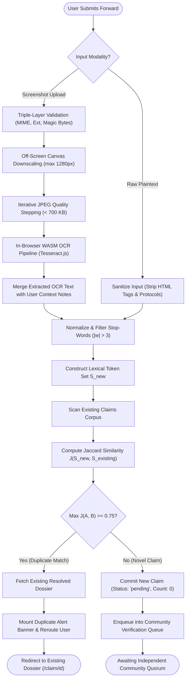
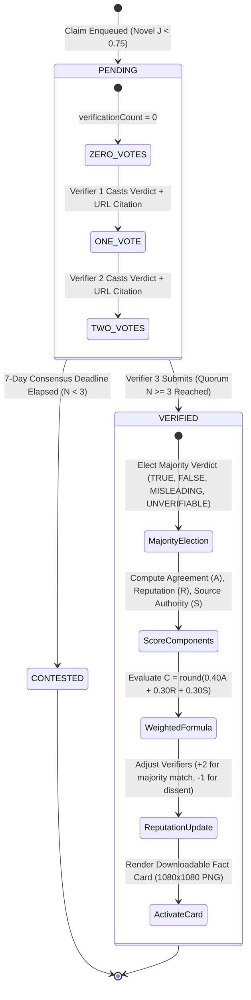
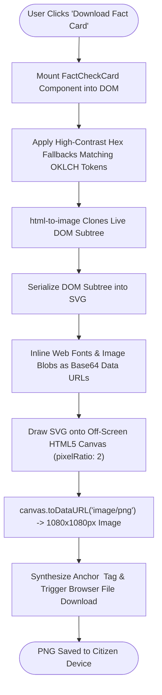

# 4.3 Procedural Design

Procedural design articulates the operational execution mechanics, data structures, and algorithmic formulations governing **FactStamp**. It translates conceptual system requirements into concrete computational pipelines, establishing deterministic logic flows for duplicate detection, quorum progression, consensus calculation, and fact card generation.

---

## 4.3.1 Logic Diagrams & Procedural Workflows

### 1. Ingestion & Duplicate Resolution Logic
This procedural flow governs the intake of citizen forwards, standardizing plaintext or screenshot input, extracting embedded text via in-browser OCR, and conducting set-theoretic deduplication against the existing claim corpus before creating database records.



---

### 2. Quorum Verification & State Transition Machine
A submitted claim progresses through deterministic state transitions as community verifiers review primary sources. A minimum quorum of three independent verifiers ($N \ge 3$) is strictly enforced to trigger algorithmic consensus.



---

### 3. Fact Card Generation & Export Pipeline
Once verified, the claim dossier is transformed into a high-DPI, pixel-perfect image artifact engineered specifically for sharing back into WhatsApp chat threads:



---

## 4.3.2 In-Memory Data Structures

The procedural execution pipelines rely on four optimized in-memory data structures to guarantee minimal asymptotic latency and high throughput.

### 1. Inverted Token Set
To compute Jaccard similarity across large claim corpora without redundant string parsing, text strings are transformed into normalized hash sets of significant lexical tokens.

```
Raw Forward String: "Drinking hot boiled ginger water with lemon cures Diabetes permanently"
        │
        ▼ Case Folding & Punctuation Stripping (toLowerCase + replace)
"drinking hot boiled ginger water with lemon cures diabetes permanently"
        │
        ▼ Token Splitting & Stop-Word / Particle Filtering (|w| > 3)
Tokens: ["drinking", "boiled", "ginger", "water", "lemon", "cures", "diabetes", "permanently"]
        │
        ▼ Unique Hash Set Representation
Set A = { "boiled", "cures", "diabetes", "drinking", "ginger", "lemon", "permanently", "water" }
```
- **Asymptotic Performance:** Token set construction operates in $O(L)$ time, where $L$ is string length. Set membership checks (`setB.has(token)`) execute in $O(1)$ amortized time.

### 2. Quorum Vote & Frequency Map
During consensus computation, individual verifications are aggregated using an associative frequency map to elect the majority outcome:

```typescript
type VerdictCounts = Record<Verdict, number>;

// Example Quorum Map state after 3 independent verifications:
const quorumMap: VerdictCounts = {
  FALSE: 2,
  MISLEADING: 1,
  TRUE: 0,
  UNVERIFIABLE: 0,
  CONTESTED: 0
};
```
- **Majority Resolution:** The elected verdict $V_{\text{majority}}$ corresponds to the key with the maximum vote tally:
  $$V_{\text{majority}} = \arg\max_{v} \text{quorumMap}[v]$$

### 3. Domain Authority Whitelist Sets
Source domain quality is evaluated dynamically using pre-compiled hash sets of verified institutional domains:

```typescript
const HQ_DOMAINS = new Set([
  'who.int', 'nih.gov', 'ncbi.nlm.nih.gov', 'pib.gov.in', 'eci.gov.in',
  'mohfw.gov.in', 'icmr.gov.in', 'ayush.gov.in', 'ceodelhi.gov.in',
  'wikipedia.org', 'indiacode.nic.in', 'rbi.org.in'
]);

const MQ_DOMAINS = new Set([
  'timesofindia.indiatimes.com', 'indianexpress.com', 'thehindu.com',
  'bbc.com', 'bbc.in', 'reuters.com', 'apnews.com', 'ndtv.com',
  'economictimes.com', 'factcheck.org', 'iitm.org', 'snopes.com'
]);
```
- **Lookup Cost:** Hostname membership checks execute in $O(1)$ amortized time via `Set.has()`.

### 4. Sliding 7-Day Temporal Buckets
For Module 7's analytics radar, claims are aggregated into 7 rolling temporal buckets representing days $T_0$ through $T_6$:

$$\text{Bucket}_d = \{ c \in \text{Claims} \mid t_{\text{now}} - (d + 1) \times 86400 \le c.\text{createdAt} < t_{\text{now}} - d \times 86400 \}$$

Each bucket maintains atomic category accumulators (`health`, `political`, `financial`, `religious`, `other`), enabling $O(N)$ single-pass aggregation across the active dataset without database-side MapReduce jobs.

---

## 4.3.3 Algorithms Design

### Algorithm 1: String Normalization and Token Extraction

```typescript
/**
 * Normalizes input string by folding case, removing punctuation, 
 * collapsing whitespace, and filtering short particles.
 * 
 * @param text Raw forward text string
 * @returns Set of unique significant tokens (length > 3)
 */
function normalize(text: string): string {
  return text
    .toLowerCase()
    .replace(/[^\w\s]/g, '')   // remove punctuation and symbols
    .replace(/\s+/g, ' ')      // collapse multiple whitespace characters
    .trim();
}

function tokenize(text: string): Set<string> {
  return new Set(
    normalize(text)
      .split(/\s+/)
      .filter((word) => word.length > 3) // ignore short particles (|w| <= 3)
  );
}
```

- **Mathematical Invariant:** $\forall w \in \text{tokenize}(T) \implies |w| > 3 \land w \in [a\text{-}z0\text{-}9\_]^+$.
- **Operational Boundary:** Eliminates language particles ("the", "and", "for", "with", "this", "that") that artificially inflate intersection size between unrelated claims.

---

### Algorithm 2: Jaccard Duplicate Detection Engine

Given two claims $A$ and $B$ with corresponding token sets $S_A = \text{tokenize}(A)$ and $S_B = \text{tokenize}(B)$:

$$J(S_A, S_B) = \frac{|S_A \cap S_B|}{|S_A \cup S_B|} = \frac{|S_A \cap S_B|}{|S_A| + |S_B| - |S_A \cap S_B|}$$

```typescript
/**
 * Computes the word-level Jaccard similarity between two text strings.
 * 
 * @param a First claim text
 * @param b Second claim text
 * @returns Jaccard similarity index in the range [0.0, 1.0]
 */
function jaccardSimilarity(a: string, b: string): number {
  const setA = tokenize(a);
  const setB = tokenize(b);

  // Boundary condition 1: both strings contain zero significant tokens
  if (setA.size === 0 && setB.size === 0) return 1.0;
  // Boundary condition 2: one string contains zero significant tokens
  if (setA.size === 0 || setB.size === 0) return 0.0;

  let intersection = 0;
  for (const word of setA) {
    if (setB.has(word)) {
      intersection++;
    }
  }

  const union = setA.size + setB.size - intersection;
  return intersection / union;
}

export function findDuplicate(
  text: string,
  existingClaims: Array<{ id: string; text: string }>,
  threshold = 0.75
): { id: string; text: string; similarity: number } | null {
  const normalized = normalize(text);
  let bestMatch: { id: string; text: string; similarity: number } | null = null;

  for (const claim of existingClaims) {
    const similarity = jaccardSimilarity(normalized, claim.text);
    if (similarity >= threshold && (!bestMatch || similarity > bestMatch.similarity)) {
      bestMatch = { id: claim.id, text: claim.text, similarity };
    }
  }

  return bestMatch;
}
```

#### Mathematical Properties & Boundary Analysis:
1. **Range Bounds:** $0.0 \le J(A, B) \le 1.0$.
2. **Identity of Indiscernibles:** $J(A, A) = 1.0$.
3. **Symmetry:** $J(A, B) = J(B, A)$.
4. **Disjoint Orthogonality:** If $S_A \cap S_B = \emptyset \implies J(A, B) = 0.0$.
5. **Threshold Invariant:** A claim is classified as a duplicate if and only if $J(A, B) \ge 0.75$.

---

### Algorithm 3: 3-Verifier Weighted Consensus & Confidence Engine

Once a claim accumulates $N \ge 3$ independent verifications, the system executes the weighted consensus algorithm to compute the majority verdict and confidence metric $C$.

#### Mathematical Definition:
Let $V = \{v_1, v_2, \dots, v_N\}$ be the set of verification submissions.
Each verification $v_i$ encapsulates:
- An elected verdict: $\text{verdict}_i \in \{\text{'TRUE'}, \text{'FALSE'}, \text{'MISLEADING'}, \text{'UNVERIFIABLE'}\}$
- A verifier reputation score: $r_i \in [0, 100]$
- A domain authority score: $s_i \in \{30, 70, 100\}$

1. **Majority Verdict Resolution:**
   $$V_{\text{majority}} = \arg\max_{v} \sum_{i=1}^N \mathbf{1}_{[\text{verdict}_i = v]}$$
   In the event of a tie among top categories, the outcome with the highest cumulative verifier reputation breaks the tie.

2. **Agreement Ratio Component ($A \in [0, 100]$, $40\%$ Weight):**
   $$A = \left( \frac{\sum_{i=1}^N \mathbf{1}_{[\text{verdict}_i = V_{\text{majority}}]}}{N} \right) \times 100$$

3. **Average Verifier Reputation Component ($R \in [0, 100]$, $30\%$ Weight):**
   $$R = \frac{1}{N} \sum_{i=1}^N r_i$$

4. **Average Source Quality Component ($S \in [0, 100]$, $30\%$ Weight):**
   $$S = \frac{1}{N} \sum_{i=1}^N s_i$$

5. **Composite Confidence Formula ($C \in [0, 100]$):**
   $$C = \min\Big(100, \max\big(0, \text{round}(0.40 \cdot A + 0.30 \cdot R + 0.30 \cdot S)\big)\Big)$$

#### Evidentiary Authority Mapping:
$$\text{score}(q) = \begin{cases} 
100 & \text{if } q = \text{'high'} \quad (\text{Official Govt Portals, WHO, Gazettes, Wikipedia}) \\
70 & \text{if } q = \text{'medium'} \quad (\text{Mainstream Press: The Hindu, BBC, Reuters, FactCheck.org}) \\
30 & \text{if } q = \text{'low'} \quad (\text{Generic blogs, social links, unindexed URLs})
\end{cases}$$

```typescript
export interface VerificationInput {
  verdict: string;
  verifierReputation: number;
  sourceQuality: number; // 0–100 scale
}

export function calculateConfidenceScore(
  verifications: VerificationInput[]
): {
  score: number;
  agreementRatio: number;
  avgReputation: number;
  sourceQualityScore: number;
} {
  if (verifications.length === 0) {
    return { score: 0, agreementRatio: 0, avgReputation: 0, sourceQualityScore: 0 };
  }

  // 1. Agreement ratio: How many verifications agree with the majority verdict
  const verdicts = verifications.map((v) => v.verdict);
  const majorityCount = Math.max(
    ...Array.from(new Set(verdicts)).map(
      (v) => verdicts.filter((x) => x === v).length
    )
  );
  const agreementRatio = (majorityCount / verifications.length) * 100;

  // 2. Average reputation of all participating verifiers
  const avgReputation =
    verifications.reduce((sum, v) => sum + v.verifierReputation, 0) /
    verifications.length;

  // 3. Source quality score (average domain authority)
  const sourceQualityScore =
    verifications.reduce((sum, v) => sum + v.sourceQuality, 0) /
    verifications.length;

  // 4. Weighted calculation: 40% Agreement + 30% Reputation + 30% Source Quality
  const score = Math.round(
    agreementRatio * 0.4 + avgReputation * 0.3 + sourceQualityScore * 0.3
  );

  return {
    score: Math.min(100, Math.max(0, score)),
    agreementRatio,
    avgReputation,
    sourceQualityScore,
  };
}
```

---

### Algorithm 4: 7-Day Temporal Expiry & CONTESTED Status Resolution

```typescript
/**
 * Scans active claims and transitions overdue unresolved claims to CONTESTED.
 * Evaluates: Date.now() > claim.consensusDeadline && claim.status === 'pending'
 */
export async function expireOverdueClaims(activeClaims: Claim[]): Promise<void> {
  const now = Date.now();

  for (const claim of activeClaims) {
    if (claim.status === 'pending') {
      const deadline = new Date(claim.consensusDeadline).getTime();
      if (now > deadline && claim.verificationCount < 3) {
        // Transition claim to verified with CONTESTED verdict
        await updateDoc(doc(db, 'claims', claim.id), {
          status: 'verified',
          verdict: 'CONTESTED',
          verifiedAt: new Date().toISOString()
        });
      }
    }
  }
}
```

---

### Algorithm 5: Dynamic Reputation Adjustment Algorithm

```typescript
/**
 * Updates participating verifier reputation scores following consensus resolution.
 * Awards +2 points for majority alignment; penalizes -1 point for dissent.
 */
export async function applyReputationDeltas(
  verifications: Verification[],
  majorityVerdict: Verdict
): Promise<void> {
  for (const v of verifications) {
    const delta = v.verdict === majorityVerdict ? 2 : -1;
    const userRef = doc(db, 'users', v.verifierId);
    const userSnap = await getDoc(userRef);

    if (userSnap.exists()) {
      const currentRep = userSnap.data().reputation || 50;
      const currentTotal = userSnap.data().totalVerifications || 0;
      const clampedRep = Math.min(100, Math.max(0, currentRep + delta));

      await updateDoc(userRef, {
        reputation: clampedRep,
        totalVerifications: currentTotal + 1
      });
    }
  }
}
```

---

## 4.3.4 Comprehensive Empirical Step-Through Examples

### Example 1: Jaccard Duplicate Detection Step-Through
Consider a scenario where an existing verified claim is stored in the database:
- **Existing Claim $T_{\text{db}}$:**  
  *"Drinking boiled ginger water with lemon twice daily permanently cures Type 2 Diabetes within 14 days."*
- **Incoming Submission $T_{\text{new}}$:**  
  *"Drinking hot boiled ginger water with lemon twice daily cures Type 2 Diabetes permanently in 14 days! Forward to all."*

#### Execution:
1. **Normalization & Filtering ($|w| > 3$):**
   - $S_{\text{db}}$ tokens: `{"drinking", "boiled", "ginger", "water", "lemon", "twice", "daily", "permanently", "cures", "type", "diabetes", "within", "days"}` ($13$ tokens)
   - $S_{\text{new}}$ tokens: `{"drinking", "boiled", "ginger", "water", "lemon", "twice", "daily", "cures", "type", "diabetes", "permanently", "days", "forward"}` ($13$ tokens)
2. **Intersection Cardinality ($|S_{\text{db}} \cap S_{\text{new}}|$):**
   - Common tokens: `{"drinking", "boiled", "ginger", "water", "lemon", "twice", "daily", "cures", "type", "diabetes", "permanently", "days"}`
   - $|S_{\text{db}} \cap S_{\text{new}}| = 12$ tokens.
3. **Union Cardinality ($|S_{\text{db}} \cup S_{\text{new}}|$):**
   - $|S_{\text{db}}| + |S_{\text{new}}| - |S_{\text{db}} \cap S_{\text{new}}| = 13 + 13 - 12 = 14$ tokens.
4. **Jaccard Similarity Calculation:**
   $$J(S_{\text{new}}, S_{\text{db}}) = \frac{12}{14} \approx \mathbf{0.857}$$
5. **Threshold Evaluation:**
   $$0.857 \ge 0.75 \implies \text{DEFINITIVE DUPLICATE MATCH}$$
6. **System Outcome:**
   The novel write is aborted. The citizen is shown a duplicate notification toast and immediately redirected to the existing verified dossier.

---

### Example 2: 3-Verifier Weighted Consensus Step-Through
Consider a viral forward claiming:  
*"Government of India announces free electric scooters for all college students under PM-Yuva Scheme."*

Three independent verifiers investigate the claim and submit evidentiary dossiers:
- **Verifier 1 (Alice):**
  - Verdict: `FALSE`
  - Verifier Reputation: $r_1 = 85$
  - Cited URL: `https://pib.gov.in/PressReleasePage.aspx?PRID=189423` (PIB Fact Check $\implies$ Tier 1 High Quality: $s_1 = 100$)
- **Verifier 2 (Bob):**
  - Verdict: `FALSE`
  - Verifier Reputation: $r_2 = 65$
  - Cited URL: `https://thehindu.com/news/national/fact-check-electric-scooter-hoax/article.ece` (The Hindu $\implies$ Tier 2 Medium Quality: $s_2 = 70$)
- **Verifier 3 (Charlie):**
  - Verdict: `MISLEADING`
  - Verifier Reputation: $r_3 = 70$
  - Cited URL: `https://who.int` (Tier 1 High Quality: $s_3 = 100$)

#### Step-by-Step Computational Evaluation:
1. **Majority Verdict Election:**
   - Verdict Tally: $2 \times \text{FALSE}$, $1 \times \text{MISLEADING}$.
   - $\max(\text{Tally}) = 2 \implies V_{\text{majority}} = \mathbf{FALSE}$.
2. **Agreement Ratio ($A$):**
   $$A = \left(\frac{2}{3}\right) \times 100 = \mathbf{66.67\%}$$
3. **Average Verifier Reputation ($R$):**
   $$R = \frac{85 + 65 + 70}{3} = \frac{220}{3} \approx \mathbf{73.33}$$
4. **Average Source Quality ($S$):**
   $$S = \frac{100 + 70 + 100}{3} = \frac{270}{3} = \mathbf{90.00}$$
5. **Composite Confidence Calculation ($C$):**
   $$C = \text{round}\Big(0.40 \cdot A + 0.30 \cdot R + 0.30 \cdot S\Big)$$
   $$C = \text{round}\Big(0.40 \times 66.67 + 0.30 \times 73.33 + 0.30 \times 90.00\Big)$$
   $$C = \text{round}\Big(26.67 + 22.00 + 27.00\Big) = \text{round}(75.67) = \mathbf{76\%}$$
6. **Reputation Deltas:**
   - Alice (agreed with `FALSE`): $R_{\text{new}} = \min(100, 85 + 2) = \mathbf{87}$ ($+2$).
   - Bob (agreed with `FALSE`): $R_{\text{new}} = \min(100, 65 + 2) = \mathbf{67}$ ($+2$).
   - Charlie (dissented with `MISLEADING`): $R_{\text{new}} = \max(0, 70 - 1) = \mathbf{69}$ ($-1$).
7. **Final System Resolution:**
   - Claim status updates to `verified`.
   - Final Verdict: `FALSE`.
   - Confidence Score: $76\%$.
   - The shareable $1080 \times 1080\text{px}$ Fact Card is activated with a Crimson Red rubber stamp and $76\%$ confidence badge.
