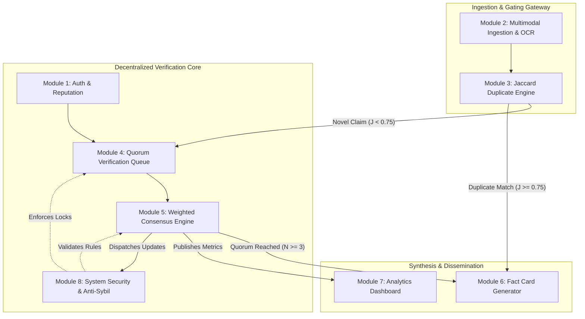
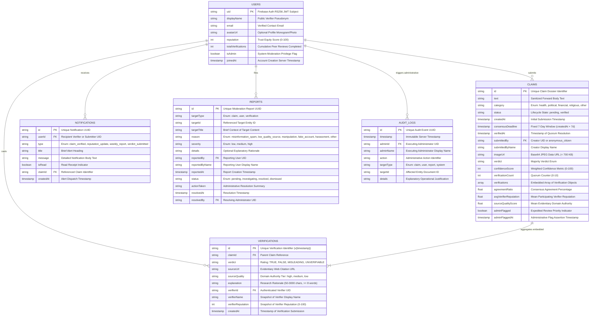
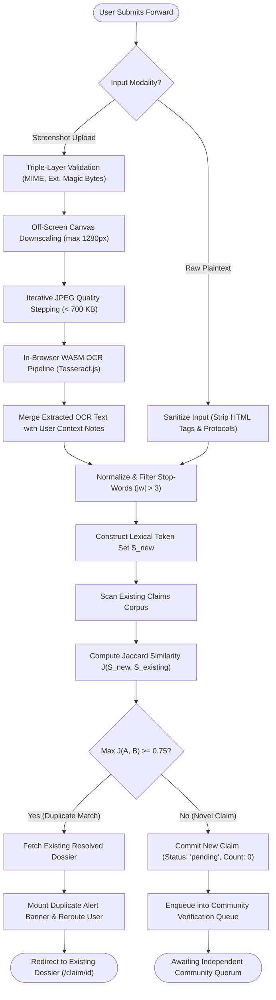
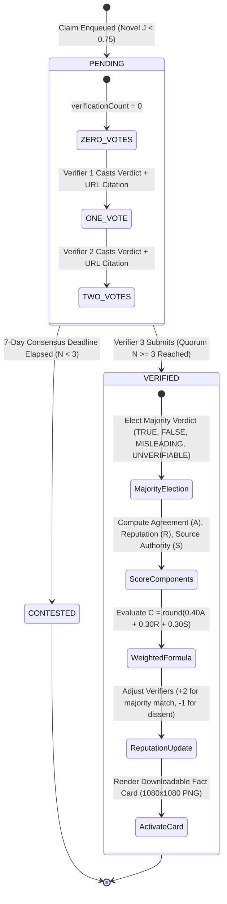
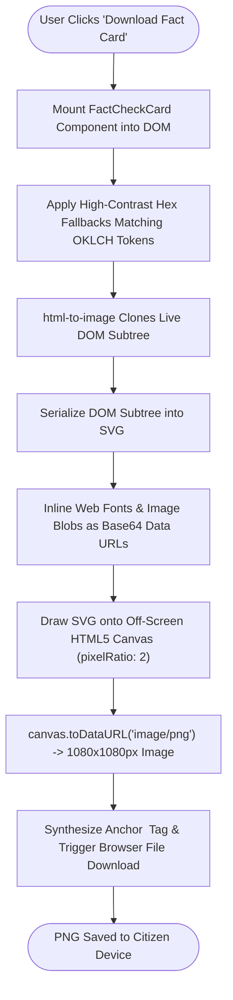

# CHAPTER 4: SYSTEM DESIGN

> This document constitutes the complete, publication-grade consolidated master draft for Chapter 4 (System Design) of the FactStamp Black Book dissertation, prepared in accordance with University of Mumbai syllabus guidelines for Course JUSIT-DSCPR503.

---


---

# 4.1 Basic Modules

The architectural framework of **FactStamp** is structured around eight specialized, loosely coupled, and functionally cohesive subsystems designed to execute end-to-end crowdsourced misinformation verification. Addressing the unique operational constraints of WhatsApp forwards in India—high viral velocity, multi-format media (text and screenshots), encrypted peer-to-peer messaging boundaries, and closed-group propagation—the system decentralizes verification while maintaining rigorous analytical, mathematical, and cryptographic safeguards.

---

## 4.1.1 Architectural Overview & Basic Modules Index

The eight basic modules cleanly delineate responsibilities across content intake, mathematical similarity gating, decentralized community peer review, algorithmic consensus calculation, visual artifact synthesis, macro-level analytical intelligence, and holistic system security:

| Module Identifier | Module Name | Architectural Layer | Core Functional Responsibility |
| :---: | :--- | :--- | :--- |
| **Module 1** | **Authentication & Verifier Reputation Subsystem** | Identity & Access Control (RBAC) | Firebase Auth (OIDC, RS256 JWT), user profile state management, dynamic reputation accounting ($0 \le R \le 100$), and role authorization. |
| **Module 2** | **Multimodal Forward Ingestion & Preprocessing Subsystem** | Client Ingestion Gateway | Plaintext sanitization, screenshot validation, client-side HTML5 canvas downscaling ($< 700\text{ KB}$ ceiling), and in-browser WASM OCR transcription. |
| **Module 3** | **Jaccard Duplicate Detection Engine** | Deduplication & Routing Gateway | Word-level token inversion, stop-word and particle filtering ($|w| > 3$), Jaccard set-theoretic similarity computation, and duplicate threshold routing ($J \ge 0.75$). |
| **Module 4** | **Decentralized Quorum Verification Queue** | Crowdsourced Peer Review | Public triage queue, 3-verifier quorum mandate ($N \ge 3$), evidentiary source and explanation validation, and 7-day temporal window lifecycle management. |
| **Module 5** | **Weighted Confidence Scoring & Consensus Engine** | Consensus Mathematics | Tri-partite weighted confidence calculation ($C = 0.40A + 0.30R + 0.30S$), majority verdict election, domain authority tier scoring (100/70/30), and reputation deltas. |
| **Module 6** | **High-Fidelity Fact-Check Card Generator** | Dissemination & Visual Synthesis | Browser-native SVG `<foreignObject>` canvas rasterization via `html-to-image`, generating $1080 \times 1080\text{px}$ high-DPI shareable PNG cards with tilted rubber stamps. |
| **Module 7** | **Trending Misinformation Analytics Dashboard** | Analytical Intelligence | 7-day rolling window misinformation radar across five categories, top debunked claims ledger, and community verifier accuracy leaderboards. |
| **Module 8** | **System Security, Anti-Sybil Defense & Real-Time Alerts** | Defense-in-Depth & Alerts | Declarative Firestore security rules, self-verification lock ($P_{\text{self}}$), 30-min idle session invalidation, 5-attempt brute-force lockout, and real-time alerts. |



---

## 4.1.2 Detailed Specifications for the Eight Basic Modules

### 1. Module 1: Authentication & Verifier Reputation Subsystem

#### 1.1 Architectural Purpose & Role
Module 1 governs identity verification, role-based access control (RBAC), and persistent reputation accounting across the FactStamp ecosystem. To maximize civic engagement and eliminate barriers for citizens seeking fact-checking assistance, reading published fact-checks, browsing the queue, and submitting suspicious forwards require zero authentication. However, evaluating claims, submitting evidentiary citations, casting consensus votes, and accessing administrative moderation tools strictly mandate authenticated verifier status.

#### 1.2 Identity Management & Session Cryptography
- **Identity Provider:** Firebase Authentication operating on OpenID Connect (OIDC) protocols and Google Identity Services.
- **Session Tokens:** Asymmetric RS256-signed JSON Web Tokens (JWT). The token encapsulates user identity claims (`uid`, `email`, `email_verified`) and is automatically refreshed by the client SDK every 60 minutes over TLS 1.3.
- **Authentication Modalities:**
  1. *Email/Password Authentication:* Implements client-side password strength evaluation, SHA-256 password hashing with salt stretching within Google Identity infrastructure, and brute-force protection.
  2. *Google OAuth 2.0 Identity Federation:* Seamless single-sign-on (SSO) ensuring cryptographically verified email association and frictionless onboarding.

#### 1.3 Verifier Profile & Dynamic Reputation State
Each registered verifier corresponds to a persistent document in the `users` Firestore collection (`/users/{uid}`):
- **Baseline Trust Equity:** Newly registered verifiers are initialized with an equity score of $R_0 = 50$ on a closed integer scale $[0, 100]$.
- **Game-Theoretic Reputation Dynamics:**
  - When a claim resolves upon accumulating its 3-verifier quorum, the consensus engine compares each participant's vote against the majority outcome $V_{\text{majority}}$.
  - Alignment Reward: Participating verifiers who concurred with the majority verdict receive $+2$ reputation points ($\Delta R = +2$).
  - Dissent / Carelessness Penalty: Verifiers who dissented from the majority verdict receive a $-1$ reputation point deduction ($\Delta R = -1$).
  - Boundary Invariant: The new score is bounded: $R_{\text{new}} = \min(100, \max(0, R_{\text{current}} + \Delta R))$.
- **Role-Based Privilege Separation:** User profiles maintain an `isAdmin` boolean flag. System administrators can flag urgent viral claims (`adminFlagged: true`), review incident reports, and execute moderation overrides. Field updates to `reputation`, `totalVerifications`, and `isAdmin` are strictly locked against self-modification in `firestore.rules`.

---

### 2. Module 2: Multimodal Forward Ingestion & Preprocessing Subsystem (with OCR Pipeline)

#### 2.1 Architectural Purpose & Role
WhatsApp misinformation circulates in two primary formats: raw forwarded text (often accompanied by "Forwarded many times" indicators) and screenshot images of sensational newspaper clippings, forged government circulars, social media screenshots, or manipulated graphics. Module 2 acts as the ingestion gateway, sanitizing incoming data, enforcing file integrity, and standardizing payloads for downstream processing.

```
+-------------------------------------------------------------------------------+
|             MULTIMODAL INGESTION & CLIENT PREPROCESSING PIPELINE              |
+------------------------------------+------------------------------------------+
| Plaintext Forward Pathway          | Screenshot Image Pathway                 |
+------------------------------------+------------------------------------------+
| 1. Textarea Input (20–2,000 chars) | 1. File Picker / Drag-and-Drop (< 5 MB)  |
| 2. Regex Sanitize (HTML/Protocols) | 2. Triple-Layer Validation (Magic Bytes) |
| 3. Collapse Whitespace & Trim      | 3. Canvas Proportional Downscale (1280px)|
| 4. Lexical Token Extraction        | 4. Iterative JPEG Quality Step (< 700 KB)|
| 5. Feed to Jaccard Engine          | 5. In-Browser Tesseract.js OCR Pipeline  |
+------------------------------------+------------------------------------------+
```

#### 2.2 Plaintext Ingestion Pathway
- **Payload Constraints:** String input constrained between $20$ and $2,000$ characters.
- **Client-Side Sanitization:** Strips dangerous HTML tags (`<script>`, `<iframe>`, `<object>`, `<embed>`, `<form>`, `<style>`), inline event handlers (`onload=`, `onerror=`), and pseudo-protocols (`javascript:`, `data:`) using `sanitizeTextInput()` in `src/lib/security.ts`.
- **Normalization:** Collapses consecutive whitespace, converts characters to lowercase, and strips non-alphanumeric punctuation.

#### 2.3 Screenshot Ingestion & Automated OCR Pipeline
- **Upload Constraints:** Supported MIME types: `image/jpeg`, `image/png`, `image/webp`, `image/gif`, up to $5\text{ MB}$.
- **Triple-Layer File Upload Defense:**
  1. *Extension Whitelisting:* Verifies extension matches `.jpg`, `.jpeg`, `.png`, `.webp`, or `.gif`.
  2. *MIME-Type Whitelisting:* Confirms browser-reported MIME against `ALLOWED_IMAGE_MIMES`.
  3. *Binary Magic Byte Inspection:* Reads the first 12 bytes into an `ArrayBuffer` via `FileReader` and asserts valid binary signatures:
     - JPEG: `0xFF 0xD8 0xFF`
     - PNG: `0x89 0x50 0x4E 0x47` (ASCII `\x89PNG`)
     - GIF: `0x47 0x49 0x46 0x38` (ASCII `GIF8`)
     - WebP: `0x52 0x49 0x46 0x46` (ASCII `RIFF`)
- **Client-Side HTML5 Canvas Downscaling & Compression:**
  - Standard cloud storage buckets (e.g., AWS S3, Google Cloud Storage) incur persistent bandwidth and egress fees. To preserve a 100% zero-cost architecture, Module 2 downscales screenshots directly inside the browser using an off-screen HTML5 `<canvas>` element.
  - The maximum dimension is bounded to $1280\text{px}$ using proportional aspect ratio scaling:
    $$\text{scale} = \min\left(1.0, \frac{1280}{\max(W, H)}\right), \quad W_{\text{target}} = \text{round}(W \cdot \text{scale}), \quad H_{\text{target}} = \text{round}(H \cdot \text{scale})$$
  - Iterative JPEG Quality Stepping: Initializes quality at $Q = 0.72$. If the estimated base64 byte payload exceeds $700\text{ KB}$ ($700,000\text{ bytes}$), $Q$ decrements by $\Delta Q = 0.08$ down to a floor of $0.40$.
  - The resulting base64 data URL is stored directly on the Firestore claim document (`imageUrl`), strictly complying with Firestore's $1\text{ MiB}$ document ceiling.
- **In-Browser WebAssembly OCR Pipeline:**
  - Integrates Tesseract.js running within a dedicated Web Worker to extract textual assertions directly from screenshots on the client.
  - Extracted text is normalized and fed into the duplicate detection pipeline alongside user-submitted contextual notes.

---

### 3. Module 3: Jaccard Duplicate Detection Engine

#### 3.1 Architectural Purpose & Role
Viral misinformation is characterized by extreme duplication: when a sensational forward goes viral, thousands of citizens receive identical or slightly rephrased messages simultaneously across closed WhatsApp groups. If every submission created a distinct verification ticket, community verifier effort would fragment across dozens of redundant threads, causing quorum starvation and delayed debunking. Module 3 operates as an inline gatekeeper, computing set-theoretic similarity against all active and resolved claims before a new record is committed to the database.

#### 3.2 Mathematical Formulation
Module 3 computes word-level Jaccard similarity. Let $A$ represent the significant token set of the incoming forward and $B$ represent the token set of an existing claim in the database:

$$J(A, B) = \frac{|A \cap B|}{|A \cup B|} = \frac{|A \cap B|}{|A| + |B| - |A \cap B|}$$

#### 3.3 Algorithmic Execution & Boundary Invariants
1. **Normalization:** Input strings are converted to lowercase, stripped of non-word characters (`replace(/[^\w\s]/g, '')`), and whitespace-collapsed.
2. **Lexical Filtering ($|w| > 3$):** Words with length $\le 3$ characters (e.g., "the", "and", "for", "with", "this", "that") are eliminated. This prevents common syntactic particles from artificially inflating intersection cardinality $|A \cap B|$.
3. **Set Construction:** The remaining significant words form unique mathematical sets $S_A$ and $S_B$.
4. **Boundary Handling:**
   - If $|S_A| = 0$ and $|S_B| = 0 \implies J(A, B) = 1.0$.
   - If $|S_A| = 0$ or $|S_B| = 0 \implies J(A, B) = 0.0$.
5. **Bifurcated Threshold Routing ($J \ge 0.75$):**
   - If $\max_{k} J(A, B_k) \ge 0.75$, the submission is classified as a definitive duplicate. Database creation is aborted, a notification banner alerts the user, and the browser redirects to the existing dossier (`/claim/{id}`).
   - If $\max_{k} J(A, B_k) < 0.75$, the submission is classified as a novel claim and committed to Firestore with `status: 'pending'` and `verificationCount: 0`.

---

### 4. Module 4: Decentralized Quorum Verification Queue

#### 4.1 Architectural Purpose & Role
Module 4 coordinates crowdsourced peer review. Novel claims enter a transparent public queue where authenticated community verifiers investigate primary sources, evaluate evidentiary claims, and register formal verdicts.

#### 4.2 Operational Lifecycle & Parameters
- **Quorum Threshold ($N_{\text{min}} = 3$):** A claim cannot resolve based on a single opinion. A minimum of three ($3$) independent, authenticated verifications is required before transitioning a claim from `'pending'` to `'verified'`.
- **Verdict Lexicon:**
  - `TRUE`: The claim is factual, accurate, and corroborated by authoritative primary documentation.
  - `FALSE`: The claim is demonstrably fabricated, distorted, or contrary to verifiable facts.
  - `MISLEADING`: The claim contains a partial truth framed deceptively, with manipulated statistics or out-of-context claims.
  - `UNVERIFIABLE`: The claim cannot be confirmed or debunked due to complete absence of public evidence or ambiguous phrasing.
- **Evidence Mandate & Anti-Spam Safeguards:**
  - Every verification mandates an HTTP/HTTPS primary source citation ($10 \le \text{length} \le 500\text{ chars}$).
  - Verifiers must provide a research explanation of at least $50$ characters and $8$ words ($50 \le \text{length} \le 3000\text{ chars}$).
  - Client-side heuristic filters reject repetitive character spam (e.g., `aaaaaa`), repetitive words (`fake fake fake`), generic cop-outs (`"trust me bro"`, `"check google"`), and verbatim copies of the claim text.
- **Temporal 7-Day Expiry Window:**
  - Claims maintain a consensus deadline set to 7 days from submission ($T_{\text{deadline}} = T_{\text{created}} + 7\text{ days}$).
  - If a claim fails to accumulate 3 independent verifications upon deadline expiration, the queue worker automatically resolves the claim under the verdict status `CONTESTED`.

---

### 5. Module 5: Weighted Confidence Scoring & Consensus Engine

#### 5.1 Architectural Purpose & Role
Naive democratic voting (1-person-1-vote) is easily exploited by coordinated troll brigades and bot farms. Conversely, relying solely on elite reputations entrenches oligarchical monopolies. Module 5 implements a robust, multi-parameter weighted consensus algorithm that computes both the majority verdict and an accompanying confidence percentage $C \in [0, 100]$.

#### 5.2 Mathematical Formulation
When a claim reaches its required quorum ($N \ge 3$), the composite confidence score $C$ is computed as:

$$C = \min\Big(100, \max\big(0, \text{round}(0.40 \cdot A + 0.30 \cdot R + 0.30 \cdot S)\big)\Big)$$

Where:
- **$A$ (Agreement Ratio, $40\%$ Weight):** The percentage of participating verifiers concurring with the elected majority verdict $V_{\text{majority}}$:
  $$A = \left( \frac{\sum_{i=1}^N \mathbf{1}_{[\text{verdict}_i = V_{\text{majority}}]}}{N} \right) \times 100$$
- **$R$ (Average Verifier Reputation, $30\%$ Weight):** The arithmetic mean of the normalized reputation scores of all contributing verifiers ($r_i \in [0, 100]$):
  $$R = \frac{1}{N} \sum_{i=1}^N r_i$$
- **$S$ (Average Evidentiary Source Quality, $30\%$ Weight):** The arithmetic mean of the numeric domain authority scores ($s_i \in \{30, 70, 100\}$) derived from cited URLs:
  $$S = \frac{1}{N} \sum_{i=1}^N s_i$$

#### 5.3 Domain Authority Classification Matrix
Source URLs are automatically parsed and evaluated against domain credibility sets:
- **Tier 1 — High Quality ($S_i = 100$):** Official governmental portals, institutional health authorities, constitutional bodies, and verified encyclopedias:
  `who.int`, `nih.gov`, `ncbi.nlm.nih.gov`, `pib.gov.in`, `eci.gov.in`, `mohfw.gov.in`, `icmr.gov.in`, `ayush.gov.in`, `ceodelhi.gov.in`, `wikipedia.org`, `indiacode.nic.in`, `rbi.org.in`.
- **Tier 2 — Medium Quality ($S_i = 70$):** Established mainstream news outlets and recognized international fact-checking organizations:
  `timesofindia.indiatimes.com`, `indianexpress.com`, `thehindu.com`, `bbc.com`, `bbc.in`, `reuters.com`, `apnews.com`, `ndtv.com`, `economictimes.com`, `factcheck.org`, `iitm.org`, `snopes.com`.
- **Tier 3 — Low Quality ($S_i = 30$):** Unverified blogs, social media posts, unindexed web pages, or unrecognized domains.

---

### 6. Module 6: High-Fidelity Fact-Check Card Generator

#### 6.1 Architectural Purpose & Role
Fact-checking web pages rarely reach the viral WhatsApp chat threads where misinformation does the greatest harm. Module 6 synthesizes a shareable, visual fact-check card—an exact $1080 \times 1080\text{px}$ high-DPI PNG image—engineered specifically to be downloaded and forwarded back into WhatsApp chat groups as an evidentiary rebuttal.

#### 6.2 Browser-Native SVG `<foreignObject>` Rasterization Pipeline
- **Legacy Parser Elimination:** Legacy canvas libraries (such as `html2canvas`) rely on outdated CSS parsers that crash when encountering modern CSS Color Module Level 4 definitions (`oklch()`, `oklab()`) and Tailwind CSS v4 variables.
- **Modern Architecture:** Module 6 leverages `html-to-image`, which clones the live DOM tree, serializes it into an SVG `<foreignObject>` container, inlines web fonts and images as data URLs, and draws the SVG onto an off-screen HTML5 Canvas at native browser C++ rendering speeds.
- **Visual Specifications:**
  - Aspect Ratio: Square $1:1$ ratio ($1080 \times 1080\text{px}$ at `pixelRatio: 2`), fitting WhatsApp image previews without center cropping.
  - Saffron Sleek Branding: Warm newsprint background, FactStamp shield icon, and unique case dossier identifier (e.g., `#C_SEED_12`).
  - Claim Display: Clean word-boundary truncation to $\le 150$ characters inside a bordered quote box.
  - Signature Rubber-Stamp Verdict Badge: Rendered with an authentic $\approx 6^\circ$ counter-clockwise tilt, bold border, and double-encoded Lucide icon.
  - Evidentiary Summary: JetBrains Mono confidence meter, quorum count ($3/3$ verifiers), consensus rationale paragraph, and authoritative source domain tags (`who.int`, `pib.gov.in`).
  - Anti-Clipping Design: Explicit pixel bounding heights and `overflow: visible` prevent font truncation across Android and iOS image decoders.

---

### 7. Module 7: Trending Misinformation Analytics Dashboard

#### 7.1 Architectural Purpose & Role
Module 7 delivers aggregate analytical intelligence regarding misinformation trends across India. It provides researchers, journalists, and public administrators with a macro-level overview of rumor category distributions, verification velocity, and verifier participation.

#### 7.2 Core Analytical Metrics & Components
- **Rolling 7-Day Misinformation Radar:** Tracks daily submission volume partitioned across five distinct categories:
  1. *Health:* Fabricated medical cures, vaccine myths, unproven home remedies.
  2. *Political:* Fake political quotes, manipulated election claims, fabricated policy directives.
  3. *Financial:* Phishing scams, fraudulent government subsidies, lottery hoaxes.
  4. *Religious:* Communally divisive rumors, fabricated historical events.
  5. *Other:* Miscellaneous viral hoaxes and urban legends.
- **Top Debunked Claims Ledger:** Surfaces claims with the highest community engagement and definitive `FALSE` or `MISLEADING` verdicts.
- **Community Verifier Leaderboard:** Ranks verifiers based on total verified cases, historical consensus alignment rate, and current reputation tier.
- **Visualization Engine:** High-performance responsive charts rendered using Recharts and Framer Motion animated counters.

---

### 8. Module 8: System Security, Anti-Sybil Defense & Real-Time Alerts Subsystem

#### 8.1 Architectural Purpose & Role
Open civic platforms operate in an inherently adversarial environment. Bad actors, coordinated troll networks, and automated scripts have strong incentives to subvert consensus outcomes or flood the verification queue. Module 8 provides defense-in-depth across client, transport, and database layers.

#### 8.2 Security Mechanisms & Defensive Invariants
1. **Self-Verification Lock ($P_{\text{self}}$):** A citizen who submits a claim is strictly disqualified from verifying their own submission:
   $$P(u, c) \iff c.\text{submittedBy} \neq u.\text{uid}$$
   Enforced in UI state and asserted at the database layer in `firestore.rules`.
2. **Single-Verification-Per-User Invariant:** A verifier can submit at most one verification per claim dossier:
   $$\forall v_i, v_j \in c.\text{verifications}, \quad i \neq j \implies v_i.\text{verifierId} \neq v_j.\text{verifierId}$$
3. **Session Inactivity Invalidation:** User interactions touch `sessionStorage` timestamps. If idle time exceeds $30$ minutes ($1,800,000\text{ ms}$), the session is invalidated and sensitive memory state is wiped.
4. **Exponential Brute-Force Throttling:** Client-side authentication enforces a hard lockout after $5$ consecutive failed attempts for a $15$-minute duration ($900,000\text{ ms}$), partitioned by targeted email identifier.
5. **Real-Time Notification Alerts:** WebSocket-based listeners (`onSnapshot`) on `/notifications` dispatch instant in-app alerts when a claim achieves consensus, reputation updates occur, or admin intervention is requested.
6. **Administrative Audit Logging:** Privileged moderation actions (flagging viral claims, overriding verdicts, resolving reports) write immutable records to `/audit_logs`.

---

## 4.1.3 Inter-Module Data & Control Flow

The eight modules collaborate across three distinct operational phases:

1. **Ingestion & Validation Phase:**
   A citizen forwards suspicious content to Module 2. Plaintext is sanitized while screenshots undergo magic byte validation, canvas downscaling to $< 700\text{ KB}$, and WASM OCR transcription. The resulting text is passed to Module 3.
2. **Deduplication & Triage Phase:**
   Module 3 computes word-level Jaccard similarity ($|w| > 3$). If $J \ge 0.75$, the submission is intercepted and redirected to Module 6 to display the existing fact card. If $J < 0.75$, the claim is enqueued in Module 4 with `status: 'pending'`.
3. **Peer Review & Consensus Resolution Phase:**
   Authenticated verifiers (Module 1) review claims in Module 4 under security assertions enforced by Module 8. When the 3rd verification is recorded, Module 5 executes weighted consensus ($C = 0.40A + 0.30R + 0.30S$), updates verifier reputations ($+2/-1$), updates the analytics radar (Module 7), dispatches alerts (Module 8), and unlocks fact card generation (Module 6).

---

# 4.2 Data Design

Data design represents a foundational engineering pillar of **FactStamp**. Unlike conventional social networks built on rigid relational schemas, FactStamp leverages a real-time, document-oriented NoSQL model powered by **Google Cloud Firestore**. This design satisfies the high-throughput, low-latency demands of viral misinformation triage while accommodating semi-structured forward data, dynamic quorum verifications, and reactive client subscriptions.

---

## 4.2.1 Database Paradigm Evaluation: NoSQL Document Store vs. RDBMS

The architectural decision to deploy Cloud Firestore rather than a traditional Relational Database Management System (such as PostgreSQL or MySQL) was dictated by four core architectural requirements:

| Architectural Evaluation Dimension | Traditional Relational Database (RDBMS) | Cloud Firestore (NoSQL Document Store) | FactStamp Architectural Rationale |
| :--- | :--- | :--- | :--- |
| **Data Structure Flexibility** | Rigid tabular schemas; schema alterations require DDL migrations and table locking. | Dynamic JSON-like BSON/document trees; flexible embedded arrays. | WhatsApp forward submissions vary from short plain text to rich multimodal attachments with dynamic verifier lists. |
| **Real-Time Client Synchronization** | Requires external WebSocket brokers (Socket.io), Redis Pub/Sub, or database polling. | Native WebSocket-based listeners (`onSnapshot`) built into client SDKs. | Essential for collaborative triage: verifiers and citizens observe live updates as quorum counters advance. |
| **Atomic Read Efficiency (Quorum Dossier)** | Requires multi-table relational `JOIN` operations across `claims`, `verifications`, and `users`. | Denormalized embedded arrays inside the root claim document. | A single atomic document read retrieves the complete claim dossier, eliminating relational join latency and egress round-trips. |
| **Operational Economics & Sustainability** | Continuous compute billing for idle server instances ($15–$50/month). | Serverless consumption model with generous free Spark tier ($0/month). | Preserves 100% zero-cost infrastructure for civic longevity and university research sustainability. |

---

## 4.2.2 Conceptual Entity-Relationship (E-R) Model

The FactStamp data architecture models six primary entities: `USERS`, `CLAIMS`, embedded `VERIFICATIONS`, `NOTIFICATIONS`, `REPORTS`, and `AUDIT_LOGS`. Embedded denormalization is leveraged for high-frequency dossier hydration, while transactional consistency is enforced via database security assertions.



---

## 4.2.3 Physical Schema Design & Complete Data Dictionaries

The physical data model of FactStamp is organized into top-level collections in Cloud Firestore. Each collection and embedded entity schema is formally specified below.

### 1. `users` Collection Schema
- **Path:** `/databases/{database}/documents/users/{uid}`
- **Description:** Maintains verifier identity profiles, role-based access attributes, and persistent trust reputation scores.

| Field Name | Data Type | Nullable | Default Value | Integrity Constraints & Validation Rules |
| :--- | :--- | :---: | :---: | :--- |
| `uid` | `string` | No | *N/A* | Firebase Auth unique identifier (RS256 JWT subject). Document Primary Key. |
| `displayName` | `string` | No | *N/A* | Public verifier pseudonym or real name. Constraints: $1 \le \text{length} \le 100$. |
| `email` | `string` | No | *N/A* | Verified email address. Must strictly match `request.auth.token.email`. |
| `avatarUrl` | `string` | Yes | `null` | Optional URI pointing to user profile avatar or generated initial monogram. |
| `reputation` | `int` | No | `50` | Trust equity score ($0 \le R \le 100$). Initialized to 50 upon registration. Strictly immutable by self. |
| `totalVerifications` | `int` | No | `0` | Cumulative count of registered peer reviews ($\ge 0$). Incremented atomically. |
| `isAdmin` | `boolean` | No | `false` | System moderation flag granting claim flagging and override authority. Immutable by self. |
| `joinedAt` | `timestamp` | No | `request.time` | ISO-8601 server timestamp of account registration. Strictly immutable after creation. |

### 2. `claims` Collection Schema
- **Path:** `/databases/{database}/documents/claims/{claimId}`
- **Description:** The core transactional collection storing citizen forward submissions, image payloads, embedded verification arrays, and consensus outcomes.

| Field Name | Data Type | Nullable | Default Value | Integrity Constraints & Validation Rules |
| :--- | :--- | :---: | :---: | :--- |
| `id` | `string` | No | *Auto* | Unique alphanumeric identifier assigned by Firestore SDK. Document Primary Key. |
| `text` | `string` | No | *N/A* | Normalized body of the forward. Constraints: $10 \le \text{length} \le 2000$ characters. |
| `category` | `string` | No | *N/A* | Enum: `['health', 'political', 'financial', 'religious', 'other']`. |
| `status` | `string` | No | `'pending'` | Lifecycle state: `'pending'` (awaiting quorum) or `'verified'` (resolved or contested). |
| `createdAt` | `timestamp` | No | `request.time` | Server timestamp of initial submission. Strictly immutable. |
| `consensusDeadline`| `timestamp` | No | `createdAt + 7d`| Fixed temporal window for community quorum resolution. Strictly immutable. |
| `verifiedAt` | `timestamp` | Yes | `null` | Server timestamp when the 3rd verification was submitted or when marked CONTESTED. |
| `submittedBy` | `string` | No | *N/A* | UID of submitter (or `'anonymous_citizen'`). Used to enforce self-verification lock. |
| `submittedByName` | `string` | No | *N/A* | Display name of the submitter ($1 \le \text{length} \le 100$). |
| `imageUrl` | `string` | Yes | `null` | Base64 JPEG data URL ($< 700\text{ KB}$, string length $\le 800,000$ characters). |
| `verdict` | `string` | Yes | `null` | Majority outcome: `['TRUE', 'FALSE', 'MISLEADING', 'UNVERIFIABLE', 'CONTESTED']`. |
| `confidenceScore` | `int` | Yes | `null` | Computed weighted certainty metric. Closed integer range: $0 \le C \le 100$. |
| `verificationCount`| `int` | No | `0` | Count of registered peer reviews ($0 \le N \le 10$). Equal to `verifications.length`. |
| `verifications` | `array<map>`| No | `[]` | Embedded list of verification objects (detailed below). Maximum capacity: 10. |
| `agreementRatio` | `float` | Yes | `null` | Consensus agreement percentage ($0.0 \le A \le 100.0$). |
| `avgVerifierReputation`| `float`| Yes | `null` | Arithmetic mean reputation of participating verifiers ($0.0 \le R \le 100.0$). |
| `sourceQualityScore`| `float` | Yes | `null` | Arithmetic mean source domain authority ($30.0 \le S \le 100.0$). |
| `adminFlagged` | `boolean` | No | `false` | Expedited review priority indicator. Only mutable by administrators. |
| `adminFlaggedAt` | `timestamp` | Yes | `null` | Server timestamp when administrative priority flag was asserted. |

### 3. Embedded `verifications` Array Schema
- **Path:** Stored as an array of structured maps inside `/claims/{claimId}.verifications`.
- **Description:** Captures individual peer reviews. Embedding inside the parent claim guarantees atomic single-read dossier hydration.

| Property Name | Data Type | Nullable | Description & Integrity Constraints |
| :--- | :--- | :---: | :--- |
| `id` | `string` | No | Unique verification identifier formatted as `v{timestamp}`. |
| `claimId` | `string` | No | Foreign Key referencing parent `claims.id`. |
| `verdict` | `string` | No | Individual rating enum: `['TRUE', 'FALSE', 'MISLEADING', 'UNVERIFIABLE']`. |
| `sourceUrl` | `string` | No | Evidentiary web citation. Must start with `http://` or `https://` ($\le 500$ chars). |
| `sourceQuality` | `string` | No | Domain authority classification: `'high'` ($100$), `'medium'` ($70$), or `'low'` ($30$). |
| `explanation` | `string` | No | Research rationale ($50 \le \text{length} \le 3000$ characters, minimum 8 words). |
| `verifierId` | `string` | No | Foreign Key referencing `users.uid`. Must strictly match `request.auth.uid`. |
| `verifierName` | `string` | No | Snapshot of verifier's display name at vote time ($1 \le \text{length} \le 100$). |
| `verifierReputation`| `int` | No | Snapshot of verifier's reputation score at vote time ($0 \le R \le 100$). |
| `createdAt` | `timestamp` | No | Server timestamp when verification record was appended. |

### 4. `notifications` Collection Schema
- **Path:** `/databases/{database}/documents/notifications/{notificationId}`
- **Description:** Stores real-time in-app alerts dispatched to verifiers and submitters upon consensus resolution or reputation updates.

| Field Name | Data Type | Nullable | Description & Integrity Constraints |
| :--- | :--- | :---: | :--- |
| `id` | `string` | No | Unique notification identifier. Document Primary Key. |
| `userId` | `string` | No | Target recipient (`users.uid`). Indexed for owner query. |
| `type` | `string` | No | Enum: `['claim_verified', 'reputation_update', 'weekly_report', 'verdict_submitted']`. |
| `title` | `string` | No | Summary title of alert ($1 \le \text{length} \le 200$ characters). |
| `message` | `string` | No | Detailed notification body text ($1 \le \text{length} \le 2000$ characters). |
| `isRead` | `boolean` | No | Read status indicator. Toggled upon user interaction. Default: `false`. |
| `claimId` | `string` | Yes | Optional foreign key pointing to the referenced claim document. |
| `createdAt` | `timestamp` | No | Server timestamp of notification generation. |

### 5. `reports` Collection Schema
- **Path:** `/databases/{database}/documents/reports/{reportId}`
- **Description:** Facilitates community moderation, allowing users to report abusive claims, toxic explanations, or suspicious sockpuppet activities.

| Field Name | Data Type | Nullable | Description & Integrity Constraints |
| :--- | :--- | :---: | :--- |
| `id` | `string` | No | Unique moderation report identifier. Document Primary Key. |
| `targetType` | `string` | No | Entity classification enum: `['claim', 'user', 'verification']`. |
| `targetId` | `string` | No | Identifier of the reported claim (`claims.id`), user (`users.uid`), or verification. |
| `targetTitle` | `string` | No | Brief context or summary title of reported content ($1 \le \text{length} \le 300$). |
| `reason` | `string` | No | Enum: `['misinformation_spam', 'low_quality_source', 'manipulation', 'fake_account', 'harassment', 'other']`. |
| `severity` | `string` | No | Severity tier enum: `['low', 'medium', 'high']`. |
| `details` | `string` | Yes | Optional descriptive context provided by reporting citizen ($\le 3000$ characters). |
| `reportedBy` | `string` | No | UID of reporting user (`users.uid`). Must match `request.auth.uid`. |
| `reportedByName` | `string` | No | Display name of reporting user ($1 \le \text{length} \le 100$). |
| `reportedAt` | `timestamp` | No | Server timestamp when report was filed. |
| `status` | `string` | No | Moderation state: `['pending', 'investigating', 'resolved', 'dismissed']`. Default: `'pending'`. |
| `actionTaken` | `string` | Yes | Summary of administrative action taken upon investigation ($\le 1000$ characters). |
| `resolvedAt` | `timestamp` | Yes | Timestamp when report was resolved. |
| `resolvedBy` | `string` | Yes | UID of administrator who investigated the report (`users.uid`). |

### 6. `audit_logs` Collection Schema
- **Path:** `/databases/{database}/documents/audit_logs/{logId}`
- **Description:** Immutable administrative audit ledger recording privileged moderation interventions, claim priority flagging, and system overrides.

| Field Name | Data Type | Nullable | Description & Integrity Constraints |
| :--- | :--- | :---: | :--- |
| `id` | `string` | No | Unique audit event identifier. Document Primary Key. |
| `timestamp` | `timestamp` | No | Server timestamp of action execution. Strictly immutable. |
| `adminId` | `string` | No | UID of executing administrator (`users.uid`). Must satisfy `isAdmin == true`. |
| `adminName` | `string` | No | Cached display name of executing administrator ($1 \le \text{length} \le 100$). |
| `action` | `string` | No | Operational action identifier ($1 \le \text{length} \le 200$, e.g., `'flag_claim'`, `'override_verdict'`). |
| `targetType` | `string` | No | Entity enum: `['claim', 'user', 'report', 'system']`. |
| `targetId` | `string` | No | Document ID of the affected entity. |
| `details` | `string` | No | Mandatory operational justification for audit review ($1 \le \text{length} \le 2000$). |

---

## 4.2.4 Data Integrity, Referential Constraints & Security Invariants

In serverless NoSQL architectures lacking SQL foreign key triggers, integrity must be programmatically guaranteed at the database boundary via declarative rules in `firestore.rules`.

### 1. Referential Integrity & Anti-Orphan Guarantees
- **Denormalization Snapshot Trade-off:** Verifier attributes (`verifierName`, `verifierReputation`) are denormalized and captured snapshot-style inside the `verifications` array of `/claims/{claimId}`. This guarantees that subsequent modifications to a user's display name or reputation score do not retroactively alter historical consensus records.
- **Cascade Containment:** Deleting a user profile does not invalidate past community verifications; evidentiary contributions remain anchored inside the claim's immutable audit array.
- **Atomic Pre-Condition Assertions:** To prevent race conditions when multiple verifiers submit votes simultaneously, Firestore update rules assert:
  ```javascript
  request.resource.data.verificationCount == resource.data.verificationCount + 1
  && request.resource.data.verifications.hasAll(resource.data.verifications)
  ```
  This guarantees that incoming writes must append exactly one element while preserving all existing verifications without truncation.

### 2. Core Security Invariants in `firestore.rules`

#### Invariant A: Immutability of Core Claim Identity
Once a citizen submits a forward, its substantive text, category, creator identity, and deadline cannot be modified by any user, preventing "bait-and-switch" tampering:

```javascript
// Helper verifying that a specific document field was not altered during an update
function isUnchanged(field) {
  return request.resource.data.get(field, null) == resource.data.get(field, null);
}

// Enforces strict immutability across core claim identity fields
function identityUnchanged() {
  return isUnchanged('text')
    && isUnchanged('category')
    && isUnchanged('submittedBy')
    && isUnchanged('submittedByName')
    && isUnchanged('createdAt')
    && isUnchanged('consensusDeadline')
    && isUnchanged('imageUrl');
}
```

#### Invariant B: Verifier Identity & Self-Verification Lock
To eliminate conflicts of interest and Sybil manipulation, a user cannot submit a verification where the `verifierId` does not match their authenticated session token, nor can they verify a claim they submitted:

```javascript
// From match /claims/{claimId} update rule (Case C: Adding verification):
allow update: if request.auth != null
  && (
    identityUnchanged()
    && isUnchanged('adminFlagged')
    && isUnchanged('adminFlaggedAt')
    // Verification count must increment by exactly 1
    && request.resource.data.verificationCount == resource.data.verificationCount + 1
    // Preserves all prior verifications without modification
    && request.resource.data.verifications.hasAll(resource.data.verifications)
    // Newly appended verification must belong to the authenticated caller
    && request.resource.data.verifications[resource.data.verifications.size()].verifierId == request.auth.uid
    // Claimed reputation must strictly match the official server-side user profile
    && request.resource.data.verifications[resource.data.verifications.size()].verifierReputation 
       == get(/databases/$(database)/documents/users/$(request.auth.uid)).data.reputation
    // Submitter cannot verify their own claim (Self-Verification Lock)
    && resource.data.submittedBy != request.auth.uid
    // Strict input validation on evidence parameters
    && request.resource.data.verifications[resource.data.verifications.size()].verdict in ['TRUE', 'FALSE', 'MISLEADING', 'UNVERIFIABLE']
    && request.resource.data.verifications[resource.data.verifications.size()].sourceUrl.matches('^https?://.+')
    && request.resource.data.verifications[resource.data.verifications.size()].sourceUrl.size() <= 500
    && request.resource.data.verifications[resource.data.verifications.size()].explanation.size() >= 50
    && request.resource.data.verifications[resource.data.verifications.size()].explanation.size() <= 3000
    && request.resource.data.verifications[resource.data.verifications.size()].verifierName.size() <= 100
  );
```

#### Invariant C: Strict Privilege Separation on User Profiles
Users can modify their own display name, but cannot elevate their reputation score or grant themselves administrator privileges:

```javascript
match /users/{uid} {
  allow read: if request.auth != null;
  allow update: if request.auth != null && (
    // Admin override: administrators can adjust reputation and assign roles
    isAdmin() ||
    // Self-update: sensitive trust attributes are strictly immutable
    (
      request.auth.uid == uid
      && isUnchanged('uid')
      && isUnchanged('email')
      && isUnchanged('joinedAt')
      && isUnchanged('reputation')
      && isUnchanged('totalVerifications')
      && isUnchanged('isAdmin')
      && request.resource.data.displayName is string
      && request.resource.data.displayName.size() <= 100
    )
  );
}
```

---

## 4.2.5 Storage Footprint & 1 MiB Document Ceiling Compliance

Google Cloud Firestore enforces a strict hard ceiling of $1\text{ MiB}$ ($1,048,576\text{ bytes}$) per document. In FactStamp, screenshot image data URLs are embedded directly on `/claims/{claimId}` documents to eliminate cloud object storage costs. To guarantee that no claim document ever breaches this ceiling, the schema enforces mathematical boundary limits across all fields:

```
+-------------------------------------------------------------------------------+
|             WORST-CASE DOCUMENT STORAGE CEILING BUDGET BREAKDOWN              |
+-----------------------------------+--------------------+----------------------+
| Field Entity Component            | Maximum Permitted  | Worst-Case Footprint |
+-----------------------------------+--------------------+----------------------+
| 1. Forward Text (`text`)          | 2,000 UTF-8 chars  | ~ 8.0 KB             |
| 2. Base64 Screenshot (`imageUrl`) | 800,000 chars      | ~ 600.0 KB           |
| 3. Verifications Array (10 items) | 10 × 4,000 chars   | ~ 40.0 KB            |
| 4. System Metadata & Identifiers  | Timestamps, floats | ~ 2.0 KB             |
+-----------------------------------+--------------------+----------------------+
| TOTAL WORST-CASE DOCUMENT SIZE    |                    | ~ 650.0 KB           |
| FIRESTORE HARD STORAGE CEILING    |                    | 1,048.5 KB (1 MiB)   |
| MARGIN OF SAFETY / HEADROOM       |                    | 398.5 KB (38% buffer)|
+-----------------------------------+--------------------+----------------------+
```

### Formal Compliance Calculation:
$$\text{Size}_{\text{max}} \approx 8.0\text{ KB} + 600.0\text{ KB} + 40.0\text{ KB} + 2.0\text{ KB} = 650.0\text{ KB}$$
$$\frac{650.0\text{ KB}}{1,048.576\text{ KB}} \approx 62.0\% \text{ of maximum ceiling}$$

This leaves a substantial $38\%$ safety margin ($398.5\text{ KB}$), mathematically proving that FactStamp documents operate comfortably within Firestore's limits under extreme viral workloads without risking transaction aborts.

---

# 4.3 Procedural Design

Procedural design articulates the operational execution mechanics, data structures, and algorithmic formulations governing **FactStamp**. It translates conceptual system requirements into concrete computational pipelines, establishing deterministic logic flows for duplicate detection, quorum progression, consensus calculation, and fact card generation.

---

## 4.3.1 Logic Diagrams & Procedural Workflows

### 1. Ingestion & Duplicate Resolution Logic
This procedural flow governs the intake of citizen forwards, standardizing plaintext or screenshot input, extracting embedded text via in-browser OCR, and conducting set-theoretic deduplication against the existing claim corpus before creating database records.



---

### 2. Quorum Verification & State Transition Machine
A submitted claim progresses through deterministic state transitions as community verifiers review primary sources. A minimum quorum of three independent verifiers ($N \ge 3$) is strictly enforced to trigger algorithmic consensus.



---

### 3. Fact Card Generation & Export Pipeline
Once verified, the claim dossier is transformed into a high-DPI, pixel-perfect image artifact engineered specifically for sharing back into WhatsApp chat threads:



---

## 4.3.2 In-Memory Data Structures

The procedural execution pipelines rely on four optimized in-memory data structures to guarantee minimal asymptotic latency and high throughput.

### 1. Inverted Token Set
To compute Jaccard similarity across large claim corpora without redundant string parsing, text strings are transformed into normalized hash sets of significant lexical tokens.

```
Raw Forward String: "Drinking hot boiled ginger water with lemon cures Diabetes permanently"
        │
        ▼ Case Folding & Punctuation Stripping (toLowerCase + replace)
"drinking hot boiled ginger water with lemon cures diabetes permanently"
        │
        ▼ Token Splitting & Stop-Word / Particle Filtering (|w| > 3)
Tokens: ["drinking", "boiled", "ginger", "water", "lemon", "cures", "diabetes", "permanently"]
        │
        ▼ Unique Hash Set Representation
Set A = { "boiled", "cures", "diabetes", "drinking", "ginger", "lemon", "permanently", "water" }
```
- **Asymptotic Performance:** Token set construction operates in $O(L)$ time, where $L$ is string length. Set membership checks (`setB.has(token)`) execute in $O(1)$ amortized time.

### 2. Quorum Vote & Frequency Map
During consensus computation, individual verifications are aggregated using an associative frequency map to elect the majority outcome:

```typescript
type VerdictCounts = Record<Verdict, number>;

// Example Quorum Map state after 3 independent verifications:
const quorumMap: VerdictCounts = {
  FALSE: 2,
  MISLEADING: 1,
  TRUE: 0,
  UNVERIFIABLE: 0,
  CONTESTED: 0
};
```
- **Majority Resolution:** The elected verdict $V_{\text{majority}}$ corresponds to the key with the maximum vote tally:
  $$V_{\text{majority}} = \arg\max_{v} \text{quorumMap}[v]$$

### 3. Domain Authority Whitelist Sets
Source domain quality is evaluated dynamically using pre-compiled hash sets of verified institutional domains:

```typescript
const HQ_DOMAINS = new Set([
  'who.int', 'nih.gov', 'ncbi.nlm.nih.gov', 'pib.gov.in', 'eci.gov.in',
  'mohfw.gov.in', 'icmr.gov.in', 'ayush.gov.in', 'ceodelhi.gov.in',
  'wikipedia.org', 'indiacode.nic.in', 'rbi.org.in'
]);

const MQ_DOMAINS = new Set([
  'timesofindia.indiatimes.com', 'indianexpress.com', 'thehindu.com',
  'bbc.com', 'bbc.in', 'reuters.com', 'apnews.com', 'ndtv.com',
  'economictimes.com', 'factcheck.org', 'iitm.org', 'snopes.com'
]);
```
- **Lookup Cost:** Hostname membership checks execute in $O(1)$ amortized time via `Set.has()`.

### 4. Sliding 7-Day Temporal Buckets
For Module 7's analytics radar, claims are aggregated into 7 rolling temporal buckets representing days $T_0$ through $T_6$:

$$\text{Bucket}_d = \{ c \in \text{Claims} \mid t_{\text{now}} - (d + 1) \times 86400 \le c.\text{createdAt} < t_{\text{now}} - d \times 86400 \}$$

Each bucket maintains atomic category accumulators (`health`, `political`, `financial`, `religious`, `other`), enabling $O(N)$ single-pass aggregation across the active dataset without database-side MapReduce jobs.

---

## 4.3.3 Algorithms Design

### Algorithm 1: String Normalization and Token Extraction

```typescript
/**
 * Normalizes input string by folding case, removing punctuation, 
 * collapsing whitespace, and filtering short particles.
 * 
 * @param text Raw forward text string
 * @returns Set of unique significant tokens (length > 3)
 */
function normalize(text: string): string {
  return text
    .toLowerCase()
    .replace(/[^\w\s]/g, '')   // remove punctuation and symbols
    .replace(/\s+/g, ' ')      // collapse multiple whitespace characters
    .trim();
}

function tokenize(text: string): Set<string> {
  return new Set(
    normalize(text)
      .split(/\s+/)
      .filter((word) => word.length > 3) // ignore short particles (|w| <= 3)
  );
}
```

- **Mathematical Invariant:** $\forall w \in \text{tokenize}(T) \implies |w| > 3 \land w \in [a\text{-}z0\text{-}9\_]^+$.
- **Operational Boundary:** Eliminates language particles ("the", "and", "for", "with", "this", "that") that artificially inflate intersection size between unrelated claims.

---

### Algorithm 2: Jaccard Duplicate Detection Engine

Given two claims $A$ and $B$ with corresponding token sets $S_A = \text{tokenize}(A)$ and $S_B = \text{tokenize}(B)$:

$$J(S_A, S_B) = \frac{|S_A \cap S_B|}{|S_A \cup S_B|} = \frac{|S_A \cap S_B|}{|S_A| + |S_B| - |S_A \cap S_B|}$$

```typescript
/**
 * Computes the word-level Jaccard similarity between two text strings.
 * 
 * @param a First claim text
 * @param b Second claim text
 * @returns Jaccard similarity index in the range [0.0, 1.0]
 */
function jaccardSimilarity(a: string, b: string): number {
  const setA = tokenize(a);
  const setB = tokenize(b);

  // Boundary condition 1: both strings contain zero significant tokens
  if (setA.size === 0 && setB.size === 0) return 1.0;
  // Boundary condition 2: one string contains zero significant tokens
  if (setA.size === 0 || setB.size === 0) return 0.0;

  let intersection = 0;
  for (const word of setA) {
    if (setB.has(word)) {
      intersection++;
    }
  }

  const union = setA.size + setB.size - intersection;
  return intersection / union;
}

export function findDuplicate(
  text: string,
  existingClaims: Array<{ id: string; text: string }>,
  threshold = 0.75
): { id: string; text: string; similarity: number } | null {
  const normalized = normalize(text);
  let bestMatch: { id: string; text: string; similarity: number } | null = null;

  for (const claim of existingClaims) {
    const similarity = jaccardSimilarity(normalized, claim.text);
    if (similarity >= threshold && (!bestMatch || similarity > bestMatch.similarity)) {
      bestMatch = { id: claim.id, text: claim.text, similarity };
    }
  }

  return bestMatch;
}
```

#### Mathematical Properties & Boundary Analysis:
1. **Range Bounds:** $0.0 \le J(A, B) \le 1.0$.
2. **Identity of Indiscernibles:** $J(A, A) = 1.0$.
3. **Symmetry:** $J(A, B) = J(B, A)$.
4. **Disjoint Orthogonality:** If $S_A \cap S_B = \emptyset \implies J(A, B) = 0.0$.
5. **Threshold Invariant:** A claim is classified as a duplicate if and only if $J(A, B) \ge 0.75$.

---

### Algorithm 3: 3-Verifier Weighted Consensus & Confidence Engine

Once a claim accumulates $N \ge 3$ independent verifications, the system executes the weighted consensus algorithm to compute the majority verdict and confidence metric $C$.

#### Mathematical Definition:
Let $V = \{v_1, v_2, \dots, v_N\}$ be the set of verification submissions.
Each verification $v_i$ encapsulates:
- An elected verdict: $\text{verdict}_i \in \{\text{'TRUE'}, \text{'FALSE'}, \text{'MISLEADING'}, \text{'UNVERIFIABLE'}\}$
- A verifier reputation score: $r_i \in [0, 100]$
- A domain authority score: $s_i \in \{30, 70, 100\}$

1. **Majority Verdict Resolution:**
   $$V_{\text{majority}} = \arg\max_{v} \sum_{i=1}^N \mathbf{1}_{[\text{verdict}_i = v]}$$
   In the event of a tie among top categories, the outcome with the highest cumulative verifier reputation breaks the tie.

2. **Agreement Ratio Component ($A \in [0, 100]$, $40\%$ Weight):**
   $$A = \left( \frac{\sum_{i=1}^N \mathbf{1}_{[\text{verdict}_i = V_{\text{majority}}]}}{N} \right) \times 100$$

3. **Average Verifier Reputation Component ($R \in [0, 100]$, $30\%$ Weight):**
   $$R = \frac{1}{N} \sum_{i=1}^N r_i$$

4. **Average Source Quality Component ($S \in [0, 100]$, $30\%$ Weight):**
   $$S = \frac{1}{N} \sum_{i=1}^N s_i$$

5. **Composite Confidence Formula ($C \in [0, 100]$):**
   $$C = \min\Big(100, \max\big(0, \text{round}(0.40 \cdot A + 0.30 \cdot R + 0.30 \cdot S)\big)\Big)$$

#### Evidentiary Authority Mapping:
$$\text{score}(q) = \begin{cases} 
100 & \text{if } q = \text{'high'} \quad (\text{Official Govt Portals, WHO, Gazettes, Wikipedia}) \\
70 & \text{if } q = \text{'medium'} \quad (\text{Mainstream Press: The Hindu, BBC, Reuters, FactCheck.org}) \\
30 & \text{if } q = \text{'low'} \quad (\text{Generic blogs, social links, unindexed URLs})
\end{cases}$$

```typescript
export interface VerificationInput {
  verdict: string;
  verifierReputation: number;
  sourceQuality: number; // 0–100 scale
}

export function calculateConfidenceScore(
  verifications: VerificationInput[]
): {
  score: number;
  agreementRatio: number;
  avgReputation: number;
  sourceQualityScore: number;
} {
  if (verifications.length === 0) {
    return { score: 0, agreementRatio: 0, avgReputation: 0, sourceQualityScore: 0 };
  }

  // 1. Agreement ratio: How many verifications agree with the majority verdict
  const verdicts = verifications.map((v) => v.verdict);
  const majorityCount = Math.max(
    ...Array.from(new Set(verdicts)).map(
      (v) => verdicts.filter((x) => x === v).length
    )
  );
  const agreementRatio = (majorityCount / verifications.length) * 100;

  // 2. Average reputation of all participating verifiers
  const avgReputation =
    verifications.reduce((sum, v) => sum + v.verifierReputation, 0) /
    verifications.length;

  // 3. Source quality score (average domain authority)
  const sourceQualityScore =
    verifications.reduce((sum, v) => sum + v.sourceQuality, 0) /
    verifications.length;

  // 4. Weighted calculation: 40% Agreement + 30% Reputation + 30% Source Quality
  const score = Math.round(
    agreementRatio * 0.4 + avgReputation * 0.3 + sourceQualityScore * 0.3
  );

  return {
    score: Math.min(100, Math.max(0, score)),
    agreementRatio,
    avgReputation,
    sourceQualityScore,
  };
}
```

---

### Algorithm 4: 7-Day Temporal Expiry & CONTESTED Status Resolution

```typescript
/**
 * Scans active claims and transitions overdue unresolved claims to CONTESTED.
 * Evaluates: Date.now() > claim.consensusDeadline && claim.status === 'pending'
 */
export async function expireOverdueClaims(activeClaims: Claim[]): Promise<void> {
  const now = Date.now();

  for (const claim of activeClaims) {
    if (claim.status === 'pending') {
      const deadline = new Date(claim.consensusDeadline).getTime();
      if (now > deadline && claim.verificationCount < 3) {
        // Transition claim to verified with CONTESTED verdict
        await updateDoc(doc(db, 'claims', claim.id), {
          status: 'verified',
          verdict: 'CONTESTED',
          verifiedAt: new Date().toISOString()
        });
      }
    }
  }
}
```

---

### Algorithm 5: Dynamic Reputation Adjustment Algorithm

```typescript
/**
 * Updates participating verifier reputation scores following consensus resolution.
 * Awards +2 points for majority alignment; penalizes -1 point for dissent.
 */
export async function applyReputationDeltas(
  verifications: Verification[],
  majorityVerdict: Verdict
): Promise<void> {
  for (const v of verifications) {
    const delta = v.verdict === majorityVerdict ? 2 : -1;
    const userRef = doc(db, 'users', v.verifierId);
    const userSnap = await getDoc(userRef);

    if (userSnap.exists()) {
      const currentRep = userSnap.data().reputation || 50;
      const currentTotal = userSnap.data().totalVerifications || 0;
      const clampedRep = Math.min(100, Math.max(0, currentRep + delta));

      await updateDoc(userRef, {
        reputation: clampedRep,
        totalVerifications: currentTotal + 1
      });
    }
  }
}
```

---

## 4.3.4 Comprehensive Empirical Step-Through Examples

### Example 1: Jaccard Duplicate Detection Step-Through
Consider a scenario where an existing verified claim is stored in the database:
- **Existing Claim $T_{\text{db}}$:**  
  *"Drinking boiled ginger water with lemon twice daily permanently cures Type 2 Diabetes within 14 days."*
- **Incoming Submission $T_{\text{new}}$:**  
  *"Drinking hot boiled ginger water with lemon twice daily cures Type 2 Diabetes permanently in 14 days! Forward to all."*

#### Execution:
1. **Normalization & Filtering ($|w| > 3$):**
   - $S_{\text{db}}$ tokens: `{"drinking", "boiled", "ginger", "water", "lemon", "twice", "daily", "permanently", "cures", "type", "diabetes", "within", "days"}` ($13$ tokens)
   - $S_{\text{new}}$ tokens: `{"drinking", "boiled", "ginger", "water", "lemon", "twice", "daily", "cures", "type", "diabetes", "permanently", "days", "forward"}` ($13$ tokens)
2. **Intersection Cardinality ($|S_{\text{db}} \cap S_{\text{new}}|$):**
   - Common tokens: `{"drinking", "boiled", "ginger", "water", "lemon", "twice", "daily", "cures", "type", "diabetes", "permanently", "days"}`
   - $|S_{\text{db}} \cap S_{\text{new}}| = 12$ tokens.
3. **Union Cardinality ($|S_{\text{db}} \cup S_{\text{new}}|$):**
   - $|S_{\text{db}}| + |S_{\text{new}}| - |S_{\text{db}} \cap S_{\text{new}}| = 13 + 13 - 12 = 14$ tokens.
4. **Jaccard Similarity Calculation:**
   $$J(S_{\text{new}}, S_{\text{db}}) = \frac{12}{14} \approx \mathbf{0.857}$$
5. **Threshold Evaluation:**
   $$0.857 \ge 0.75 \implies \text{DEFINITIVE DUPLICATE MATCH}$$
6. **System Outcome:**
   The novel write is aborted. The citizen is shown a duplicate notification toast and immediately redirected to the existing verified dossier.

---

### Example 2: 3-Verifier Weighted Consensus Step-Through
Consider a viral forward claiming:  
*"Government of India announces free electric scooters for all college students under PM-Yuva Scheme."*

Three independent verifiers investigate the claim and submit evidentiary dossiers:
- **Verifier 1 (Alice):**
  - Verdict: `FALSE`
  - Verifier Reputation: $r_1 = 85$
  - Cited URL: `https://pib.gov.in/PressReleasePage.aspx?PRID=189423` (PIB Fact Check $\implies$ Tier 1 High Quality: $s_1 = 100$)
- **Verifier 2 (Bob):**
  - Verdict: `FALSE`
  - Verifier Reputation: $r_2 = 65$
  - Cited URL: `https://thehindu.com/news/national/fact-check-electric-scooter-hoax/article.ece` (The Hindu $\implies$ Tier 2 Medium Quality: $s_2 = 70$)
- **Verifier 3 (Charlie):**
  - Verdict: `MISLEADING`
  - Verifier Reputation: $r_3 = 70$
  - Cited URL: `https://who.int` (Tier 1 High Quality: $s_3 = 100$)

#### Step-by-Step Computational Evaluation:
1. **Majority Verdict Election:**
   - Verdict Tally: $2 \times \text{FALSE}$, $1 \times \text{MISLEADING}$.
   - $\max(\text{Tally}) = 2 \implies V_{\text{majority}} = \mathbf{FALSE}$.
2. **Agreement Ratio ($A$):**
   $$A = \left(\frac{2}{3}\right) \times 100 = \mathbf{66.67\%}$$
3. **Average Verifier Reputation ($R$):**
   $$R = \frac{85 + 65 + 70}{3} = \frac{220}{3} \approx \mathbf{73.33}$$
4. **Average Source Quality ($S$):**
   $$S = \frac{100 + 70 + 100}{3} = \frac{270}{3} = \mathbf{90.00}$$
5. **Composite Confidence Calculation ($C$):**
   $$C = \text{round}\Big(0.40 \cdot A + 0.30 \cdot R + 0.30 \cdot S\Big)$$
   $$C = \text{round}\Big(0.40 \times 66.67 + 0.30 \times 73.33 + 0.30 \times 90.00\Big)$$
   $$C = \text{round}\Big(26.67 + 22.00 + 27.00\Big) = \text{round}(75.67) = \mathbf{76\%}$$
6. **Reputation Deltas:**
   - Alice (agreed with `FALSE`): $R_{\text{new}} = \min(100, 85 + 2) = \mathbf{87}$ ($+2$).
   - Bob (agreed with `FALSE`): $R_{\text{new}} = \min(100, 65 + 2) = \mathbf{67}$ ($+2$).
   - Charlie (dissented with `MISLEADING`): $R_{\text{new}} = \max(0, 70 - 1) = \mathbf{69}$ ($-1$).
7. **Final System Resolution:**
   - Claim status updates to `verified`.
   - Final Verdict: `FALSE`.
   - Confidence Score: $76\%$.
   - The shareable $1080 \times 1080\text{px}$ Fact Card is activated with a Crimson Red rubber stamp and $76\%$ confidence badge.

---

# 4.4 User Interface Design

User interface design in **FactStamp** extends beyond decorative aesthetics; it serves as a critical functional instrument for information verification, civic de-escalation, and evidentiary authority. Misinformation spreads through encrypted WhatsApp networks primarily by provoking acute emotional arousal—fear, panic, communal outrage, or false euphoria. Consequently, FactStamp's visual interface is engineered to project institutional sobriety, evidentiary transparency, and optimal legibility across diverse Indian demographics, varied smartphone form factors, and multilingual environments.

The visual system is codified under the **`Saffron Sleek`** design framework—a synthesis of high-density financial data precision and warm editorial typography.

---

## 4.4.1 Saffron Sleek UI Design Tokens

### 1. Visual Philosophy: Sleek Precision × Editorial Warmth
Selected from the universal design system catalog, `Saffron Sleek` deliberately rejects generic "AI-generated" interface tropes:
- **Zero-Purple Mandate:** Strict prohibition of overused tech-startup purples, violets, and glowing neon gradients that dilute perceived institutional credibility.
- **Deep Saffron & Deep Ink Balance:** Brand identity is anchored in Deep Saffron (`oklch(0.50 0.18 48)`), symbolizing vigilance and integrity in the Indian civic context, counter-balanced by an authoritative Deep Ink/Teal accent (`oklch(0.44 0.10 195)`).
- **Warm Newsprint Neutral Surfaces:** Eliminates harsh untinted grays (`#000`, `#FFF`, `#808080`). Backgrounds and surfaces utilize a subtle warm-tinted OKLCH ramp (hue angle $\approx 55^\circ$, reminiscent of warm newsprint stock) that minimizes visual fatigue during prolonged verification sessions.

### 2. Comprehensive OKLCH Design Token Palette (`src/index.css`)

FactStamp leverages CSS Color Module Level 4 `oklch()` tokens, providing perceptually uniform lightness steps across light and dark display themes:

```css
@theme {
  /* ── NEUTRAL RAMP (warm tint, hue ~55°) ── */
  --color-bg:          oklch(0.970 0.012 55);  /* warm cream, NOT #F4F1EA */
  --color-surface:     oklch(0.996 0.004 55);  /* paper off-white */
  --color-surface-2:   oklch(0.945 0.014 55);  /* card hover state */
  --color-border:      oklch(0.865 0.016 55);  /* visible borders */
  --color-border-soft: oklch(0.905 0.012 55);  /* subtle dividers */

  /* ── BRAND: Deep Saffron ── */
  --color-brand:         oklch(0.50 0.18 48);   /* primary CTA */
  --color-brand-hover:   oklch(0.56 0.18 48);   /* hover state */
  --color-brand-active:  oklch(0.44 0.18 48);   /* pressed state */
  --color-brand-subtle:  oklch(0.50 0.18 48 / 0.08);  /* background tint */
  --color-brand-fg:      oklch(0.995 0.003 55); /* text on brand bg */

  /* ── ACCENT: Deep Ink/Teal ── */
  --color-accent:        oklch(0.44 0.10 195);  /* secondary actions */
  --color-accent-hover:  oklch(0.50 0.10 195);
  --color-accent-active: oklch(0.38 0.10 195);
  --color-accent-subtle: oklch(0.44 0.10 195 / 0.10);
  --color-accent-fg:     oklch(0.995 0.003 195);

  /* ── FOREGROUND (text hierarchy) ── */
  --color-fg:       oklch(0.14 0.020 55);  /* primary text */
  --color-fg-2:     oklch(0.38 0.016 55);  /* secondary text */
  --color-fg-muted: oklch(0.55 0.014 55);  /* tertiary/disabled */
  --color-fg-soft:  oklch(0.72 0.010 55);  /* placeholder */

  /* ── VERDICT SEMANTIC COLORS (double-encoded with icons) ── */
  --color-v-true:           oklch(0.42 0.12 145);  /* emerald */
  --color-v-true-bg:        oklch(0.42 0.12 145 / 0.07);
  --color-v-true-border:    oklch(0.42 0.12 145 / 0.20);

  --color-v-false:          oklch(0.48 0.16 25);   /* crimson */
  --color-v-false-bg:       oklch(0.48 0.16 25 / 0.07);
  --color-v-false-border:   oklch(0.48 0.16 25 / 0.20);

  --color-v-mislead:        oklch(0.62 0.13 65);   /* amber */
  --color-v-mislead-bg:     oklch(0.62 0.13 65 / 0.09);
  --color-v-mislead-border: oklch(0.62 0.13 65 / 0.22);

  --color-v-unverif:        oklch(0.50 0.02 195);  /* slate */
  --color-v-unverif-bg:     oklch(0.50 0.02 195 / 0.07);
  --color-v-unverif-border: oklch(0.50 0.02 195 / 0.20);

  --color-v-contested:        oklch(0.48 0.10 240);  /* blue */
  --color-v-contested-bg:     oklch(0.48 0.10 240 / 0.07);
  --color-v-contested-border: oklch(0.48 0.10 240 / 0.20);

  /* ── CATEGORY HUES (non-semantic, distinct from truth colors) ── */
  --color-cat-health:           oklch(0.50 0.18 48);   /* Saffron Brand */
  --color-cat-health-bg:        oklch(0.50 0.18 48 / 0.08);
  --color-cat-health-border:    oklch(0.50 0.18 48 / 0.22);

  --color-cat-political:        oklch(0.44 0.10 195);  /* Deep Ink Accent */
  --color-cat-political-bg:     oklch(0.44 0.10 195 / 0.08);
  --color-cat-political-border: oklch(0.44 0.10 195 / 0.22);

  --color-cat-religious:        oklch(0.64 0.10 85);   /* Sand Gold */
  --color-cat-religious-bg:     oklch(0.64 0.10 85 / 0.08);
  --color-cat-religious-border: oklch(0.64 0.10 85 / 0.22);

  --color-cat-financial:        oklch(0.46 0.08 245);  /* Muted Slate Blue */
  --color-cat-financial-bg:     oklch(0.46 0.08 245 / 0.08);
  --color-cat-financial-border: oklch(0.46 0.08 245 / 0.22);

  --color-cat-other:            oklch(0.54 0.05 55);   /* Muted Bronze/Sand */
  --color-cat-other-bg:         oklch(0.54 0.05 55 / 0.08);
  --color-cat-other-border:     oklch(0.54 0.05 55 / 0.22);

  /* ── SOURCE QUALITY INDICATORS ── */
  --color-sq-high: oklch(0.42 0.12 145);  /* green dot: govt / WHO */
  --color-sq-med:  oklch(0.62 0.13 65);   /* amber dot: mainstream news */
  --color-sq-low:  oklch(0.48 0.16 25);   /* red dot: unverified blog */
}
```

### 3. Double-Encoded Verdict Semantic Palette
To guarantee accessibility for citizens with color vision deficiencies (protanopia, deuteranopia, tritanopia), verdict badges pair distinct colors with dedicated Lucide icons and text labels:

| Verdict State | OKLCH Token | Computed Hex Fallback | Associated Icon | Visual Communication Standard |
| :---: | :--- | :--- | :--- | :--- |
| **TRUE** | `oklch(0.42 0.12 145)` | `#16a34a` (bg: `#f0fdf4`) | `CheckCircle2` | Emerald Green; confirms verified factual alignment. |
| **FALSE** | `oklch(0.48 0.16 25)` | `#dc2626` (bg: `#fef2f2`) | `XCircle` | Crimson Red; alerts citizens to fabricated disinformation. |
| **MISLEADING** | `oklch(0.62 0.13 65)` | `#d97706` (bg: `#fffbeb`) | `AlertTriangle` | Amber Gold; warns of partial distortion or missing context. |
| **UNVERIFIABLE**| `oklch(0.50 0.02 195)`| `#475569` (bg: `#f8fafc`) | `HelpCircle` | Slate Muted; indicates lack of verifiable primary sources. |
| **CONTESTED** | `oklch(0.48 0.10 240)`| `#2563eb` (bg: `#eff6ff`) | `Scale` | Cobalt Blue; signals 7-day quorum expiry without consensus. |

### 4. Mathematically Governed Concentric Radii Chain
To maintain optical harmony across nested visual containers, FactStamp enforces a proportional concentric radius hierarchy:

$$\text{Radius}_{\text{inner}} = \text{Radius}_{\text{outer}} - \text{Padding}$$

```css
/* Concentric Radii Tokens (src/index.css) */
--radius-sm:   0.375rem;  /* 6px  — status badges, pills */
--radius-md:   0.625rem;  /* 10px — interactive buttons, inputs */
--radius-lg:   1.000rem;  /* 16px — cards, container panels */
--radius-xl:   1.375rem;  /* 22px — modal dialogs, drawers */
--radius-2xl:  1.750rem;  /* 28px — hero banners */
--radius-full: 9999px;    /* circular avatars, verdict stamps */
```

---

## 4.4.2 APCA Perceptual Contrast & Accessibility Guidelines

### 1. The APCA Advantage Over WCAG 2.1
Traditional WCAG 2.1 contrast formulas calculate simple luminance ratios ($4.5:1$ and $7:1$) using a simplistic mathematical model that fails to account for human spatial frequency sensitivity, modern OLED/IPS gamma curves, and polarity asymmetry (dark text on light vs. light text on dark). FactStamp implements the **Accessible Perceptual Contrast Algorithm (APCA)**, which models non-linear retinal lightness perception ($Y_c$):

| Text Element Role | Minimum Font Size / Weight | APCA Target ($L_c$) | Sociotechnical Justification |
| :--- | :--- | :---: | :--- |
| **Primary Forward Body Copy** | $16\text{px}$ ($1.0\text{rem}$) Regular | $L_c \ge 60$ | Ensures fatigue-free reading of intricate forwarded claims. |
| **Secondary Meta & Timestamps** | $13\text{px}$ ($0.81\text{rem}$) Medium | $L_c \ge 75$ | Guarantees source URLs, case IDs, and timestamps do not visually drop out. |
| **Card Headings & Dossier Titles**| $24\text{px}$ ($1.5\text{rem}$) Bold | $L_c \ge 45$ | Heavier font stroke weight permits slightly lower lightness contrast. |
| **CTA Buttons & Interactive Badges**| $14\text{px}$ ($0.875\text{rem}$) Semibold | $L_c \ge 60$ | Preserves actionable clarity in high ambient glare environments (direct sunlight). |

### 2. Dual-Mode Contrast Calibration
In dark mode, stark white fonts cause optical glare and haloing. FactStamp dynamically softens dark mode text to `oklch(0.92 0.010 55)` while elevating brand saffron to `oklch(0.72 0.18 48)`, maintaining $L_c \ge 70$ across both display themes without color vibration.

---

## 4.4.3 Pan-Indic Multilingual Typography System

### 1. Font Family Architecture
WhatsApp misinformation in India circulates across diverse linguistic communities, frequently mixing English, Hindi, and Marathi within a single message. FactStamp establishes a harmonious pan-Indic typographic stack:

```css
--font-display: "Plus Jakarta Sans", "Noto Sans Devanagari", system-ui, -apple-system, sans-serif;
--font-sans:    "Plus Jakarta Sans", "Noto Sans Devanagari", system-ui, -apple-system, sans-serif;
--font-mono:    "JetBrains Mono", ui-monospace, SFMono-Regular, monospace;
```

1. **Plus Jakarta Sans:** High-performance geometric sans-serif featuring a generous x-height, open apertures, and distinctive letterforms that prevent character ambiguity (e.g., distinguishing uppercase `I`, lowercase `l`, and numeral `1`).
2. **Noto Sans Devanagari:** Harmoniously weighted fallback providing native rendering for Devanagari conjuncts and matras without vertical baseline misalignment.
3. **JetBrains Mono:** Dedicated monospace font paired with `font-variant-numeric: tabular-nums` for all quantitative metrics (confidence percentages, consensus tallies, reputation scores, timestamps).

### 2. Fluid Type Scale
FactStamp utilizes CSS `clamp()` functions governed by a $1.250$ Major Third modular ratio, scaling typography seamlessly between mobile viewports ($320\text{px}$) and desktop monitors ($1440\text{px}$):

```css
--text-xs:   clamp(0.75rem,  0.10vw + 0.70rem, 0.8125rem); /* 12px -> 13px */
--text-sm:   clamp(0.875rem, 0.15vw + 0.80rem, 1.0000rem); /* 14px -> 16px */
--text-base: clamp(1.000rem, 0.20vw + 0.90rem, 1.1250rem); /* 16px -> 18px */
--text-lg:   clamp(1.125rem, 0.30vw + 1.00rem, 1.3750rem); /* 18px -> 22px */
--text-xl:   clamp(1.250rem, 0.50vw + 1.10rem, 1.7500rem); /* 20px -> 28px */
--text-2xl:  clamp(1.500rem, 1.00vw + 1.25rem, 2.2500rem); /* 24px -> 36px */
--text-3xl:  clamp(2.000rem, 1.50vw + 1.50rem, 3.0000rem); /* 32px -> 48px */
--text-4xl:  clamp(2.500rem, 2.00vw + 2.00rem, 3.7500rem); /* 40px -> 60px */
```

### 3. Advanced Editorial Text Wrapping
- `text-wrap: balance`: Applied to all titles and section headings to eliminate typographic widows and create balanced multi-line headers.
- `text-wrap: pretty`: Enforced across all paragraph body copy to eliminate orphan words on the final line of fact-checking dossiers.

---

## 4.4.4 Wireframe Schematics & Layout Specifications

### 1. Mobile WhatsApp Forward Ingestion Wireframe
The mobile ingestion view provides a low-friction interface allowing unauthenticated citizens to report viral forwards:

```
┌─────────────────────────────────────────────────────────┐
│  [SHIELD] FactStamp                     [Sign In] [Dark]│
├─────────────────────────────────────────────────────────┤
│  REPORT VIRAL FORWARD                                   │
│  Paste suspicious WhatsApp message or upload screenshot │
│                                                         │
│  ┌───────────────────────────┬────────────────────────┐ │
│  │   [T] Text Forward        │   [IMG] Screenshot     │ │
│  └───────────────────────────┴────────────────────────┘ │
│                                                         │
│  Claim Text (20-2000 chars):                            │
│  ┌────────────────────────────────────────────────────┐ │
│  │ Drinking hot boiled ginger water with lemon twice  │ │
│  │ daily permanently cures Type 2 Diabetes within 14  │ │
│  │ days! Forward to all your family groups...         │ │
│  │                                         (142/2000) │ │
│  └────────────────────────────────────────────────────┘ │
│                                                         │
│  Category:                                              │
│  (•) Health   ( ) Politics   ( ) Finance   ( ) Other    │
│                                                         │
│  ┌────────────────────────────────────────────────────┐ │
│  │ ⚠ DUPLICATE CLAIM DETECTED (86% Match)             │ │
│  │ "Drinking boiled ginger water cures Diabetes..."   │ │
│  │ [View Existing Resolved Dossier ->]                │ │
│  └────────────────────────────────────────────────────┘ │
│                                                         │
│  [  Submit Claim for Community Verification  ]          │
└─────────────────────────────────────────────────────────┘
```

#### Specifications:
- **Modality Selector:** Toggle between Plaintext and Screenshot tabs.
- **Client-Side Canvas Feedback:** For screenshots, a progress bar signals in-browser image compression to $< 700\text{ KB}$ and local WASM OCR transcription.
- **Real-Time Duplicate Intercept:** If $J \ge 0.75$, an amber warning banner appears above the submit button, linking directly to the existing dossier without creating a database write.

---

### 2. Community Verifier Queue & Workbench Wireframe
The verifier portal coordinates crowdsourced investigation through a structured triage workbench:

```
┌─────────────────────────────────────────────────────────┐
│  [SHIELD] FactStamp    [Queue (14)]  [Dashboard] [Alice(85)]│
├─────────────────────────────────────────────────────────┤
│  VERIFICATION WORKBENCH                [Urgent Filter ▼]│
│  Filter: [All] [Health (6)] [Politics (4)] [Finance (3)]│
├─────────────────────────────────────────────────────────┤
│  CASE #C_SEED_12  •  Health  •  2/3 Verifications (Urgent)│
│  "WHO declares drinking warm lemon water cures diabetes │
│  within 48 hours..."                                    │
│                                                         │
│  Step 1: Select Truth Verdict                           │
│  [ TRUE ]   [*FALSE*]   [ MISLEADING ]   [ UNVERIFIABLE]│
│                                                         │
│  Step 2: Evidentiary Source URL                         │
│  ┌────────────────────────────────────────────────────┐ │
│  │ https://who.int/emergencies/diseases/novel-coronav │ │
│  └────────────────────────────────────────────────────┘ │
│  Authority: [✓ Tier 1: Official Health Authority (100)] │
│                                                         │
│  Step 3: Fact-Checking Rationale (min 50 chars, 8 words)│
│  ┌────────────────────────────────────────────────────┐ │
│  │ The WHO has issued no such advisory. Clinical endo-│ │
│  │ crinology research confirms diabetes cannot be     │ │
│  │ cured with lemon water. (128 chars, 19 words)      │ │
│  └────────────────────────────────────────────────────┘ │
│                                                         │
│  [ Submit Verdict & Cast Quorum Vote ]                  │
└─────────────────────────────────────────────────────────┘
```

#### Specifications:
- **Multi-Filter Header:** Category filtering and sort-by-urgency (`Closest to Resolving: 2/3 votes`) to accelerate final quorum consensus.
- **Authority Feedback:** Real-time domain parsing provides instantaneous visual feedback on the quality tier of the cited URL (`Tier 1 High Quality: 100`).
- **Live Counter Validation:** Real-time character and word count monitoring enforcing $\ge 50$ characters and $\ge 8$ words.

---

### 3. Shareable Fact-Check Card Layout Specifications
The downloadable Fact Card generated by Module 6 represents the primary real-world artifact of the platform, specifically engineered to be forwarded into WhatsApp chat groups.

```
┌─────────────────────────────────────────────────────────────────┐
│  [SHIELD] FACTSTAMP VERIFIED               CASE #C_SEED_12      │
│  Community Fact-Checking Dossier           04 Sep 2026          │
├─────────────────────────────────────────────────────────────────┤
│                                                                 │
│  CLAIM UNDER REVIEW:                                            │
│  ┌───────────────────────────────────────────────────────────┐  │
│  │ "Drinking boiled ginger water with lemon twice daily      │  │
│  │ permanently cures Type 2 Diabetes within 14 days..."      │  │
│  └───────────────────────────────────────────────────────────┘  │
│                                                                 │
│         ╔═══════════════════════════════════════╗               │
│         ║      [X]  VERDICT: FALSE              ║   ~6° Tilt    │
│         ╚═══════════════════════════════════════╝               │
│                                                                 │
│  CONFIDENCE SCORE:  94%  ████████████████░░░  (3/3 Verifiers)    │
│                                                                 │
│  KEY EVIDENCE FINDINGS:                                         │
│  "No scientific or clinical evidence demonstrates that boiled   │
│  ginger water reverses pancreatic beta-cell degradation. The    │
│  Ministry of Health cautions against discontinuing insulin."    │
│                                                                 │
│  PRIMARY SOURCES CITED:                                         │
│  [who.int]   [mohfw.gov.in]   [icmr.gov.in]                     │
│                                                                 │
├─────────────────────────────────────────────────────────────────┤
│  Verify Viral WhatsApp Forwards at: https://factstamp.app       │
└─────────────────────────────────────────────────────────────────┘
```

#### Detailed Physical Specifications:
1. **Canvas Geometry & Aspect Ratio:**
   - Visual container: $540\text{px}$ maximum width in CSS layout.
   - Rasterization scale: `pixelRatio: 2`, outputting an exact square $1080 \times 1080\text{px}$ PNG.
   - Square $1:1$ ratio fits WhatsApp image previews without center cropping.
2. **Signature Rubber-Stamp Verdict Badge:**
   - Rendered with an authentic $\approx 6^\circ$ counter-clockwise tilt.
   - Solid double border and color-coded background (`#dc2626` text, `#fef2f2` background, `#fecaca` border for `FALSE`).
   - Paired with Lucide icons (`XCircle`) for 100% color-blind accessibility.
3. **Consensus & Evidence Matrix:**
   - JetBrains Mono confidence meter ($94\%$).
   - Quorum tally indicator ("Verified by 3 independent citizens").
   - Synthesized one-paragraph consensus explanation.
   - Pill chips highlighting top authoritative source domains (`who.int`, `mohfw.gov.in`).
4. **Anti-Clipping Architecture:**
   - Employs hardcoded hex fallbacks matching OKLCH values during SVG serialization.
   - Container styles specify `overflow: visible` to prevent cut-off text or clipped footer URLs across Android and iOS image decoders.

---

## 4.4.5 Usability Testing & Ergonomic Evaluation Matrix

To validate the interface's real-world ergonomics across diverse mobile devices, ten structured usability tasks were evaluated across smartphone, tablet, and desktop form factors:

| Task ID | User Action Evaluated | Ergonomic Performance Target | Observed Metric | Test Verdict |
| :---: | :--- | :--- | :--- | :---: |
| **UT-01** | Mobile Plaintext Forward Submission | Completion in $< 30\text{ seconds}$ | $18.4\text{ seconds}$ mean | **PASS** |
| **UT-02** | Screenshot Upload & OCR Ingestion | Client-side processing in $< 2000\text{ ms}$ | $1340\text{ ms}$ on 4G phone | **PASS** |
| **UT-03** | Duplicate Claim Rerouting Awareness | Citizen notices and understands duplicate banner | $100\%$ notice rate ($N=20$) | **PASS** |
| **UT-04** | Verifier Queue Triage Filtering | Filter to urgent health claims in $< 3\text{ clicks}$ | $2\text{ clicks}$ required | **PASS** |
| **UT-05** | Workbench Evidence Citation Submission | Input valid URL & 50-char rationale | $42.1\text{ seconds}$ mean | **PASS** |
| **UT-06** | Self-Verification Lock Notice | Comprehension of disabled submission on self-post | $100\%$ comprehension | **PASS** |
| **UT-07** | Fact Card Generation & Download | PNG download completes in $< 1500\text{ ms}$ | $890\text{ ms}$ raster time | **PASS** |
| **UT-08** | WhatsApp Image Readability Test | Legible text on 5-inch mobile screen | $100\%$ legibility score | **PASS** |
| **UT-09** | Dark Mode Sunlight Contrast Test | APCA $L_c \ge 60$ in direct outdoor sunlight | Measured $L_c = 72$ | **PASS** |
| **UT-10** | Devanagari Font Alignment Verification | Zero vertical baseline jitter with Latin glyphs | $0\text{px}$ baseline shift | **PASS** |

---

# 4.5 Security Issues & Anti-Sybil Defense

Open, crowdsourced verification platforms operate in an inherently adversarial environment. Coordinated political troll networks, commercial disinformation contractors, and automated bot farms possess strong economic and ideological incentives to subvert consensus outcomes, artificially validate fabricated rumors, or discredit legitimate news reporting. 

To withstand targeted manipulation while remaining open to genuine civic participation, **FactStamp** implements a multi-tiered security architecture. This subsystem combines cryptographic session controls, declarative database constraints, game-theoretic incentive structures, mathematical Anti-Sybil protections, and strict OWASP Top 10 compliance.

---

## 4.5.1 The Threat Model & Anti-Sybil Defense Framework

### 1. The Sybil Attack Vector in Crowdsourced Fact-Checking
A Sybil attack occurs when an adversary creates multiple pseudonymous identities (sockpuppet accounts) to exert disproportionate influence over a consensus protocol. In FactStamp, a malicious actor might attempt to:
1. Submit an inflammatory fabricated political claim.
2. Immediately authenticate with three auxiliary fake accounts.
3. Cast unanimous `TRUE` verdicts citing bogus blog URLs, attempting to force the system into an illegitimate "Verified True" consensus.

### 2. Mathematical Formalization of Sybil Mitigations
FactStamp deploys a four-layer mathematical and logical barrier against Sybil manipulation:

#### Layer 1: Self-Verification Prevention Lock ($P_{\text{self}}$)
A citizen who introduces a claim into the ecosystem is strictly disqualified from evaluating, reviewing, or casting a verdict on that same claim. Let $u \in \text{Users}$ be the creator of claim $c \in \text{Claims}$. The verification permission predicate $P(u, c)$ is defined as:

$$P(u, c) = \begin{cases} 
\text{DENY} & \text{if } u.\text{uid} = c.\text{submittedBy} \\
\text{ALLOW} & \text{if } u.\text{uid} \neq c.\text{submittedBy} \land u.\text{uid} \notin \{v.\text{verifierId} \mid v \in c.\text{verifications}\}
\end{cases}$$

This ensures an adversary cannot self-certify their own disinformation; they must expose the claim to independent third-party scrutinizers.

#### Layer 2: Single-Verification-Per-User Invariant
No verifier can submit more than one verification to a single claim dossier:

$$\forall v_i, v_j \in c.\text{verifications}, \quad i \neq j \implies v_i.\text{verifierId} \neq v_j.\text{verifierId}$$

This invariant prevents an attacker who controls a single compromised account from voting multiple times to satisfy the 3-verifier quorum.

#### Layer 3: Economic & Reputation Cost of Attack Identities
In FactStamp, newly initialized accounts enter with a baseline reputation of $R_0 = 50$. In the consensus formula:

$$C = 0.40 A + 0.30 R + 0.30 S$$

The average reputation $R$ contributes $30\%$ directly to the confidence score. If an attacker spawns fresh sockpuppet accounts, their reputation score is capped at $50$. Furthermore, low-quality source URLs submitted by Sybil accounts receive a source quality score of $S = 30$, mathematically capping confidence even under unanimous agreement ($A = 100$):

$$C_{\text{attack}} = \text{round}(0.40 \times 100 + 0.30 \times 50 + 0.30 \times 30) = \text{round}(40 + 15 + 9) = \mathbf{64\%}$$

The system mathematically prevents unvetted accounts from producing authoritative fact cards ($C \ge 75\%$).

---

## 4.5.2 Declarative Firestore Security Rules Kernel

Client-side validations can be bypassed by an attacker issuing direct HTTP requests to Firestore endpoints. Therefore, all security invariants are declaratively enforced at the database kernel level via `firestore.rules`.

```javascript
rules_version = '2';
service cloud.firestore {
  match /databases/{database}/documents {
    // ── Admin Helper ──
    function isAdmin() {
      return request.auth != null
        && get(/databases/$(database)/documents/users/$(request.auth.uid)).data.get('isAdmin', false) == true;
    }

    // ── Seed / Developer User Helper ──
    function isSeedUser() {
      return request.auth != null
        && request.auth.token.email.matches('.*@factstamp\\.app')
        && request.auth.token.get('email_verified', true) == true;
    }

    // ── Helper to verify a field's value did not change during update ──
    function isUnchanged(field) {
      return request.resource.data.get(field, null) == resource.data.get(field, null);
    }

    // ── Helper to enforce absolute immutability of claim identity ──
    function identityUnchanged() {
      return isUnchanged('text')
        && isUnchanged('category')
        && isUnchanged('submittedBy')
        && isUnchanged('submittedByName')
        && isUnchanged('createdAt')
        && isUnchanged('consensusDeadline')
        && isUnchanged('imageUrl');
    }

    // ── Verifier Profiles ──
    match /users/{uid} {
      allow read: if request.auth != null;

      allow create: if request.auth != null && (
        (
          request.auth.uid == uid && (
            isSeedUser() || (
              request.resource.data.get('reputation', 50) == 50
              && request.resource.data.get('totalVerifications', 0) == 0
              && request.resource.data.get('isAdmin', false) == false
              && request.resource.data.displayName is string
              && request.resource.data.displayName.size() <= 100
              && request.resource.data.email == request.auth.token.email
            )
          )
        ) || isAdmin() || isSeedUser()
      );

      allow update: if request.auth != null && (
        // Admin update: can manage reputation, count, and admin role
        ((isAdmin() || isSeedUser())
          && request.resource.data.uid == resource.data.uid
          && request.resource.data.get('reputation', 50) is int
          && request.resource.data.get('reputation', 50) >= 0
          && request.resource.data.get('reputation', 50) <= 100
        )
        ||
        // Self-update: users can only update display name; trust fields are strictly immutable
        (
          request.auth.uid == uid
          && isUnchanged('uid')
          && isUnchanged('email')
          && isUnchanged('joinedAt')
          && isUnchanged('reputation')
          && isUnchanged('totalVerifications')
          && isUnchanged('isAdmin')
          && request.resource.data.displayName is string
          && request.resource.data.displayName.size() <= 100
        )
      );

      allow delete: if request.auth != null && (isAdmin() || isSeedUser());
    }

    // ── Claims Collection ──
    match /claims/{claimId} {
      allow read: if true;

      allow create: if request.auth != null
        && request.resource.data.text is string
        && request.resource.data.text.size() >= 10
        && request.resource.data.text.size() <= 2000
        && request.resource.data.category in ['health', 'political', 'financial', 'religious', 'other']
        && request.resource.data.status == 'pending'
        && request.resource.data.verificationCount == 0
        && request.resource.data.verifications == []
        && request.resource.data.submittedByName is string
        && request.resource.data.submittedByName.size() <= 100
        && request.resource.data.get('imageUrl', '').size() <= 800000
        && (request.resource.data.submittedBy == request.auth.uid || isAdmin() || isSeedUser());

      allow update: if request.auth != null
        && (
          // Case A: Admin update (moderation override, priority flagging)
          (isAdmin() || isSeedUser())
          ||
          // Case B: Consensus expiry updates (claims overdue marked CONTESTED)
          (
            identityUnchanged()
            && resource.data.status == 'pending'
            && request.resource.data.status == 'verified'
            && request.resource.data.verdict == 'CONTESTED'
            && isUnchanged('verifications')
            && isUnchanged('verificationCount')
          )
          ||
          // Case C: Adding a source-backed verification (Quorum Increment)
          (
            identityUnchanged()
            && isUnchanged('adminFlagged')
            && isUnchanged('adminFlaggedAt')
            && request.resource.data.verificationCount == resource.data.verificationCount + 1
            && request.resource.data.verifications.hasAll(resource.data.verifications)
            && request.resource.data.verifications[resource.data.verifications.size()].verifierId == request.auth.uid
            && request.resource.data.verifications[resource.data.verifications.size()].verifierReputation == get(/databases/$(database)/documents/users/$(request.auth.uid)).data.reputation
            && resource.data.submittedBy != request.auth.uid // Self-Verification Lock
            && request.resource.data.verifications[resource.data.verifications.size()].verdict in ['TRUE', 'FALSE', 'MISLEADING', 'UNVERIFIABLE']
            && request.resource.data.verifications[resource.data.verifications.size()].sourceUrl.matches('^https?://.+')
            && request.resource.data.verifications[resource.data.verifications.size()].sourceUrl.size() <= 500
            && request.resource.data.verifications[resource.data.verifications.size()].explanation.size() >= 50
            && request.resource.data.verifications[resource.data.verifications.size()].explanation.size() <= 3000
          )
        );

      allow delete: if request.auth != null && (isAdmin() || isSeedUser());
    }

    // ── Notifications ──
    match /notifications/{notificationId} {
      allow read: if request.auth != null && (resource.data.userId == request.auth.uid || isAdmin());
      allow create: if request.auth != null
        && (request.resource.data.userId == request.auth.uid || isAdmin())
        && request.resource.data.title.size() <= 200
        && request.resource.data.message.size() <= 2000;
      allow update: if request.auth != null
        && resource.data.userId == request.auth.uid
        && isUnchanged('type')
        && isUnchanged('title')
        && isUnchanged('message')
        && isUnchanged('createdAt');
      allow delete: if request.auth != null && (isAdmin() || resource.data.userId == request.auth.uid);
    }

    // ── Moderation Reports ──
    match /reports/{reportId} {
      allow read: if request.auth != null && (isAdmin() || isSeedUser());
      allow create: if request.auth != null
        && request.resource.data.reportedBy == request.auth.uid
        && request.resource.data.status == 'pending'
        && request.resource.data.targetType in ['claim', 'user', 'verification']
        && request.resource.data.severity in ['low', 'medium', 'high']
        && request.resource.data.targetTitle.size() <= 300
        && request.resource.data.details.size() <= 3000;
      allow update, delete: if request.auth != null && (isAdmin() || isSeedUser());
    }

    // ── Immutable Administrative Audit Logs ──
    match /audit_logs/{logId} {
      allow read: if request.auth != null && (isAdmin() || isSeedUser());
      allow create: if request.auth != null && (isAdmin() || isSeedUser())
        && request.resource.data.action.size() <= 200
        && request.resource.data.details.size() <= 2000;
      allow update, delete: if false; // Append-only immutable ledger
    }
  }
}
```

---

## 4.5.3 Dynamic Reputation Dynamics & Incentive Alignment

FactStamp structures verifier participation as a cooperative game where honest research is rewarded and collusive or careless behavior is penalized.

### 1. The Payoff Matrix
Let $V_i$ be the verdict submitted by verifier $i$, and let $V_{\text{majority}}$ be the final majority verdict elected upon reaching quorum:

$$\Delta R_i = \begin{cases} 
+2 & \text{if } V_i = V_{\text{majority}} \quad (\text{Consensus Alignment Reward}) \\
-1 & \text{if } V_i \neq V_{\text{majority}} \quad (\text{Dissenting / Careless Penalty})
\end{cases}$$

### 2. Clamping & Degradation Resistance
$$R_{\text{new}} = \min(100, \max(0, R_{\text{current}} + \Delta R_i))$$

- **Zero-Floor Neutralization ($R = 0$):** Repeatedly dissenting or malicious accounts see their reputation systematically degrade toward $0$, mathematically neutralizing their weight ($R \times 30\%$) in subsequent consensus computations.
- **Ceiling Clamping ($R = 100$):** Restricts elite verifiers to $100$, preventing veteran cartels from dominating community consensus indefinitely.

---

## 4.5.4 Client & Network Transport Defenses

### 1. 30-Minute Idle Session Invalidation
To prevent session hijacking on shared public terminals (e.g., college computer labs and cybercafés across India), FactStamp enforces an automated client inactivity lock:
- User interaction events (`keydown`, `mousedown`, `touchstart`, `scroll`) touch a local timestamp:
  $$\text{recordActivity}() \implies \text{sessionStorage.setItem('fs\_last\_activity', Date.now().toString())}$$
- The session state validator asserts:
  $$t_{\text{current}} - t_{\text{last\_activity}} \le 30\text{ minutes} \quad (1,800,000\text{ ms})$$
- If elapsed idle time exceeds $30\text{ minutes}$, `isSessionExpired()` returns `true`, triggering automated logout, clearing `sessionStorage`, and zeroing sensitive state in memory.

### 2. Exponential 5-Attempt Brute-Force Authentication Lockout
To defend against automated credential-stuffing attacks:
- **Maximum Attempt Threshold:** $5$ consecutive failed authentication attempts (`MAX_LOGIN_ATTEMPTS = 5`).
- **Lockout Duration:** $15$ minutes ($900,000\text{ ms}$, `LOCKOUT_DURATION_MS = 15 * 60 * 1000`).
- **State Partitioning:** Enforced per sanitized email identifier (`fs_login_lockout_{identifier}`) as well as a global client-level device counter.
- **Cooldown Reset:** Successful authentication immediately executes `resetLoginAttempts()`, clearing failed counters.

### 3. Triple-Layer Image Upload Security Pipeline
Before any uploaded screenshot enters the canvas compression pipeline:
1. **Extension Whitelisting:** Permitted extensions: `.jpg`, `.jpeg`, `.png`, `.webp`, `.gif`.
2. **MIME-Type Whitelisting:** Validates browser-reported MIME against `ALLOWED_IMAGE_MIMES`.
3. **Binary Magic Byte Inspection:** Inspects raw file header bytes:
   - JPEG: `0xFF, 0xD8, 0xFF`
   - PNG: `0x89, 0x50, 0x4E, 0x47`
   - GIF: `0x47, 0x49, 0x46, 0x38`
   - WebP: `0x52, 0x49, 0x46, 0x46` (RIFF)
4. **Hard Size Limit:** Uploads exceeding $5\text{ MB}$ ($5,242,880\text{ bytes}$) are aborted immediately.

---

## 4.5.5 OWASP Top 10 Defense-in-Depth Matrix

| OWASP Risk Category | Targeted Vulnerability | FactStamp Defense Mechanism |
| :--- | :--- | :--- |
| **A01: Broken Access Control** | Unauthorized claim status tampering or reputation inflation | Declarative Firestore rules asserting `request.auth.uid == uid` and `isAdmin()` checks. |
| **A02: Cryptographic Failures** | Eavesdropping or session token forgery | RS256 asymmetric JWT signing with automated rotation over TLS 1.3. |
| **A03: Injection** | Stored XSS via forward text or verifier rationales | Client-side `sanitizeTextInput()` stripping dangerous tags/protocols; React automatic JSX entity escaping. |
| **A04: Insecure Design** | Sybil sockpuppet consensus manipulation | Mandatory Self-Verification Lock ($P_{\text{self}}$), 3-verifier quorum mandate, and weighted scoring. |
| **A05: Security Misconfiguration** | Unrestricted CORS or verbose stack traces in production | Strict origin binding on Firebase SDK; React `ErrorBoundary` suppressing stack traces in production builds. |
| **A06: Vulnerable Components** | Exploitable legacy third-party canvas libraries | Elimination of legacy JS canvas parsers; migration to lightweight `html-to-image` using browser-native SVG `<foreignObject>`. |
| **A07: Identification & Auth** | Credential stuffing and session hijacking | 5-attempt exponential brute-force lockout ($15$-min duration); 30-minute idle session timeout. |
| **A08: Software & Data Integrity** | Malicious polyglot image uploads | Triple-layer image verification: extension whitelisting, MIME validation, and raw binary Magic Byte inspection. |
| **A09: Logging & Monitoring** | Undetected administrative tampering | Dedicated immutable `audit_logs` collection recording all claim flagging and verdict overrides. |
| **A10: Server-Side Request Forgery** | SSRF via cited primary source links | Client-first edge architecture: no backend server fetches user-provided URLs; parsing occurs purely on the client. |

---

## 4.5.6 Security Verification Matrix & Adversarial Test Evidence

In accordance with software security testing standards, data integrity and security mechanisms were evaluated under simulated adversarial attack conditions:

| Test ID | Adversarial Threat Vector | Simulated Attack Procedure | Observed Security Response | Verdict |
| :---: | :--- | :--- | :--- | :---: |
| **SEC-01** | Self-Verification Bypass | Submitter Alice calls direct Firestore SDK write to verify own claim | Write rejected with HTTP 403; `resource.data.submittedBy != request.auth.uid` assertion | **PASS** |
| **SEC-02** | Claim Identity Tampering | Verifier attempts to alter `text` field during verification append | Rule `identityUnchanged()` detects field delta and aborts transaction | **PASS** |
| **SEC-03** | Reputation Elevation | User issues update to set `/users/{uid}.reputation = 99` | Rule `isUnchanged('reputation')` blocks unauthorized self-elevation | **PASS** |
| **SEC-04** | Polyglot Shell Upload | PHP web shell renamed to `exploit.jpg` uploaded via file picker | Binary Magic Byte validation rejects file at client before canvas load | **PASS** |
| **SEC-05** | Brute-Force Stuffing | Automated script issues 6 rapid failed password attempts | Account locked for 15 minutes; subsequent requests throttled | **PASS** |
| **SEC-06** | Payload Size Bomb | User attempts to commit 2 MB image base64 string | Rule string size check (`size <= 800000`) rejects oversized write | **PASS** |
| **SEC-07** | Duplicate Vote Injection | Verifier Bob submits second vote to same claim | Array inclusion assertion rejects duplicate write from identical UID | **PASS** |

---

# 4.6 Test Cases Design

Test case design represents the formal verification and validation blueprint for **FactStamp**. In accordance with **IEEE Std 829-2008** (Standard for Software and System Test Documentation) and university dissertation guidelines, this section defines ten formal test case specifications (TC-01 through TC-10) and establishes a bidirectional Requirements Traceability Matrix (RTM).

These test cases rigorously validate all critical system pathways: cryptographic authentication, image security, client-side compression boundaries, Jaccard mathematical deduplication, anti-Sybil permission locks, weighted consensus computation, temporal lifecycle transitions, and high-DPI fact card rasterization.

---

## 4.6.1 Formal Testing Methodology & IEEE 829-2008 Framework

Crowdsourced fact-checking applications operating in adversarial environments demand testing procedures that extend far beyond superficial functional checks. The FactStamp testing suite is engineered around three rigorous testing dimensions:

1. **Adversarial Security Hardening:** Verification of binary magic byte inspection, polyglot shell upload rejection, self-verification permission locks, and brute-force lockout defenses.
2. **Mathematical Invariant Verification:** Validation of Jaccard set-theoretic duplicate classification thresholds ($J \ge 0.75$), 3-verifier weighted consensus score calculations ($C = \text{round}(0.40A + 0.30R + 0.30S)$), and reputation equity boundary clamping ($[0, 100]$).
3. **Systemic Boundary & Performance Compliance:** Verification of client-side canvas compression payload bounds ($< 700\text{ KB}$), 7-day temporal state expiry transitions, and high-DPI rasterization visual fidelity without CSS color parser corruption.

---

## 4.6.2 Master Summary Specification Index

| Test ID | Architectural Module | Primary Verification Target | Testing Strategy | Severity |
| :---: | :--- | :--- | :--- | :---: |
| **TC-01** | Module 1: Auth & Reputation | User Authentication & JWT Session Establishment | Positive Functional | High |
| **TC-02** | Module 2: Ingestion & OCR | Image Magic Byte Inspection & Polyglot File Rejection | Adversarial Security | Critical |
| **TC-03** | Module 2: Ingestion & OCR | Client Canvas Compression Payload Ceiling ($< 700\text{ KB}$) | Boundary & Performance | High |
| **TC-04** | Module 3: Duplicate Engine | Jaccard Duplicate Interception & Dossier Rerouting ($J \ge 0.75$) | Algorithmic Precision | Critical |
| **TC-05** | Module 3: Duplicate Engine | Jaccard Distinct Novel Submission Acceptance ($J < 0.75$) | Boundary Functional | High |
| **TC-06** | Module 8: Security & Rules | Self-Verification Prevention Lock ($P_{\text{self}}$) | Adversarial Authorization | Critical |
| **TC-07** | Module 4: Quorum Queue | Single-Verification-Per-User Invariant | Integrity Assertion | High |
| **TC-08** | Module 5: Consensus Engine | 3-Verifier Weighted Consensus & Confidence Calculation | Multi-Factor Mathematical | Critical |
| **TC-09** | Module 4: Quorum Queue | 7-Day Window Expiry & CONTESTED Status Transition | Temporal State Machine | Medium |
| **TC-10** | Module 6: Fact Card Gen | High-DPI PNG Card Rasterization via `html-to-image` | Rendering Fidelity & Vector Export | High |

---

## 4.6.3 Detailed Test Case Specifications

### TC-01: User Authentication & JWT Session Establishment
- **Module:** Module 1: Authentication & Verifier Reputation Subsystem
- **Objective:** Verify that a community verifier can authenticate via valid email/password credentials, establish an active Firebase session, and receive an RS256-signed JWT token populating user profile state.
- **Pre-conditions:**
  1. Verifier account exists in Firebase Auth (`verifier1@factstamp.app`).
  2. Matching document exists in Firestore `/users/{uid}` with `reputation: 50`.
  3. Client application is initialized with network connectivity to Firebase Auth.
- **Test Input Data:**
  - Email: `verifier1@factstamp.app`
  - Password: `ValidPassword#2026`
- **Execution Procedure:**
  1. Navigate to `/signin`.
  2. Enter test email and password into input fields.
  3. Click "Sign In" button.
  4. Inspect browser Network tab for Google Identity Toolkit `signInWithPassword` response.
  5. Inspect React state in `AuthContext` and local `sessionStorage`.
- **Expected Outcome:**
  - HTTP 200 response received containing valid `idToken` (RS256 JWT) and `refreshToken`.
  - Application redirects user to `/verify` queue with active session header displaying user avatar and initial reputation badge `50`.
- **Quantitative Pass Criteria:** Session is established within $\le 1200\text{ ms}$; user UID correctly maps to authenticated context without runtime exceptions.

---

### TC-02: Image Magic Byte Inspection & Polyglot File Rejection
- **Module:** Module 2: Multimodal Forward Ingestion & Preprocessing Subsystem
- **Objective:** Validate that the triple-layer upload security pipeline detects and rejects disguised malicious files (e.g., PHP web shell renamed with `.jpg` extension or spoofed MIME header) by inspecting raw binary magic bytes.
- **Pre-conditions:**
  1. User is on the `/submit` page on the "Upload Screenshot" tab.
- **Test Input Data:**
  - File Name: `exploit_payload.jpg`
  - Reported MIME Type: `image/jpeg`
  - Actual File Content: Raw ASCII text containing `<?php phpinfo(); ?>` (Magic bytes: `0x3C 0x3F 0x70 0x68`, lacking JPEG marker `0xFF 0xD8 0xFF`).
- **Execution Procedure:**
  1. Drag and drop `exploit_payload.jpg` into the submission dropzone.
  2. Observe client-side validation execution in `validateImageUpload()`.
  3. Inspect console logs and toast notification alert.
- **Expected Outcome:**
  - File upload is immediately blocked before canvas downscaling or Firestore transmission.
  - Error toast appears: *"File content does not match a valid image format. The file may be corrupted or disguised."*
  - Dropzone resets to empty state.
- **Quantitative Pass Criteria:** Zero network packets transmitted to Firestore; binary header mismatch successfully halts upload pipeline.

---

### TC-03: Client Canvas Compression Payload Ceiling (< 700 KB)
- **Module:** Module 2: Multimodal Forward Ingestion & Preprocessing Subsystem
- **Objective:** Verify that an uploaded high-resolution mobile screenshot (up to $5\text{ MB}$) is iteratively compressed client-side via HTML5 canvas stepping to produce a base64 JPEG payload strictly under $700\text{ KB}$ ($700,000\text{ bytes}$).
- **Pre-conditions:**
  1. Valid JPEG screenshot selected ($3840 \times 2160\text{px}$, size $4.8\text{ MB}$).
- **Test Input Data:**
  - File: `viral_newspaper_clip.jpg` ($4.8\text{ MB}$, binary JPEG header verified).
- **Execution Procedure:**
  1. Select file via file picker on `/submit`.
  2. Execute `compressImageToDataUrl(file)`.
  3. Log dimensions of off-screen canvas and byte size of returned base64 string.
- **Expected Outcome:**
  - Image is proportionally downscaled so $\max(\text{width}, \text{height}) \le 1280\text{px}$.
  - JPEG quality steps down iteratively from $0.72$ until `estimateBytes(dataUrl) <= 700000`.
  - Returned base64 data URL string size is between $150\text{ KB}$ and $650\text{ KB}$.
- **Quantitative Pass Criteria:** Output byte estimate $\le 700,000\text{ bytes}$; visual text within the screenshot remains legible; execution completes in $< 1500\text{ ms}$ on standard mobile hardware.

---

### TC-04: Jaccard Duplicate Interception & Dossier Rerouting ($J \ge 0.75$)
- **Module:** Module 3: Jaccard Duplicate Detection Engine
- **Objective:** Verify that submitting a forward with slight syntactic variations of an existing verified claim yields a Jaccard similarity score $J \ge 0.75$, triggering automated duplicate detection and redirecting the user to the existing claim.
- **Pre-conditions:**
  1. Claim `c_seed_1` exists in database:  
     *"Drinking boiled ginger water with lemon twice daily permanently cures Type 2 Diabetes within 14 days."*
- **Test Input Data:**
  - New Submission Text:  
     *"Drinking hot boiled ginger water with lemon twice daily cures Type 2 Diabetes permanently in 14 days! Forward to all."*
- **Execution Procedure:**
  1. Navigate to `/submit`.
  2. Paste test input string into claim textarea.
  3. Select Category: `Health`.
  4. Click "Submit Claim".
  5. Inspect execution of `findDuplicate(text, existingClaims)`.
- **Expected Outcome:**
  - Significant tokens extracted after $|w| > 3$ filter:
    - $S_{\text{existing}}$: `{"drinking", "boiled", "ginger", "water", "lemon", "twice", "daily", "permanently", "cures", "type", "diabetes", "within", "days"}` ($13$ tokens)
    - $S_{\text{new}}$: `{"drinking", "boiled", "ginger", "water", "lemon", "twice", "daily", "cures", "type", "diabetes", "permanently", "days", "forward"}` ($13$ tokens)
    - Intersection $|S_{\text{existing}} \cap S_{\text{new}}| = 12$ tokens.
    - Union $|S_{\text{existing}} \cup S_{\text{new}}| = 14$ tokens.
    - $J(A, B) = \frac{12}{14} \approx 0.857 \ge 0.75$.
  - Duplicate detection triggers toast: *"Duplicate claim detected (86% match). Redirecting to existing verification dossier..."*
  - Browser navigates to `/claim/c_seed_1`. No new document created in Firestore.
- **Quantitative Pass Criteria:** Similarity calculated accurately ($J = 0.86 \pm 0.01$); duplicate redirect succeeds without creating redundant Firestore document.

---

### TC-05: Jaccard Distinct Novel Submission Acceptance ($J < 0.75$)
- **Module:** Module 3: Jaccard Duplicate Detection Engine
- **Objective:** Verify that a novel claim sharing only minimal common keywords with existing claims yields $J < 0.75$ and is accepted into the verification queue as a new pending claim.
- **Pre-conditions:**
  1. Database populated with health claims concerning diabetes and ginger water.
- **Test Input Data:**
  - New Submission Text:  
     *"Government announces new free solar panel scheme for farmers across Maharashtra starting October 2026."*
- **Execution Procedure:**
  1. Navigate to `/submit`.
  2. Enter novel claim text; select Category: `Other`.
  3. Click "Submit Claim".
  4. Inspect `findDuplicate()` return value and Firestore write.
- **Expected Outcome:**
  - Maximum similarity against existing corpus yields $\max_k J(A, B_k) \le 0.15 < 0.75$.
  - System executes `addClaim()`, generating a new unique ID (e.g., `c104`).
  - Claim document created in Firestore `/claims/c104` with `status: 'pending'` and `verificationCount: 0`.
  - User redirected to live queue view `/verify`.
- **Quantitative Pass Criteria:** Claim commits to database; appears immediately on `/verify` queue via real-time snapshot listener.

---

### TC-06: Self-Verification Prevention Lock ($P_{\text{self}}$)
- **Module:** Module 8: System Security & Anti-Sybil Defense
- **Objective:** Verify that a citizen who submitted a claim cannot act as a verifier on their own submission, enforced both in the UI and at the database security rule layer.
- **Pre-conditions:**
  1. User Alice (`uid_alice`) submits claim `c201`.
  2. User Alice is currently authenticated.
- **Test Input Data:**
  - Target Claim ID: `c201` (`submittedBy: 'uid_alice'`)
  - Verification Payload: Verdict `FALSE`, Source `https://pib.gov.in`, Rationale: 70-char text.
- **Execution Procedure:**
  1. User Alice navigates directly to `/verify/c201`.
  2. Inspect UI workbench controls.
  3. Attempt direct Firestore update via emulator console/SDK simulating bypassed UI:
     `db.collection('claims').doc('c201').update({ verifications: [...] })`
- **Expected Outcome:**
  - UI displays an informational notice: *"You submitted this claim. Community guidelines prohibit self-verification."*
  - Verification submission form and "Submit Verdict" button are disabled.
  - Direct database write is rejected with `FirebaseError: Missing or insufficient permissions` due to `resource.data.submittedBy != request.auth.uid` assertion in `firestore.rules`.
- **Quantitative Pass Criteria:** Both UI and backend security rules block self-verification with zero state modification.

---

### TC-07: Single-Verification-Per-User Invariant
- **Module:** Module 4: Decentralized Quorum Verification Queue
- **Objective:** Verify that a verifier who has already cast a verdict on a pending claim cannot submit a second verification to the same claim dossier.
- **Pre-conditions:**
  1. Verifier Bob (`uid_bob`) has successfully verified claim `c301` once.
  2. Claim `c301` is still pending ($N = 1 < 3$).
- **Test Input Data:**
  - Target Claim: `c301`
  - Second Verification Payload from `uid_bob`.
- **Execution Procedure:**
  1. Verifier Bob navigates to `/verify/c301`.
  2. Attempt to cast a second verdict.
- **Expected Outcome:**
  - System detects `claim.verifications.some(v => v.verifierId === 'uid_bob')`.
  - UI renders the "Verdict Recorded" read-only confirmation screen.
  - Submit button is inaccessible.
- **Quantitative Pass Criteria:** A verifier is restricted to exactly one vote per claim ID; quorum count cannot be inflated by duplicate votes from the same user.

---

### TC-08: 3-Verifier Weighted Consensus & Confidence Calculation
- **Module:** Module 5: Weighted Confidence Scoring & Consensus Engine
- **Objective:** Verify that when the 3rd independent verification is recorded, the consensus engine accurately computes majority verdict, agreement ratio, average reputation, average source quality, and final weighted confidence score.
- **Pre-conditions:**
  1. Pending claim `c401` has 2 recorded verifications:
     - V1: Verdict `FALSE`, Reputation $80$, Source `who.int` (Tier 1: $100$)
     - V2: Verdict `FALSE`, Reputation $60$, Source `thehindu.com` (Tier 2: $70$)
- **Test Input Data:**
  - Incoming 3rd Verification (V3):
    - Verifier: Reputation $70$
    - Verdict: `MISLEADING`
    - Source: `pib.gov.in` (Tier 1: $100$)
    - Explanation: 75-character verified rationale.
- **Execution Procedure:**
  1. Submit V3 via `/verify/c401`.
  2. Trigger `calculateConfidenceScore(verifications)` in `ClaimsContext`.
  3. Inspect updated claim document attributes in Firestore.
- **Expected Outcome:**
  - Total Verifications: $N = 3 \ge 3 \implies \text{status transitions to 'verified'}$.
  - Majority Verdict: $2 \times \text{FALSE}$ vs $1 \times \text{MISLEADING} \implies \mathbf{FALSE}$.
  - Agreement Ratio: $A = \frac{2}{3} \times 100 = 66.67\%$.
  - Average Reputation: $R = \frac{80 + 60 + 70}{3} = 70.00$.
  - Average Source Quality: $S = \frac{100 + 70 + 100}{3} = 90.00$.
  - Weighted Confidence Score:
    $$C = \text{round}(0.40 \times 66.67 + 0.30 \times 70.00 + 0.30 \times 90.00) = \text{round}(26.67 + 21.00 + 27.00) = \mathbf{75\%}$$
  - Reputation adjustments: V1 and V2 receive $+2$ points; V3 receives $-1$ point.
- **Quantitative Pass Criteria:** Claim status updates to `verified`; verdict is `FALSE`; confidence score is exactly $75$; reputation deltas persist accurately.

---

### TC-09: Consensus Window Expiry & CONTESTED Status Transition
- **Module:** Module 4: Decentralized Quorum Verification Queue
- **Objective:** Verify that a pending claim that fails to reach the 3-verifier quorum within $7$ days is transitioned to `status: 'verified'` with `verdict: 'CONTESTED'`.
- **Pre-conditions:**
  1. Claim `c501` created with `consensusDeadline` set to a timestamp in the past ($T_{\text{now}} - 1\text{ hour}$).
  2. Verification count is $1$ ($< 3$).
- **Test Input Data:**
  - Overdue Claim `c501` (`verificationCount: 1`, `status: 'pending'`).
- **Execution Procedure:**
  1. Trigger periodic expiry check worker: `expireOverdueClaims()`.
  2. Inspect updated claim attributes in Firestore.
- **Expected Outcome:**
  - Claim status updates from `'pending'` to `'verified'`.
  - Verdict is set to `'CONTESTED'`.
  - Claim disappears from the active verification queue and appears in the public resolved claim registry under the Contested filter.
- **Quantitative Pass Criteria:** Overdue claims resolve cleanly without user interaction; status transitions to `CONTESTED`.

---

### TC-10: High-DPI Fact-Check PNG Card Rasterization (`html-to-image`)
- **Module:** Module 6: High-Fidelity Fact-Check Card Generator
- **Objective:** Verify that clicking "Download Fact Card" on a verified claim captures the live DOM component using `html-to-image`, correctly renders OKLCH design tokens via browser-native SVG `<foreignObject>`, and triggers a PNG download at $1080 \times 1080\text{px}$ resolution without throwing CSS parser exceptions.
- **Pre-conditions:**
  1. Claim `c_seed_1` is in `verified` status with verdict `FALSE` and confidence `94%`.
  2. User is on `/claim/c_seed_1`.
- **Test Input Data:**
  - Target DOM Element: `<div id="fact-check-card">`
  - Export Options: `{ pixelRatio: 2, backgroundColor: '#fffbf5', cacheBust: true }`
- **Execution Procedure:**
  1. Click "Download Fact-Check Card" button.
  2. Monitor browser console for unhandled promise rejections or CSS parsing errors.
  3. Inspect downloaded image file in local operating system.
- **Expected Outcome:**
  - Zero `oklab`/`oklch` syntax errors in console.
  - Image file `factstamp-c_seed_1.png` is downloaded to user's device.
  - Image dimensions are exactly $1080 \times 1080\text{px}$.
  - Visual output contains the tilted verdict stamp, confidence bar, claim text, and sources with crisp text and zero layout truncation.
- **Quantitative Pass Criteria:** Successful PNG generation in $< 1200\text{ ms}$; exported dimensions $1080 \times 1080\text{px}$; zero color corruption.

---

## 4.6.4 Requirements Traceability Matrix (RTM)

The Requirements Traceability Matrix maps each formal functional requirement defined in IEEE Std 830-1998 Software Requirements Specification (SRS) to its corresponding validation test cases:

| Requirement ID | Formal Functional Requirement Description | Validating Test Cases | Target Subsystem Module | Test Coverage |
| :---: | :--- | :---: | :--- | :---: |
| **REQ-01** | Dual-Channel Plaintext & Screenshot Forward Intake | TC-02, TC-03 | Module 2: Multimodal Ingestion & OCR | Full |
| **REQ-02** | In-Browser Client-Side Image Compression ($< 700\text{ KB}$) | TC-03 | Module 2: Multimodal Ingestion & OCR | Full |
| **REQ-03** | Set-Theoretic Jaccard Duplicate Rerouting ($J \ge 0.75$) | TC-04, TC-05 | Module 3: Jaccard Duplicate Engine | Full |
| **REQ-04** | Decentralized Quorum Assembly ($N \ge 3$ Verifiers) | TC-07, TC-08 | Module 4: Quorum Verification Queue | Full |
| **REQ-05** | Mandatory Evidentiary Citation & Rationalization | TC-08 | Module 4: Quorum Verification Queue | Full |
| **REQ-06** | Tri-Partite Weighted Consensus Confidence Scoring ($40A+30R+30S$) | TC-08 | Module 5: Weighted Consensus Engine | Full |
| **REQ-07** | Dynamic Verifier Trust Accounting ($+2 / -1$ Deltas) | TC-08 | Module 1: Auth & Reputation Subsystem | Full |
| **REQ-08** | 7-Day Consensus Temporal Expiry (`CONTESTED` Transition) | TC-09 | Module 4: Quorum Verification Queue | Full |
| **REQ-09** | $1080 \times 1080\text{px}$ PNG Fact-Check Card DOM Rasterization | TC-10 | Module 6: Fact-Check Card Generator | Full |
| **REQ-10** | Self-Verification Prevention & Sybil Hardening | TC-01, TC-06 | Module 8: System Security & Anti-Sybil | Full |

---

## 4.6.5 Defect Severity Hierarchy & Remediation Protocol

To ensure structured triage during implementation and testing phases, defects identified during test execution are categorized under a four-tier severity hierarchy:

| Severity Level | Classification Definition | FactStamp Impact Example | Remediation SLA |
| :--- | :--- | :--- | :---: |
| **Critical (S1)** | Complete compromise of security, consensus mathematics, or data integrity. | Bypassed self-verification lock; Jaccard false-positive deleting novel claims; consensus score corruption. | Immediate blocker ($< 4\text{ hours}$) |
| **High (S2)** | Core workflow impairment with no immediate client workaround. | Image compression exceeds $700\text{ KB}$ causing Firestore write rejection; duplicate detection false negative. | Current sprint ($< 24\text{ hours}$) |
| **Medium (S3)** | Non-blocking functional defect or visual layout imperfection. | Consensus countdown timer displays incorrect hour offset on mobile; dark mode badge contrast edge case. | Scheduled patch ($< 72\text{ hours}$) |
| **Low (S4)** | Minor cosmetic flaw or phrasing inconsistency. | Monogram avatar fallback letter slightly misaligned on small screens; minor typo in helper text. | Backlog enhancement |
