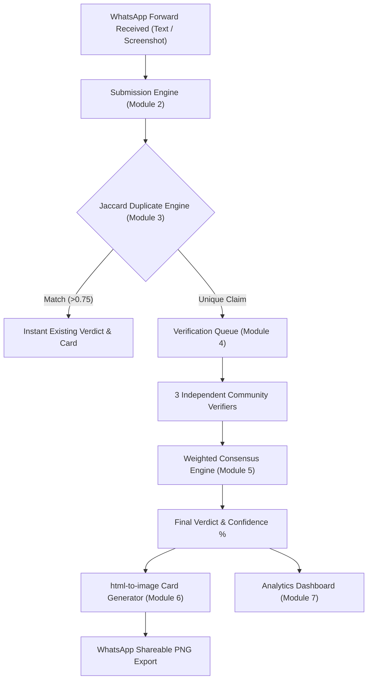

# FactStamp — Universal Master Project Index & Single Source of Truth

> **Stop WhatsApp Fake News Before It Spreads.**  
> FactStamp is a decentralized, community-driven fact-checking web platform built to verify viral WhatsApp forwards using a weighted 3-verifier quorum consensus engine and downloadable fact-check PNG cards.

This document is the **authoritative master reference** for both human developers and AI agents. It maps every file, component, rule, template, algorithm, and workflow command across all project directories.

---

## System Root Directory Locations

| System Domain | Absolute Path | Primary Purpose |
| :--- | :--- | :--- |
| **Typst Workspace** *(Current)* | [`/home/aadish/Documents/typst/FactStamp`](file:///home/aadish/Documents/typst/FactStamp) | Academic dissertation, report chapters, SRS, and Typst compilation assets. |
| **Obsidian Vault** | [`/home/aadish/Documents/Obsidian/Project/persnoal/FactStamp`](file:///home/aadish/Documents/Obsidian/Project/persnoal/FactStamp) | Personal project notes, daily logs, UI specs, and detailed module docs. |
| **Github Repository** | [`/home/aadish/Documents/Github/FactStamp`](file:///home/aadish/Documents/Github/FactStamp) | Full application source code (React 18, Vite 5, Tailwind CSS v4, Firebase, Docker). |

---

## "Where to Look for What" — Quick Decision Matrix

| Task / Topic | Target File Link | Key Guidelines & Rules |
| :--- | :--- | :--- |
| **Typst Page Format & Margins** | [`Rules/Typst_format.md`](file:///home/aadish/Documents/typst/FactStamp/Rules/Typst_format.md) | A4, 1.5in left margin, Times New Roman, Headings: 16pt bold, Subheadings: 14pt bold, Content: 12pt Justified, New topic on new page, dual-mode `standalone` vs `blackbook`, `styled-table`. |
| **Diagram Tooling & Standards** | [`Rules/Diagram-rules.md`](file:///home/aadish/Documents/typst/FactStamp/Rules/Diagram-rules.md) | PlantUML (`.puml` → SVG) for UML diagrams, Graphviz (`.dot` → SVG) for DFDs (Level 0/1/2), modern sans-serif engineering typography (`Liberation Sans` / `Helvetica-Bold`), bold labels, 2.5px solid strokes, 100% full-width embeds. |
| **Code Screenshot Automation** | [`Only_module/how_to.md`](file:///home/aadish/Documents/typst/FactStamp/Only_module/how_to.md) | `code-screenshot-v4.sh` (<150 lines, dynamic height), `code-split.sh` (>150 lines, ~70-line A4 chunks). Sequential run only. |
| **AI Template Selection Matrix** | [`Rules/Template-rules.md`](file:///home/aadish/Documents/typst/FactStamp/Rules/Template-rules.md) | Decision matrix for selecting reference templates when writing dissertation chapters. |
| **Codebase & File Inventory Map** | [`Rules/CODE_PATHS_AND_NOTES.md`](file:///home/aadish/Documents/typst/FactStamp/Rules/CODE_PATHS_AND_NOTES.md) | Complete directory map of React components, page views, utilities, contexts, and Firestore rules. |
| **Dissertation Syllabus & Outline** | [`Project_syllabus.md`](file:///home/aadish/Documents/typst/FactStamp/Project_syllabus.md) | Official 7-chapter outline (Course `JUSIT-DSCPR503`) & mandatory front-matter requirements. |
| **IEEE 830 SRS Specification** | [`srs_template-ieee.md`](file:///home/aadish/Documents/typst/FactStamp/srs_template-ieee.md) | IEEE 830 standard template for functional/non-functional requirements, external interfaces, and system features. |
| **Scrum Framework & Roles** | [`template/2020-Scrum-Guide-US.md`](file:///home/aadish/Documents/typst/FactStamp/template/2020-Scrum-Guide-US.md) | Official 2020 Scrum Guide rules (Product Owner, Scrum Master, Developers, 5 Events, 3 Artifacts). |
| **Scrum Agile Lifecycle** | [`template/SCRUM_Model.md`](file:///home/aadish/Documents/typst/FactStamp/template/SCRUM_Model.md) | Sprint planning, daily standups, backlog refinement, velocity metrics, and burndown charts. |
| **SDLC Process Models** | [`template/SDLC_Software_Process_Models.md`](file:///home/aadish/Documents/typst/FactStamp/template/SDLC_Software_Process_Models.md) | Comparative evaluation of Waterfall, Spiral, V-Model, Iterative, and Agile SDLC methodologies. |
| **Extreme Programming (XP)** | [`template/Extreme_Programming.md`](file:///home/aadish/Documents/typst/FactStamp/template/Extreme_Programming.md) | Engineering practices: Pair Programming, Test-Driven Development (TDD), Refactoring, Continuous Integration. |
| **Kanban Flow & WIP Limits** | [`template/Kanban.md`](file:///home/aadish/Documents/typst/FactStamp/template/Kanban.md) | Work-In-Progress limits, visual workflow queues, cycle time optimization, and bottleneck management. |
| **Feature-Driven Development** | [`template/FDD.md`](file:///home/aadish/Documents/typst/FactStamp/template/FDD.md) | Feature list decomposition, domain object modeling, milestone tracking, and chief programmer strategy. |
| **Template Folder Index** | [`template/README.md`](file:///home/aadish/Documents/typst/FactStamp/template/README.md) | Index of all reference markdown templates in the `template/` directory. |
| **Academic Synopsis & 7 Modules** | [`Obsidian: documentation/full.md`](file:///home/aadish/Documents/Obsidian/Project/persnoal/FactStamp/documentation/full.md) | Project abstract, problem statement, 8 objectives, and detailed specs for all 7 system modules. |
| **UI Design System & Tokens** | [`Obsidian: documentation/ui.md`](file:///home/aadish/Documents/Obsidian/Project/persnoal/FactStamp/documentation/ui.md) | `Saffron Sleek` design system, OKLCH warm-tinted color ramps, fluid tokens, DM Sans typography, zero-purple mandate. |
| **Dev Logs & Bug Tracebacks** | [`Obsidian: daily-doc/31-7-26.md`](file:///home/aadish/Documents/Obsidian/Project/persnoal/FactStamp/daily-doc/31-7-26.md) | Developer interaction log, bug tracebacks, migration from legacy JS canvas parser to `html-to-image` due to OKLCH color parsing breakdown. |
| **Obsidian Vault Master Hub** | [`Obsidian: INDEX.md`](file:///home/aadish/Documents/Obsidian/Project/persnoal/FactStamp/INDEX.md) | Master hub note in Obsidian connecting notes, daily docs, and problem logs (`[[INDEX]]`). |
| **Github Application Summary** | [`Github: README.md`](file:///home/aadish/Documents/Github/FactStamp/README.md) | Codebase setup, dependencies, Docker Compose runtimes, and Firebase Local Emulator suite. |

---

## GitHub Source Code Repository Inventory (`/home/aadish/Documents/Github/FactStamp`)

### 1. Application Entrypoints & Global Setup
* [`src/main.tsx`](file:///home/aadish/Documents/Github/FactStamp/src/main.tsx) — React DOM root rendering script.
* [`src/App.tsx`](file:///home/aadish/Documents/Github/FactStamp/src/App.tsx) — Main React Router navigation shell & provider wrapping.
* [`src/index.css`](file:///home/aadish/Documents/Github/FactStamp/src/index.css) — Tailwind CSS v4 design tokens (`saffron-sleek` OKLCH color ramps, fluid typography, concentric radii).
* [`src/vite-env.d.ts`](file:///home/aadish/Documents/Github/FactStamp/src/vite-env.d.ts) — Vite TypeScript environment declarations.

### 2. Main Page Views (`src/pages/`)
* [`src/pages/Home.tsx`](file:///home/aadish/Documents/Github/FactStamp/src/pages/Home.tsx) — Hero section, rapid claim lookup, live stats marquee, recent debunked claims grid.
* [`src/pages/Submit.tsx`](file:///home/aadish/Documents/Github/FactStamp/src/pages/Submit.tsx) — Forward submission form (text input + screenshot base64 image compression/OCR text extraction).
* [`src/pages/VerifyQueue.tsx`](file:///home/aadish/Documents/Github/FactStamp/src/pages/VerifyQueue.tsx) — Community verification queue listing claims awaiting 3-verifier quorum consensus.
* [`src/pages/VerifyDetail.tsx`](file:///home/aadish/Documents/Github/FactStamp/src/pages/VerifyDetail.tsx) — Verifier workbench view for evaluating claims, adding source links, and submitting verdicts.
* [`src/pages/ClaimDetail.tsx`](file:///home/aadish/Documents/Github/FactStamp/src/pages/ClaimDetail.tsx) — Single claim view with verdict badge, confidence breakdown, source list, and `html-to-image` PNG card export.
* [`src/pages/Dashboard.tsx`](file:///home/aadish/Documents/Github/FactStamp/src/pages/Dashboard.tsx) — Misinformation analytics dashboard with Recharts trend graphs, category distribution, and top verifiers.
* [`src/pages/Profile.tsx`](file:///home/aadish/Documents/Github/FactStamp/src/pages/Profile.tsx) — User profile page displaying verifier reputation score, submitted claims, and accuracy stats.
* [`src/pages/SignIn.tsx`](file:///home/aadish/Documents/Github/FactStamp/src/pages/SignIn.tsx) — Authentication sign-in view (Email/Password & Google OAuth).
* [`src/pages/SignUp.tsx`](file:///home/aadish/Documents/Github/FactStamp/src/pages/SignUp.tsx) — Authentication sign-up view with initial reputation setup.
* [`src/pages/NotFound.tsx`](file:///home/aadish/Documents/Github/FactStamp/src/pages/NotFound.tsx) — Custom 404 error page.

### 3. Core Domain Components (`src/components/`)
* [`src/components/Navbar.tsx`](file:///home/aadish/Documents/Github/FactStamp/src/components/Navbar.tsx) — Main application navigation header with active tab indicator, search bar, and user avatar menu.
* [`src/components/Footer.tsx`](file:///home/aadish/Documents/Github/FactStamp/src/components/Footer.tsx) — Application footer with quick links, tech stack badges, and copyright info.
* [`src/components/ClaimCard.tsx`](file:///home/aadish/Documents/Github/FactStamp/src/components/ClaimCard.tsx) — Compact card preview for claims in grids or search results.
* [`src/components/FactCheckCard.tsx`](file:///home/aadish/Documents/Github/FactStamp/src/components/FactCheckCard.tsx) — 1080×1080px card template exported by `html-to-image`.
* [`src/components/VerdictStamp.tsx`](file:///home/aadish/Documents/Github/FactStamp/src/components/VerdictStamp.tsx) — Visual verdict stamp badge (`TRUE`, `FALSE`, `MISLEADING`, `UNVERIFIED`).
* [`src/components/DashboardChart.tsx`](file:///home/aadish/Documents/Github/FactStamp/src/components/DashboardChart.tsx) — Recharts wrapper for trend graphs and category pie/bar charts.
* [`src/components/NotificationBell.tsx`](file:///home/aadish/Documents/Github/FactStamp/src/components/NotificationBell.tsx) — Real-time notification menu for verifier updates and consensus alerts.
* [`src/components/AuthLayout.tsx`](file:///home/aadish/Documents/Github/FactStamp/src/components/AuthLayout.tsx) — Split-screen authentication layout wrapper.
* [`src/components/Breadcrumbs.tsx`](file:///home/aadish/Documents/Github/FactStamp/src/components/Breadcrumbs.tsx) — Accessible path breadcrumbs.
* [`src/components/ContrastChecker.tsx`](file:///home/aadish/Documents/Github/FactStamp/src/components/ContrastChecker.tsx) — APCA contrast checking utility component.
* [`src/components/ErrorBoundary.tsx`](file:///home/aadish/Documents/Github/FactStamp/src/components/ErrorBoundary.tsx) — React error boundary for runtime exception catching.
* [`src/components/OnlineStatusBar.tsx`](file:///home/aadish/Documents/Github/FactStamp/src/components/OnlineStatusBar.tsx) — Network status indicator.
* [`src/components/ProtectedRoute.tsx`](file:///home/aadish/Documents/Github/FactStamp/src/components/ProtectedRoute.tsx) — Route guard requiring authenticated user session.
* [`src/components/AnimatedCounter.tsx`](file:///home/aadish/Documents/Github/FactStamp/src/components/AnimatedCounter.tsx) — Framer Motion number tick counter.
* [`src/components/Seo.tsx`](file:///home/aadish/Documents/Github/FactStamp/src/components/Seo.tsx) — Dynamic document title & meta tags manager.

### 4. Primitive UI Components (`src/components/ui/`)
* [`src/components/ui/Button.tsx`](file:///home/aadish/Documents/Github/FactStamp/src/components/ui/Button.tsx) — Standard button with variant states (primary, secondary, outline, ghost, danger).
* [`src/components/ui/Input.tsx`](file:///home/aadish/Documents/Github/FactStamp/src/components/ui/Input.tsx) — Accessible text input, textarea, and select wrappers with error states.
* [`src/components/ui/Modal.tsx`](file:///home/aadish/Documents/Github/FactStamp/src/components/ui/Modal.tsx) — Framer Motion dialog overlay component.
* [`src/components/ui/Badge.tsx`](file:///home/aadish/Documents/Github/FactStamp/src/components/ui/Badge.tsx) — Generic pill badge component.
* [`src/components/ui/CategoryBadge.tsx`](file:///home/aadish/Documents/Github/FactStamp/src/components/ui/CategoryBadge.tsx) — Color-coded claim category badge (Health, Political, Religious, Financial).
* [`src/components/ui/VerdictPill.tsx`](file:///home/aadish/Documents/Github/FactStamp/src/components/ui/VerdictPill.tsx) — Compact verdict pill with confidence score.
* [`src/components/ui/TrustRing.tsx`](file:///home/aadish/Documents/Github/FactStamp/src/components/ui/TrustRing.tsx) — Circular SVG progress ring for verifier reputation and confidence percentages.
* [`src/components/ui/SourceQualityDot.tsx`](file:///home/aadish/Documents/Github/FactStamp/src/components/ui/SourceQualityDot.tsx) — Source credibility rating indicator (high/medium/low).
* [`src/components/ui/EmptyState.tsx`](file:///home/aadish/Documents/Github/FactStamp/src/components/ui/EmptyState.tsx) — Reusable empty state view with illustration and CTA.
* [`src/components/ui/ErrorState.tsx`](file:///home/aadish/Documents/Github/FactStamp/src/components/ui/ErrorState.tsx) — Reusable inline error fallback component.
* [`src/components/ui/Skeletons.tsx`](file:///home/aadish/Documents/Github/FactStamp/src/components/ui/Skeletons.tsx) — Shimmer loading skeletons for cards, tables, and detail views.
* [`src/components/ui/Avatar.tsx`](file:///home/aadish/Documents/Github/FactStamp/src/components/ui/Avatar.tsx) — User profile image / initials fallback avatar.
* [`src/components/ui/BorderBeam.tsx`](file:///home/aadish/Documents/Github/FactStamp/src/components/ui/BorderBeam.tsx) — Subtle animated border light beam effect.
* [`src/components/ui/FlowButton.tsx`](file:///home/aadish/Documents/Github/FactStamp/src/components/ui/FlowButton.tsx) — Smooth flowing CTA button.
* [`src/components/ui/InteractiveHoverButton.tsx`](file:///home/aadish/Documents/Github/FactStamp/src/components/ui/InteractiveHoverButton.tsx) — Micro-interactive hover state button.
* [`src/components/ui/InteractiveShieldButton.tsx`](file:///home/aadish/Documents/Github/FactStamp/src/components/ui/InteractiveShieldButton.tsx) — Verifier action button with shield animation.
* [`src/components/ui/Marquee.tsx`](file:///home/aadish/Documents/Github/FactStamp/src/components/ui/Marquee.tsx) — Continuous scrolling statistics banner.
* [`src/components/ui/PasswordStrength.tsx`](file:///home/aadish/Documents/Github/FactStamp/src/components/ui/PasswordStrength.tsx) — Real-time password strength meter.
* [`src/components/ui/ShimmerButton.tsx`](file:///home/aadish/Documents/Github/FactStamp/src/components/ui/ShimmerButton.tsx) — Premium shimmer highlight button.
* [`src/components/ui/ShimmerText.tsx`](file:///home/aadish/Documents/Github/FactStamp/src/components/ui/ShimmerText.tsx) — Text shimmer sweep effect.
* [`src/components/ui/SpotlightCard.tsx`](file:///home/aadish/Documents/Github/FactStamp/src/components/ui/SpotlightCard.tsx) — Mouse-following spotlight card container.

### 5. Application Contexts (`src/contexts/`)
* [`src/contexts/AuthContext.tsx`](file:///home/aadish/Documents/Github/FactStamp/src/contexts/AuthContext.tsx) — Firebase Auth session provider (login, logout, sign-up, Google OAuth, user profile state).
* [`src/contexts/ClaimsContext.tsx`](file:///home/aadish/Documents/Github/FactStamp/src/contexts/ClaimsContext.tsx) — Claims state provider (claim creation, duplicate check trigger, verification submission, consensus computation).
* [`src/contexts/NotificationsContext.tsx`](file:///home/aadish/Documents/Github/FactStamp/src/contexts/NotificationsContext.tsx) — Real-time notifications state provider.
* [`src/contexts/ThemeContext.tsx`](file:///home/aadish/Documents/Github/FactStamp/src/contexts/ThemeContext.tsx) — Light/Dark theme provider (`dark` class toggle on root `<html>`).
* [`src/contexts/UsersContext.tsx`](file:///home/aadish/Documents/Github/FactStamp/src/contexts/UsersContext.tsx) — Users directory and reputation leaderboard provider.

### 6. Logic Core & Utility Libraries (`src/lib/`)
* [`src/lib/firebase.ts`](file:///home/aadish/Documents/Github/FactStamp/src/lib/firebase.ts) — Firebase SDK initialization (Auth, Firestore, Storage) with emulator connection fallbacks.
* [`src/lib/types.ts`](file:///home/aadish/Documents/Github/FactStamp/src/lib/types.ts) — Core TypeScript data interfaces (`Claim`, `Verification`, `User`, `VerdictType`, `CategoryType`).
* [`src/lib/duplicateDetection.ts`](file:///home/aadish/Documents/Github/FactStamp/src/lib/duplicateDetection.ts) — Jaccard word-overlap similarity scoring algorithm ($J \ge 0.75$ threshold).
* [`src/lib/confidenceScore.ts`](file:///home/aadish/Documents/Github/FactStamp/src/lib/confidenceScore.ts) — Weighted consensus algorithm (40% agreement, 30% verifier reputation, 30% source quality).
* [`src/lib/imageCompression.ts`](file:///home/aadish/Documents/Github/FactStamp/src/lib/imageCompression.ts) — Client-side screenshot image compression pipeline producing compact base64 strings.
* [`src/lib/apca.ts`](file:///home/aadish/Documents/Github/FactStamp/src/lib/apca.ts) — APCA contrast math library ensuring accessibility compliance.
* [`src/lib/weeklyReport.ts`](file:///home/aadish/Documents/Github/FactStamp/src/lib/weeklyReport.ts) — Client-side analytics & weekly trending report computation engine.
* [`src/lib/utils.ts`](file:///home/aadish/Documents/Github/FactStamp/src/lib/utils.ts) — Helper utilities.

### 7. Data Services (`src/services/`)
* [`src/services/firebaseService.ts`](file:///home/aadish/Documents/Github/FactStamp/src/services/firebaseService.ts) — Firestore CRUD service operations for `claims`, `verifications`, and `users` collections.

### 8. Repository Configuration Files
* [`firestore.rules`](file:///home/aadish/Documents/Github/FactStamp/firestore.rules) — Firestore Security Rules enforcing data structure validation, user authentication, and verifier permissions.
* [`storage.rules`](file:///home/aadish/Documents/Github/FactStamp/storage.rules) — Firebase Storage Security Rules.
* [`package.json`](file:///home/aadish/Documents/Github/FactStamp/package.json) — NPM dependencies, scripts (`dev`, `build`, `emulators`, `seed:db`).
* [`vite.config.ts`](file:///home/aadish/Documents/Github/FactStamp/vite.config.ts) — Vite bundler configuration.
* [`tsconfig.json`](file:///home/aadish/Documents/Github/FactStamp/tsconfig.json) — TypeScript compiler configuration.
* [`docker-compose.yml`](file:///home/aadish/Documents/Github/FactStamp/docker-compose.yml) — Docker Compose service definitions (`dev` container with hot-reload, `prod` Nginx container).
* [`Dockerfile`](file:///home/aadish/Documents/Github/FactStamp/Dockerfile) — Multi-stage Docker build file.
### 9. Module Submissions & Compiled Deliverables

* [`Submission of 5.4 Modifications and Improvements, 6.1 User Documentation(User manual with screen Layouts)`](file:///home/aadish/Documents/typst/FactStamp/Submission%20of%205.4%20Modifications%20and%20Improvements%2C%206.1%20User%20Documentation%28User%20manual%20with%20screen%20Layouts%29) — ([`modifications_improvements_and_user_documentation.typ`](file:///home/aadish/Documents/typst/FactStamp/Submission%20of%205.4%20Modifications%20and%20Improvements%2C%206.1%20User%20Documentation%28User%20manual%20with%20screen%20Layouts%29/modifications_improvements_and_user_documentation.typ) & [`modifications_improvements_and_user_documentation.pdf`](file:///home/aadish/Documents/typst/FactStamp/Submission%20of%205.4%20Modifications%20and%20Improvements%2C%206.1%20User%20Documentation%28User%20manual%20with%20screen%20Layouts%29/modifications_improvements_and_user_documentation.pdf))
* [`Submission of 5.1 Implementation Approach :• Project Summary,5.2 Coding Details and Code Efficiency,5.2.1 Code Efficiency`](file:///home/aadish/Documents/typst/FactStamp/Submission%20of%205.1%20Implementation%20Approach%20%3A%E2%80%A2%20Project%20Summary%2C5.2%20Coding%20Details%20and%20Code%20Efficiency%2C5.2.1%20Code%20Efficiency) — ([`implementation_approach_coding_details_and_code_efficiency.typ`](file:///home/aadish/Documents/typst/FactStamp/Submission%20of%205.1%20Implementation%20Approach%20%3A%E2%80%A2%20Project%20Summary%2C5.2%20Coding%20Details%20and%20Code%20Efficiency%2C5.2.1%20Code%20Efficiency/implementation_approach_coding_details_and_code_efficiency.typ) & [`implementation_approach_coding_details_and_code_efficiency.pdf`](file:///home/aadish/Documents/typst/FactStamp/Submission%20of%205.1%20Implementation%20Approach%20%3A%E2%80%A2%20Project%20Summary%2C5.2%20Coding%20Details%20and%20Code%20Efficiency%2C5.2.1%20Code%20Efficiency/implementation_approach_coding_details_and_code_efficiency.pdf))
* [`Submission of GANTT chart,4.2 Data Design: Database and Schema Design`](file:///home/aadish/Documents/typst/FactStamp/Submission%20of%20GANTT%20chart%2C4.2%20Data%20Design%3A%20Database%20and%20Schema%20Design) — ([`gantt_chart_and_data_design.typ`](file:///home/aadish/Documents/typst/FactStamp/Submission%20of%20GANTT%20chart%2C4.2%20Data%20Design%3A%20Database%20and%20Schema%20Design/gantt_chart_and_data_design.typ) & [`gantt_chart_and_data_design.pdf`](file:///home/aadish/Documents/typst/FactStamp/Submission%20of%20GANTT%20chart%2C4.2%20Data%20Design%3A%20Database%20and%20Schema%20Design/gantt_chart_and_data_design.pdf))
* [`Submission of ABSTRACT, 1.4 Achievements, 1.5 Organization of Report`](file:///home/aadish/Documents/typst/FactStamp/Submission%20of%20ABSTRACT%2C%201.4%20Achievements%2C%201.5%20Organization%20of%20Report) — ([`abstract_achievements_and_organization_of_report.typ`](file:///home/aadish/Documents/typst/FactStamp/Submission%20of%20ABSTRACT%2C%201.4%20Achievements%2C%201.5%20Organization%20of%20Report/abstract_achievements_and_organization_of_report.typ) & [`abstract_achievements_and_organization_of_report.pdf`](file:///home/aadish/Documents/typst/FactStamp/Submission%20of%20ABSTRACT%2C%201.4%20Achievements%2C%201.5%20Organization%20of%20Report/abstract_achievements_and_organization_of_report.pdf))
* [`Submission of 7. CONCLUSION(7.1 Conclusion, 7.2 Limitations of the System, 7.3 Future Scope of the Project, References`](file:///home/aadish/Documents/typst/FactStamp/Submission%20of%207.%20CONCLUSION%287.1%20Conclusion%2C%207.2%20Limitations%20of%20the%20System%2C%207.3%20Future%20Scope%20of%20the%20Project%2C%20References) — ([`conclusion_limitations_future_scope_and_references.typ`](file:///home/aadish/Documents/typst/FactStamp/Submission%20of%207.%20CONCLUSION%287.1%20Conclusion%2C%207.2%20Limitations%20of%20the%20System%2C%207.3%20Future%20Scope%20of%20the%20Project%2C%20References/conclusion_limitations_future_scope_and_references.typ) & [`conclusion_limitations_future_scope_and_references.pdf`](file:///home/aadish/Documents/typst/FactStamp/Submission%20of%207.%20CONCLUSION%287.1%20Conclusion%2C%207.2%20Limitations%20of%20the%20System%2C%207.3%20Future%20Scope%20of%20the%20Project%2C%20References/conclusion_limitations_future_scope_and_references.pdf))
* [`Submission of Module 7`](file:///home/aadish/Documents/typst/FactStamp/Submission%20of%20Module%207) — ([`module_7_trending_misinformation_analytics_dashboard.typ`](file:///home/aadish/Documents/typst/FactStamp/Submission%20of%20Module%207/module_7_trending_misinformation_analytics_dashboard.typ) & [`module_7_trending_misinformation_analytics_dashboard.pdf`](file:///home/aadish/Documents/typst/FactStamp/Submission%20of%20Module%207/module_7_trending_misinformation_analytics_dashboard.pdf))
* [`Submission of 5.3 Testing Approach`](file:///home/aadish/Documents/typst/FactStamp/Submission%20of%205.3%20Testing%20Approach) — ([`testing_approach_unit_integrated_and_beta_testing.typ`](file:///home/aadish/Documents/typst/FactStamp/Submission%20of%205.3%20Testing%20Approach/testing_approach_unit_integrated_and_beta_testing.typ) & [`testing_approach_unit_integrated_and_beta_testing.pdf`](file:///home/aadish/Documents/typst/FactStamp/Submission%20of%205.3%20Testing%20Approach/testing_approach_unit_integrated_and_beta_testing.pdf))
* [`Submission of Chp 5. IMPLEMENTATION AND TESTING : 5.1 Implementation Approach -Introduction,Input and Output Design Implementation,Database Implementation,Table Structures,Code Module,System Implementation`](file:///home/aadish/Documents/typst/FactStamp/Submission%20of%20Chp%205.%20IMPLEMENTATION%20AND%20TESTING%20%3A%205.1%20Implementation%20Approach%20-Introduction%2CInput%20and%20Output%20Design%20Implementation%2CDatabase%20Implementation%2CTable%20Structures%2CCode%20Module%2CSystem%20Implementation) — ([`implementation_approach_input_output_database_and_system.typ`](file:///home/aadish/Documents/typst/FactStamp/Submission%20of%20Chp%205.%20IMPLEMENTATION%20AND%20TESTING%20%3A%205.1%20Implementation%20Approach%20-Introduction%2CInput%20and%20Output%20Design%20Implementation%2CDatabase%20Implementation%2CTable%20Structures%2CCode%20Module%2CSystem%20Implementation/implementation_approach_input_output_database_and_system.typ) & [`implementation_approach_input_output_database_and_system.pdf`](file:///home/aadish/Documents/typst/FactStamp/Submission%20of%20Chp%205.%20IMPLEMENTATION%20AND%20TESTING%20%3A%205.1%20Implementation%20Approach%20-Introduction%2CInput%20and%20Output%20Design%20Implementation%2CDatabase%20Implementation%2CTable%20Structures%2CCode%20Module%2CSystem%20Implementation/implementation_approach_input_output_database_and_system.pdf))
* [`Submission of Module 6`](file:///home/aadish/Documents/typst/FactStamp/Submission%20of%20Module%206) — ([`module_6_fact_check_card_generator.typ`](file:///home/aadish/Documents/typst/FactStamp/Submission%20of%20Module%206/module_6_fact_check_card_generator.typ) & [`module_6_fact_check_card_generator.pdf`](file:///home/aadish/Documents/typst/FactStamp/Submission%20of%20Module%206/module_6_fact_check_card_generator.pdf))
* [`Submission of Chp 4: 4.2.2 Data Integrity and Constraints, 4.4 Security Issues`](file:///home/aadish/Documents/typst/FactStamp/Submission%20of%20Chp%204%3A%204.2.2%20Data%20Integrity%20and%20Constraints%2C%204.4%20Security%20Issues) — ([`data_integrity_and_security_issues.typ`](file:///home/aadish/Documents/typst/FactStamp/Submission%20of%20Chp%204%3A%204.2.2%20Data%20Integrity%20and%20Constraints%2C%204.4%20Security%20Issues/data_integrity_and_security_issues.typ) & [`data_integrity_and_security_issues.pdf`](file:///home/aadish/Documents/typst/FactStamp/Submission%20of%20Chp%204%3A%204.2.2%20Data%20Integrity%20and%20Constraints%2C%204.4%20Security%20Issues/data_integrity_and_security_issues.pdf))
* [`Submission of 3.6 Conceptual Models - Component Diagram`](file:///home/aadish/Documents/typst/FactStamp/Submission%20of%203.6%20Conceptual%20Models%20-%20Component%20Diagram) — ([`conceptual_models_component_diagram.typ`](file:///home/aadish/Documents/typst/FactStamp/Submission%20of%203.6%20Conceptual%20Models%20-%20Component%20Diagram/conceptual_models_component_diagram.typ) & [`conceptual_models_component_diagram.pdf`](file:///home/aadish/Documents/typst/FactStamp/Submission%20of%203.6%20Conceptual%20Models%20-%20Component%20Diagram/conceptual_models_component_diagram.pdf))
* [`Submission of 3.6 Conceptual Models - Data Flow Diagram`](file:///home/aadish/Documents/typst/FactStamp/Submission%20of%203.6%20Conceptual%20Models%20-%20Data%20Flow%20Diagram) — ([`conceptual_models_data_flow_diagram.typ`](file:///home/aadish/Documents/typst/FactStamp/Submission%20of%203.6%20Conceptual%20Models%20-%20Data%20Flow%20Diagram/conceptual_models_data_flow_diagram.typ) & [`conceptual_models_data_flow_diagram.pdf`](file:///home/aadish/Documents/typst/FactStamp/Submission%20of%203.6%20Conceptual%20Models%20-%20Data%20Flow%20Diagram/conceptual_models_data_flow_diagram.pdf))
* [`Submission of Module 5`](file:///home/aadish/Documents/typst/FactStamp/Submission%20of%20Module%205) — ([`module_5_weighted_confidence_and_consensus_engine.typ`](file:///home/aadish/Documents/typst/FactStamp/Submission%20of%20Module%205/module_5_weighted_confidence_and_consensus_engine.typ) & [`module_5_weighted_confidence_and_consensus_engine.pdf`](file:///home/aadish/Documents/typst/FactStamp/Submission%20of%20Module%205/module_5_weighted_confidence_and_consensus_engine.pdf))
* [`Submission of 3.6 Conceptual Models - Package Diagram, Deployment Diagram`](file:///home/aadish/Documents/typst/FactStamp/Submission%20of%203.6%20Conceptual%20Models%20-%20Package%20Diagram%2C%20Deployment%20Diagram) — ([`conceptual_models_package_and_deployment_diagram.typ`](file:///home/aadish/Documents/typst/FactStamp/Submission%20of%203.6%20Conceptual%20Models%20-%20Package%20Diagram%2C%20Deployment%20Diagram/conceptual_models_package_and_deployment_diagram.typ) & [`conceptual_models_package_and_deployment_diagram.pdf`](file:///home/aadish/Documents/typst/FactStamp/Submission%20of%203.6%20Conceptual%20Models%20-%20Package%20Diagram%2C%20Deployment%20Diagram/conceptual_models_package_and_deployment_diagram.pdf))
* [`Submission of 4.3 User Interface Design (Wireframes)`](file:///home/aadish/Documents/typst/FactStamp/Submission%20of%204.3%20User%20Interface%20Design%20%28Wireframes%29) — ([`user_interface_design_and_wireframes.typ`](file:///home/aadish/Documents/typst/FactStamp/Submission%20of%204.3%20User%20Interface%20Design%20%28Wireframes%29/user_interface_design_and_wireframes.typ) & [`user_interface_design_and_wireframes.pdf`](file:///home/aadish/Documents/typst/FactStamp/Submission%20of%204.3%20User%20Interface%20Design%20%28Wireframes%29/user_interface_design_and_wireframes.pdf))
* [`Submission of 4.5 Test Cases Design(Draft)`](file:///home/aadish/Documents/typst/FactStamp/Submission%20of%204.5%20Test%20Cases%20Design%28Draft%29) — ([`test_cases_design_draft.typ`](file:///home/aadish/Documents/typst/FactStamp/Submission%20of%204.5%20Test%20Cases%20Design%28Draft%29/test_cases_design_draft.typ) & [`test_cases_design_draft.pdf`](file:///home/aadish/Documents/typst/FactStamp/Submission%20of%204.5%20Test%20Cases%20Design%28Draft%29/test_cases_design_draft.pdf))
* [`Submission of Module 4`](file:///home/aadish/Documents/typst/FactStamp/Submission%20of%20Module%204) — ([`module_4_decentralized_quorum_verification_queue.typ`](file:///home/aadish/Documents/typst/FactStamp/Submission%20of%20Module%204/module_4_decentralized_quorum_verification_queue.typ) & [`module_4_decentralized_quorum_verification_queue.pdf`](file:///home/aadish/Documents/typst/FactStamp/Submission%20of%20Module%204/module_4_decentralized_quorum_verification_queue.pdf))
* [`Submission of 3.6 Conceptual Models - Sequence Diagram`](file:///home/aadish/Documents/typst/FactStamp/Submission%20of%203.6%20Conceptual%20Models%20-%20Sequence%20Diagram) — ([`conceptual_models_sequence_diagram.typ`](file:///home/aadish/Documents/typst/FactStamp/Submission%20of%203.6%20Conceptual%20Models%20-%20Sequence%20Diagram/conceptual_models_sequence_diagram.typ) & [`conceptual_models_sequence_diagram.pdf`](file:///home/aadish/Documents/typst/FactStamp/Submission%20of%203.6%20Conceptual%20Models%20-%20Sequence%20Diagram/conceptual_models_sequence_diagram.pdf))
* [`Submission of 4. SYSTEM DESIGN (4.1 Basic Modules,4.2 Data Design,4.2.1 Schema Design (Data Dictionary))`](file:///home/aadish/Documents/typst/FactStamp/Submission%20of%204.%20SYSTEM%20DESIGN%20%284.1%20Basic%20Modules%2C4.2%20Data%20Design%2C4.2.1%20Schema%20Design%20%28Data%20Dictionary%29%29) — ([`system_design_modules_and_data_design.typ`](file:///home/aadish/Documents/typst/FactStamp/Submission%20of%204.%20SYSTEM%20DESIGN%20%284.1%20Basic%20Modules%2C4.2%20Data%20Design%2C4.2.1%20Schema%20Design%20%28Data%20Dictionary%29%29/system_design_modules_and_data_design.typ) & [`system_design_modules_and_data_design.pdf`](file:///home/aadish/Documents/typst/FactStamp/Submission%20of%204.%20SYSTEM%20DESIGN%20%284.1%20Basic%20Modules%2C4.2%20Data%20Design%2C4.2.1%20Schema%20Design%20%28Data%20Dictionary%29%29/system_design_modules_and_data_design.pdf))
* [`Submission of (3.5 Preliminary Product Description)`](file:///home/aadish/Documents/typst/FactStamp/Submission%20of%20%283.5%20Preliminary%20Product%20Description%29) — ([`preliminary_product_description.typ`](file:///home/aadish/Documents/typst/FactStamp/Submission%20of%20%283.5%20Preliminary%20Product%20Description%29/preliminary_product_description.typ) & [`preliminary_product_description.pdf`](file:///home/aadish/Documents/typst/FactStamp/Submission%20of%20%283.5%20Preliminary%20Product%20Description%29/preliminary_product_description.pdf))
* [`Submission of 3.6 Conceptual Models - Activity Diagram, State Diagram`](file:///home/aadish/Documents/typst/FactStamp/Submission%20of%203.6%20Conceptual%20Models%20-%20Activity%20Diagram%2C%20State%20Diagram) — ([`conceptual_models_activity_and_state_diagram.typ`](file:///home/aadish/Documents/typst/FactStamp/Submission%20of%203.6%20Conceptual%20Models%20-%20Activity%20Diagram%2C%20State%20Diagram/conceptual_models_activity_and_state_diagram.typ) & [`conceptual_models_activity_and_state_diagram.pdf`](file:///home/aadish/Documents/typst/FactStamp/Submission%20of%203.6%20Conceptual%20Models%20-%20Activity%20Diagram%2C%20State%20Diagram/conceptual_models_activity_and_state_diagram.pdf))
* [`Submission of Module 3`](file:///home/aadish/Documents/typst/FactStamp/Submission%20of%20Module%203) — ([`module_3_jaccard_duplicate_detection_engine.typ`](file:///home/aadish/Documents/typst/FactStamp/Submission%20of%20Module%203/module_3_jaccard_duplicate_detection_engine.typ) & [`module_3_jaccard_duplicate_detection_engine.pdf`](file:///home/aadish/Documents/typst/FactStamp/Submission%20of%20Module%203/module_3_jaccard_duplicate_detection_engine.pdf))
* [`Submission of 3.6 Conceptual Models -Use Case Diagram`](file:///home/aadish/Documents/typst/FactStamp/Submission%20of%203.6%20Conceptual%20Models%20-Use%20Case%20Diagram) — ([`conceptual_models_use_case_diagram.typ`](file:///home/aadish/Documents/typst/FactStamp/Submission%20of%203.6%20Conceptual%20Models%20-Use%20Case%20Diagram/conceptual_models_use_case_diagram.typ) & [`conceptual_models_use_case_diagram.pdf`](file:///home/aadish/Documents/typst/FactStamp/Submission%20of%203.6%20Conceptual%20Models%20-Use%20Case%20Diagram/conceptual_models_use_case_diagram.pdf))
* [`Submission of 3.6 Conceptual Models -Event Table, Object Diagram`](file:///home/aadish/Documents/typst/FactStamp/Submission%20of%203.6%20Conceptual%20Models%20-Event%20Table%2C%20Object%20Diagram) — ([`conceptual_models_event_table_and_object_diagram.typ`](file:///home/aadish/Documents/typst/FactStamp/Submission%20of%203.6%20Conceptual%20Models%20-Event%20Table%2C%20Object%20Diagram/conceptual_models_event_table_and_object_diagram.typ) & [`conceptual_models_event_table_and_object_diagram.pdf`](file:///home/aadish/Documents/typst/FactStamp/Submission%20of%203.6%20Conceptual%20Models%20-Event%20Table%2C%20Object%20Diagram/conceptual_models_event_table_and_object_diagram.pdf))
* [`Submission of ER Diagram, Class Diagram,Object Diagram [Project Dissertation] and Module 2[Project Implementation]`](file:///home/aadish/Documents/typst/FactStamp/Submission%20of%20ER%20Diagram%2C%20Class%20Diagram%2CObject%20Diagram%20%5BProject%20Dissertation%5D%20and%20Module%202%5BProject%20Implementation%5D) — ([`er_class_object_and_module_2.typ`](file:///home/aadish/Documents/typst/FactStamp/Submission%20of%20ER%20Diagram%2C%20Class%20Diagram%2CObject%20Diagram%20%5BProject%20Dissertation%5D%20and%20Module%202%5BProject%20Implementation%5D/er_class_object_and_module_2.typ) & [`er_class_object_and_module_2.pdf`](file:///home/aadish/Documents/typst/FactStamp/Submission%20of%20ER%20Diagram%2C%20Class%20Diagram%2CObject%20Diagram%20%5BProject%20Dissertation%5D%20and%20Module%202%5BProject%20Implementation%5D/er_class_object_and_module_2.pdf))
* [`Submission of Module 2`](file:///home/aadish/Documents/typst/FactStamp/Submission%20of%20Module%202) — ([`module_2_multimodal_claim_ingestion_and_ocr.typ`](file:///home/aadish/Documents/typst/FactStamp/Submission%20of%20Module%202/module_2_multimodal_claim_ingestion_and_ocr.typ) & [`module_2_multimodal_claim_ingestion_and_ocr.pdf`](file:///home/aadish/Documents/typst/FactStamp/Submission%20of%20Module%202/module_2_multimodal_claim_ingestion_and_ocr.pdf))
* [`Submission of 3.6 Conceptual Models -E-R Diagram , Class Diagram`](file:///home/aadish/Documents/typst/FactStamp/Submission%20of%203.6%20Conceptual%20Models%20-E-R%20Diagram%20%2C%20Class%20Diagram) — ([`conceptual_models_er_and_class_diagram.typ`](file:///home/aadish/Documents/typst/FactStamp/Submission%20of%203.6%20Conceptual%20Models%20-E-R%20Diagram%20%2C%20Class%20Diagram/conceptual_models_er_and_class_diagram.typ) & [`conceptual_models_er_and_class_diagram.pdf`](file:///home/aadish/Documents/typst/FactStamp/Submission%20of%203.6%20Conceptual%20Models%20-E-R%20Diagram%20%2C%20Class%20Diagram/conceptual_models_er_and_class_diagram.pdf))
* [`Submission of CHAPTER 3: REQUIREMENTS AND ANALYSIS 3.1 Problem Definition 3.2 Requirements Specification 3.3 Planning and Scheduling 3.4 Software and Hardware Requirements`](file:///home/aadish/Documents/typst/FactStamp/Submission%20of%20CHAPTER%203%3A%20REQUIREMENTS%20AND%20ANALYSIS%203.1%20Problem%20Definition%203.2%20Requirements%20Specification%203.3%20Planning%20and%20Scheduling%203.4%20Software%20and%20Hardware%20Requirements) — ([`requirements_and_analysis.typ`](file:///home/aadish/Documents/typst/FactStamp/Submission%20of%20CHAPTER%203%3A%20REQUIREMENTS%20AND%20ANALYSIS%203.1%20Problem%20Definition%203.2%20Requirements%20Specification%203.3%20Planning%20and%20Scheduling%203.4%20Software%20and%20Hardware%20Requirements/requirements_and_analysis.typ) & [`requirements_and_analysis.pdf`](file:///home/aadish/Documents/typst/FactStamp/Submission%20of%20CHAPTER%203%3A%20REQUIREMENTS%20AND%20ANALYSIS%203.1%20Problem%20Definition%203.2%20Requirements%20Specification%203.3%20Planning%20and%20Scheduling%203.4%20Software%20and%20Hardware%20Requirements/requirements_and_analysis.pdf))
* [`CHAPTER 2: SURVEY OF TECHNOLOGIES`](file:///home/aadish/Documents/typst/FactStamp/CHAPTER%202%3A%20SURVEY%20OF%20TECHNOLOGIES) — ([`survey_of_technologies.typ`](file:///home/aadish/Documents/typst/FactStamp/CHAPTER%202%3A%20SURVEY%20OF%20TECHNOLOGIES/survey_of_technologies.typ) & [`survey_of_technologies.pdf`](file:///home/aadish/Documents/typst/FactStamp/CHAPTER%202%3A%20SURVEY%20OF%20TECHNOLOGIES/survey_of_technologies.pdf))
* [`Submission of CHAPTER 1: INTRODUCTION 1.1 Background 1.2 Objectives 1.3 Purpose, Scope, and Applicability 1.3.1 Purpose 1.3.2 Scope 1.3.3 Applicability`](file:///home/aadish/Documents/typst/FactStamp/Submission%20of%20CHAPTER%201%3A%20INTRODUCTION%201.1%20Background%201.2%20Objectives%201.3%20Purpose%2C%20Scope%2C%20and%20Applicability%201.3.1%20Purpose%201.3.2%20Scope%201.3.3%20Applicability) — ([`introduction_background_objectives_and_scope.typ`](file:///home/aadish/Documents/typst/FactStamp/Submission%20of%20CHAPTER%201%3A%20INTRODUCTION%201.1%20Background%201.2%20Objectives%201.3%20Purpose%2C%20Scope%2C%20and%20Applicability%201.3.1%20Purpose%201.3.2%20Scope%201.3.3%20Applicability/introduction_background_objectives_and_scope.typ) & [`introduction_background_objectives_and_scope.pdf`](file:///home/aadish/Documents/typst/FactStamp/Submission%20of%20CHAPTER%201%3A%20INTRODUCTION%201.1%20Background%201.2%20Objectives%201.3%20Purpose%2C%20Scope%2C%20and%20Applicability%201.3.1%20Purpose%201.3.2%20Scope%201.3.3%20Applicability/introduction_background_objectives_and_scope.pdf))
* [`Submission of 3.3 Planning and Scheduling(PERT Chart), Event Table, Use case diagram [Project Dissertation] and Module 1[Project Implementation]`](file:///home/aadish/Documents/typst/FactStamp/Submission%20of%203.3%20Planning%20and%20Scheduling%28PERT%20Chart%29%2C%20Event%20Table%2C%20Use%20case%20diagram%20%5BProject%20Dissertation%5D%20and%20Module%201%5BProject%20Implementation%5D) — ([`planning_pert_event_table_usecase_and_module_1.typ`](file:///home/aadish/Documents/typst/FactStamp/Submission%20of%203.3%20Planning%20and%20Scheduling%28PERT%20Chart%29%2C%20Event%20Table%2C%20Use%20case%20diagram%20%5BProject%20Dissertation%5D%20and%20Module%201%5BProject%20Implementation%5D/planning_pert_event_table_usecase_and_module_1.typ) & [`planning_pert_event_table_usecase_and_module_1.pdf`](file:///home/aadish/Documents/typst/FactStamp/Submission%20of%203.3%20Planning%20and%20Scheduling%28PERT%20Chart%29%2C%20Event%20Table%2C%20Use%20case%20diagram%20%5BProject%20Dissertation%5D%20and%20Module%201%5BProject%20Implementation%5D/planning_pert_event_table_usecase_and_module_1.pdf))
* [`Submission of 1. INTRODUCTION 2. SURVEY OF TECHNOLOGIES 3. REQUIREMENT AND ANALYSIS`](file:///home/aadish/Documents/typst/FactStamp/Submission%20of%201.%20INTRODUCTION%202.%20SURVEY%20OF%20TECHNOLOGIES%203.%20REQUIREMENT%20AND%20ANALYSIS) — ([`introduction_survey_and_requirements.typ`](file:///home/aadish/Documents/typst/FactStamp/Submission%20of%201.%20INTRODUCTION%202.%20SURVEY%20OF%20TECHNOLOGIES%203.%20REQUIREMENT%20AND%20ANALYSIS/introduction_survey_and_requirements.typ) & [`introduction_survey_and_requirements.pdf`](file:///home/aadish/Documents/typst/FactStamp/Submission%20of%201.%20INTRODUCTION%202.%20SURVEY%20OF%20TECHNOLOGIES%203.%20REQUIREMENT%20AND%20ANALYSIS/introduction_survey_and_requirements.pdf))
* [`Project Synopsis`](file:///home/aadish/Documents/typst/FactStamp/Project%20Synopsis) — ([`project_synopsis.typ`](file:///home/aadish/Documents/typst/FactStamp/Project%20Synopsis/project_synopsis.typ) & [`project_synopsis.pdf`](file:///home/aadish/Documents/typst/FactStamp/Project%20Synopsis/project_synopsis.pdf))

---

## Academic Dissertation Syllabus Structure (`Project_syllabus.md`)

Dissertation chapter structure for Course **`JUSIT-DSCPR503` (Project Dissertation and Implementation)**:

* **Front Matter**: Title Page, Approved Proforma, Authenticated Work Certificate, Role & Responsibility Form, Abstract, Acknowledgement, Table of Contents, Table of Figures.
* **Chapter 1: Introduction**: Background, Objectives (1–8), Purpose, Scope, Applicability, Achievements, Report Organization.
* **Chapter 2: Survey of Technologies**: Evaluation of React 18, Vite 5, Tailwind CSS v4, Firebase v12, Framer Motion, Recharts, html-to-image, Docker.
* **Chapter 3: Requirements and Analysis**: Problem Definition, Requirements Spec, Planning/Scheduling, SW/HW Requirements, Conceptual Models (DFDs Level 0/1/2, Use Cases).
* **Chapter 4: System Design**: Basic Modules (7 Modules), Data Design & Firestore Schemas, Procedural Design/Algorithms (Jaccard, Consensus), UI Design (`Saffron Sleek`), Security Issues, Test Case Design.
* **Chapter 5: Implementation and Testing**: Implementation Approaches, Code Efficiency, Unit/Integrated/Beta Testing, Modifications, Test Cases.
* **Chapter 6: Results and Discussion**: Test Reports, User Documentation.
* **Chapter 7: Conclusions**: System Significance, Limitations, Future Scope, References, Glossary.

---

## Core System Algorithms & Mathematical Formulas

### 1. Jaccard Duplicate Detection Engine
To prevent redundant verification queues, incoming claim text $A$ is normalized (lowercased, stripped of punctuation) and tokenized into word set $A$. It is compared against existing claim word set $B$:

$$J(A, B) = \frac{|A \cap B|}{|A \cup B|}$$

- **Threshold**: If $J(A, B) \ge 0.75$, the submission is flagged as a duplicate and the user is redirected to the existing verified claim.

### 2. Weighted Consensus & Confidence Engine
When 3 or more verifications are submitted, the final verdict is determined by majority agreement. The confidence percentage $C$ is computed from three weighted components:

$$\text{Confidence } C = (A \times 40\%) + (R \times 30\%) + (S \times 30\%)$$

Where:
- $A$ = Verifier Agreement Ratio ($\frac{\text{Matching Verdicts}}{\text{Total Verdicts}}$).
- $R$ = Normalized Average Reputation Score of participating verifiers ($\frac{\bar{R}_{\text{verifiers}}}{100}$).
- $S$ = Source Quality Score (1.0 for WHO/Ministry of Health/Official news, 0.5 for secondary sources, 0.2 for unlinked sources).

### 3. HTML-to-Image Card Export Engine (Replaced Legacy JS Canvas Parser)
The legacy JS canvas parser was replaced with `html-to-image` because its internal CSS parser choked on `oklch()` / `oklab()`, whereas `html-to-image` uses browser-native SVG `<foreignObject>` canvas rasterization:
- Employs browser-native SVG `<foreignObject>` rendering rather than a custom JavaScript CSS parser.
- Natively supports CSS Color Level 4 syntax (`oklch`, `oklab`) and Tailwind CSS v4 design tokens without color conversion failures.
- Produces crisp 1080×1080px (2x DPI) shareable PNG cards with zero layout distortion or font clipping.

---

## Core System Architecture (7 System Modules)



1. **Module 1: Auth & Verifier Reputation**: Firebase Auth, reputation score weighting (base 50).
2. **Module 2: Forward Submission**: Text input & screenshot client compression / OCR text extraction.
3. **Module 3: Duplicate Engine**: Jaccard word-overlap similarity threshold `0.75`.
4. **Module 4: Verification Queue**: Minimum 3 verifications with source URL and plain-language explanation.
5. **Module 5: Consensus & Confidence Engine**: 40% verifier agreement, 30% verifier reputation, 30% source quality.
6. **Module 6: Fact-Check Card Generator**: 1080×1080px client-side PNG export via `html-to-image`.
7. **Module 7: Misinformation Dashboard**: Recharts analytics, weekly reports, category distribution.

---

## Universal CLI Commands Cheat Sheet

```bash
# 1. Run React App Dev Server (Github dir)
cd /home/aadish/Documents/Github/FactStamp
npm run dev

# 2. Run Firebase Emulators & Seed DB
npm run emulators
npm run seed:db

# 3. Docker Runtimes
docker compose up dev   # Local Dev with Hot Reload
docker compose up prod  # Nginx Production Build

# 4. Compile Typst Document (Typst dir)
cd /home/aadish/Documents/typst/FactStamp
typst compile 3.6_dfd.typ 3.6_dfd.pdf                                          # Standalone mode
typst compile --input mode=blackbook master_blackbook.typ master_blackbook.pdf # Blackbook mode

# 5. Generate Diagram Assets
plantuml -tsvg attachments/class_diagram.puml
dot -Tsvg attachments/dfd_level_0.dot -o attachments/dfd_level_0.svg

# 6. Generate Code Screenshots (Only_module dir)
bash Only_module/scripts/code-screenshot-v4.sh src/lib/types.ts attachments/types.png 'types.ts'
bash Only_module/scripts/code-split.sh src/pages/ClaimDetail.tsx 1 70 attachments/claim_1_70.png 'ClaimDetail.tsx'
```
