# Diagram Tooling Rules — FactStamp Docs

Hybrid architecture, decided after peer review: **PlantUML for UML diagrams, Graphviz for topological flow graphs, native Typst for linear/tabular content.** Three tools now, not two — each used where it's actually the right fit, not where it's merely possible.

## Rule 1 — PlantUML (`.puml` → `svg` → `#image()`) for UML diagrams

Anything that IS formally a UML diagram type gets PlantUML's native UML DSL instead of Graphviz's record-label string hacks.

| Diagram type | Why PlantUML over Graphviz |
|---|---|
| ER Diagrams | Native `entity` blocks + crow's-foot relations (`||--o{`) — no manual record-string escaping |
| Class Diagrams | Native `class`/`abstract class`, `--|>` inheritance, `..>` dependency — ~60% less code than Graphviz record hacks, and a single missing `\l` can't silently break the layout anymore |
| Object Diagrams | Native `object` keyword, same instance-vs-type clarity as Class without record syntax |
| Component Diagrams | Native `component`/`interface` blocks with clean port notation |
| Package Diagrams | Native `package` blocks — same nesting Graphviz needed `subgraph cluster_x` hacks for, without the hacks |
| Deployment Diagrams | Native `node`/`artifact` syntax, purpose-built for this exact diagram type |
| Use Case Diagrams | Native `actor`/`usecase`, built-in `<<include>>`/`<<extend>>` stereotypes |
| State Diagrams | Native `state` blocks, `[*]` for initial/final — purpose-built, not a topological hack |

**Rule of thumb:** if the diagram type has an official UML notation, it's PlantUML — full stop, regardless of node count.

## Rule 2 — Graphviz (`dot` → `svg` → `#image()`) for topological flow graphs only

Reserved now for diagrams that are **not** UML — pure node/edge topology where auto-routing is what matters, not standard notation.

| Diagram type | Why Graphviz still wins here |
|---|---|
| DFDs (Level 0/1/2, Context Diagram) | Not a UML type — pure data-flow topology. Graphviz's auto-layout is still the right tool; PlantUML has no native DFD notation. |

If you ever have a genuinely non-UML topological graph (dependency graphs, generic flowcharts with no UML equivalent), it goes here too. Everything UML moved to Rule 1.

## Rule 3 — Native Typst (or `fletcher`) for linear/tabular content

| Case | Why native is right here |
|---|---|
| Sequence diagrams | Fletcher (or hand-drawn) gives 100% font-consistency with the rest of the document and searchable PDF text — timing/lifelines were never a great fit for either dot or PlantUML's auto-layout anyway |
| Event Tables | Tabular data, not a diagram — `#table()`, see Rule 4 |
| Small 2–3 box inline callouts | Too trivial to justify an external compile step |

## Rule 4 — Event Table is not a diagram

Event Tables (Event | Trigger | Source | Activity | Response | Destination columns) are tabular data. Use a native Typst `#table()` with the `styled-table()` helper from `typst-format.md` — never `columns: N` equal division, see that file for why.

## Rule 5 — Vertical orientation, always

**All diagrams in this blackbook are printed on A4 portrait pages, so every diagram must end up reading top-to-bottom on the printed page, never left-to-right.** A wide horizontal diagram either overflows the page width or gets shrunk so small it's unreadable in print — and once the book is bound, there's no fixing that after the fact.

- **PlantUML** defaults to top-to-bottom already for most UML types. Never add `left to right direction` to a `.puml` file in this project — if a diagram naturally wants to sprawl sideways (e.g. many actors/use-cases at the same level), let it grow taller instead by restructuring relationships, not by switching to horizontal.
- **Graphviz** defaults to `rankdir=TB` (top-to-bottom) when `rankdir` is omitted, but state it explicitly (`rankdir=TB`) in every `.dot` file rather than relying on the implicit default — explicit beats implicit when a whole book depends on it.
- **Don't blindly compile-and-check.** Before generating anything, look at the diagram's actual shape: how many nodes sit at the same conceptual level (same rank), how long are the labels, how many parallel edges cross. Think through whether forcing that content into a tall/narrow vertical layout will produce something genuinely readable, or just a diagram that's technically vertical but cramped, overlapping, or absurdly elongated. A 3-actor Use Case diagram restructures cleanly. A Deployment diagram with six parallel nodes at the same layer usually doesn't — forcing it vertical just trades a wide unreadable diagram for a tall unreadable one.
- **Decide before building, not after:**
  1. If the content naturally restructures top-to-bottom without crowding → build it vertical directly (default `rankdir=TB` / no `left to right direction`). This is the common case — most UML types.
  2. If the content is inherently wide (many same-rank nodes, long horizontal label chains) and forcing it vertical would genuinely look worse than horizontal → **build the diagram in its natural horizontal layout, then rotate the compiled SVG** for the printed page, per Rule 5a. Don't fight the diagram's natural shape into a bad vertical version just to avoid rotation.
- Either way, before committing an `.svg`, open it and check the aspect ratio against which path you took. If you built vertical, it should read cleanly top-to-bottom with no overlap. If you built horizontal-to-rotate, confirm Rule 5a's `reflow: true` step actually produces a clean rotated result before moving on — don't assume it worked.

### Rule 5a — When the diagram genuinely can't go vertical

Some diagrams resist top-to-bottom restructuring without becoming unreadable — wide Component/Deployment diagrams with many parallel nodes, or a Use Case diagram with several actors that would otherwise stack absurdly tall. For these, rotate the SVG image with Typst's `rotate()`, but keep the page itself portrait:

```typst
#align(center)[
  #rotate(-90deg, reflow: true)[
    #image("attachments/deployment_diagram.svg", width: 90%)
  ]
]
```

- **`reflow: true` is mandatory.** Without it, Typst rotates the image in place without resizing its allocated layout box, so a wide diagram rotated 90° either gets clipped or leaves huge dead space around it. `reflow: true` lets the now-tall-and-narrow rotated box actually claim the right amount of vertical space on the page.
- **`-90deg` vs `90deg`** just changes which side the "top" of the original diagram ends up on — pick whichever reads more naturally when the physical book page is turned (test both, they're not equivalent for a reader rotating a bound page).
- **The catch, unavoidable with this approach:** every label, class name, and arrow annotation *inside* the SVG rotates along with the diagram. The image itself becomes readable again once the reader physically turns the book sideways — but on the page as printed (unrotated), all text runs vertically. This is fine for a diagram the reader is expected to turn the book for, same as the landscape-page approach — the difference is purely whether the *page boundary* rotates (Rule 5a alt: `#page(flipped: true)`) or just the *image* rotates within a portrait page (this rule). Rotating the image keeps the rest of that page's portrait content (captions, body text) upright and normal, which is the main reason to prefer this over a full landscape page when the diagram shares a page with regular text.
- Add a one-line caption near the image either way: *"Turn page sideways to view Figure X.X"* — the reader has no other visual cue that rotation is expected.
- Still try restructuring the diagram vertically first (fewer nodes per rank, splitting one large diagram into two) — reach for rotation only when that's genuinely not workable, since a rotated figure breaks reading flow more than a normal one.

## Workflow — two build chains now

```bash
# PlantUML diagrams (Rule 1 — Class, ER, Object, Component, Package, Deployment, Use Case, State)
plantuml -tsvg diagram.puml
# outputs diagram.svg next to the .puml

# Graphviz diagrams (Rule 2 — DFD only)
dot -Tsvg diagram.dot -o diagram.svg

# Embed either in Typst identically
#align(center)[ #image("attachments/diagram.svg", width: 90%) ]

# Compile the submission
typst compile main.typ main.pdf
```

**New dependency, worth knowing before deadline week:** PlantUML needs a JVM (`java -jar plantuml.jar` under the hood, or the `plantuml` CLI wrapper). Verify `java -version` and `plantuml -version` both work *now*, not the night before a submission — this is the one new failure point the hybrid approach introduces. Graphviz's `dot` stays a native binary with no such dependency, which is exactly why DFDs stayed on it.

Keep `.puml`/`.dot` sources + their compiled `.svg` inside the submission's `attachments/` subfolder either way — same convention regardless of which tool produced the file.

## Quick decision check

1. Is it an Event Table? → Native Typst `#table()`.
2. Is it a Sequence Diagram or ≤3-box callout? → Native Typst / fletcher.
3. Is it a DFD or Context Diagram? → Graphviz, `rankdir=TB`.
4. Is it any other UML type (ER, Class, Object, Component, Package, Deployment, Use Case, State)? → PlantUML, top-to-bottom (default).
5. Does the diagram naturally have many same-rank nodes or long horizontal chains that would crowd or overlap if forced vertical? → Build it in its natural horizontal layout and rotate the SVG instead — see Rule 5a. Otherwise → build vertical directly (Rule 5).
6. Compiled `.svg` still comes out wider than tall despite building vertical? → Fix the source restructuring, don't just shrink `width:` in Typst — see Rule 5.

---

## Rule 6 — Modern Professional Engineering Typography & High Legibility

**All diagrams use modern, clean, engineering-grade sans-serif typography (`Liberation Sans` / `Helvetica-Bold` / `Arial`) with high-contrast borders and large font sizing to match production software architecture specifications.**

### PlantUML skinparam block (prepend to every `.puml` file)


- **Bold Labels**: In entity attribute lists, mark critical field names and types with markdown bold `**fieldName** : type` for maximum clarity.
- **Heavy Borders**: Use `skinparam ArrowThickness 2.5` and border thickness `2.5` so lines are crisp, solid, and high-contrast.

### Graphviz block (DFD only — Professional Sans-Serif Typography)

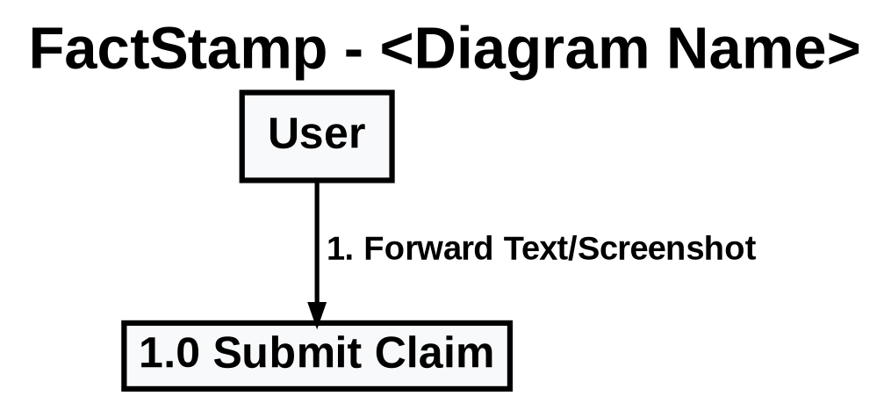

- **Bold Graphviz Fonts**: Use `fontname="Liberation Sans Bold"` (or `fontname="Helvetica-Bold"`) for all node labels, edge labels, and titles.
- **Heavy Penwidth**: `penwidth=3.0` for nodes and `penwidth=2.5` for edges ensures crisp rendering at all scale factors.

## Per-diagram-type templates

### ER Diagram (PlantUML)
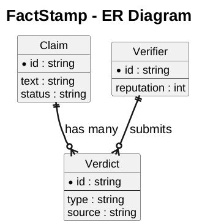

### Class Diagram (PlantUML)
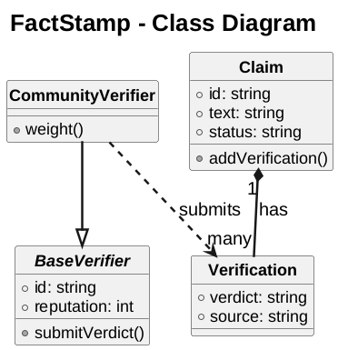
`--|>` inheritance, `..>` dependency, `*--` composition, `o--` aggregation — native PlantUML arrows, no `arrowhead=` fiddling.

### Object Diagram (PlantUML)
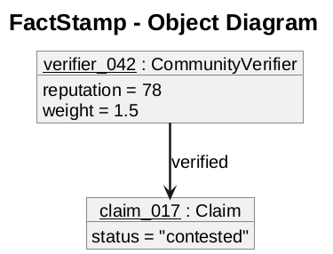

### Component Diagram (PlantUML)
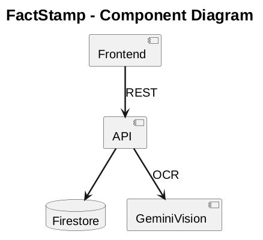

### Package Diagram (PlantUML)
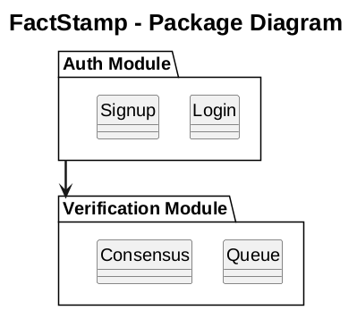

### Deployment Diagram (PlantUML)
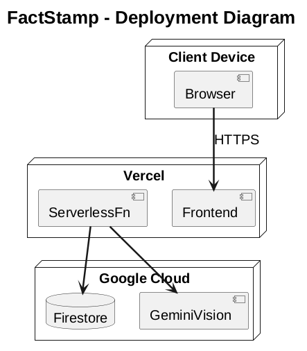

### State Diagram (PlantUML)
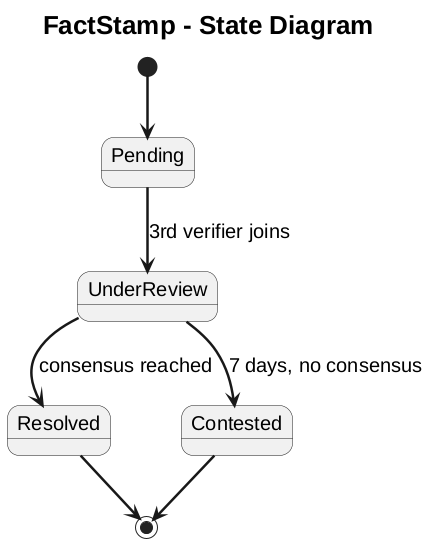

### Use Case Diagram (PlantUML — Left-to-Right 2-Column Standard)
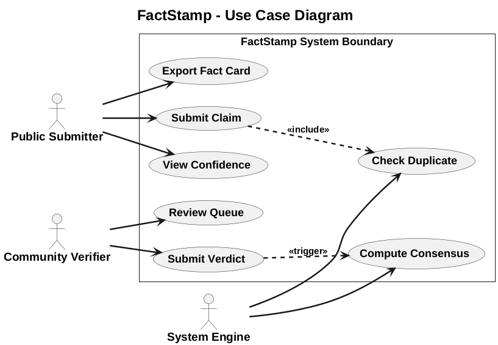

### DFD (Graphviz — the one type on dot)
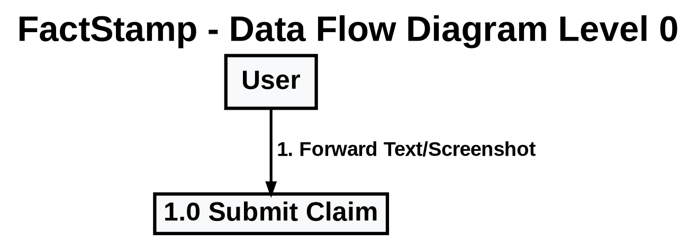

## File naming & location

### Folder & File Naming Rule
- **Folder Name**: **MUST EXACTLY MATCH** the title/prompt specified by the user (e.g. `Submission of Chp 4: 4.2.2 Data Integrity and Constraints, 4.4 Security Issues/`).
- **Sub-file Names (`.typ` & `.pdf`)**: Use a concise **descriptive title slug** with lowercase words and underscores (e.g. `data_integrity_and_security_issues.typ` & `data_integrity_and_security_issues.pdf`).

Each submission folder gets an `attachments/` subfolder holding **all** source (`.puml` or `.dot`) + `.svg` pairs — same convention regardless of which tool produced the diagram.

```
Submission of Chp 4: 4.2.2 Data Integrity and Constraints, 4.4 Security Issues/
│  data_integrity_and_security_issues.typ
│  data_integrity_and_security_issues.pdf
└─ attachments/
   │  er_diagram.puml
   │  er_diagram.svg
   │  class_diagram_core.puml
   └  class_diagram_core.svg
```

```
Submission of 3.6 Conceptual Models - Data Flow Diagram/
│  data_flow_diagram.typ
│  data_flow_diagram.pdf
└─ attachments/
   │  dfd_level_0.dot
   │  dfd_level_0.svg
   │  dfd_level_1.dot
   │  dfd_level_1.svg
   │  dfd_level_2_ingestion.dot
   └  dfd_level_2_ingestion.svg
```

Rules:
- One source file + one `.svg` per diagram, even if two diagrams are related — don't combine ER + Class into one `.puml`.
- Filenames are `<diagram_type>_<qualifier>.puml` or `.dot` — lowercase, underscores, no spaces.
- Reference from Typst as `#image("attachments/er_diagram.svg", width: 100%)` — identical regardless of source tool.
- Commit the `.svg` files too — don't `.gitignore` `attachments/`.
- Multi-level DFDs all live in the same `attachments/` folder — filename qualifier is enough, no per-level subfolders.

## Full worked example

`attachments/class_diagram_core.puml` — complete file, title/skinparam block + real diagram body:

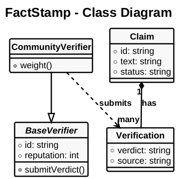

Compile:
```bash
plantuml -tsvg attachments/class_diagram_core.puml
typst compile class_diagram_er.typ class_diagram_er.pdf
```

Every other UML diagram type follows this same skeleton — skinparam block stays identical, only the diagram body changes per the templates above. DFDs are the one exception and keep using the Graphviz worked example (dot → svg, large-font block).

