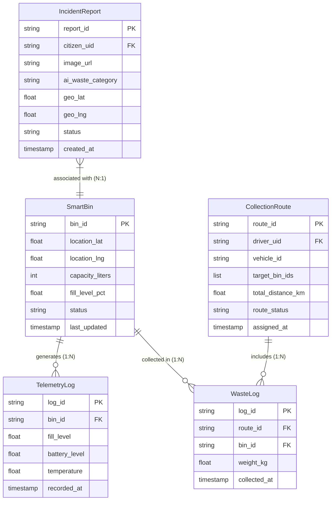
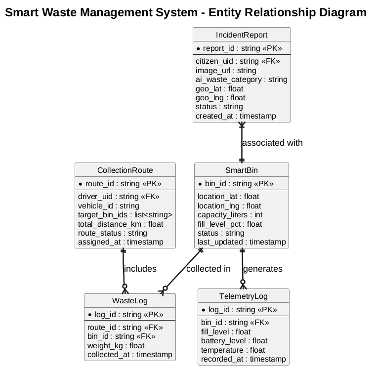

# Required Diagrams Checklist — Dissertation & Black Book

Below is the complete, official mapping of all required diagrams, their syllabus section (Course `JUSIT-DSCPR503`), and recommended tooling formats.

| # | Diagram Name | Syllabus Section | Primary Tool / Format |
|---|---|---|---|
| 1 | PERT Chart | Ch 3.3 (Planning & Scheduling) | Typst / Mermaid / Graphviz |
| 2 | GANTT Chart | Ch 3.3 (Planning & Scheduling) | Typst / Mermaid / Image |
| 3 | Data Flow Diagram (DFD) — Level 0 (Context) | Ch 3.6 (Conceptual Models) | Graphviz (.dot → .svg) |
| 4 | Data Flow Diagram (DFD) — Level 1 | Ch 3.6 (Conceptual Models) | Graphviz (.dot → .svg) |
| 5 | Data Flow Diagram (DFD) — Level 2 | Ch 3.6 (Conceptual Models) | Graphviz (.dot → .svg) |
| 6 | Use Case Diagram | Ch 3.6 (Conceptual Models) | PlantUML (.puml → .svg) |
| 7 | Activity Diagram | Ch 3.6 (Conceptual Models) | PlantUML (.puml → .svg) |
| 8 | State Diagram (State Machine) | Ch 3.6 (Conceptual Models) | PlantUML (.puml → .svg) |
| 9 | Sequence Diagram | Ch 3.6 (Conceptual Models) | Typst Fletcher / PlantUML |
| 10 | Class Diagram | Ch 3.6 (Conceptual Models) | PlantUML (.puml → .svg) |
| 11 | Object Diagram | Ch 3.6 (Conceptual Models) | PlantUML (.puml → .svg) |
| 12 | Package Diagram | Ch 3.6 (Conceptual Models) | PlantUML (.puml → .svg) |
| 13 | Deployment Diagram | Ch 3.6 (Conceptual Models) | PlantUML (.puml → .svg) |
| 14 | Component Diagram | Ch 3.6 (Conceptual Models) | PlantUML (.puml → .svg) |
| 15 | **Entity-Relationship (E-R) Diagram** | **Ch 3.6 (Conceptual Models) & Ch 4.2 (Data Design)** | **PlantUML (.puml → .svg)** |
| 16 | UI Wireframes & Screen Layouts | Ch 4.3 & Ch 6.1 (UI & Manual) | SVG / High-Res Mockups |
| 17 | Overall System Architecture Diagram | Ch 5.1 (Implementation Approach) | PlantUML / Mermaid / SVG |

---

## Entity-Relationship (E-R) Diagram

The **Entity-Relationship Diagram** is required under **Chapter 3.6 (Conceptual Models)** as a conceptual data model, and under **Chapter 4.2 (Data Design: Database & Schema Design)** as the formal relational schema design.

### 1. Visual E-R Diagram (Mermaid)

---

### 2. PlantUML Source Code (`er_diagram.puml`)

---

### 3. Entity & Relationship Cardinality Matrix

| Parent Entity | Relationship | Child Entity | Cardinality | Business Logic Rule |
|:---|:---:|:---|:---:|:---|
| **SmartBin** | Generates | **TelemetryLog** | $1 : N$ (One-to-Many) | Each smart bin emits periodic ultrasonic sensor telemetry readings over time. |
| **SmartBin** | Collected In | **WasteLog** | $1 : N$ (One-to-Many) | A bin is emptied across multiple dispatch collections over its lifetime. |
| **CollectionRoute** | Includes | **WasteLog** | $1 : N$ (One-to-Many) | Each optimized driver collection route covers multiple designated waste pick-up logs. |
| **IncidentReport** | Associated With | **SmartBin** | $N : 1$ (Many-to-One) | Citizens can report overflow incidents or damaged bins tied to a specific physical bin location. |
